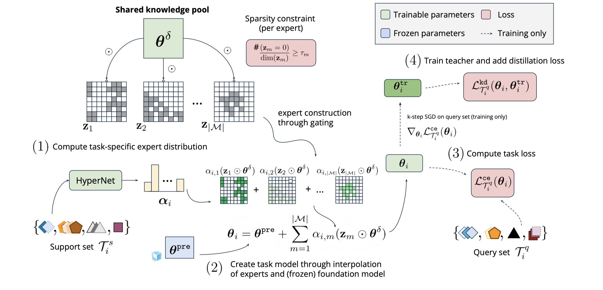

# Unleashing the Power of Meta-tuning for Few-shot Generalization Through Sparse Interpolated Experts

> Shengzhuang Chen, Jihoon Tack, Yunqiao Yang, Yee Whye Teh, Jonathan Richard Schwarz, Ying Wei

## Abstract

Recent successes suggest that parameter-efficient fine-tuning of foundation
models as the state-of-the-art method for transfer learning in vision,
replacing the rich literature of alternatives such as meta-learning. In trying
to harness the best of both worlds, meta-tuning introduces a subsequent
optimization stage of foundation models but has so far only shown limited
success and crucially tends to underperform on out-of-distribution (OOD) tasks.
In this paper, we introduce Sparse MetA-Tuning (SMAT), a method inspired by
sparse mixture-of-experts approaches and trained to isolate subsets of
pre-trained parameters automatically for meta-tuning on each task. SMAT
successfully overcomes OOD sensitivity and delivers on the promise of enhancing
the transfer abilities of vision foundation models beyond parameter-efficient
fine-tuning. We establish new state-of-the-art results on a challenging
combination of Meta-Dataset augmented with additional OOD tasks in both
zero-shot and gradient-based adaptation settings. In addition, we provide a
thorough analysis of the superiority of learned over hand-designed sparsity
patterns for sparse expert methods and the pivotal importance of the sparsity
level in balancing between in-distribution and out-of-distribution
generalization. Our code is publicly available.

OOD任务的Meta-learning场景，通过提度方法对激活值进行划分，类似切分为多个expert