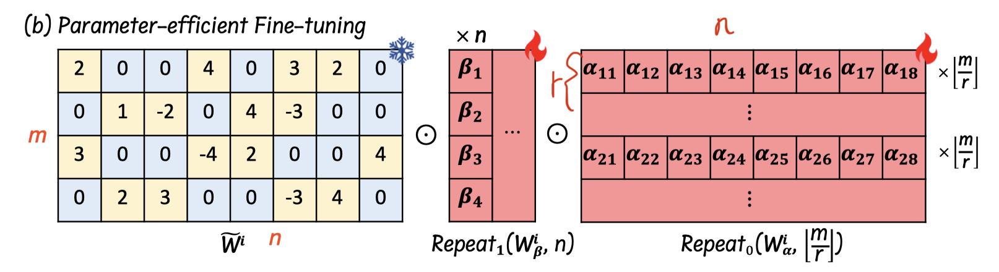

# SPP: Sparsity-Preserved Parameter-Efficient Fine-Tuning for Large Language Models

## 一句话总结

SPP 提出了一种稀疏保持的参数高效微调方法，通过在剪枝后的稀疏权重矩阵上引入轻量级可学习列矩阵和行矩阵，实现对大语言模型的高效微调，同时保持模型稀疏结构不变，显著提升了高稀疏率模型的性能。

## 摘要翻译

大语言模型（LLMs）已成为推动人工智能发展的关键力量，但其庞大的参数规模给微调和部署带来了巨大挑战。当前的训练后剪枝方法虽然能减小模型大小，但往往无法保持原始性能。为应对这些挑战，本文提出了 SPP（Sparsity-Preserved Parameter-efficient fine-tuning），一种稀疏保持的参数高效微调方法。与现有难以保持性能的训练后剪枝方法不同，SPP 采用轻量级可学习的列矩阵和行矩阵来优化稀疏的 LLM 权重，保持剪枝预训练模型的结构和稀疏性不变。通过逐元素乘法和残差加法，SPP 确保在训练和权重合并过程中模型稀疏模式和比例的一致性。作者在 LLaMA 和 LLaMA-2 模型系列上结合近期的训练后剪枝方法验证了 SPP 的有效性。结果表明，SPP 显著提升了不同稀疏模式（即非结构化和 N:M 稀疏）模型的性能，尤其在高稀疏率（如 75%）下表现突出，使其成为稀疏 LLM 高效微调的有前景的解决方案。

## 研究动机

大语言模型（LLMs）在各种复杂任务中展现出令人瞩目的成功，但其参数量通常在数十亿到数百亿级别（如 GPT-4），这使得微调和部署面临巨大挑战。具体而言：

1. **微调成本高昂**：以 LLaMA-65B 为例，全参数微调至少需要 780GB 的 GPU 显存（Dettmers et al., 2023），尚未包含更新稀疏掩码所需的额外内存。

2. **训练后剪枝的局限性**：现有的训练后剪枝方法（如 SparseGPT、Wanda）虽然能减小模型大小，但在高稀疏率下往往导致显著的性能下降，无法有效恢复模型质量。

3. **稀疏模型微调的困境**：在 LLM 时代之前，模型剪枝主要通过梯度或启发式方法识别最优二值稀疏掩码，同时训练剩余参数。然而，这些方法需要全参数反向传播，对 LLM 来说代价过高。例如，RigL 等方法需要 5 倍的训练时间。

4. **现有 PEFT 方法的不足**：LoRA 等参数高效微调方法通过引入低秩分解矩阵来更新权重，但在训练和合并后会产生密集矩阵，破坏了模型的稀疏结构，无法在稀疏模型上有效工作。

因此，需要一种能够平衡性能恢复和计算开销的高效微调方法，既能保持模型的稀疏性，又能有效提升性能。

## 方法（技术细节）

### 核心思想

SPP 的核心思想是：在训练后剪枝的稀疏模型上，通过引入轻量级可学习参数进行微调，同时**保持模型的稀疏结构不变**。与 LoRA 相比，SPP 不使用加法（addition），而是使用**逐元素乘法（element-wise multiplication）**来更新权重，从而避免破坏稀疏模式。

### 参数插入机制

SPP 为每个线性层引入两组轻量级可学习参数：

1. **列矩阵 $W^\alpha_i \in \mathbb{R}^{r \times n}$**：随机初始化，乘以矩阵的每一列
2. **行矩阵 $W^\beta_i \in \mathbb{R}^{m \times 1}$**：零初始化，乘以矩阵的每一行

其中 $r$ 是可调的秩参数（默认 $r=16$），$m$ 和 $n$ 分别是权重矩阵的行数和列数。

这两组参数通过 **Repeat 操作**扩展到与原始稀疏矩阵相同的尺寸，然后与稀疏权重进行逐元素乘法：

$$\hat{W}_i = \hat{W}_i \odot \text{Repeat}_0(W^\alpha_i, \lfloor m/r \rfloor) \odot \text{Repeat}_1(W^\beta_i, n)$$

其中 $\hat{W}_i = W_i \odot M_i$ 是训练后剪枝得到的稀疏权重，$M_i$ 是二值掩码。

### 训练框架

训练时，第 $i$ 个线性层的输出计算为：

$$Y_i = F(X_i, \hat{W}_i) + s \cdot F(\text{Dropout}(X_i), \hat{W}'_i)$$

其中：
- $s$ 是缩放超参数
- $X_i \in \mathbb{R}^{b \times n}$ 是输入激活值
- $F(X, W)$ 表示线性操作 $XW^T$
- $\hat{W}'_i$ 是 SPP 添加参数后的更新权重

**关键特性**：通过这种设计，训练和权重合并过程中，模型的稀疏模式和比例保持不变。初始时 $W^\beta$ 为零、$W^\alpha$ 随机初始化，因此网络初始结构与训练后剪枝模型一致，实现稳定训练。

### 权重合并

训练完成后，线性层参数可合并为：

$$\hat{W}_i + s \cdot \hat{W}'_i$$

这与原始剪枝模型具有相同的稀疏模式和比例。

### 内存优化

SPP 发现直接存储扩展后的中间矩阵 $W^\alpha_i$ 会占用大量内存。为此，作者参考 Megatron-LM 的列并行线性层设计，重新设计矩阵乘法流程，避免存储中间矩阵。具体来说，将权重矩阵的列分成 $r$ 个块，分别计算线性操作再拼接，这样不需要存储额外的中间矩阵。

### 与 LoRA 的对比

| 特性 | LoRA | SPP |
|------|------|-----|
| 参数更新方式 | 加法（addition） | 逐元素乘法（element-wise multiplication） |
| 训练后模型结构 | 密集矩阵 | 稀疏矩阵 |
| 稀疏保持 | 不保持 | 保持 |
| 适用场景 | 密集模型 | 稀疏模型 |
| 推理加速 | 无 | 与原始剪枝模型相同 |

### 超参数设置

- 学习率：7B/13B/30B/65B/70B 分别为 4e-3/2e-3/4e-3/5e-4/5e-4
- 每设备批量大小：8/4/16/8/8
- Warm-up 比率：0.03
- 优化器：AdamW（默认设置）
- 权重衰减：0.001
- 秩参数 $r$：16（默认）
- 训练轮数：7B/13B/30B 为 3 个 epoch，65B/70B 为 1 个 epoch
- 应用层：q_proj, k_proj, v_proj, o_proj, gate_proj, up_proj, down_proj, score

## 实验结果

### 实验设置

- **模型系列**：LLaMA (7B/13B/30B/65B) 和 LLaMA-2 (7B/13B/70B)
- **剪枝方法**：SparseGPT 和 Wanda
- **稀疏模式**：非结构化 50%/75% 和 2:4/2:8 结构化稀疏
- **评估基准**：EleutherAI LM Harness 的 7 个零样本任务（BoolQ, RTE, HellaSwag, WinoGrande, ARC-e, ARC-c, OBQA）+ MMLU 5-shot 评估

### 可训练参数量

| 模型 | 可训练参数 | 总参数 | 千分比（‰） |
|------|-----------|--------|------------|
| LLaMA 7B | 2.0×10⁷ | 6.8×10⁹ | 2.90 |
| LLaMA 13B | 3.1×10⁷ | 1.3×10¹⁰ | 2.35 |
| LLaMA 30B | 6.0×10⁷ | 3.3×10¹⁰ | 1.83 |
| LLaMA 65B | 9.8×10⁷ | 6.5×10¹⁰ | 1.50 |
| LLaMA-2 7B | 2.0×10⁷ | 6.8×10⁹ | 2.90 |
| LLaMA-2 13B | 3.1×10⁷ | 1.3×10¹⁰ | 2.35 |
| LLaMA-2 70B | 1.1×10⁸ | 6.9×10¹⁰ | 1.54 |

### 50% 稀疏率下的零样本评估结果

**LLaMA 7B 示例**（非结构化 50%）：

| 方法 | 平均准确率 |
|------|-----------|
| Dense | 59.98 |
| SparseGPT | 55.11 |
| SparseGPT+SPP | 58.43 |
| Wanda | 54.18 |
| Wanda+SPP | 58.13 |

**LLaMA 7B 2:4 结构化稀疏**：

| 方法 | 平均准确率 |
|------|-----------|
| SparseGPT | 49.74 |
| SparseGPT+SPP | 54.60 |
| Wanda | 48.34 |
| Wanda+SPP | 55.42 |

**关键发现**：
- SPP 在所有模型规模和稀疏模式上均显著提升了性能
- 在 2:4 结构化稀疏下提升尤为明显（如 LLaMA 7B：Wanda 从 48.34 提升到 55.42）
- SPP 将稀疏模型性能恢复到接近甚至超过 50% 稀疏率下的表现

### 75% 稀疏率下的表现（与 LoRA* 对比）

**LLaMA 7B 非结构化 75%**：

| 方法 | 平均准确率 |
|------|-----------|
| Wanda+LoRA* | 39.11 |
| Wanda+SPP | 41.71 |

**LLaMA 30B 非结构化 75%**：

| 方法 | 平均准确率 |
|------|-----------|
| Wanda+LoRA* | 48.60 |
| Wanda+SPP | 50.33 |

**关键发现**：SPP 在高稀疏率（75%）下优于 LoRA*（先用 LoRA 微调密集模型，再用原始剪枝掩码得到稀疏模型的方法）。

### 75% 稀疏率下的困惑度比较

| 方法 | LLaMA 7B 非结构化 75% | LLaMA 30B 非结构化 75% |
|------|----------------------|----------------------|
| Wanda | PPL: 1285.24 | PPL: 149.63 |
| Wanda+DS⊘T | PPL: 646.40 | PPL: 184.51 |
| Wanda+SPP | PPL: 21.80 | PPL: 10.89 |

**关键发现**：SPP 在困惑度指标上实现了巨大改进，将 PPL 从数百降至 10-20 级别。

### 5-shot MMLU 评估

SPP 在 Alpaca 数据集上进行指令微调后，在 MMLU 5-shot 评估中也表现出显著提升。例如：
- LLaMA 7B 非结构化 50%：SparseGPT 从 32.19 提升到 30.77（SparseGPT+SPP），Wanda 从 31.50 提升到 31.74
- LLaMA-2 7B 非结构化 50%：Wanda 从 34.20 提升到 38.08

### 推理速度

由于 SPP 不改变剪枝模型的稀疏模式和比例，推理速度与原始剪枝模型相同。对于 2:4 结构化稀疏，可实现约 1.6 倍线性层加速和 1.24 倍端到端延迟加速（LLaMA-7B 从 312ms 降至 251ms）。

### 消融实验

作者进行了关于零初始化的消融实验，测试了 4 种设置（无零初始化、$W^\alpha$ 零初始化、$W^\beta$ 零初始化、两者都零初始化）：

- **两者都零初始化**会导致梯度消失，参数始终为零，无法带来性能提升
- **$W^\beta$ 零初始化、$W^\alpha$ 随机初始化**获得整体最佳结果

## 优势

1. **稀疏保持**：SPP 在训练和权重合并过程中保持模型的稀疏模式和比例不变，这是其最核心的优势。与 LoRA 等方法不同，SPP 不会破坏剪枝模型的稀疏结构。

2. **参数高效**：仅需微调总参数量的 0.15%~0.29%（千分比），远低于全参数微调的成本。

3. **即插即用**：SPP 可以与现有的训练后剪枝方法（SparseGPT、Wanda）无缝结合，支持非结构化和 N:M 结构化稀疏。

4. **显著的性能提升**：在高稀疏率（如 75%）下，SPP 带来了显著的性能恢复和提升，尤其在困惑度指标上表现突出（PPL 从数百降至 10-20 级别）。

5. **推理加速不变**：由于保持了原始稀疏结构，推理速度与原始剪枝模型相同，不会因为微调而增加推理开销。

6. **内存优化**：通过参考 Megatron-LM 的列并行设计，SPP 优化了内存使用，避免存储中间矩阵。

7. **稳定训练**：零初始化的 $W^\beta$ 使得网络初始结构与剪枝模型一致，训练过程更加稳定。

8. **简单易实现**：SPP 的实现相对简单，不需要复杂的超参数调优（固定超参数后在不同稀疏模式和比例上均能稳定提升性能）。

## 局限

1. **仅适用于训练后剪枝模型**：SPP 是专门为训练后剪枝方法（如 SparseGPT、Wanda）设计的，不适用于训练时稀疏化（如 RigL）等场景。

2. **需要训练数据**：SPP 仍然需要一定量的训练数据进行微调，虽然比全参数微调少，但仍需数据集支持。

3. **线性层的特定设计**：SPP 仅在 q_proj、k_proj、v_proj、o_proj、gate_proj、up_proj、down_proj、score 等线性层上添加参数，未探索其他层（如嵌入层）。

4. **秩参数 $r$ 的固定性**：实验中默认使用 $r=16$，未充分探索不同 $r$ 值对性能的影响（尽管论文提到不进行特定稀疏模式或比例的超参数调优）。

5. **仅在 LLaMA 系列上验证**：论文仅在 LLaMA 和 LLaMA-2 系列上进行了实验，未在其他模型（如 GPT 系列、Mistral 等）上验证。

6. **高稀疏率下的性能仍有限**：虽然 SPP 在 75% 稀疏率下提升了性能，但与密集模型相比仍有较大差距（如 LLaMA 7B：Dense 59.98 vs SPP 41.71）。

7. **不支持动态稀疏**：SPP 使用固定掩码，不支持训练过程中动态调整稀疏模式。

8. **未充分探索量化与稀疏的结合**：虽然 SPP 保持了稀疏性，但未与量化技术（如 GPTQ）结合进行联合优化。

## 与 EfficientPaper 相关的研究方向

### 1. 模型剪枝与稀疏化
- **SparseGPT** (Frantar & Alistarh, 2023)：训练后剪枝方法，SPP 可直接与其结合使用。
- **Wanda** (Sun et al., 2023)：简单有效的训练后剪枝方法，SPP 的主要实验对象。
- **RigL** (Evci et al., 2020)：训练时动态稀疏化方法，与 SPP 的固定掩码形成对比。
- **Sheared LLaMA** (Xia et al., 2023)：通过结构化剪枝加速预训练，SPP 可能与其互补。

### 2. 参数高效微调（PEFT）
- **LoRA** (Hu et al., 2021)：低秩适应方法，SPP 的灵感来源，但 SPP 通过乘法保持稀疏性。
- **Adapters** (Houlsby et al., 2019)：插入轻量级适配模块，SPP 的另一种替代方案。
- **QA-LoRA** (Xu et al., 2023)：量化感知的 LoRA，与 SPP 的稀疏保持思想有相似之处。

### 3. 大语言模型压缩与部署
- **GPTQ**：量化方法，可与 SPP 结合实现更高效的部署。
- **SmoothQuant**：激活量化方法，可能与 SPP 的稀疏保持结合使用。
- **高效推理**：SPP 的推理加速与结构化稀疏（2:4）结合，可实现显著的端到端加速。

### 4. 稀疏神经网络训练
- **Lotto** (Liu et al., 2018)：固定掩码的重训练方法，SPP 的理论基础之一。
- **动态稀疏训练**：SPP 的固定掩码与动态稀疏方法的对比和互补。
- **结构化稀疏**：N:M 稀疏模式（如 2:4）在硬件加速中的应用，SPP 支持此类模式。

### 5. 未来研究方向
- **SPP 与量化结合**：探索稀疏 + 量化的联合优化方法。
- **SPP 在更大模型上的验证**：在 GPT-4 等更大规模模型上的效果。
- **SPP 与任务特定微调**：结合指令微调（如 Alpaca）的效果。
- **SPP 的理论分析**：深入分析为什么乘法更新比加法更新更适合稀疏模型。
- **SPP 在其他领域的应用**：如计算机视觉模型的稀疏微调。

## AI 生成声明

本笔记由 AI Agent 自动处理生成，基于论文元数据、PDF 文本提取和结构化分析。笔记内容经过机器学习模型的理解和整理，可能存在对论文细节的简化或误读。建议读者以原始论文为准。笔记生成日期：2026-06-05。
