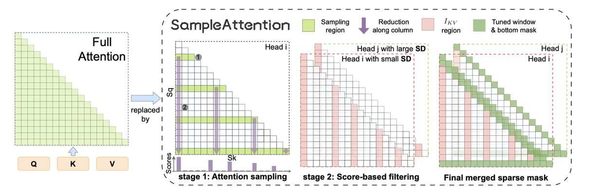

# SampleAttention: Near-Lossless Acceleration of Long Context LLM Inference with Adaptive Structured Sparse Attention

## 一句话总结

SampleAttention 通过自适应结构化稀疏注意力机制，在不损失模型精度的前提下，将长上下文 LLM 推理的首 Token 延迟（TTFT）最高降低至 FlashAttention 的 2.42 倍加速，是一种即插即用的近无损注意力加速方案。

## 摘要翻译

大语言模型（LLM）现已支持极长的上下文窗口，但原始注意力机制的二次复杂度导致首 Token 延迟（TTFT）显著增加。现有方法在解决该复杂度时需要额外的预训练或微调，并且常常牺牲模型精度。本文首先从理论和实证两方面为近无损稀疏注意力提供了基础。研究发现，以低开销动态捕获每个注意力头特有的稀疏模式至关重要。为此，我们提出了 SampleAttention，一种自适应结构化近无损稀疏注意力。利用观察到的显著稀疏模式，SampleAttention 对固定比例的相邻 token 进行注意力计算以捕获局部窗口模式，并采用两阶段查询引导的键值过滤方法，以低开销自适应选择最小的键值集合来捕获列条纹模式。综合评估表明，SampleAttention 可以无缝替换现成 LLM 中的原始注意力，几乎不损失精度，并且相较于 FlashAttention 可将 TTFT 降低高达 2.42 倍。

## 研究动机

随着 LLM 上下文窗口长度的不断增加（如 Gemini、Claude、Kimi 已支持超过 100 万 token），注意力机制的二次复杂度成为实时交互的瓶颈。以 ChatGLM-6B 为例，在 100 万 token 上下文中，注意力计算耗时 1555 秒，占 TTFT 的 90% 以上。

现有解决注意力二次复杂度的方案（如静态/动态稀疏注意力、低秩矩阵、循环状态、外部内存等）存在以下问题：
- **需要额外预训练或微调**：无法直接应用于已有的预训练 LLM
- **牺牲模型精度**：无法实现近无损的精度保持
- **不适合长上下文 prefill 阶段**：如 StreamingLLM 虽然无需微调，但无法有效减少 TTFT

因此，核心问题是：**如何在不损失模型精度的前提下，为现成的长上下文 LLM 降低 TTFT？**

## 方法（技术细节）

### 3.1 理论基础：近无损稀疏注意力

作者定义了两个关键概念：

**定理 1（近无损稀疏注意力）**：假设值向量 V 的 L1 范数上界为 R > 0，给定 ε > 0，存在注意力掩码 M 使得 ‖P̃ − P‖₁ ≤ ε/R，从而 ‖Õ − O‖₁ ≤ ε。

**定义 1 - 稀疏度（SD）**：衡量在满足指定 CRA 阈值 α 的条件下，可以丢弃的最大 KV 元素百分比。

**定义 2 - 累积残差注意力（CRA）**：在稀疏化后每个 query 的最小剩余注意力概率之和。

### 3.2 经验基础：注意力稀疏性分析

通过在 ChatGLM-6B 和 InternLM2-7B 上的实证分析，作者发现：

1. **固有高稀疏度**：大多数层的稀疏度超过 90%（α=0.95），且随序列长度增加而增加
2. **自适应稀疏性**：注意力稀疏度是逐头特异性和内容感知的，不同头的 SD 从 27.4% 到 99.8% 不等
3. **显著的窗口和条纹模式**：
   - **局部窗口模式**：捕获最近的上下文信息
   - **列条纹模式**：体现关键的全局上下文信息

### 4.1 问题形式化

将注意力掩码 M 分解为结构化掩码：

**M̂ := Mwindow(w) ∪ Mstripe(IKV)**

其中 w 为窗口大小，IKV 为感兴趣的键值索引集合。

### 4.2 SampleAttention 方法

**（1）调优窗口大小 w**：
- 将窗口大小设为序列长度的固定比例（⌈rw% × Sk⌉）
- 该比例通过轻量级离线 profiling 确定，足够大以捕获重要的局部窗口，同时适应不同上下文长度

**（2）查询引导注意力采样（Stage 1）**：
- 对注意力分数矩阵进行行方向的步幅采样
- 基于列条纹模式的观察：如果 Pik 很高，则 Pjk（j≠i）也很可能很高
- 通过采样少量 query 行来近似整个注意力分数，采样比率为 rrow

**（3）基于分数的键值过滤（Stage 2）**：
- 对采样得到的注意力分数沿列方向进行累积求和
- 每个头独立选择 top-k 键值索引以满足 CRA 阈值 α
- 得到的 IKV 与局部窗口和底部区域掩码合并，用于稀疏注意力计算

### 4.3 硬件高效实现

- **算子融合**：将查询引导键值过滤的一系列小算子（bmm、softmax、reduce）进行融合，减少 I/O 开销
- **自适应结构化稀疏注意力核**：基于 FlashAttention 进行修改，实现硬件感知的优化

### 超参数调优

| 超参数 | 描述 | 调优方式 |
|--------|------|----------|
| α | 期望的 CRA 阈值 | 离线 profiling |
| rrow | Stage-1 中的采样比率 | 离线 profiling |
| rw% | 局部窗口大小比例 | 离线 profiling |

通过包含 22 个请求（25K-96K 上下文长度）的小数据集确定这些超参数。

## 实验结果

### 实验设置

- **模型**：ChatGLM2-6B（96K 上下文窗口）、InternLM2-7B（200K 上下文窗口）
- **任务**：LongBench、BABILong、Needle in a Haystack
- **基线**：Full Attention、BigBrid、StreamingLLM、HyperAttention、Hash-Sparse
- **设备**：单张 NVIDIA A100 GPU (80GB)

### 精度结果

| 模型 | 方法 | LongBench 总分 | BABILong 总分 |
|------|------|----------------|---------------|
| ChatGLM2-6B | Full Attention | 837.40 | 30.20 |
| ChatGLM2-6B | **SampleAttention(α=0.95)** | **833.00** | **31.04** |
| ChatGLM2-6B | BigBrid | 765.94 | 27.68 |
| ChatGLM2-6B | StreamingLLM | 519.27 | 14.60 |
| ChatGLM2-6B | HyperAttention | 508.94 | 17.00 |
| ChatGLM2-6B | Hash-Sparse | 364.49 | 11.20 |
| InternLM2-7B | Full Attention | 685.46 | 35.24 |
| InternLM2-7B | **SampleAttention(α=0.95)** | **686.86** | **36.88** |
| InternLM2-7B | BigBrid | 637.04 | 34.12 |
| InternLM2-7B | StreamingLLM | 319.55 | 5.96 |
| InternLM2-7B | HyperAttention | 336.57 | 16.64 |

关键发现：
- SampleAttention 在所有基准上持续保持全注意力 99% 以上的精度，实现近无损
- 在 InternLM2-7B 上甚至略优于全注意力（LongBench 686.86 vs 685.46）
- 其他基线方法（BigBrid、StreamingLLM、HyperAttention、Hash-Sparse）均有显著性能下降

### 加速结果（96K 序列长度）

| 方法 | 注意力加速 | TTFT 加速 |
|------|-----------|-----------|
| SampleAttention(α=0.95) | 2.20× | 1.62× |
| SampleAttention(α=0.80) | 5.12× | 2.28× |

### 序列扩展到 1M 的结果

| 方法 | TTFT 加速（1M 序列） |
|------|---------------------|
| SampleAttention(α=0.95) | 2.42× |
| SampleAttention(α=0.80) | 4.62× |

### 超参数消融研究

- **CRA 阈值 α**：α=0.95 时精度最优；即使 α=0.80，平均性能仍超过全注意力的 94.5%
- **窗口比例 rw%**：将窗口比例减半（rw=4）导致 LongBench 性能下降超过 6%
- **采样比率 rrow**：降至 2% 时约有 4.5% 的性能损失

## 优势

1. **即插即用（Plug-and-Play）**：可无缝替换现成 LLM 中的原始注意力机制，无需额外预训练或微调
2. **近无损精度**：在所有评估任务和模型上保持全注意力 99% 以上的精度
3. **显著加速**：在 96K 序列长度下，TTFT 降低最高 2.42 倍（α=0.95）至 4.62 倍（α=0.80）
4. **结构化稀疏**：利用局部窗口和列条纹模式，硬件友好
5. **自适应稀疏**：根据每个头和每个内容动态调整稀疏模式，避免统一压缩的局限性
6. **可与 KV Cache 压缩方法组合**：与 H2O、StreamingLLM 等方法正交，可进一步减少内存消耗
7. **高效的硬件实现**：基于 FlashAttention 修改，实现 I/O 感知的自适应结构化稀疏注意力核
8. **轻量级超参数调优**：仅需 22 个请求的小数据集即可确定超参数

## 局限

1. **额外模式捕获不足**：在低稀疏度的头中存在额外的对角结构模式，虽然 SampleAttention 可以通过选择足够多的 KV 来覆盖，但精确捕获这些模式可能带来更好的性能提升
2. **短序列加速有限**：在较短序列（<16K）时，采样开销导致无明显加速优势
3. **超参数调优挑战**：超参数对精度和加速的权衡影响显著，如何快速确定特定模型的高效超参数仍是关键挑战
4. **分布式部署内存问题**：在分布式服务框架中集成时，超长序列（≥128K）或大批量会导致内存问题，需要更多工程优化（如流水线并行、序列并行、分块策略）
5. **仅优化 prefill 阶段**：SampleAttention 仅针对 prefill 阶段的注意力进行加速，解码阶段的 KV cache 未压缩
6. **仅在两个模型上验证**：实验仅在 ChatGLM2-6B 和 InternLM2-7B 上进行，缺乏更广泛的模型验证

## 与 EfficientPaper 相关的研究方向

1. **注意力机制加速**：SampleAttention 是注意力稀疏化方向的重要工作，与 FlashAttention、HyperAttention 等方法直接相关
2. **KV Cache 优化**：可与 H2O、StreamingLLM 等 KV Cache 压缩方法结合，共同减少长上下文推理的计算和内存开销
3. **长上下文 LLM 优化**：属于长上下文 LLM 推理优化领域，与位置编码外推（RoPE scaling）、上下文窗口扩展等技术互补
4. **自适应计算**：体现自适应计算在注意力机制中的应用，根据内容动态调整计算量
5. **硬件高效实现**：基于 FlashAttention 的硬件高效核实现，涉及 GPU 上的 IO 感知优化
6. **稀疏注意力模式发现**：从理论和经验两方面揭示了 LLM 注意力的固有稀疏模式，为未来更高效的注意力设计提供基础

## AI 生成声明

本笔记由 AI Agent（Hermes Agent）基于论文原文自动生成。AI Agent 使用 PyMuPDF（fitz）从 PDF 中提取文本内容，并结合论文元数据信息撰写。笔记中的所有内容均基于论文原文，但可能在翻译和总结中存在一定程度的简化或偏差。建议读者参考原始论文以获取完整准确的信息。

---

> **论文信息**
> - 标题：SampleAttention: Near-Lossless Acceleration of Long Context LLM Inference with Adaptive Structured Sparse Attention
> - 作者：Qianchao Zhu, Jiangfei Duan, Chang Chen, Siran Liu, Xiuhong Li, Guanyu Feng, Xin Lv, Huanqi Cao, Chuanfu Xiao, Xingcheng Zhang, Dahua Lin, Chao Yang
> - 机构：北京大学、香港中文大学、智谱AI、清华大学、上海AI Lab
> - 发表：arXiv, 2024
> - 链接：http://arxiv.org/abs/2406.15486v2
> - 关键词：sparse_pruning, attention_sparsity
