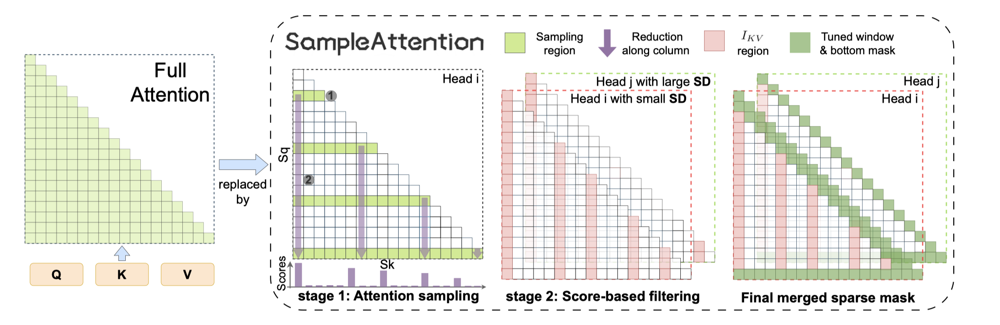

# SampleAttention: Near-Lossless Acceleration of Long Context LLM Inference with Adaptive Structured Sparse Attention

## Abstract

Large language models (LLMs) now support extremely long context windows, but
the quadratic complexity of vanilla attention results in significantly long
Time-to-First-Token (TTFT) latency. Existing approaches to address this
complexity require additional pretraining or finetuning, and often sacrifice
model accuracy. In this paper, we first provide both theoretical and empirical
foundations for near-lossless sparse attention. We find dynamically capturing
head-specific sparse patterns at runtime with low overhead is crucial. To
address this, we propose SampleAttention, an adaptive structured and
near-lossless sparse attention. Leveraging observed significant sparse
patterns, SampleAttention attends to a fixed percentage of adjacent tokens to
capture local window patterns, and employs a two-stage query-guided key-value
filtering approach, which adaptively select a minimum set of key-values with
low overhead, to capture column stripe patterns. Comprehensive evaluations show
that SampleAttention can seamlessly replace vanilla attention in off-the-shelf
LLMs with nearly no accuracy loss, and reduces TTFT by up to $2.42\times$
compared with FlashAttention.