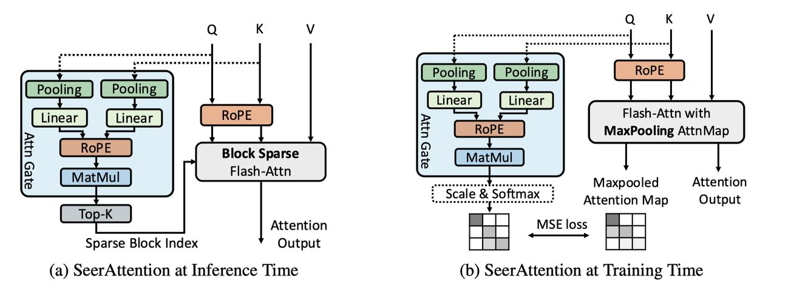

# SeerAttention: Learning Intrinsic Sparse Attention in Your LLMs

## 一句话总结

SeerAttention 提出了一种基于学习的稀疏注意力机制，通过可学习的门控网络（AttnGate）自适应地识别注意力图中的重要块，从而在保持模型精度的同时实现高达 5.67× 的推理加速（相比 FlashAttention-2），在长上下文微调中可在 90% 稀疏率下实现近乎无损的性能。

---

## 摘要翻译

注意力机制是现代大语言模型（LLM）的基石。然而，其二次方复杂度限制了 LLM 的效率和可扩展性，尤其是在长上下文窗口场景下。利用注意力稀疏性是解决这一局限的有前景的方法。但现有基于稀疏性的解决方案主要依赖预定义的模式或启发式方法来近似稀疏性，无法充分捕捉语言任务中注意力稀疏性的动态特性。本文认为，注意力稀疏性应该被学习而非预定义。为此，我们设计了 SeerAttention，一种新的注意力机制，通过可学习的门控模块增强传统注意力，自适应地选择注意力图中的重要块，并将其余块视为稀疏块。这种块级稀疏性有效平衡了精度和加速。为了高效学习门控网络，我们开发了定制的 FlashAttention 实现，以最小开销提取注意力图的块级真实值。SeerAttention 不仅适用于后训练，还在长上下文微调中表现优异。实验表明，在后训练阶段，SeerAttention 显著优于基于静态或启发式的稀疏注意力方法，同时更灵活地适应不同的上下文长度和稀疏率。结合 YaRN 进行长上下文微调时，SeerAttention 在 32k 上下文长度下可实现 90% 稀疏率，且困惑度损失极小，相比 FlashAttention-2 实现 5.67× 加速。

---

## 研究动机

### 1. 注意力机制的效率瓶颈

Transformer 架构中的注意力机制（Vaswani, 2017）对每个 token 与其他所有 token 进行关联，导致计算和内存的二次方复杂度 O(n²)，其中 n 为序列长度。随着 LLM 越来越多地处理长上下文，这一问题变得尤为突出。虽然线性注意力（O(n)）和循环网络（如 RWKV、RetNet、Mamba）被提出，但这些方法在大规模模型和长上下文下难以匹配完整注意力的性能。

### 2. 注意力稀疏性的内在潜力

注意力机制本身具有稀疏性——softmax 函数产生大量可忽略的分数，这些分数可以被视为零而不影响模型精度（Zaheer et al., 2020）。在某些 LLM 注意力头中，稀疏率可达 95% 甚至 99%。稀疏性在长上下文中更为显著。

### 3. 现有方法的局限

然而，注意力稀疏性是动态的，随不同输入和注意力头而变化，每个头显示出不同的稀疏位置和比率。现有方法（如 MInference、MoA）依赖预定义的稀疏模式或启发式方法（如 A-shape、Vertical-Slash），缺乏通用性，无法充分捕捉注意力机制的动态稀疏行为。此外，MoA 需要离线搜索不同稀疏配置，耗时且不够灵活。

### 4. 核心论点

本文的核心论点是：**注意力稀疏性应该被学习而非预定义**。这与混合专家（MoE）模型的原则相呼应——稀疏性应直接从数据中学习，使模型能够自适应地利用稀疏性，在提高效率的同时保持准确性。

---

## 方法（技术细节）

### 整体架构

SeerAttention 采用全学习方法来自适应地识别 LLM 中的注意力稀疏性，并利用学习到的稀疏性进行高效推理。为了在 GPU 等现代硬件上保证效率，SeerAttention 聚焦于学习块稀疏性（block sparsity），可以无缝集成到 FlashAttention 的平铺计算方案中。

SeerAttention 在传统注意力基础上增加了可学习的门控模块（AttnGate），通过以下流程工作：
1. **前向推理阶段**：Q 和 K 输入被池化和处理，由可学习门控自适应地识别重要块
2. **块稀疏 FlashAttention 核心**：仅加载和处理激活的块，跳过不重要的块

### 3.1 注意力门控（AttnGate）

AttnGate 模块旨在以最小开销学习块级信息：

- **输入**：原始矩阵 Q 和 K
- **下采样**：沿序列维度使用池化操作将 Q 和 K 从 [seq, d] 下采样到 [seq/B, d]（B 为块大小，通常为 64）
- **处理**：下采样后的 Q 和 K 通过线性层处理并相乘，生成 [seq/B, seq/B] 的矩阵
- **输出**：每个元素对应完整注意力图中的一个块。在块大小为 64 时，AttnGate 输出仅为原始注意力图的 1/4096
- **Top-k 选择**：推理时通过选择每行的 Top-k 块来激活块稀疏 FlashAttention 核心

**池化选择**：AttnGate 支持组合不同的池化方法（average、max、min），实验表明最优组合是：Q 使用 average pooling，K 使用 max + min pooling（可能与 LLM 量化中 K 的异常值特征有关）。

**额外 RoPE**：由于池化操作会丢失相对位置编码属性，AttnGate 中引入了独立的 RoPE，基于每个块的起始位置分配位置 ID。这等价于使用降低的旋转角度 θ' = θ/B，但编码每个块的位置。RoPE 显著提升了 AttnGate 在长上下文中的外推能力（仅用 8k 训练数据即可在 128k 上下文中保持一致性能）。

### 3.2 块稀疏 FlashAttention 推理核心

FlashAttention-2（Dao, 2023）不直接支持块稀疏，因此 SeerAttention 使用 Triton（Tillet et al., 2019）实现了自己的块稀疏 FlashAttention 核心：
- 数据流类似于 FlashAttention-2，Q 被分配到不同的 warp
- 每个 warp 读取 AttnGate 生成的稀疏块索引
- 加载对应的 K 和 V 块到片上进行计算
- 通过跳过非激活块来有效减少 I/O 和计算开销

### 4. 训练 SeerAttention

#### 4.1 训练注意力门控

训练的关键挑战：FlashAttention 通过操作融合消除了显式注意力图的输出，而朴素手动注意力实现在长上下文场景中速度慢且内存消耗大。

**训练方案**：
- 使用全注意力生成的 **2D 最大池化注意力图** 作为真实值（ground truth）
- 为对齐分布，AttnGate 输出经过缩放和 softmax
- 使用 MSE 损失（均方误差）训练
- 这种自回归训练方案允许用户通过调整 Top-k 比率来平衡精度和效率

#### 4.2 定制 FlashAttention 训练核心

为了高效获取最大池化注意力图，SeerAttention 定制了 FlashAttention 核心：
- 在标准 FlashAttention 计算中，存储临时的行最大值 r_ij（通常被视为临时结果）
- 在迭代完成后，使用最终的全局最大值 m_i 和指数和 l_i 进行重缩放：a_ij = exp(r_ij - m_i) / l_i
- 通过列最大值实现 2D 最大池化
- 这仅引入少量开销（存储和重缩放 r_ij），但显著提高了获取真实值的效率
- 内存开销与 FlashAttention-2 相当，PyTorch 朴素实现在序列长度超过 4k 时 OOM

#### 4.3 应用场景

**后训练（Post-training）**：
- 仅学习 AttnGate 的权重，不改变原始模型权重
- 高效且低成本，使用最少的校准数据快速收敛
- 推理时可灵活调整 Top-k 比率

**长上下文微调（Fine-tuning）**：
- 首先使用后训练方法初始化 AttnGate
- 微调整个模型，固定 Top-k 比率
- 使用原始训练损失和注意力图 MSE 损失

---

## 实验结果

### 实验设置

- **模型**：Llama-3.1-8B、Mistral-7B-v0.3、Llama-3.1-8B-Instruct
- **评估数据集**：PG19、Proof-pile（困惑度），LongBench（指令遵循）
- **基线方法**：MoA（Fu et al., 2024）、MInference（Jiang et al., 2024）
- **硬件**：单个 A100 GPU
- **块大小 B**：固定为 64

### 后训练精度

- **困惑度对比**（Llama-3.1-8B-Instruct on PG19）：
  - SeerAttention 在 50% 稀疏率下几乎无损（困惑度仅略微增加）
  - 在 90% 稀疏率下，困惑度仍保持合理范围（如 32k 上下文：10.30 vs 原始 9.92）
  - 显著优于 MoA 和 MInference（MoA 在 64k 时 OOM）
  - 越长的上下文长度允许更高的稀疏率，性能损失最小

- **LongBench 评估**（Llama-3.1-8B-Instruct）：
  - SeerAttention 在相似或更高稀疏率下一致优于 MoA 和 MInference
  - 0-4k 分段：55.91（10% 稀疏率）vs 原始 55.32
  - 4-8k 分段：54.32（10% 稀疏率）vs 原始 53.98

### 长上下文微调精度

- 使用 YaRN 将 Llama-3-8B 从 8k 扩展到 32k 上下文
- **50% 稀疏率**：训练损失曲线几乎与基准重叠，测试困惑度近乎无损（PG19：8.81 vs 8.79，Proof-pile：2.47 vs 2.46）
- **90% 稀疏率**：损失仍极小（PG19：9.16 vs 8.79，Proof-pile：2.60 vs 2.46）
- 对比：后训练 SeerAttention 的困惑度显著更高（90% 稀疏率：PG19 10.18 vs 9.16）

### 效率评估

#### 内核级评估

- **AttnGate 和 Top-k 开销**：极小（32k、50% 稀疏率下分别仅占总延迟的 1% 和 2%）
- **块稀疏 FlashAttention 核心加速**：
  - 128k 序列长度、90% 稀疏率：**5.47× 加速**（相比 FlashAttention-2）
  - 加速随稀疏率线性增长
  - 基于 Triton 实现，未来可通过 CUDA 进一步优化

#### 端到端加速（Time to First Token, TTFT）

| 方法 | 8k | 16k | 32k | 64k | 128k |
|------|-----|-----|------|------|------|
| FlashAttn-2 | 0.90s | 1.95s | 4.63s | 10.09s | 35.54s |
| MInference | 2.33s | 3.10s | 4.68s | 8.21s | 14.38s |
| SeerAttention | 0.78s (50%) | 1.65s (60%) | 3.60s (70%) | 7.69s (80%) | 13.37s (95%) |

- SeerAttention 始终优于 MInference（即使在更低稀疏率下）
- MoA 在 128k 时 OOM
- SeerAttention 在 32k 时 70% 稀疏率达到 3.60s，显著快于 FlashAttention-2 的 4.63s

### 学习到的稀疏模式可视化

AttnGate 自动学习了多种多样的稀疏模式，包括：
- (a) A-shape（A 形）
- (b) Vertical（垂直）
- (c) Slash with empty vertical spaces（带空垂直空间的斜线）
- (d) Block sparsity along the diagonal（对角线块稀疏）
- (e) Random patterns（随机模式）

这些模式不仅涵盖而且超越了先前工作（如 MoA 和 MInference）中的模式，展示了基于学习方法的通用性。

---

## 优势

1. **学习而非预定义**：与依赖预定义模式或启发式方法的 MInference 和 MoA 不同，SeerAttention 通过可学习的门控网络自适应地学习注意力稀疏性，能够适应不同模型、输入和注意力头的动态变化
2. **显著加速**：在 90% 稀疏率下实现 5.67× 推理加速（相比 FlashAttention-2），AttnGate 和 Top-k 的开销极小（<3%）
3. **近无损精度**：在 50% 稀疏率下几乎无损（困惑度极小变化），即使在 90% 稀疏率下损失仍可控
4. **灵活性和适应性**：
   - 可适应任意上下文长度（通过 RoPE 外推）
   - 可调节稀疏率（通过调整 Top-k）
   - 无需为不同设置重新校准
5. **广泛适用性**：
   - 后训练：仅训练门控参数，高效且低成本
   - 长上下文微调：与 YaRN 等方法兼容，进一步提升性能
6. **多样化的稀疏模式**：自动学习多种模式（A-shape、Vertical、Slash 等），超越预定义方法
7. **低开销训练**：定制 FlashAttention 核心实现最小开销获取注意力图真实值，支持长上下文训练

---

## 局限

1. **仅覆盖预填充阶段**：当前工作主要关注 prefill 阶段，AttnGate 在推理时仅作用于预填充阶段，对解码阶段（decoding）的效果尚未验证
2. **固定稀疏率**：所有注意力头使用统一的稀疏率，而 MInference 可以动态为不同注意力头生成不同的稀疏索引，这在 128k 上下文长度时可能成为瓶颈（SeerAttention 在此长度下的表现不如 MInference）
3. **当前仅 Triton 实现**：推理核心基于 Triton 实现，未来可通过 CUDA 进一步优化以获得更大加速
4. **固定块大小**：实验中块大小 B 固定为 64，未探索更灵活的块大小配置
5. **训练数据依赖**：门控网络需要校准数据进行训练，训练过程仍需一定的计算资源（4 个 A100 GPU）
6. **极长上下文的稀疏率限制**：在 128k 上下文、90% 稀疏率下，困惑度显著增加（如 13.20 vs 原始 2.29），说明极高稀疏率在超长上下文中仍有挑战

---

## 与 EfficientPaper 相关的研究方向

SeerAttention 与 EfficientPaper 项目中的多个研究方向密切相关：

1. **稀疏注意力（Sparse Attention）**：本论文的核心研究方向，通过学习注意力稀疏性来提升 LLM 效率，与 sparse_pruning 和 attention_sparsity 关键词直接相关
2. **长上下文效率（Long-Context Efficiency）**：SeerAttention 专门针对长上下文场景设计，解决二次方复杂度瓶颈，与长上下文扩展和微调的研究方向紧密相关
3. **FlashAttention 优化**：SeerAttention 开发了定制的 FlashAttention 核心（支持最大池化注意力图提取和块稀疏推理），是 FlashAttention 系列工作的重要扩展
4. **混合专家（MoE）与门控机制**：SeerAttention 中的 AttnGate 与 MoE 的门控机制类似，学习稀疏模式，可与 MoE 架构结合
5. **高效推理（Efficient Inference）**：通过块稀疏推理实现显著加速，与 EfficientPaper 项目关注的推理效率优化直接相关
6. **长上下文微调**：SeerAttention 与 YaRN 结合实现长上下文扩展，与长上下文微调研究方向高度相关
7. **注意力机制设计**：SeerAttention 的学习式门控设计为注意力机制设计提供了新的范式

---

## AI 生成声明

> 本笔记由 AI Agent（Hermes Agent）自动生成。笔记内容基于论文 SeerAttention: Learning Intrinsic Sparse Attention in Your LLMs（arXiv:2410.13276v2）的 PDF 文本提取和结构化分析。笔记中的中文摘要、技术细节、实验结果等均通过 AI 模型理解和生成，可能存在对原文的简化或误读。建议读者参考原文以获取完整信息。
>
> 生成时间：2026 年 6 月
> AI 模型：Hermes Agent（Nous Research）
> 生成工具：PyMuPDF (fitz) 文本提取 + AI 文本生成
