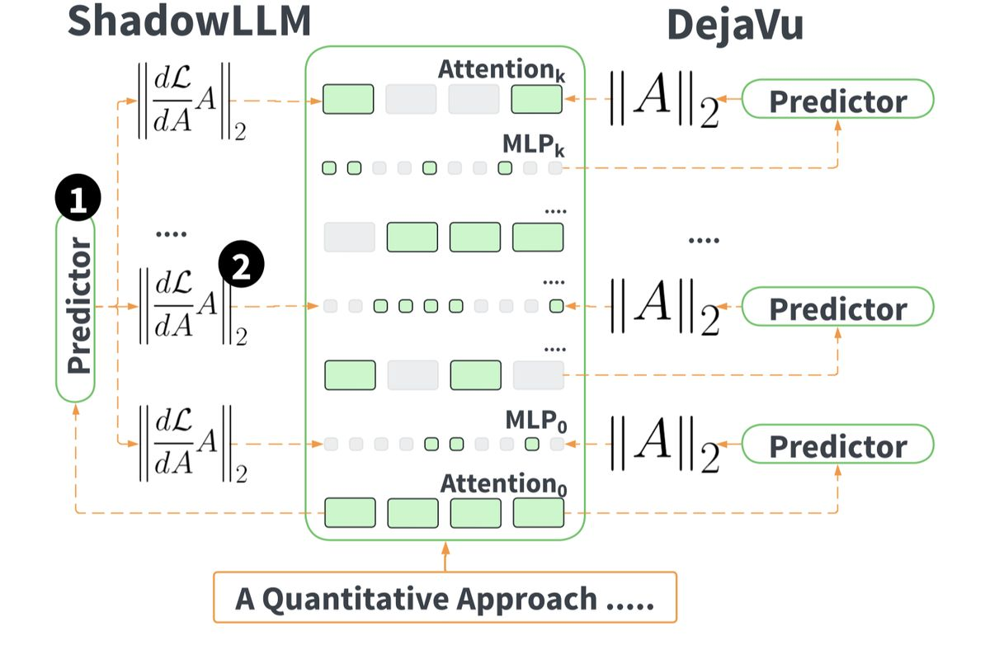

# ShadowLLM: Predictor-based Contextual Sparsity for Large Language Models

## 一句话总结

ShadowLLM 提出了一种基于梯度信息的上下文稀疏性预测器，通过单一预测器对整个 LLM 的注意力头和神经元进行动态剪枝，在不增加延迟的情况下实现了超过 15% 的端到端精度提升和最高 20% 的加速。

## 摘要翻译

大语言模型（LLM）的高功耗和对延迟敏感的部署需求催生了量化和稀疏化等技术。上下文稀疏性（contextual sparsity），即稀疏模式依赖于输入，对于 LLM 至关重要，因为永久移除注意力头或神经元会显著降低精度。先前的工作试图使用训练来预测激活幅值的神经网络来建模上下文稀疏性，从而可以动态剪枝激活幅值较小的结构。在本文中，我们超越了基于幅值的剪枝标准来评估 LLM 中注意力头和神经元的重要性。我们开发了一种名为 ShadowLLM 的新型预测器，它可以模拟 LLM 的行为并强制执行更好的稀疏模式，与之前的方法相比，端到端精度提高了 15% 以上，且不增加延迟。ShadowLLM 相比最先进的 DejaVu 框架实现了高达 20% 的加速。这些改进在多达 300 亿参数的模型上得到了验证。

## 研究动机

1. **LLM 部署成本高**：大语言模型的参数规模庞大，结合其对延迟的敏感性，使得部署成本昂贵。
2. **静态稀疏性的局限**：静态剪枝（永久移除注意力头或神经元）会显著降低模型精度，尤其是对上下文学习（in-context learning）能力的影响。
3. **DejaVu 的不足**：DejaVu 采用逐层预测器的方式生成稀疏模式，虽然能获取更多局部信息，但逐层预测器带来了昂贵的运行时开销（由于额外的内核启动和内存带宽限制），且逐层固定稀疏率的策略在真正的上下文稀疏场景下可能是次优的。
4. **剪枝标准的局限**：现有方法主要基于激活幅值（如 L2Norm）来判断神经元重要性，但这种方法忽略了梯度信息对模型损失的影响。

## 方法（技术细节）

### 1. 剪枝标准（Pruning Criteria）

ShadowLLM 评估了五类剪枝标准：
- **激活方法（Activation Methods）**：如 L2Norm，通过计算头和神经元激活的 L2 范数来评估重要性：`||A_{l,k}||_2`
- **一阶梯度方法（First-Order Gradient/Jacobian Methods）**：如 GradNorm
- **激活+雅可比方法（Activation + Jacobian Methods）**：如 Jacov
- **OBD 风格的海森方法（OBD-style Hessian Methods）**：如 Fisher、GRASP
- **基于敏感度的方法（Sensitivity-Based Methods）**：如 SNIP

**核心发现**：作者提出了一种名为 **plainact** 的梯度感知剪枝标准，它衡量模型在移除某个头或神经元后对损失的预期敏感度：
- 对注意力头：`||A_{l,k} · ∂L/∂A_{l,k}||_1`
- 对 FFN 神经元：`||θ_{l,k} · ∂L/∂θ_{l,k}||_1`

plainact 结合了激活值和梯度信息，比单纯的 L2Norm 更能准确评估神经元重要性。

### 2. 预测器设计（Predictor Design）

- **ShadowLLM 使用单一预测器**：在 Transformer 的第一层使用注意力输出来预测整个模型的稀疏模式，消除了逐层预测的需要。
- **相比 DejaVu**：DejaVu 在每层交替使用两层 MLP 预测下一层的稀疏模式，需要 per-layer 预测器。ShadowLLM 的统一预测器将预测器的 FLOPs 减少了约 20%（例如，OPT-1.3B 减少 19.11%，OPT-30B 减少 19.55%，OPT-175B 减少 19.76%）。
- **全序列 ShadowLLM（Full Sequence ShadowLLM）**：使用小型 Transformer 接收完整输入 token 嵌入来预测稀疏模式，可以剪枝第一层，但计算成本较高（额外 2(2E²+EL²) FLOPs），因此不实用。

### 3. 全局剪枝 vs 局部剪枝

- **局部剪枝（Local Pruning）**：每层都达到目标稀疏率，相对重要性只在层内比较。
- **全局剪枝（Global Pruning）**：允许跨层的不均匀剪枝，因为某些层的头比其他层的更重要。实验表明全局剪枝在精度-稀疏率权衡上优于局部剪枝。

### 4. 预测器超参数

| 超参数 | 值 |
|--------|-----|
| 隐藏层数 | 1 |
| 隐藏层神经元数 | 2048 |
| 激活函数 | ReLU |
| 输入维度 | OPT 模型嵌入维度 |
| 输出维度 | 神经元数量 |
| 训练轮次 | 100 |
| 批大小 | 32 |
| 优化器 | AdamW |
| 学习率 | 0.001 |
| 调度器 | CosineAnnealingLR |
| 损失函数 | MSELoss |

## 实验结果

### 1. 困惑度（Perplexity）评估

在 WikiText2 数据集上评估 OPT-1.3B 模型：
- **ShadowLLM（PlainAct）在全局和局部剪枝中均优于 DejaVu-Style（L2Norm）**，如图 7 所示。
- **全局剪枝优于局部剪枝**，因为某些层的头更重要，强制均匀剪枝可能导致更重要的头被剪掉。
- 在 OPT-13B 和 OPT-30B 上的全局剪枝中，ShadowLLM 的困惑度-稀疏率权衡也优于 DejaVu。

### 2. 下游任务精度

在 7 个下游任务（PIQA、COPA、OpenBookQA、Winogrande、RTE、HellaSwag、ARC-Easy）的零样本设置下：
- **ShadowLLM 相比 DejaVu 在所有 7 个任务上均有一致的精度提升**（图 8）。
- 在 50% 稀疏率下，OPT-13B 的平均零样本精度为 61.19%，而 DejaVu 为 59.28%（表 2）。
- ShadowLLM 的端到端精度提升超过 15%。

### 3. 延迟性能

- **ShadowLLM 在 50% 稀疏率下的延迟为 2562ms，而 DejaVu 为 2981ms**（表 2），降低约 14%。
- 静态稀疏延迟为 2014ms，密集模型为 2609ms。
- 在 OPT-1.3B 到 OPT-66B 的多个模型规模上，ShadowLLM 均表现出比 DejaVu 更低的推理时间。
- 在 OPT-30B 上，随着生成长度增加，ShadowLLM 的生成时间增长慢于 DejaVu。
- 每 token 延迟随稀疏率增加，ShadowLLM 始终低于 DejaVu。

### 4. 预测器有效性

- ShadowLLM 使用单一预测器在整个模型中实现准确的全局头和神经元重要性排序（图 5）。
- DejaVu 风格的逐层预测器在全局剪枝场景下表现不佳。
- Full Sequence ShadowLLM 与 ShadowLLM 性能相近，但计算成本显著增加。

### 5. 剪枝标准消融实验

- **PlainAct 和 Fisher 在困惑度上表现最好**（图 16），但 Fisher 的 Spearman-ρ 低于 0.7，难以预测。
- **GRASP 因高方差和异常值难以预测**。
- **PlainAct 易于预测且在上下文设置下表现良好**，是最佳的可预测性与精度平衡。
- Jacov 在静态剪枝中表现稳定，但不适合上下文稀疏场景。
- 在 5-shot 设置下提供更多的上下文示例有助于提升模型质量（图 13）。

## 优势

1. **显著的精度提升**：相比 DejaVu 在所有 7 个下游任务上均有一致的精度提升（超过 15%），且不增加延迟。
2. **更高效的预测器**：单一预测器替代逐层预测器，将预测器 FLOPs 减少约 20%，同时消除了逐层预测器带来的额外内核启动和内存带宽开销。
3. **更好的剪枝标准**：PlainAct 结合激活和梯度信息，比基于幅值的方法（L2Norm）更准确地评估神经元重要性。
4. **全局剪枝策略**：允许跨层的不均匀剪枝，避免了强制均匀剪枝导致重要神经元被剪掉的问题。
5. **可扩展性**：在多达 300 亿参数的模型上验证了有效性。
6. **易于集成**：无需担心逐层预测器的连续流水线和调度问题，集成更简单。

## 局限

1. **逐层预测器的 FLOPs 比例较低**：虽然 ShadowLLM 减少了预测器 FLOPs，但逐层预测器本身在 OPT-1.3B 上仅占总 FLOPs 的 2%，因此 FLOPs 减少的实际影响有限。
2. **Full Sequence ShadowLLM 计算成本高**：额外 2(2E²+EL²) FLOPs 的成本与运行整个密集注意力层相当，使其不实用。
3. **训练数据依赖**：预测器训练需要约 3000 个输入-输出样本，且在不同下游任务上的表现可能受到任务分布的影响。
4. **未验证 300 亿以上规模**：实验最多验证到 30B 参数模型（尽管表 1 提及了 OPT-175B 的 FLOPs 降低百分比）。
5. **PlainAct 的预测难度**：虽然 plainact 易于预测且表现良好，但其他剪枝标准（如 Fisher）在静态场景下可能表现更好，却难以被预测器准确建模。
6. **上下文示例数量的影响**：更多上下文示例（5-shot）会提升模型质量，但在实际部署中可能难以获得大量上下文示例。
7. **通用性验证不足**：现有实验主要在 OPT 系列模型和特定下游任务上验证，未广泛验证在其他架构（如 LLaMA、Mistral）上的效果。
8. **论文原始笔记指出**：DejaVu 的改进版，predictor 使用了 PIQA 来训练和测试，所以结果提升很大，如果使用通用的测试集，提升可能就有限。

## 与 EfficientPaper 相关的研究方向

1. **动态稀疏性（Dynamic/Contextual Sparsity）**：与 DejaVu、Chinchilla 等工作密切相关，关注如何根据输入动态调整稀疏模式以实现更高效的推理。
2. **模型剪枝（Model Pruning）**：与静态剪枝方法（如 Lottery Ticket Hypothesis、OBD、SNIP）互补，但聚焦于上下文敏感的动态剪枝。
3. **LLM 推理加速**：与量化（如 ATOM、Binarized NMT）和内存优化等技术正交，可以结合使用以实现更高效的 LLM 部署。
4. **神经架构搜索（NAS）**：论文中引入了 NAS 相关的代理指标（如 NWOT、EPE-NAS），探索了 NAS 与稀疏化技术的交叉。
5. **梯度信息利用**：利用梯度信息（如 Fisher、GRASP）评估模型组件重要性的方法，与权重剪枝和结构化剪枝研究相关。
6. **高效 Transformer**：与 Attention 稀疏化（如 Confident Adaptive Language Modeling）、通道门控（Channel Gating）等高效 Transformer 方法相关。

## AI 生成声明

本文档由 AI Agent（Hermes Agent）基于论文原文、元数据和 PDF 文本提取结果自动生成。内容经过 AI 整理和翻译，可能包含翻译误差或理解偏差，请以原文为准。本文档仅供学术参考，不构成任何形式的官方声明。
