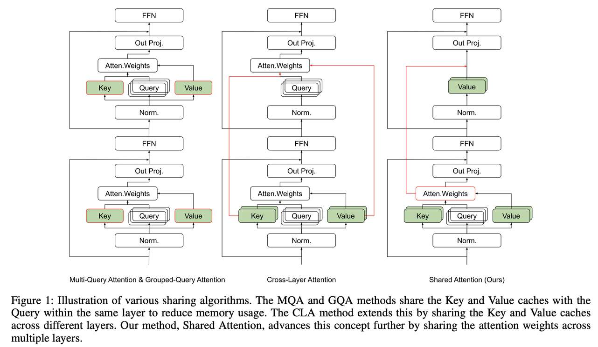

# Beyond KV Caching: Shared Attention for Efficient LLMs

## 一句话总结

本文提出了一种名为 Shared Attention (SA) 的注意力共享机制，通过直接共享多层之间已计算的注意力权重（而非仅共享 KV 缓存），利用大语言模型预训练后注意力分布的各向同性特征，显著降低推理时的计算量和 KV 缓存大小，同时在标准基准上保持较小的精度损失。

## 摘要翻译

大语言模型（LLMs）的效率仍然是一个关键挑战，尤其是在计算资源有限的情况下。这些模型中的传统注意力机制虽然强大，但由于需要在不同层之间重新计算和存储注意力权重，需要大量的计算和内存资源。本文提出了一种新颖的共享注意力（SA）机制，旨在通过直接在多个层之间共享已计算的注意力权重来提高 LLM 的效率。与之前专注于共享中间键值（KV）缓存的方法不同，我们的方法利用了高级 LLM 预训练后观察到的注意力分布的各向同性趋势，以减少推理时的计算量和所需的 KV 缓存大小。我们通过实验证明，在各种 LLM 上实现 SA 在标准基准上仅产生极小的精度损失。我们的研究结果表明，SA 不仅节约了计算资源，还保持了稳健的模型性能，从而促进了在资源受限环境中部署更高效的 LLM。

## 研究动机

### KV 缓存的局限性

传统的 Transformer 注意力机制（softmax(QK^T/√d)V）在每一层都需要重新计算注意力权重，这是一个计算密集型的任务。虽然 KV 缓存技术可以避免对已处理 token 的 K 和 V 矩阵重新计算，但在推理过程中仍然需要大量的内存存储。现有的方法（如 MQA、GQA、CLA）主要通过在同一层或相邻层之间共享 K 和 V 矩阵来减少内存开销，但它们都假设不同层之间的注意力权重存在显著差异，因此每一层都需要独立计算。

### 核心发现：注意力权重的各向同性

本文的关键发现是：**不同层之间的注意力权重分布具有高度相似性**。通过对 Llama2-7B-chat 模型的实证分析，研究者发现：
- 余弦相似度分析表明，大多数层（特别是第 3 到第 30 层）的注意力权重具有显著的高相似度
- 仅初始层（第 0 和第 1 层）和最终输出层（第 31 层）与中间层的相似度较低
- 初始层更接近输入 token 嵌入，需要频繁调整注意力分布来从不同输入中抽象语义含义
- 最终层在预测下一个 token 方面具有独特角色，因此其注意力模式与其他层不同

这一发现促使研究者提出：如果注意力权重在大多数层之间高度相似，是否可以直接共享这些权重，从而避免在每一层重复计算 softmax？

## 方法（技术细节）

### Shared Attention 算法

SA 机制的核心思想是：**在多个层之间直接共享已计算的注意力权重（softmax 结果），而不是共享 K 和 V 矩阵**。

#### 算法流程（Algorithm 1）：

1. **初始化**：设定共享注意力的层范围 S（如第 23 到第 30 层）
2. **对 S 中的每一层 l**：
   - 如果是 S 中的第一层：计算初始注意力权重 A_l = softmax(Q_l * K_l^T / √d_k)，并设置共享注意力矩阵 A = A_l
   - 否则：直接将注意力权重设为 A_l = A（共享第一层计算的注意力权重）
3. **应用共享注意力**：计算输出 O_l = A_l * V_l
4. **调整后续层的输入**：使用 S 层的输出调整后续层的输入
5. **继续处理剩余层**：使用标准注意力处理其他层

#### 与现有方法的关键区别

| 方法 | 共享内容 | 优化目标 |
|------|----------|----------|
| MQA/GQA | 同一层内多个头的 K 和 V | 减少 KV 缓存大小 |
| CLA | 相邻层之间的 K 和 V | 减少 KV 缓存大小 |
| **Shared Attention** | **多层之间的注意力权重（softmax 结果）** | **减少计算量 + 减少 KV 缓存** |

SA 的独特之处在于：
- **直接共享注意力权重**：绕过了重复的 softmax 计算
- **保留各自的 V 矩阵**：每一层仍然有自己的 V 矩阵，用于计算输出
- **减少计算复杂度**：避免了每一层重复计算 softmax（注意力机制中最昂贵的操作之一）
- **减少 KV 缓存**：由于共享注意力权重，无需为每一层存储独立的 K 矩阵

### 注意力各向同性分析

研究者对多种 LLM 进行了分析，包括 Llama2-7B-chat、Llama3-8B-instruct、Llama3-70B-instruct、Baichuan2-7B-chat、Qwen2-7B-instruct 和 Qwen2-72B-instruct。结果表明，这些模型的注意力权重分布呈现出一致的全局相似模式，可以分为四个功能组：

1. **Group 1（第 0-1 层）**：最接近输入 token，主要关注抽象 token 级语义信息
2. **Group 2（第 2-5 层）**：过渡区域，中间语义特征被精炼
3. **Group 3（第 6-30 层）**：最大的组，层间注意力权重高度相似，显示出注意力机制的各向同性
4. **Group 4（第 31 层）**：输出层，处理聚合的上下文信息以生成输出

### 预训练动态分析

通过分析 Baichuan 7B 模型的中间检查点（从 0.2T 到 2.6T token），研究者观察到：
- 早期预训练阶段（0.2T token）：Group 1 和 Group 2 合并，表明这些初始层的处理策略不太分化
- 训练进展到 1.0T token 时：Group 1 和 Group 2 之间出现清晰分离
- Group 3 的相似度从 0.8 提升到 0.9，表明注意力机制趋于稳定
- 这种训练进展与 MMLU、CMMLU 和 C-Eval 的 5-shot 准确度从 0.25 提升到 0.50 正相关

### 注意力方差分析

研究者还对注意力权重的方差进行了详细分析。结果显示：
- 早期层的加权累积方差显著高于后期层
- 方差随着模型架构的深入而降低
- 这表明注意力机制在后期层趋于稳定
- 因此 SA 主要在后期层应用，其中方差似乎趋于稳定

## 实验结果

### 实验设置

- **模型**：Llama2-7B 和 Llama3-8B（各 32 层）
- **硬件**：两块 NVIDIA A100 80GB GPU
- **优化器**：AdamW，初始学习率 2×10⁻⁵
- **数据类型**：bf16
- **批次大小**：每 GPU 微批次 16，使用梯度累积
- **分布式训练**：DeepSpeed Zero Stage 3
- **训练周期**：2 个 epoch
- **数据格式**：Alpaca 指令格式
- **评估基准**：GLUE（通用）、GSM8K（算术）、HellaSwag（推理）、MMLU（知识）

### 直接应用 SA（无微调）

在不同层段上实施 SA 的实验结果如下：

**Llama2-7B 模型：**

| 配置 | GLUE | GSM8K | HellaSwag | MMLU |
|------|------|-------|-----------|------|
| 原始 | 0.4050 | 0.1395 | 0.5713 | 0.4119 |
| SA:23~30 | 0.3819 | 0.0728 | 0.5575 | 0.3794 |
| SA:27~30 | 0.3882 | 0.1243 | 0.5616 | 0.4056 |
| SA:23~26 | 0.4351 | 0.1122 | 0.5681 | 0.3994 |
| SA:19~22 | 0.3996 | 0.0834 | 0.5553 | 0.3926 |
| SA:15~18 | 0.3731 | 0.0220 | 0.4790 | 0.3378 |

**Llama3-8B 模型：**

| 配置 | GLUE | GSM8K | HellaSwag | MMLU |
|------|------|-------|-----------|------|
| 原始 | 0.4804 | 0.5155 | 0.6009 | 0.6198 |
| SA:23~30 | 0.5595 | 0.3275 | 0.6011 | 0.6122 |
| SA:27~30 | 0.5532 | 0.4526 | 0.6060 | 0.6163 |
| SA:23~26 | 0.5024 | 0.4556 | 0.5993 | 0.6189 |
| SA:19~22 | 0.5115 | 0.3745 | 0.5829 | 0.6181 |
| SA:15~18 | 0.4685 | 0.0136 | 0.5307 | 0.3019 |

### 关键发现

1. **后期层效果最佳**：SA 在后期层（如 SA:27~30）的应用效果最好，精度损失最小
2. **早期层效果差**：在早期层（如 SA:15~18）应用 SA 会导致严重的性能下降，特别是 GSM8K（数学推理任务）
3. **Llama3-8B 表现更好**：Llama3-8B 模型由于本身就具有更高的层间注意力相似度，SA 的应用效果更好
4. **GLUE 甚至提升**：在 Llama3-8B 上，SA:27~30 配置的 GLUE 分数甚至超过原始模型（0.5532 vs 0.4804）

### 微调实验

在 Instruct 数据集上对 SA 模型进行微调后：
- 性能差距显著缩小
- 微调后的 Llama2-7BSA:23~30 在多个指标上显示出显著改进
- 这表明通过适当的训练，SA 的初始性能缺陷可以得到缓解

## 优势

1. **计算效率提升**：通过直接共享注意力权重，避免了每一层重复计算 softmax，显著减少了 FLOPs
2. **KV 缓存减少**：共享注意力权重减少了 K 矩阵的存储需求
3. **保持性能**：在标准基准上仅产生极小的精度损失，某些情况下甚至有所提升
4. **通用性**：适用于多种 LLM（Llama2、Llama3、Baichuan2、Qwen2 等）
5. **低侵入性**：可以直接应用于已有的预训练模型，无需从头训练
6. **可微调**：通过在 Instruct 数据集上微调，可以恢复甚至超越原始性能
7. **启发性强**：为注意力机制的效率优化提供了新的范式

## 局限

1. **早期层效果差**：SA 在早期层的应用会导致严重的性能下降，因为早期层的注意力方差较大，需要更多的变化来处理不同的输入
2. **数学推理任务敏感**：SA 对 GSM8K 等数学推理任务的影响较大，特别是当 SA 应用于更广泛的层范围时
3. **未从头训练验证**：由于计算限制，作者无法从头训练一个使用 SA 的 LLM，这限制了对 SA 最优配置的探索
4. **需要微调**：虽然可以直接应用于已有模型，但最佳效果需要通过微调实现
5. **注意力共享粒度固定**：当前方法在整个层段内共享固定的注意力权重，缺乏自适应的共享策略
6. **层段选择需要经验**：选择合适的层段范围需要一定的经验，不同模型可能有不同的最优配置
7. **与 CLA 等方法的组合尚未充分探索**：虽然论文提到了与 CLA 组合的可能性，但尚未进行详细的实验验证

## 与 EfficientPaper 相关的研究方向

### 1. 注意力机制效率优化
- **SA + CLA 组合**：探索将共享注意力与跨层注意力结合，可能产生更高效的注意力机制
- **自适应 SA**：根据层间相似度动态调整共享策略
- **SA 在不同模型架构上的应用**：验证 SA 在 Mamba、RWKV 等非 Transformer 架构上的适用性

### 2. KV 缓存优化
- **SA + KV 量化**：将 SA 与 KV 缓存量化技术（如 KVQuant、KIVI）结合
- **SA + 稀疏注意力**：将 SA 与稀疏注意力（如 AttentionSink、Scissorhands）结合
- **SA + 滑动窗口注意力**：探索在滑动窗口注意力中应用 SA 的可能性

### 3. 预训练阶段优化
- **从头训练 SA**：探索在预训练阶段引入 SA 的效果
- **SA 在不同规模模型上的表现**：验证 SA 在 7B、70B、405B 等不同规模模型上的效果
- **SA 在多模态模型中的应用**：探索 SA 在视觉-语言模型中的潜力

### 4. 系统级优化
- **SA 的硬件加速**：为 SA 设计专用的硬件加速器
- **SA 在边缘设备上的部署**：探索 SA 在资源受限环境（如移动设备）中的应用
- **SA 与其他推理优化技术的结合**：如投机解码、模型蒸馏等

### 5. 理论分析
- **注意力各向同性的理论基础**：探索为什么 LLM 会形成注意力各向同性的结构
- **SA 的最优层段选择**：从理论上确定最优的层段范围
- **SA 的泛化能力**：分析 SA 在不同任务和数据集上的泛化能力

## AI 生成声明

本笔记由 AI Agent（Hermes Agent）基于论文原文自动提取和分析生成。内容包括对论文核心方法、实验结果和相关研究方向的总结和分析。所有数据均来自论文原文，未经人工审核。本笔记旨在帮助研究人员快速了解论文内容，不替代原文阅读。
