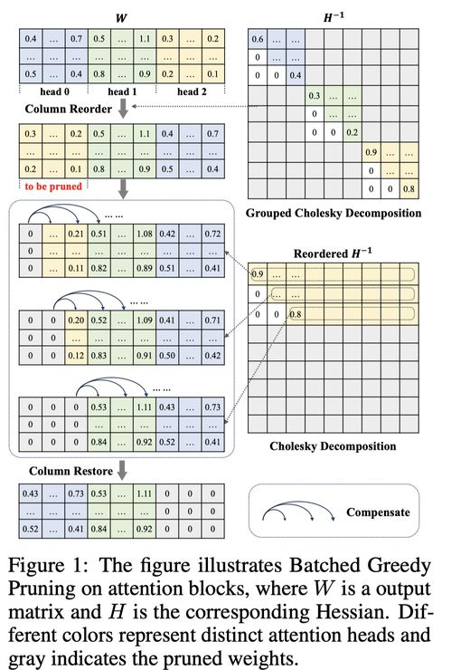

# SlimGPT: Layer-wise Structured Pruning for Large Language Models

## 一句话总结

SlimGPT 是一种基于最优脑外科（OBS）框架的低成本、快速结构化剪枝方法，通过批量贪心剪枝和递增剪枝比例策略，在单块 GPU 上约一小时内完成对 LLM 的近似最优结构化剪枝，且在 LLaMA 系列模型上取得了 SOTA 结果。

## 摘要翻译

大型语言模型（LLMs）因其在各领域的卓越能力而备受关注，但其庞大的参数规模给实际部署带来了挑战。结构化剪枝是一种平衡模型性能与效率的有效方法，但在计算资源约束下的性能恢复是剪枝 LLM 的主要挑战。因此，我们提出了一种基于最优脑外科（OBS）框架的低成本、快速结构化剪枝方法——SlimGPT。我们提出了**批量贪心剪枝（Batched Greedy Pruning）**方法，用于快速且近似最优的剪枝，通过分组 Cholesky 分解提高了逐头剪枝误差估计的准确性，并通过**动态组大小（Dynamic Group Size）**提高了 FFN 的剪枝效率，从而在一小时内实现近似局部最优剪枝结果。此外，我们从误差累积的角度探讨了逐层剪枝的局限性，并提出了**递增剪枝比例（Incremental Pruning Ratio）**——一种非均匀剪枝策略，以减少性能退化。在 LLaMA 基准上的实验结果表明，SlimGPT 优于其他方法并取得了最先进的结果。

## 研究动机

1. **LLM 部署难题**：大型语言模型参数量巨大，推理成本高、部署困难，需要高效的模型压缩方法。
2. **结构化剪枝的独特价值**：相比非结构化剪枝（需要特殊硬件/框架加速），结构化剪枝通过删除权重矩阵的列或行来减少参数量，能直接在常规硬件上提升推理速度。
3. **OBS 框架的局限**：OBS 框架最初为逐参数压缩设计，直接应用于结构化剪枝时存在两个关键问题：
   - 粒度不匹配：OBS 每次迭代压缩一个参数，而结构化剪枝的最小粒度是列或头，直接应用会产生较大的数值误差。
   - 缺乏全局信息：OBS 本质上是逐层压缩方法，无法利用全局信息（如全局梯度）合理分配各层的剪枝比例，这对 LLM 结构化剪枝至关重要。
4. **逐层剪枝的误差累积**：层剪枝的局部性导致误差在后续层中被放大，造成最终模型输出与原始模型的显著偏差。
5. **低成本需求**：现有方法依赖大量计算资源进行后训练，不适合当前 LLM 场景。需要一种仅需单块 GPU、少量校准数据和约一小时即可完成的压缩方案。

## 方法（技术细节）

### 4.1 基于 OBS 框架的结构化剪枝

将 OBS 框架扩展为结构化列剪枝，即一次删除一列，并用剩余列补偿：

$$W_{:,p} = \arg\min_{W_{:,p}} \frac{\sum W^2_{:,p}}{H^{-1}_{p,p}}, \quad \Delta = -\frac{W_{:,p}}{H^{-1}_{p,p}} \cdot H^{-1}_{p,:}$$

以注意力块和 FFN 为最小剪枝单位，分别剪枝注意力块的输出矩阵列和 FFN 的降维矩阵列。

### 4.2 批量贪心剪枝（Batched Greedy Pruning）

**核心思想**：通过分组 Cholesky 分解和动态组大小策略，实现快速、近似最优的结构化剪枝。

**分组 Cholesky 分解（Grouped Cholesky Decomposition）**：
- 利用对称矩阵的逆矩阵在置换后可通过相同置换获得的性质，以及 Cholesky 分解的主子矩阵等价性，将 $H^{-1}$ 沿主对角线拆分为 $n_{head}$ 个子矩阵并行分解：
$$\hat{H}^{-1} = \text{Cholesky}(\text{Stack}([H^{-1}_{0:d,0:d}, H^{-1}_{d:2d,d:2d}, ..., H^{-1}_{(n-1)d:nd,(n-1)d:nd}]))$$
- 利用 GPU 加速快速计算对角线元素，计算逐头误差。
- 在误差计算过程中，仅更新 $H^{-1}$ 的对角线元素，跳过 $W$ 的更新。
- 确定要剪枝的头后，重新排列 $W$ 和 $H^{-1$ 的对应行列到前面，再次使用全局 Cholesky 分解逐列剪枝。
- 对于 FFN，由于没有类似注意力头的块约束，采用动态组大小策略：从较大组大小（如 1024）开始剪枝，逐渐减小到较小值（如 8），在提升剪枝效率的同时接近近似最优解。

### 4.3 递增剪枝比例（Incremental Pruning Ratio）

**问题**：逐层剪枝中，误差在后续层中被放大，以超线性速率累积。实验证明，浅层剪枝比例越高，深层误差累积越严重。

**策略**：采用对数递增策略控制逐层剪枝比例：
$$r_i = r_0 + (r_{n-1} - r_0) \frac{\log(i + 1)}{\log(n)}, \quad (0 \leq i < n)$$

- $r_i$ 为第 $i$ 层的剪枝比例，$r_0$ 和 $r_{n-1}$ 分别为第一层和最后一层的剪枝比例。
- 该策略确保从第一层到最后一层的剪枝比例平滑过渡为对数曲线。
- 减轻浅层的剪枝误差累积，同时避免深层过度剪枝，进一步降低性能损失。

### 4.4 实施细节

- 校准集：从 C4 数据集中随机选择 256 个 2048-token 序列。
- 后训练：使用 LoRA 微调，采用 Alpaca 数据集，训练一个 epoch，AdamW 优化器，初始学习率 1e-4，余弦退火调度，全局 batch size 64，序列长度截断为 256。
- 剪枝在单块 A100 上执行，微调使用两块 A100。
- 评估：WikiText2（语言建模）和 Commonsense Reasoning（七项零样本任务：BoolQ, PIQA, HellaSwag, WinoGrande, ARC-easy, ARC-challenge, OpenbookQA）。

## 实验结果

### LLaMA-7B 结果

| 剪枝比例 | 方法 | 参数量 | PPL↓ | 零样本平均↑ |
|---------|------|--------|------|------------|
| 20% | LLM-Pruner | 5.4B | 18.01 | 61.50 |
| 20% | Compresso | - | - | 59.51 |
| 20% | SlimGPT | 16.68 | 65.07 | 65.07 |
| 25% | LLM-Pruner | 5.0B | 20.57 | 58.67 |
| 25% | SlimGPT | 18.45 | 62.45 | 62.45 |
| 33% | LLM-Pruner | 4.5B | 24.50 | 55.39 |
| 33% | SlimGPT | 22.43 | 61.41 | 61.41 |
| 50% | LLM-Pruner | 3.4B | 40.64 | 48.35 |
| 50% | SlimGPT | 31.07 | 53.76 | 53.76 |

### LLaMA-13B/30B 结果

- **LLaMA-13B**：20% 剪枝后 PPL 14.73，零样本平均 68.06；50% 剪枝后 PPL 26.38，零样本平均 59.49。
- **LLaMA-30B**：20% 剪枝后 PPL 11.69，零样本平均 72.56；50% 剪枝后 PPL 17.17，零样本平均 66.79。
- 模型规模越大，剪枝导致的性能损失越小，说明大模型参数冗余度更高。
- LLaMA-13B 50% 剪枝的性能甚至不如 LLaMA-7B 20% 剪枝，说明低成本微调的局限性。

### 效率分析

| 模型 | 20% 剪枝耗时 | 50% 剪枝耗时 | 内存 |
|------|------------|------------|------|
| 7B | 678s (≈11分钟) | 1074s (≈18分钟) | 7375M |
| 13B | 1417s (≈24分钟) | 2475s (≈41分钟) | 11601M |

- 7B 模型 50% 剪枝后：推理内存减少至 51%（14297MB vs 27737MB），推理延迟降低至 69%（9.21ms vs 13.51ms）。
- 逐层剪枝策略不需要一次加载整个模型，仅需加载当前层参数和输入特征，显著降低内存消耗。

### 消融实验

- **分组 Cholesky 分解**：对注意力块的 PPL 影响显著（38.83 vs 54.94）。
- **动态组大小**：对 FFN 的零样本性能有贡献（52.23 vs 51.63）。
- **剪枝比例策略**：对数递增 > 线性递增 > 均匀 > 对数递减 > 线性递减。
- **校准样本数和序列长度**：样本越多、序列越长，效果越好。样本数达 2048 时 PPL 仍未收敛。

## 优势

1. **低成本高效压缩**：仅需单块 GPU、256 个校准样本、约 18 分钟（7B/20%）即可完成剪枝，极大降低了压缩成本。
2. **任务无关性**：使用通用预训练语料的随机样本作为校准集即可获得压缩模型，无需特定任务数据。
3. **通用性**：理论上适用于所有基于标准 Transformer 架构的模型，已在 LLaMA、Vicuna、LLaMA2、Baichuan 上验证。
4. **SOTA 性能**：在 LLaMA-7B/13B/30B 上，PPL 和零样本性能均优于 LLM-Pruner、Compresso、LoRAPrune 等基线方法。
5. **无需特殊硬件**：结构化剪枝直接减少参数量，无需特殊推理框架或硬件支持。
6. **与量化/非结构化剪枝兼容**：可与其他压缩方法组合使用。
7. **误差累积分析新颖**：从误差累积角度深入分析逐层剪枝的局限性，提出对数递增策略，具有理论贡献。

## 局限

1. **高剪枝比例下性能退化明显**：50% 剪枝时性能损失显著，尤其在复杂任务（如 LongBench）上。
2. **低成本微调的局限**：使用 LoRA 微调时，50% 剪枝后的 13B 模型性能甚至不如 20% 剪枝的 7B 模型，说明资源受限条件下性能恢复有限。
3. **对数递增策略非最优**：虽然保证了通用性，但不是最优的非均匀策略，需要进一步探索更合适的方案。
4. **校准数据影响**：校准样本数和序列长度对结果有显著影响，数据不足时效果不佳。
5. **伦理安全风险**：剪枝后的模型可能带来伦理安全问题，需要谨慎处理。
6. **未与多种基线方法全面对比**：仅与 LLM-Pruner、Compresso、LoRAPrune 进行对比，缺少与 SparseGPT、Wanda 等方法的直接对比。

## 与 EfficientPaper 相关的研究方向

- **结构化剪枝（Structured Pruning）**：高效 AI 研究中的核心方向，SlimGPT 作为 OBS 框架在结构化剪枝中的首次应用，具有重要参考价值。
- **模型压缩（Model Compression）**：与量化（Quantization）、知识蒸馏（Knowledge Distillation）等方法互补，可与 GPTQ、SparseGPT 等方法组合使用。
- **LLM 推理加速（LLM Inference Acceleration）**：结构化剪枝直接减少参数量，提升推理速度，是高效推理的重要手段。
- **低成本压缩（Low-cost Compression）**：SlimGPT 的低成本特性使其在资源受限场景下具有独特优势，与 Compresso、LoRAPrune 等方法形成对比。
- **稀疏性（Sparsity）**：与稀疏训练、稀疏注意力等研究方向相关，是构建高效 LLM 的关键。
- **模型架构优化**：结构化剪枝可视为模型架构搜索（NAS）的简化版本，两者在高效模型设计方面有交叉。

---

## AI 生成声明

本笔记由 AI Agent（Hermes Agent）基于论文 PDF 全文自动生成。AI Agent 使用 PyMuPDF（fitz）提取论文文本，结合元数据文件（.prototxt）信息，生成了本中文笔记。笔记内容包括摘要翻译、研究动机、方法技术细节、实验结果、优势、局限、相关研究方向等。AI 生成内容可能存在偏差或遗漏，建议读者参考原文进行核实。
