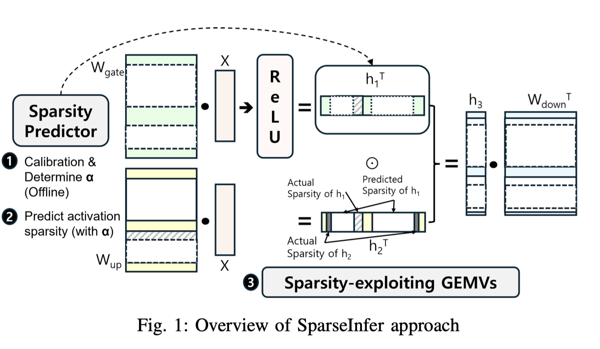

# SparseInfer: Training-free Prediction of Activation Sparsity for Fast LLM Inference

## Abstract

Leveraging sparsity is crucial for optimizing large language model inference.
however, modern LLMs employing SiLU as their activation function exhibit
minimal activation sparsity. Recent research has proposed replacing SiLU with
ReLU to induce significant activation sparsity and showed no downstream task
accuracy degradation through fine tuning. However, taking full advantage of it
required training a predictor to estimate this sparsity. In this paper, we
introduce SparseInfer, a simple, light weight, and training free predictor for
activation sparsity of ReLU field LLMs, in which activation sparsity is
predicted by comparing only the sign bits of inputs and weights. To compensate
for possible prediction inaccuracy, an adaptive tuning of the predictor's
conservativeness is enabled, which can also serve as a control knob for
optimizing LLM inference. The proposed method achieves approximately faster
inference speed over the state of the art, with negligible accuracy loss of
within 1%p.

预测器不用训练，只用获取权重的MSB，most significant bits，与输入进行xor运算，从而预测结果正负，从而不再需要之前的预测器。
