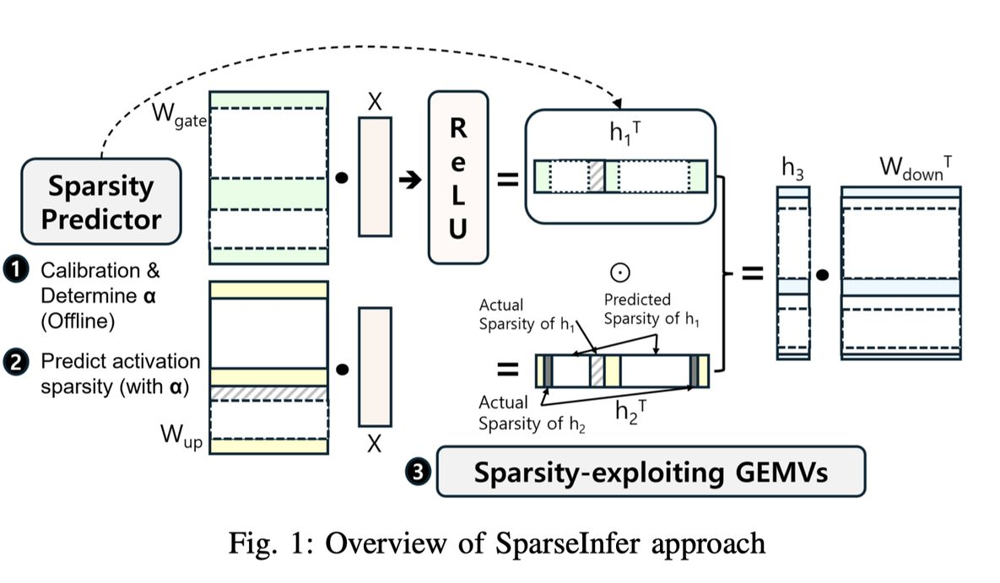

# SparseInfer: Training-free Prediction of Activation Sparsity for Fast LLM Inference

## 一句话总结

SparseInfer 提出了一种无需训练的激活稀疏性预测方法，仅通过比较权重和输入的最高有效位（MSB）的符号位，即可预测 ReLU 化 LLM 中的激活稀疏性，从而在移动级 GPU 上实现比 SOTA（PowerInfer）快约 21% 的推理速度，且精度损失控制在 1% 以内。

---

## 摘要翻译

利用稀疏性对于优化大型语言模型（LLM）的推理至关重要；然而，现代 LLM 采用 SiLU 作为激活函数，其激活稀疏性极低。最近的研究提出将 SiLU 替换为 ReLU 以诱导显著的激活稀疏性，并通过微调证明了下游任务精度几乎不受影响。然而，要充分利用这种稀疏性需要训练一个预测器来估计稀疏模式。本文介绍了 SparseInfer，一种简单、轻量且无需训练的激活稀疏性预测器，适用于 ReLU 化的 LLM。该方法仅通过比较输入和权重的符号位即可预测激活稀疏性。为补偿可能的预测不准确性，引入了对预测器保守性的自适应调节机制，同时可作为优化 LLM 推理的控制旋钮。所提出的方法实现了比 SOTA 快约 21% 的推理速度，精度损失可忽略不计，控制在 1% 以内。

---

## 研究动机

1. **LLM 推理瓶颈**：基于 GPT 架构的 LLM 在解码阶段需要频繁的内存访问，导致 I/O 瓶颈，限制了整体计算性能。传统的剪枝和量化方法虽然能降低内存访问开销，但不可避免地导致精度损失。
2. **激活稀疏性的潜力**：利用激活稀疏性是另一种优化 LLM 推理的方法。通过运行时动态利用零值激活，可以跳过不必要的计算。然而，现代 LLM 普遍采用 SiLU 或 GELU 作为激活函数，其稀疏性远低于 ReLU。
3. **ReLU 化的局限**：虽然将 SiLU 替换为 ReLU 可以诱导高稀疏性（约 90%），但要在设计时知道哪些内积操作最终会产生零值是不可能的，因此需要运行时预测机制。
4. **现有预测器的不足**：DEJAVU 等方法需要训练额外的神经网络作为预测器，这带来了额外的内存和计算开销，且当模型或量化方式改变时需要重新训练。
5. **SparseInfer 的动机**：需要一种无需训练、轻量级、可移植的激活稀疏性预测方法，适用于各种硬件平台（包括 GPU、CPU 和定制硬件加速器），并能支持设计空间探索（DSE）。

---

## 方法（技术细节）

### 1. 核心思想

SparseInfer 的核心思想是：**不需要精确计算内积结果，只需要预测 ReLU 函数的输入是正还是负**。通过比较输入向量和权重矩阵的符号位（最高有效位 MSB），即可近似预测内积结果的符号。

### 2. 理论基础

假设输入向量 X 和权重矩阵 Wgate 的元素服从独立的高斯分布，那么它们的点积结果服从拉普拉斯分布，均值约为零。在此分布中，正负值比例大致相等。因此，如果元素级乘积中有更多负值，累积结果很可能为负，从而经过 ReLU 后变为零，贡献于激活稀疏性。

### 3. 稀疏性预测算法

- **符号位 XOR 运算**：仅提取权重矩阵 Wgate 和输入向量 X 的最高有效位（MSB），通过 XOR 运算预测每个元素级乘积的符号。
  - XOR 结果为 0：预测乘积为正
  - XOR 结果为 1：预测乘积为负
- **计数与比较**：统计预测为正（Npos）和负（Nneg）的元素数量。若 Npos < Nneg，则认为内积结果很可能为负，经过 ReLU 后为零，标记为稀疏。
- **可调参数 α**：引入可调参数 α 来控制预测的保守性：α · Npos < Nneg。
  - α > 1.0：更保守的预测（减少误判）
  - α < 1.0：更激进的预测（增加稀疏性）
  - 通常对早期层（预测精度较低）设置 α = 1.01–1.03，后续层设置 α = 1.0。

### 4. 预测精度分析

- 整体精度（Precision）超过 99%
- 召回率（Recall）相对较低
- 早期层的预测精度较低，因为 X 值分布集中在零附近，偏离典型正态分布
- 通过分层调节 α 参数可以补偿早期层的不准确性

### 5. CUDA 实现

- **预取与打包符号位**：
  - 权重矩阵 Wgate 的符号位在模型加载时预取并打包为 32 位整数（32 个连续元素打包为一个变量），仅需一次性开销
  - 输入向量 X 的符号位在解码阶段动态打包
- **稀疏性预测内核**：
  - 每个线程块组织为 2D 32×16 线程结构（1 个 warp = 32 线程处理一行，16 个 warp 组成一个线程块）
  - 每个线程从 sign_Wgate 和 sign_X 中提取 32 位打包信息，执行 XOR 运算
  - 使用 CUDA 内置函数 __popc() 统计 XOR 结果中 1 的数量（即预测为负的元素数量）
  - 通过 warp 级归约操作得到总计数，设置 skip 标志
- **稀疏 GEMV 内核**：
  - 接收预测器生成的 skip 标志
  - 当 skip 标志为真时，整个 warp 直接返回 0，无需任何计算
  - 后续步骤使用预测稀疏性和实际稀疏性的联合（union）
- **内核融合（Kernel Fusion）**：
  - MLP 块的步骤 1（gate 计算）、2（输入处理）、3（门控应用）可融合为单个 CUDA 内核
  - 减少内存访问：仅需一次加载 X，一次写入 h3
  - 步骤 4（输出生成）作为独立内核实现，因为 Wdown 转置后需要使用 atomicAdd 进行归约

### 6. 实际稀疏性补偿

- 在步骤 1 执行后，除了预测的稀疏性外，还能识别出预测器遗漏的实际稀疏性（actual sparsity）
- 这种补偿机制使后续步骤能利用更多稀疏性，尤其在 α > 1.0（保守预测）时效果显著

---

## 实验结果

### 实验平台

- 硬件：NVIDIA Jetson Orin AGX 64GB（Cortex CPU + Ampere GPU，共享 LPDDR DRAM）
- 软件：Ubuntu 22.04, JetPack 6.0 DP, CUDA 12.2
- 实现：基于 llama.cpp 扩展
- 模型：ProSparse-Llama2-7B 和 13B（ReLU 化版本）
- 基线：llama.cpp（密集推理）和 PowerInfer（SOTA，使用 DEJAVU 预测器）

### 预测器开销

| 指标 | PowerInfer | SparseInfer |
|------|-----------|-------------|
| 操作数 | 1.940 × 10⁷ | 2.211 × 10⁶（约低一个数量级） |
| 操作类型 | FP16 乘法（Tensor Core） | 32 位 XOR（CUDA Core） |
| 每层每 token 预测延迟 | ~256 μs | ~70 μs |
| 预测器加速比 | - | 3.66× |

**内存占用**：
- PowerInfer（rank=1024）：约 1480 MB
- SparseInfer（仅符号位）：约 337.5 MB
- 内存节省：4.38×

### 端到端推理加速

| 模型 | α | 相对 llama.cpp 加速 | 相对 PowerInfer 加速 |
|------|---|---------------------|---------------------|
| ProSparse-Llama2-13B | 1.00 | 1.79× | 1.27× |
| ProSparse-Llama2-13B | 1.02 | 1.70× | 1.21× |
| ProSparse-Llama2-7B | 1.00 | 1.74× | 1.30× |
| ProSparse-Llama2-7B | 1.03 | 1.59× | 1.19× |

- 内核融合（+KF）带来的加速不显著（因为复用的输入向量较小，约 16-20KB）
- 实际稀疏性利用（+AS）对加速贡献显著，尤其在 α > 1.0 时

### 精度评估

| 模型 | α | GSM8K | BBH | 平均 |
|------|---|-------|-----|------|
| ProSparse-Llama2-13B (baseline) | - | 30.71 | 44.80 | 37.76 |
| ProSparse-Llama2-13B (SparseInfer) | 1.03 | 30.63 (-0.08) | 44.34 (-0.46) | 37.49 (-0.27) |
| ProSparse-Llama2-7B (baseline) | - | 13.42 | 35.80 | 24.61 |
| ProSparse-Llama2-7B (SparseInfer) | 1.03 | 12.96 (-0.46) | 35.60 (-0.20) | 24.28 (-0.33) |

- 精度损失在 α = 1.03 时控制在 1% 以内
- 无预测器时随机选择 90% 稀疏性导致 0% 精度，证明了预测器的必要性

---

## 优势

1. **无需训练**：与 DEJAVU 等基于训练的方法不同，SparseInfer 无需额外的预测器训练，可直接应用于预训练模型，避免了模型或量化方式改变时的重新训练。
2. **极低的预测器开销**：预测器仅使用 32 位 XOR 运算，操作数比 PowerInfer 低约一个数量级，预测延迟仅为 70 μs（3.66× 快于 PowerInfer）。
3. **低内存占用**：仅需存储符号位信息（约 337.5 MB），比 PowerInfer 的 1480 MB 节省 4.38×。
4. **高精度**：预测器精度超过 99%，通过 α 参数调节可将精度损失控制在 1% 以内。
5. **可移植性**：预测器仅需简单的符号位查找操作，适用于各种硬件平台（GPU、CPU、定制硬件加速器）。
6. **支持设计空间探索（DSE）**：通过可调参数 α，可灵活探索推理速度与精度的权衡，支持针对特定平台和任务的优化。
7. **对量化鲁棒**：由于仅使用符号位信息，对 INT8、FP16 等量化方案具有鲁棒性。
8. **实际稀疏性补偿**：结合预测稀疏性和实际稀疏性，尤其在 α > 1.0 时效果显著。
9. **内核融合优化**：通过融合 MLP 块的多个步骤，减少内存访问开销。

---

## 局限

1. **早期层预测精度较低**：由于早期层中 X 值分布集中在零附近，偏离典型正态分布，导致预测精度较低，需要通过 α 参数进行补偿。
2. **精度与速度的权衡**：虽然 α 参数可调节，但更保守的预测（α > 1.0）会减少稀疏性，降低加速效果。
3. **仅适用于 ReLU 化模型**：SparseInfer 需要模型已进行 ReLU 化（如 ProSparse-Llama2），对于原始 SiLU/GELU 模型不直接适用。
4. **内核融合收益有限**：内核融合带来的加速不显著，因为复用的输入向量较小（16-20KB），相对于 4MB 的 L2 缓存可忽略。
5. **仅优化 MLP 块**：SparseInfer 主要针对 MLP 块中的 GEMV 操作，未涉及 Attention 块的优化。
6. **实验平台受限**：实验仅在 Jetson Orin AGX 64GB 上进行，未在更广泛的硬件平台上验证。
7. **未支持混合精度**：虽然对量化鲁棒，但未明确支持混合精度推理（如 FP16/INT8 混合）。
8. **预测器需要离线校准**：虽然无需训练，但 α 参数的最优值仍需通过测试运行进行校准。
9. **仅支持 Llama 系列模型**：虽然理论上可应用于其他 ReLU 化模型（如 Falcon、OPT），但实验仅验证了 Llama2 系列。

---

## 与 EfficientPaper 相关的研究方向

SparseInfer 属于 **sparse_pruning** 和 **activation_sparsity** 研究方向，与 EfficientPaper 项目中以下研究密切相关：

1. **激活稀疏性利用**：SparseInfer 属于利用激活稀疏性加速 LLM 推理的类别，与 ReLUfication（[7]）、ProSparse（[8]）、TurboSparse（[14]）等方法互补。
2. **稀疏性预测**：SparseInfer 提供了一种无训练的稀疏性预测方法，与 DEJAVU（[9]）等基于训练的方法形成对比。
3. **LLM 推理加速**：SparseInfer 关注推理阶段的优化，与 llama.cpp 等推理引擎集成，属于 LLM 推理加速的范畴。
4. **稀疏 GEMV 优化**：SparseInfer 通过稀疏 GEMV 和内核融合优化计算，属于矩阵运算优化方向。
5. **设计空间探索（DSE）**：SparseInfer 的可调参数 α 支持 DSE，与 LLM 推理优化中的权衡分析相关。
6. **移动/边缘推理**：SparseInfer 在 Jetson Orin AGX 上验证，属于移动/边缘 LLM 推理优化方向。
7. **稀疏计算框架**：SparseInfer 的实现（基于 llama.cpp + CUDA）属于稀疏计算框架方向。

---

## AI 生成声明

本笔记由 AI Agent（Hermes Agent）自动生成。笔记基于论文 SparseInfer 的 PDF 文本提取结果，通过分析论文内容、实验数据和相关研究，整理而成。笔记内容仅供参考，如有错误或不准确之处，请以原文为准。

- 生成工具：Hermes Agent（Nous Research）
- 生成时间：2026-06-05
- 生成方法：基于 PyMuPDF (fitz) 提取的论文文本，结合元数据和现有笔记，自动整理中文总结。
- 声明：本笔记不包含作者的主观评价，仅为论文内容的客观总结和翻译。
