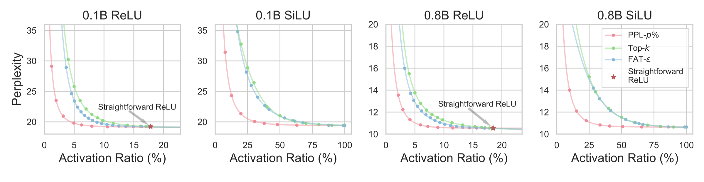
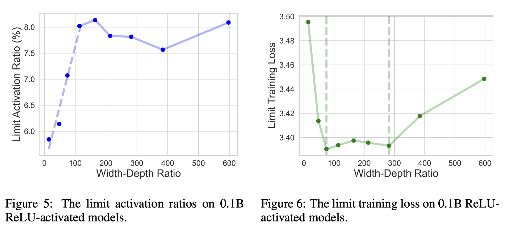
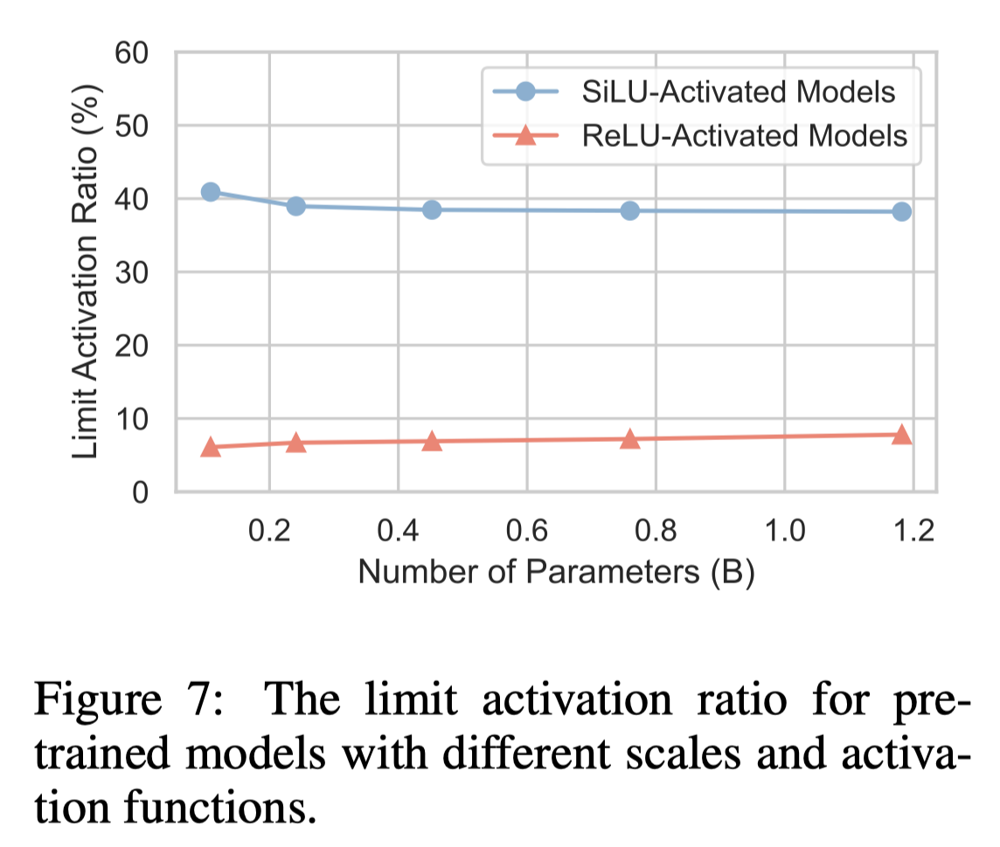

# Sparsing Law: Towards Large Language Models with Greater Activation Sparsity

## Abstract

Activation sparsity denotes the existence of substantial weakly-contributed
elements within activation outputs that can be eliminated, benefiting many
important applications concerned with large language models (LLMs). Although
promoting greater activation sparsity within LLMs deserves deep studies,
existing works lack comprehensive and quantitative research on the correlation
between activation sparsity and potentially influential factors. In this paper,
we present a comprehensive study on the quantitative scaling properties and
influential factors of the activation sparsity within decoder-only
Transformer-based LLMs. Specifically, we propose PPL-$p\%$ sparsity, a precise
and performance-aware activation sparsity metric that is applicable to any
activation function. Through extensive experiments, we find several important
phenomena. Firstly, different activation functions exhibit comparable
performance but opposite training-time sparsity trends. The activation ratio
(i.e., $1-\mathrm{sparsity\ ratio}$) evolves as a convergent increasing
power-law and decreasing logspace power-law with the amount of training data
for SiLU-activated and ReLU-activated LLMs, respectively. These demonstrate
that ReLU is more efficient as the activation function than SiLU and can
leverage more training data to improve activation sparsity. Secondly, the
activation ratio linearly increases with the width-depth ratio below a certain
bottleneck point, indicating the potential advantage of a deeper architecture
at a fixed parameter scale. Finally, at similar width-depth ratios, we
surprisingly find that the limit value of activation sparsity varies weakly
with the parameter scale, i.e., the activation patterns within LLMs are
insensitive to the parameter scale. These empirical laws towards LLMs with
greater activation sparsity have important implications for making LLMs more
efficient and interpretable.

- 提出PPL-p%评估指标，其实就是帕累托曲线，这里p%表示sparsity ratio，越高一半模型的精度也会越差，比如ppl越高。图中给的是activation ratio，正好与p%相加=100%。

- PPL-1%来评估模型对sparse的忍受程度
  - ReLU：更多的训练数据可以导致模型更加稀疏
  - SiLU: 更多的训练数据导致模型更加稠密 （使用PPL-1%来评估），这并不能说dense silu model比relu model差，按照经验和之前的实验结果，silu model比relu model好，但是去掉1%的激活后，silu model的精度表现会降低很多，而且随着训练的数据越多，精度降低的幅度就越大；这个是一个很好的结论。
  - 所以推荐使用ReLU来作为LLM的激活函数

- width-depth ratio 表示 hidden dimension 与 layer number的比例，越高证明这个LLM越胖，这个参数也与activation sparsity表现有密切关系

- 以0.1B模型训练举例
  - Fig.5表示Width-Depth Ratio在[0, 114]之间，模型会逐渐变胖，且激活比例越来越高，所以希望模型越瘦越好，有利于activation sparsity
  - Fig.6表示Width-Depth Ratio在[74, 182]之间，不胖不瘦时训练loss最好
  - 综上，可以选取 Width-Depth Ratio=74，可以满足training loss 和 activation sparsity 需求

- 确定模型的 Width-Depth ，且training data 足够多时，model的参数量对 activation sparsity 影响很小
- 但是小模型更加容易收敛 （从 activation sparsity变化的角度）
- 另外，不同scale 的LLM，acitvation 激活的频率都是相似的，且对相同的token输入，不同scale LLM激活的比例也是相似的。

根据以上观察：
- LLM Architectural design 尽量使用ReLU，且满足loss 前提下，尽量瘦一点
- Training-time predictable sparsity，可以根据小模型的表现预测大模型的结果
- Lens for the convergence of neuron specialization，Fig4表示training loss收敛后，activation sparsity 仍然在逐步的进化，所以可以让模型多训练，从而让更多的神经元进化为专用神经元。