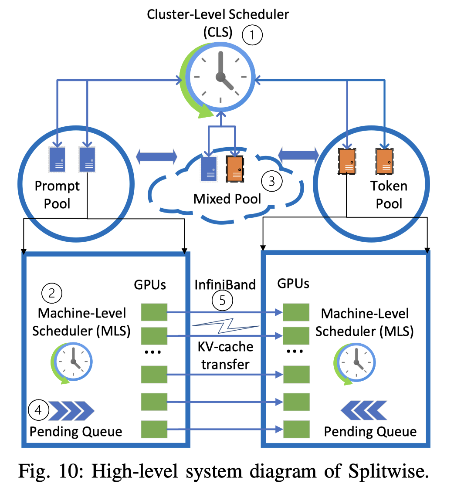

# Splitwise: Efficient generative LLM inference using phase splitting

> Pratyush Patel, Esha Choukse, Chaojie Zhang, Aashaka Shah, Íñigo Goiri, Saeed Maleki, Ricardo Bianchini

## Abstract

Recent innovations in generative large language models (LLMs) have made their
applications and use-cases ubiquitous. This has led to large-scale deployments
of these models, using complex, expensive, and power-hungry AI accelerators,
most commonly GPUs. These developments make LLM inference efficiency an
important challenge. Based on our extensive characterization, we find that
there are two main phases during an LLM inference request: a compute-intensive
prompt computation, and a memory-intensive token generation, each with distinct
latency, throughput, memory, and power characteristics. Despite
state-of-the-art batching and scheduling, the token generation phase
underutilizes compute resources. Specifically, unlike compute-intensive prompt
computation phases, token generation phases do not require the compute
capability of the latest GPUs, and can be run with lower power and cost.
  With Splitwise, we propose splitting the two phases of a LLM inference
request on to separate machines. This allows us to use hardware that is
well-suited for each phase, and provision resources independently per phase.
However, splitting an inference request across machines requires state transfer
from the machine running prompt computation over to the machine generating
tokens. We implement and optimize this state transfer using the fast back-plane
interconnects available in today's GPU clusters.
  We use the Splitwise technique to design LLM inference clusters using the
same or different types of machines for the prompt computation and token
generation phases. Our clusters are optimized for three key objectives:
throughput, cost, and power. In particular, we show that we can achieve 1.4x
higher throughput at 20% lower cost than current designs. Alternatively, we can
achieve 2.35x more throughput with the same cost and power budgets.
