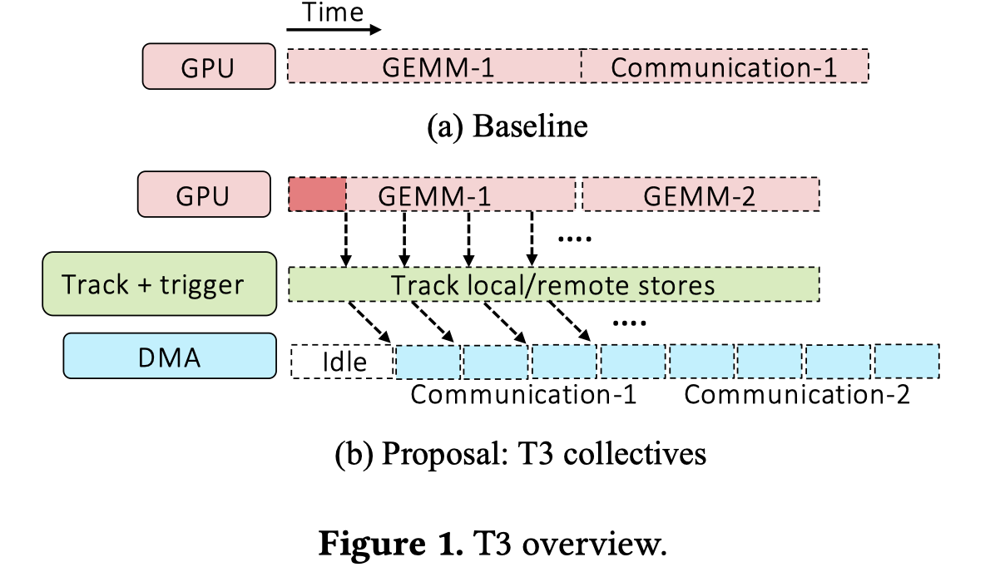
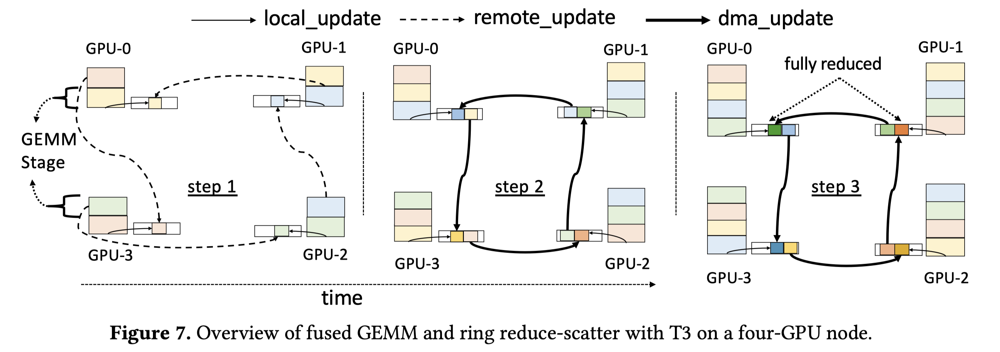

# T3: Transparent Tracking & Triggering for Fine-grained Overlap of Compute & Collectives

> Suchita Pati, Shaizeen Aga, Mahzabeen Islam, Nuwan Jayasena, Matthew D. Sinclair

## Abstract

Large Language Models increasingly rely on distributed techniques for their
training and inference. These techniques require communication across devices
which can reduce scaling efficiency as the number of devices increases. While
some distributed techniques can overlap, and thus, hide this communication with
independent computations, techniques such as Tensor Parallelism (TP) inherently
serialize communication with model execution. One approach to hide this
serialized communication is to interleave it with the producer operation (of
the communicated data) in a fine-grained manner. However, this fine-grained
interleaving of communication and computation in software can be difficult.
Furthermore, as with any concurrent execution, it requires compute and memory
resources to be shared between computation and communication, causing resource
contention that reduces overlapping efficacy.
  To overcome these challenges, we propose T3 which applies hardware-software
co-design to transparently overlap serialized communication while minimizing
resource contention with compute. T3 transparently fuses producer operations
with the subsequent communication via a simple configuration of the producer's
output address space and requires minor software changes. At the hardware
level, T3 adds a lightweight track and trigger mechanism to orchestrate the
producer's compute, and communication. It further uses compute-enhanced
memories for communication's attendant compute. As a result, T3 reduces
resource contention, and efficiently overlaps serialized communication with
computation. For important Transformer models like T-NLG, T3 speeds up
communication-heavy sublayers by 30% geomean (max 47%) and reduces data
movement by 22% geomean (max 36%). Furthermore, T3's benefits persist as models
scale: geomean 29% for sublayers in $\sim$500-billion parameter models, PALM
and MT-NLG.

