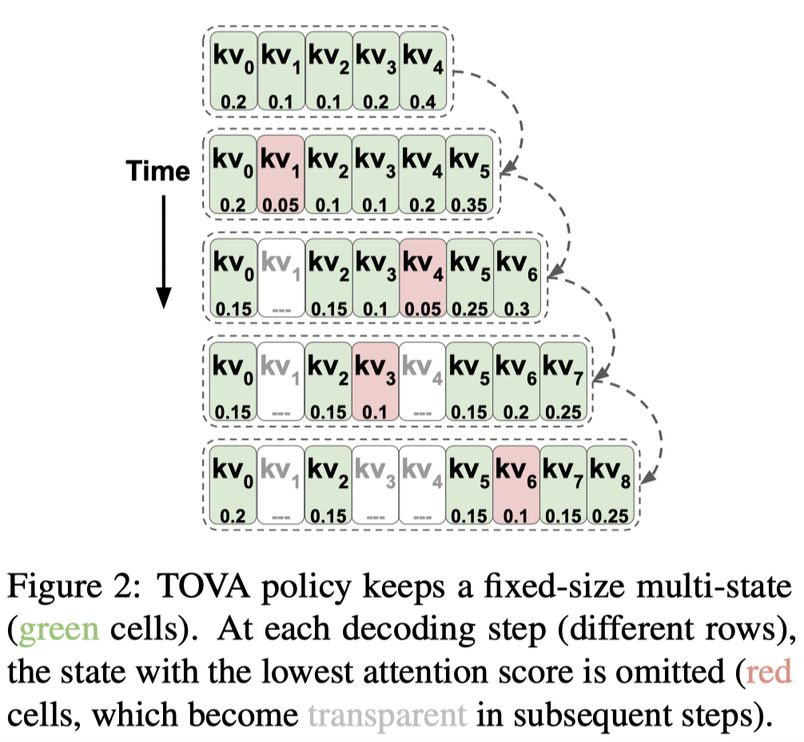

# Transformers are Multi-State RNNs (TOVA)

## 一句话总结

TOVA 从理论角度将 decoder-only Transformer 重新建模为无界多状态 RNN（MSRNN），并提出一种无需训练的 KV Cache 压缩策略——Token Omission Via Attention，仅用 1/8 的缓存即可达到接近完整模型的性能，实现最高 4.8 倍吞吐量提升。

## 摘要翻译

Transformer 被认为与前一代最先进的 NLP 模型——循环神经网络（RNN）有本质不同。在本文中，我们证明了 decoder-only Transformer 实际上可以被概念化为无界多状态 RNN（MSRNN）——一种具有无限隐藏状态大小的 RNN 变体。我们进一步表明，通过固定其隐藏状态的大小，Transformer 可以被转换为有界多状态 RNN，从而有效地压缩其键值缓存（KV Cache）。我们提出了一种新颖的、无需训练的压缩策略——**Token Omission Via Attention (TOVA)**。我们在四个长距离任务和多个大语言模型上的实验表明，TOVA 优于多种基线压缩策略。特别是，我们的结果与完整模型几乎持平，在某些情况下仅使用原始缓存大小的 1/8，这转化为 4.8 倍的吞吐量提升。我们的研究揭示了 Transformer 与 RNN 之间的联系，并有助于缓解大语言模型最痛苦的计算瓶颈之一——键值缓存的大小问题。代码已公开发布。

## 研究动机

1. **Transformer 与 RNN 的理论鸿沟**：长久以来，Transformer 被认为与 RNN 在概念上截然不同。RNN 通过循环状态保持历史信息，而 Transformer 通过自注意力直接访问每个 token 的表示。本文旨在从理论层面弥合这一鸿沟。
2. **KV Cache 是 LLM 推理的瓶颈**：大语言模型在自回归生成时需要缓存所有先前 token 的 Key 和 Value 向量。随着序列长度增加，KV Cache 的内存消耗急剧增长，严重限制了推理效率（吞吐量和批处理大小）。
3. **现有压缩方法存在归纳偏差**：现有的 KV Cache 压缩策略（如 Window、H2O）引入了强归纳偏差——固定保留最近的 token 或偏好序列开头的 token。这种硬编码的假设可能不是最优的。
4. **LLM 实际上表现得像有界 MSRNN**：尽管 LLM 理论上可以处理任意长度的序列（无界），但实验表明它们在实际中经常表现得像有界 MSRNN，只有效地使用有限的上下文窗口。这一发现启发了一种高效的缓存压缩方法。

## 方法（技术细节）

### 3.1 多状态 RNN（MSRNN）定义

本文提出了 **Multi-State RNN (MSRNN)** 的形式化定义：

- 标准 RNN 在每一层使用向量作为隐藏状态：$h_t^l \in \mathbb{R}^d$
- MSRNN 使用**状态矩阵**代替向量：$H_t^l \in \mathbb{R}^{g(t) \times d}$
- 状态矩阵的每一行可以解释为一个单独的状态，$H_t^l$ 可视为多状态矩阵
- 状态大小由函数 $g(t)$ 参数化：
  - $g(t) = 1$：退化为标准（单状态）RNN
  - $g(t) \leq k$（常数）：有界记忆容量
  - $g(t) = t$：无界容量

### 3.2 Transformer 是无界 MSRNN

当 $g(t) = t$（状态数等于当前时间步的输入 token 数）时，Transformer 可以被视为无界 MSRNN：

- 状态：$H_t^l = (K_t^l, V_t^l)$，即 Key 和 Value 矩阵
- 层计算：$(K_t^l, V_t^l) = (K_{t-1}^l \oplus k_t^l, V_{t-1}^l \oplus v_t^l)$
- 输出：$x_t^{l+1} = FF_l(Attn_l(q_t^l, K_t^l, V_t^l))$
- MSRNN 方程：$x_t^{l+1}, (K_t^l, V_t^l) = f_t^{TRANS}(x_t^l, (K_{t-1}^l, V_{t-1}^l))$

### 3.3 将 Transformer 转换为有界 MSRNN

通过设置 $g(t) = \min(t, k)$，Transformer 可以被转换为有界 MSRNN。当 $t > k$ 时，需要应用压缩策略将多状态适配到有限的内存中。

### 3.4 TOVA 压缩策略

**TOVA (Token Omission Via Attention)** 是本文提出的核心压缩策略：

1. **基本思想**：当多状态达到容量上限时，TOVA 在每个解码步骤丢弃注意力分数最低的 token
2. **形式化定义**：当 $t > k$ 且 $j$ 是注意力分数最低的状态时：
   - $(K_t^l, V_t^l) = (K_{0:j-1}^l, K_{j+1:k}^l, V_{0:j-1}^l, V_{j+1:k}^l)$
3. **多头处理**：TOVA 分别计算每个头的注意力分数，因此不同头可以保留不同的 token
4. **层内平均**：实验表明，在给定层中跨所有头平均注意力分数优于单独处理每个头（见附录 A）
5. **无需训练**：TOVA 是一种 training-free 的方法，可以直接应用于预训练的 LLM，无需任何额外训练

### 3.5 基线压缩策略

本文对比了以下基线方法：

- **Window**：FIFO 策略，丢弃最早的 token，仅保留最近的 token
- **Window+i**：保留固定窗口 + 最早的 i 个 token（实验中使用 Window+4）
- **H2O**：保留固定窗口的最近 token + 通过累积注意力分数动态选择的早期 token
- **Full model (topline)**：完整（无界）模型，作为上界参考

### 3.6 位置编码外推

TOVA 支持处理超过训练序列长度的文本。方法是压缩相邻 token 表示之间的间隔 $g$ 为 $\ln(\ln(g))$，当 $g \leq 10$ 时保持 $g$ 不变以保留局部敏感性。

## 实验结果

### 6.1 语言建模（PG-19）

- **模型**：LLaMA-2-7B, Mistral-7B, Yi-7B
- **数据集**：PG-19 测试集（100 本完整书籍，平均长度 70K tokens）
- **结果**：
  - TOVA 在所有多状态大小下均优于所有基线方法
  - 使用仅 1/8 的上下文长度（512 tokens），TOVA 达到与完整模型（4096 tokens）相比仅 0.4 个困惑度的差距
  - 基线方法需要至少一半的上下文长度才能达到完整模型的性能

### 6.2 长距离理解

- **任务**：SQuALITY（问题聚焦的摘要）和 QASPER（基于长文本的 QA）
- **模型**：LLaMA-2-chat, Mistral-Instruct, neural-chat
- **SQuALITY 结果**：
  - TOVA 在所有设置下均优于所有基线
  - 使用 1/8 到 1/4 的上下文大小即可达到与上界相差 1 个 ROUGE 点的性能
- **QASPER 结果**：
  - TOVA 与基线之间的差距较大，在某些情况下超过 5 个 F1 点
  - 需要一半的上下文大小才能达到与上界相差 1 个 F1 点的性能

### 6.3 文本生成

- **模型**：MythoLogic（LLaMA-2-13B 微调版）
- **评估方法**：GPT-4 作为评估器，对比 TOVA 和完整模型生成的故事
- **结果**：
  - 使用 256 tokens 时，TOVA 在 47% 的情况下与完整模型持平或胜出
  - 使用 512 tokens 时，仅 19% 的情况下失败
  - 使用 1024 tokens 时，仅 6% 的情况下失败
  - 在所有多状态大小下，TOVA 在 5-10% 的情况下优于完整模型

### 7.1 内存和吞吐量效率（LLaMA-2-7B）

| 多状态大小 | 内存 (Gig.) | 最大批处理 | 相对吞吐量 |
|-----------|------------|-----------|-----------|
| 256 | 0.15 | 139 | 8.5X |
| 512 | 0.28 | 70 | 4.8X |
| 1024 | 0.56 | 35 | 3.1X |
| 2048 | 1.11 | 17 | 1.7X |
| 4096 (full) | 2.18 | 8 | 1X |

### 7.2 外推能力

- TOVA 成功外推至 70K tokens，困惑度差异小于 0.5 个点
- 显著优于 Window+4 基线方法

### 7.3 哪些 token 重要？

- **最近性并非唯一因素**：仅 73-76% 被保留的 token 是最近的，表明旧 token 也经常被保留
- **第一个 token 非常重要**：第一个 token 在所有多状态大小下都保持到序列结束
- **不同 token 的保留时间不同**：通过词性标注分析，标点符号和特殊符号倾向于被保留，但所有格后缀（POS）和专有名词（NNPS）也倾向于长期保留
- **TOVA 自动识别窗口**：与需要手动指定窗口的方法不同，TOVA 自动识别最近窗口

## 优势

1. **无需训练**：TOVA 是一种 training-free 方法，可直接应用于任何预训练的 decoder-only Transformer LLM
2. **显著的效率提升**：仅使用 1/8 的缓存即可达到接近完整模型的性能，吞吐量提升最高 4.8 倍
3. **强大的理论基础**：首次从 MSRNN 角度将 Transformer 与 RNN 联系起来，提供了新的理论视角
4. **自动化的 token 选择**：无需手动设计压缩策略，TOVA 自动根据注意力分数选择要保留的 token
5. **灵活的外推能力**：支持处理超过训练长度的文本，可外推至 70K tokens
6. **多任务验证**：在语言建模、长距离理解和文本生成等多个任务上均有验证
7. **减少归纳偏差**：与 Window 和 H2O 等方法不同，TOVA 不固定最近窗口，也不偏好早期 token

## 局限

1. **检索型 QA 需要更多上下文**：在 QASPER 等需要检索特定细节的任务上，TOVA 需要约一半的上下文大小才能达到与完整模型相当的性能
2. **文本生成长度受限**：限制多状态大小会缩短生成的文本长度（从 1,566 tokens 降至 1,361 tokens）
3. **注意力分数的计算开销**：虽然不需要训练，但每次解码步骤都需要重新计算注意力分数来决定丢弃哪个 token
4. **仅适用于 decoder-only 模型**：本文的理论框架和实验仅针对 decoder-only Transformer，未验证 encoder 或 encoder-decoder 架构
5. **多头策略的权衡**：虽然跨头平均注意力分数效果更好，但这可能丢失了不同头捕获的多样化信息
6. **特定 token 的保留机制未充分探索**：虽然发现了一些有趣的 token（如所有格后缀、专有名词）被长期保留，但其背后的原因尚未深入研究

## 与 EfficientPaper 相关的研究方向

1. **KV Cache 优化**：本文的 TOVA 方法直接针对 KV Cache 压缩，是 LLM 推理效率优化的重要方向
2. **LLM 推理加速**：通过压缩 KV Cache 提高吞吐量，是 LLM 服务部署的关键技术
3. **长上下文处理**：TOVA 支持外推至更长上下文（70K tokens），是长上下文 LLM 研究的重要进展
4. **RNN 与 Transformer 的统一**：从 MSRNN 角度统一 RNN 和 Transformer，为混合架构设计提供理论基础
5. **注意力机制的深入分析**：通过对注意力分数的分析，揭示了哪些 token 在长上下文中更重要
6. **高效的 LLM 服务**：TOVA 的高效压缩策略可以显著降低 LLM 服务的计算成本
7. **KV Cache 压缩的后续工作**：包括 token 剪枝、token 合并、跨层 KV 共享等方向
8. **RNN 回归的理论基础**：TOVA 将 Transformer 转化为有界 MSRNN，与近期的 RNN 回归工作（如 Mamba、RWKV）形成互补

## AI 生成声明

> ⚠️ **注意**：本文档由 AI Agent (Hermes Agent) 基于论文元数据和论文原文自动生成，仅供研究参考。内容可能存在理解偏差或遗漏，请以原文为准。
>
> 生成工具：Hermes Agent (Nous Research)
> 生成时间：2026-06-05
> 论文来源：arXiv:2401.06104v2 (2024)
