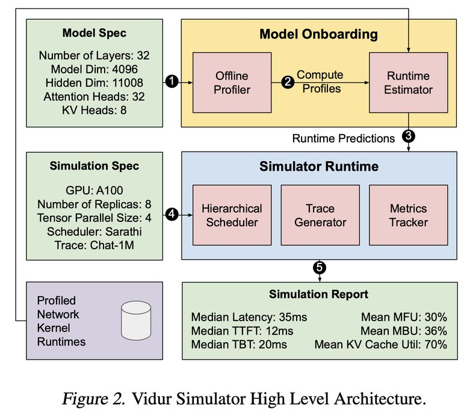

# Vidur: A Large-Scale Simulation Framework For LLM Inference

> Amey Agrawal, Nitin Kedia, Jayashree Mohan, Ashish Panwar, Nipun Kwatra, Bhargav Gulavani, Ramachandran Ramjee, Alexey Tumanov

## 一句话总结

Vidur 是一个大规模、高保真、可扩展的 LLM 推理性能模拟框架，通过结合实验剖析与预测建模来评估不同工作负载下的端到端推理性能（延迟、吞吐量等），并配套 Vidur-Search 工具自动搜索最优部署配置，可将配置搜索成本降低数个数量级（例如 LLaMA2-70B 最优配置搜索从 42K GPU 小时 / $218K 降至 1 小时 CPU 时间 / $9.93）。

---

## 摘要翻译

优化大语言模型（LLM）的部署目前非常昂贵，因为它需要在由并行化策略、批处理技术和调度策略等系统旋钮构成的大型配置空间中，实验性地运行应用工作负载。为解决这一挑战，我们提出了 Vidur —— 一个大规模、高保真、易于扩展的 LLM 推理性能模拟框架。Vidur 通过结合实验剖析和预测建模来模拟 LLM 算子的性能，并通过估计延迟和吞吐量等多种指标来评估不同工作负载的端到端推理性能。我们在多种 LLM 上验证了 Vidur 的保真度，结果表明其推断推理延迟的误差在 9% 以内。此外，我们提出了 Vidur-Search，一个帮助优化 LLM 部署的配置搜索工具。Vidur-Search 使用 Vidur 自动识别满足应用性能约束的最具成本效益的部署配置。例如，Vidur-Search 在一台 CPU 机器上一小时内找到 LLaMA2-70B 的最佳部署配置，而基于部署的探索则需要 42K GPU 小时——成本约 218K 美元。

---

## 研究动机

1. **LLM 推理成本高昂**：例如 ChatGPT 的推理成本估计为每天 $694K，LLM 推理已成为一个巨大的经济负担。
2. **配置空间巨大**：LLM 部署需要选择并行化策略（TP/PP）、调度算法（Orca/vLLM/Sarathi-Serve）、批大小、SKU（A100/H100）等大量配置参数，组合数量庞大。
3. **最优配置依赖于模型-工作负载对**：研究发现，最优配置不是简单地由模型决定的，而是由模型和工作负载共同决定的（Model-Trace Pair）。在一个工作负载上获得的最优配置在另一个工作负载上可能差 2 倍（图1b）。
4. **现有模拟框架的局限**：现有的 DNN 训练模拟框架（如 Daydream、Habitat、Proteus）不适用于 LLM 推理，因为 LLM 推理在时间粒度、迭代时间变化和误差级联等方面有独特挑战。
5. **缺乏标准化基准**：目前没有标准化的基准套件来全面评估 LLM 推理性能。

---

## 方法（技术细节）

### 整体架构

Vidur 采用两阶段处理流程：

1. **模型上舰阶段（Model Onboarding）**：利用模型规格生成需要剖析的计算算子集，Vidur Profiler 收集运行时特征，Runtime Estimator 使用机器学习模型预测未剖析输入大小的运行时间。
2. **模拟阶段（Simulation）**：用户指定部署配置和工作负载，事件驱动模拟器（Event-driven Simulator）结合层级调度器（Hierarchical Scheduler）模拟完整的推理流程，输出请求级和集群级指标。

### 关键洞察

- **LLM 架构相似性**：绝大多数 LLM 共享相似架构（Transformer），差异仅在于激活函数、归一化层、残差连接等。这允许使用统一的声明式模型规格格式和少量共享算子模型。
- **算子分类（Operation Triaging）**：LLM 算子可分为三类：
  - **Token-level Operators**（如线性层、激活函数）：运行时间仅依赖于批中的总 token 数。
  - **Sequence-level Operators**（如注意力操作）：运行时间依赖于每个请求的上下文长度。
  - **Communication Operators**（如 all-reduce、all-gather）：运行时间仅依赖于传输数据量。
- **自动并行化剖析**：Vidur 通过模型声明式规格自动识别每个设备上的张量分片配置，只需在单个 GPU 上进行最少的剖析即可模拟各种并行化方案。

### Profiler（剖析器）

- **Token-level Operators**：使用标准 PyTorch 内核和 CUPTI 进行剖析，覆盖所有不同的张量并行分片配置。
- **Sequence-level Operators**：
  - Prefill 注意力：使用二次复杂度近似，将 batch 中长度为 p_i 的 P 个 prefill 近似为一个等价的长度为 √(Σp_i²) 的 prefill。
  - Decode 注意力：由于 decode 阶段主要是内存瓶颈操作，只需对批中请求的总 KV-Cache 数据量建模即可。
- **Communication Operators**：独立于模型，使用不同拓扑进行预剖析。

### Runtime Estimator（运行时估计器）

- 使用**随机森林（Random Forest）回归模型**进行插值预测，在数据经济性和保真度之间取得平衡。
- 相比 MLP 需要大量数据，相比多项式回归无法捕捉非线性特征（如 tile 和 wave quantization），随机森林是最佳选择。
- 生成运行时间查找表，供模拟阶段使用。

### Hierarchical Scheduler（层级调度器）

采用三层架构：
1. **Global Scheduler**：请求路由，支持轮询、最少未完成请求等负载均衡策略，以及延迟绑定的有状态调度策略。
2. **Replica Scheduler**：包含 Memory Planner（内存规划）和 Memory Manager（内存管理），支持 5 种批处理策略：FasterTransformers、Orca、Sarathi-Serve、vLLM、LightLLM。所有策略均在不到 150 行 Python 代码中实现。
3. **Replica Stage Scheduler**：处理流水线阶段内的微批次调度，目前支持同步流水线并行。

### Vidur-Bench

一个即插即用的基准套件，包含：
- **工作负载**：LMSys-Chat-1M（自然语言对话）、Arxiv-Summarization（论文摘要）、Bilingual-Web-Book（中英双语文档）。
- **性能指标**：算子级（输入大小和执行时间）、请求级（调度延迟、TTFT、TBT）、副本级（批大小、token 数、忙碌/空闲时间、内存/计算利用率）、硬件级（集群 GPU FLOPs 和内存利用率）。

### Vidur-Search

配置搜索工具，帮助优化 LLM 部署：
- **输入**：LLM 模型、工作负载、可用 GPU SKU、最大 GPU 数。
- **约束**：TTFT P90 < 2s、TBT P99 < 200ms 等 SLO。
- **搜索空间**：并行化策略（TP/PP）、并行度、调度策略、调度参数、批大小、GPU SKU 等。
- **优化目标**：最大化 QPS/美元（每美元查询数）。
- **方法**：枚举所有可能的部署配置，对每个配置使用二分搜索找到最大 QPS，最终选择最优配置。所有搜索并行化在 CPU 核心上运行。

---

## 实验结果

### 模拟器保真度

- **静态工作负载**：Vidur 在 4 个模型（LLaMA2-7B/70B、InternLM-20B、Qwen-72B）和 3 个工作负载（Chat-1M、Arxiv-4K、BWB-4K）上，请求执行时间预测误差在 3.33% 以内（P95）。
- **动态工作负载**：在系统容量 85% 处，Vidur 几乎在所有场景下实现 < 5% 的端到端延迟预测误差。
- **小模型误差略高**：LLaMA2-7B 因 CPU 开销较高，误差稍大（约 8.5%），但整体仍在可接受范围内。
- **尾部延迟预测准确**：即使在 P95 和 P90 尾部延迟上，预测误差也控制在合理范围内。

### What-if 分析（配置搜索）

- **配置差异显著**：不同工作负载的最优配置差异很大。例如 LLaMA2-70B 在 Chat-1M 上最优批大小为 256，而在 BWB 上为 64（因 BWB 的 KV-Cache 负载高）。
- **GPU SKU 变化**：最优 GPU SKU 可能从 H100 变为 A100（取决于工作负载）。
- **相似模型性能差异**：LLaMA2-70B 使用 GQA，Qwen-72B 使用 MHA（8× 更高 KV-Cache 负载），导致 Qwen-72B 服务成本约 2×。
- **成本节省巨大**：
  - 完整搜索仅需 $125 模拟费用，而实际执行需要 $1.14M。
  - LLaMA2-70B 最优配置搜索：1 小时 CPU 时间（$9.93） vs 42K GPU 小时（$218K），节省约 30,000 倍。
  - 表 2 详细列出了 12 个模型-工作负载组合的成本对比，模拟成本节省从 3,837× 到 33,354× 不等。

### 配置稳定性

- 使用一个工作负载的最优配置服务另一个工作负载可能导致 2× 成本增加（如图1b所示）。

### Pareto 前沿分析

- SLO 约束的微小变化可导致显著成本差异。例如，对于 LLaMA2-70B-Chat-1M，TBT SLO 从 0.12s 改为 0.14s（仅 20ms 差异），成本可降低约 1.85×。

---

## 优势

1. **高保真度**：在多种模型、硬件和工作负载下，延迟预测误差 < 9%，接近实际部署表现。
2. **成本极低**：搜索成本相比实际部署降低数千至数万倍（最高节省 33,354×）。
3. **可扩展性**：基于声明式模型规格和统一的算子模型，新模型接入成本低。
4. **灵活性**：支持多种并行化策略、调度策略和批处理策略，且易于扩展。
5. **端到端覆盖**：从算子级到集群级的全面指标，包括 TTFT、TBT、MFU、KV-Cache 利用率等。
6. **实用性**：通过 Vidur-Search 工具直接支持生产部署决策，降低 misconfiguration 风险。
7. **开源**：代码公开在 GitHub（https://github.com/microsoft/vidur），可复现。

---

## 局限

1. **小模型误差较高**：LLaMA2-7B 因 CPU 开销占比较大，预测误差相对较高（约 8.5%-12.65%）。
2. **高负载下误差级联**：在接近系统容量时（如 95%），预测误差可能因级联效应显著增大。
3. **仅支持同步流水线并行**：目前只支持同步 PP 调度，尚未实现异步通信、序列并行、投机解码等高级优化。
4. **未建模量化等优化**：文中未明确讨论量化、蒸馏等模型压缩技术对推理性能的影响。
5. **CPU 开销未充分建模**：对于小模型，CPU 开销（如调度、内存管理）可能成为主要瓶颈，但模拟器对此建模不足。
6. **静态工作负载限制**：工作负载基于公开数据集的 trace，可能无法完全反映真实生产场景的动态变化（如突发流量、用户行为变化）。
7. **不支持所有并行策略**：虽然支持 TP 和 PP，但未覆盖张量并行与流水线并行的混合策略（如 3D 并行）的全面优化。
8. **验证范围有限**：仅在 4 个模型和 3 个工作负载上验证，对于更广泛的模型架构（如 MoE 模型）和工作负载模式的泛化性尚需进一步验证。

---

## 与 EfficientPaper 相关的研究方向

1. **LLM 推理性能建模与优化**：Vidur 作为 LLM 推理性能模拟的代表性工作，与 EfficientPaper 项目中关注的高效推理方向高度相关。
2. **部署配置自动优化**：Vidur-Search 的自动化配置搜索方法，为 LLM 部署优化提供了新的思路，可与 AutoML、神经架构搜索（NAS）等方法结合。
3. **推理基准测试**：Vidur-Bench 作为首个针对 LLM 推理的标准化基准套件，可为后续研究提供评估工具。
4. **并行化策略研究**：Vidur 对 TP/PP 并行策略的建模和比较，可指导未来更高效并行策略的设计。
5. **工作负载感知优化**：Vidur 发现最优配置依赖于模型-工作负载对，这提示未来研究需要考虑工作负载感知的优化策略。
6. **成本效益分析**：Vidur 的成本分析方法（QPS/美元）为 LLM 部署的成本效益评估提供了新的框架。
7. **推测解码与投机执行**：Vidur 提到未来计划支持投机解码等优化，这与当前 LLM 推理效率研究的热点方向一致。
8. **硬件协同优化**：Vidur 对 A100/H100 不同 GPU SKU 的建模，可为硬件-软件协同优化提供参考。

---

## AI 生成声明

本笔记由 AI Agent（Hermes Agent，由 Nous Research 创建）自动生成。内容基于论文原文（Vidur: A Large-Scale Simulation Framework For LLM Inference, arXiv:2405.05465v2）的全文提取与分析，使用 PyMuPDF (fitz) 进行 PDF 文本提取。笔记中的摘要翻译、方法分析、实验结果总结和研究方向分析均基于论文原始内容，经过结构化整理和中文翻译。所有技术细节和数据均来源于论文原文，未添加额外推测。本笔记仅用于学术研究参考，不构成对原论文的正式评价。
