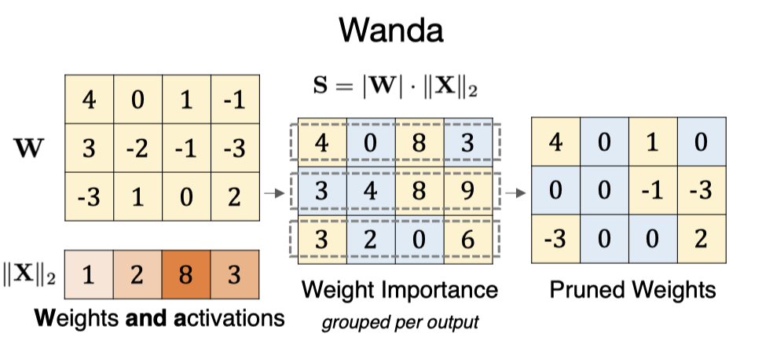

# A Simple and Effective Pruning Approach for Large Language Models (Wanda)



> **一句话总结**：Wanda 提出了一种无需重训练或权重更新的 LLM 剪枝方法，通过将权重大小与对应输入激活范数相乘来评估权重重要性，并按输出神经元逐行比较，在保持计算简单高效的同时，实现了与需要复杂权重更新的 SparseGPT 相当的剪枝效果。

---

## 摘要翻译

随着大型语言模型（LLM）规模的增长，网络剪枝方法成为降低计算成本的天然候选方案——这类方法在努力保持性能的同时，丢弃网络权重的子集。然而，现有方法要么需要重训练（这对数十亿参数的 LLM 来说很少可承受），要么依赖于二阶信息的权重重建问题，计算代价也很高。本文介绍了一种新颖、简洁而有效的剪枝方法，称为 Wanda（Pruning by Weights and activations，通过权重和激活剪枝），旨在为预训练 LLM 诱导稀疏性。受到 LLM 中新兴的大特征幅度的观察启发，我们的方法在每个输出基础上，剪除幅度与对应输入激活相乘最小的权重。值得注意的是，Wanda 不需要重训练或权重更新，剪枝后的 LLM 可以直接使用。我们在 LLaMA 和 LLaMA-2 上对 Wanda 方法进行了全面评估。Wanda 显著超越了幅度剪枝这一既定基准，并与涉及密集权重更新的最新方法具有竞争力的性能。代码可在 https://github.com/locuslab/wanda 获取。

---

## 研究动机

1. **LLM 的高昂计算成本**：大型语言模型通常包含数十亿参数，需要大量计算资源。模型压缩（如量化和剪枝）是降低这一成本的关键手段，但剪枝在 LLM 领域的研究相对较少。

2. **现有剪枝方法的局限性**：传统剪枝方法（如权重重要性评分、迭代剪枝、从头训练等）通常需要重训练，这对 LLM 来说几乎不可承受。近期的 SparseGPT 虽然不需要传统重训练，但需要复杂的权重更新过程，计算代价很高。

3. **幅度剪枝在 LLM 上失效**：研究表明，传统的幅度剪枝（magnitude pruning）在 LLM 上表现极差，即使在相对较低的稀疏度下也会导致显著的性能下降。这与 LLM 中存在"新兴的大特征幅度"（emergent large magnitude features）有关——少数隐藏状态特征的幅度远大于其他特征（约100倍），这使得传统的全局幅度排序不再有效。

4. **关键洞察**：LLM 中存在稀疏但重要的特征，这些特征对于模型的预测能力至关重要。因此，评估权重重要性时需要同时考虑权重大小和输入激活的幅度。

---

## 方法（技术细节）

### 核心思想

Wanda 的核心思想是：权重的重要性不应仅由其幅度决定，还应考虑对应的输入激活的幅度。这通过一个简单的乘积来实现：

**剪枝度量（Pruning Metric）**：对于线性层的权重 $W_{ij}$，其重要性得分定义为：

$$S_{ij} = |W_{ij}| \cdot \|X_j\|_2$$

其中：
- $|W_{ij}|$ 是权重的绝对值
- $\|X_j\|_2$ 是第 j 个输入特征的 $\ell_2$ 范数，跨 N×L 个 token 聚合
- 使用 $\ell_2$ 范数（而非 $\ell_1$ 或 $\ell_\infty$），因为 $\ell_2$ 范数更平滑，在测量激活幅度时效果更好

### 比较组（Comparison Group）

与传统的逐层（layer-wise）或全局（global）比较不同，Wanda 采用**按输出神经元（per-output）**进行比较：

$$G_{ij} = \{W_{uv} | u = i\}$$

即连接到同一输出神经元 i 的所有权重构成一个比较组，在该组内按重要性得分排序，剪除最低优先级的权重。

**关键发现**：这种按输出比较的方式比逐层比较更有效，尤其是对于 LLM。作者发现这可能是 LLM 特有的性质，在图像分类器上未观察到类似趋势。

### 实现流程

Wanda 可以在**单次前向传播**中完成：

1. 使用校准数据（128 条序列，来自 C4 数据集）计算每个线性层的输入特征范数 $\|X_j\|_2$
2. 计算权重重要性得分 $S_{ij} = |W_{ij}| \cdot \|X_j\|_2$
3. 在每个输出组内按得分排序，剪除最低 s% 的权重
4. 剪枝后的层输出作为下一层的输入，继续剪枝

**PyTorch 实现**（简洁的 6 行代码）：
```python
def prune(W, X, s):
    metric = W.abs() * X.norm(p=2, dim=0)
    _, sorted_idx = torch.sort(metric, dim=1)
    pruned_idx = sorted_idx[:, :int(C_in * s)]
    W.scatter_(dim=1, index=pruned_idx, src=0)
    return W
```

### 结构化 N:M 稀疏性

Wanda 可自然扩展到结构化 N:M 稀疏性（如 2:4、4:8），在每 M 个连续权重中保留最多 N 个非零值，从而利用 NVIDIA 的稀疏张量核加速矩阵乘法。

### 与 SparseGPT 的理论联系

Wanda 的度量可以看作 SparseGPT 度量的简化版：
- SparseGPT 的度量涉及 Hessian 矩阵的逆（$S_{ij} = |W|^2 / \text{diag}((X^T X + \lambda I)^{-1})_{ij}$）
- 当 $\lambda=0$ 且只保留对角元素时，简化为 $|W_{ij}| \cdot \|X_j\|_2$（Wanda 的度量的平方）
- 这种简化消除了矩阵逆运算，大幅降低了计算复杂度

---

## 实验结果

### 评估模型与数据集
- **模型**：LLaMA (7B/13B/30B/65B) 和 LLaMA-2 (7B/13B/70B)
- **评估**：零样本任务（7个 EleutherAI LM Harness 任务）和语言建模（WikiText 验证集困惑度）
- **校准数据**：128 条 C4 训练集序列（与 SparseGPT 相同）
- **稀疏类型**：非结构化 50%、结构化 4:8、结构化 2:4

### 零样本任务结果（Table 2）

| 方法 | 权重更新 | 稀疏度 | LLaMA 7B | 13B | 30B | 65B | LLaMA-2 7B | 13B | 70B |
|------|----------|--------|-----------|-----|-----|-----|-----------|-----|-----|
| Dense | - | 0% | 59.99 | 62.59 | 65.38 | 66.97 | 59.71 | 63.03 | 67.08 |
| Magnitude | ✗ | 50% | 46.94 | 47.61 | 53.83 | 62.74 | 51.14 | 52.85 | 60.93 |
| SparseGPT | ✓ | 50% | 54.94 | 58.61 | 63.09 | 66.30 | 56.24 | 60.72 | 67.28 |
| **Wanda** | **✗** | **50%** | **54.21** | **59.33** | **63.60** | **66.67** | **56.24** | **60.83** | **67.03** |

关键发现：
- Wanda 在非结构化 50% 稀疏度下与 SparseGPT 性能相当，甚至在 LLaMA-13B/30B/65B 上略优
- 大模型的稀疏子网络性能接近稠密模型：LLaMA-65B 非结构化 50% 稀疏 (66.67%) 接近稠密 LLaMA-65B (66.97%)
- 显著超越幅度剪枝（magnitude pruning）基准

### 语言建模结果（Table 3）

| 方法 | 稀疏度 | LLaMA 7B | 13B | 30B | 65B | LLaMA-2 7B | 13B | 70B |
|------|--------|-----------|-----|-----|-----|-----------|-----|-----|
| Dense | 0% | 5.68 | 5.09 | 4.77 | 3.56 | 5.12 | 4.57 | 3.12 |
| Magnitude | 50% | 17.29 | 20.21 | 7.54 | 5.90 | 14.89 | 6.37 | 4.98 |
| SparseGPT | 50% | 7.22 | 6.21 | 5.31 | 4.57 | 6.51 | 5.63 | 3.98 |
| **Wanda** | **50%** | **7.26** | **6.15** | **5.24** | **4.57** | **6.42** | **5.56** | **3.98** |

关键发现：
- Wanda 在 LLaMA-7B 上非结构化 50% 稀疏度的困惑度为 7.26，显著优于幅度剪枝的 17.29
- 与 SparseGPT 基本持平
- 结构化稀疏度下，Wanda 在大模型上更有优势（如 LLaMA-30B 的 2:4 和 4:8 稀疏度）

### 剪枝速度对比（Table 4）

| 方法 | LLaMA 7B | 13B | 30B | 65B |
|------|----------|-----|-----|-----|
| SparseGPT | 203.1s | 339.0s | 810.3s | 1353.4s |
| Wanda | 0.54s | 0.91s | 2.9s | 5.6s |

**Wanda 比 SparseGPT 快约 300 倍**，且计算复杂度从 $O(d_{hidden}^3)$ 降至 $O(d_{hidden}^2)$。

### 推理加速（Table 5）

结构化 2:4 稀疏性在 LLaMA-65B 上带来约 1.6× 的矩阵乘法加速，端到端延迟 LLaMA-7B 从 312ms 降至 251ms（1.24× 加速）。

### 消融实验

- **比较组选择**：按输出（per-output）显著优于按层（per-layer），这一发现对幅度剪枝同样有效
- **校准样本数量**：Wanda 对校准样本数量非常鲁棒，即使只有 1 个样本也能获得困惑度 7.66
- **微调效果**：LoRA 微调和全参数微调都能恢复剪枝 LLM 的性能，全参数微调将 LLaMA-7B 的零样本准确率从 54.21% 恢复到 58.15%
- **权重更新效果**：Wanda 不需要权重更新（无需迭代过程），权重更新对其性能几乎没有提升

---

## 优势

1. **计算高效**：Wanda 可在单次前向传播中完成，剪枝速度比 SparseGPT 快约 300 倍（0.54s vs 203.1s，LLaMA-7B）
2. **无需重训练或权重更新**：剪枝后的 LLM 可直接使用，无需任何额外的训练或权重更新步骤
3. **与 SparseGPT 性能相当**：在非结构化 50% 稀疏度下，Wanda 的零样本准确率和困惑度与需要复杂权重更新的 SparseGPT 基本持平
4. **计算复杂度低**：从 SparseGPT 的 $O(d_{hidden}^3)$ 降至 $O(d_{hidden}^2)$，消除了矩阵逆运算
5. **鲁棒性强**：对校准样本数量不敏感，即使只有 1 个样本也能获得良好的剪枝效果
6. **易于实现**：代码简洁（6 行 PyTorch 代码），易于集成到现有流程
7. **可扩展到结构化稀疏性**：自然支持 N:M 结构化稀疏性（如 2:4、4:8），可利用硬件加速
8. **大模型性能接近稠密**：50% 稀疏的大模型（如 LLaMA-65B）性能几乎与稠密模型持平

---

## 局限

1. **不适用于图像分类器**：按输出比较的优势在图像分类模型上不成立，表明该方法可能对 LLM 有特殊性
2. **稀疏子网络需预训练权重**：Wanda 依赖于预训练 LLM 中的"新兴大特征幅度"特性，可能不适用于较小的模型或非 Transformer 架构
3. **结构化稀疏性在小模型上性能有限**：在结构化 2:4 稀疏度下，小模型（如 7B）的性能不如 SparseGPT
4. **剪枝后性能与稠密模型仍有差距**：无微调情况下，剪枝后的 LLM 与原始稠密模型存在明显的性能差距（尤其是小模型），需要微调来恢复
5. **仅适用于线性层**：剪枝只针对线性层（约占 LLM 参数的 99%），跳过嵌入层和分类头
6. **校准数据依赖**：虽然对校准样本数量鲁棒，但仍需校准数据来估计输入特征范数

---

## 与 EfficientPaper 相关的研究方向

1. **模型压缩与稀疏性**：Wanda 是 EfficientPaper 项目中稀疏剪枝（sparse pruning）方向的重要工作，与 SparseGPT 等方法形成对比，展示了无需权重更新的高效剪枝策略
2. **权重稀疏性（weight_sparsity）**：作为关键词之一，Wanda 探索了 LLM 权重稀疏化的有效方法，为后续研究提供了基准
3. **无重训练剪枝**：Wanda 的核心优势——无需重训练或权重更新——对大规模 LLM 的压缩具有重要意义
4. **LLM 剪枝基准**：Wanda 的作者明确希望将其作为未来 LLM 剪枝研究的基线（baseline），其简洁高效的特点使其成为该领域的标杆
5. **与量化技术的互补**：剪枝和量化是模型压缩的两大手段，Wanda 可与量化技术（如 GPTQ、AWQ）结合使用，进一步降低 LLM 的计算成本
6. **硬件感知稀疏性**：Wanda 支持结构化 N:M 稀疏性，可利用 NVIDIA 稀疏张量核加速推理，与硬件高效的 LLM 部署相关
7. **LLM 稀疏子网络发现**：Wanda 证明了 LLM 中存在精确的稀疏子网络（不需要权重调整），这对理解 LLM 的冗余性和可压缩性有重要启示

---

## AI 生成声明

> 本笔记由 AI Agent（Hermes Agent）自动生成，基于论文原文 PDF 提取和分析。笔记内容仅供参考，建议读者阅读原文获取完整信息。

---

*笔记生成时间：2026-06-05*
*论文链接：[arXiv:2306.11695](http://arxiv.org/abs/2306.11695)*
*代码仓库：[GitHub - locuslab/wanda](https://github.com/locuslab/wanda)*
*发表会议：ICLR 2024*
