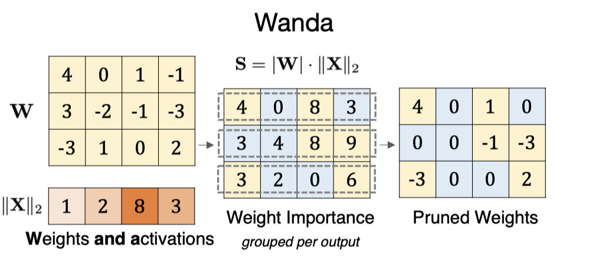

# A Simple and Effective Pruning Approach for Large Language Models

## Abstract

As their size increases, Large Languages Models (LLMs) are natural candidates
for network pruning methods: approaches that drop a subset of network weights
while striving to preserve performance. Existing methods, however, require
either retraining, which is rarely affordable for billion-scale LLMs, or
solving a weight reconstruction problem reliant on second-order information,
which may also be computationally expensive. In this paper, we introduce a
novel, straightforward yet effective pruning method, termed Wanda (Pruning by
Weights and activations), designed to induce sparsity in pretrained LLMs.
Motivated by the recent observation of emergent large magnitude features in
LLMs, our approach prunes weights with the smallest magnitudes multiplied by
the corresponding input activations, on a per-output basis. Notably, Wanda
requires no retraining or weight update, and the pruned LLM can be used as is.
We conduct a thorough evaluation of our method Wanda on LLaMA and LLaMA-2
across various language benchmarks. Wanda significantly outperforms the
established baseline of magnitude pruning and performs competitively against
recent method involving intensive weight update. Code is available at
https://github.com/locuslab/wanda.
