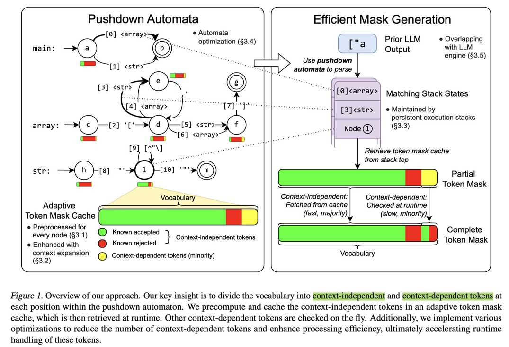

# XGrammar: Flexible and Efficient Structured Generation Engine for Large Language Models

## 一句话总结

XGrammar 是一种灵活高效的结构化生成引擎，通过将词汇表分为上下文无关 token 和上下文相关 token、构建自适应 token mask 缓存、持久化执行栈以及与 LLM 推理引擎协同设计，在结构化生成中实现高达 100 倍的加速和近零开销的端到端服务。

## 摘要翻译

大语言模型 (LLM) 的应用日益复杂多样，对结构化输出（可解析为代码、结构化函数调用和具身智能体指令）的需求不断增长。这些发展对 LLM 推理中的结构化生成提出了重大需求。上下文无关文法 (CFG) 是一种通过约束解码实现结构化生成的灵活方法，但在运行时执行 CFG 需要在词汇表中的所有 token 上经过多个栈状态，为结构化生成带来不可忽略的开销。本文提出 XGrammar，一种灵活高效的 LLM 结构化生成引擎。XGrammar 通过将词汇表分为可预检查的上下文无关 token 和需要在运行时解释的上下文相关 token 来加速 CFG 执行。进一步构建变换以扩展文法上下文并减少上下文无关 token 的数量。此外，构建高效的持久栈以加速上下文相关 token 的检查。最后，将文法引擎与 LLM 推理引擎协同设计，实现文法计算与 GPU 执行的重叠。评估结果表明，XGrammar 相比现有方案可实现高达 100 倍的加速，与 LLM 推理引擎结合后，在端到端低延迟 LLM 服务中实现近零开销的结构化生成。

## 研究动机

1. **LLM 应用对结构化输出的强烈需求**：代码生成、调试、函数调用、机器人控制等应用都需要结构化输出（JSON、SQL、领域特定语言等），这对 LLM 推理系统提出了结构化生成的迫切需求。
2. **约束解码的效率瓶颈**：约束解码通过在每步解码时过滤无效 token 来保证输出结构，但需要遍历词汇表中的所有 token（如 Llama 3.1 的 128k 词汇表），带来显著开销。
3. **CFG 执行的固有困难**：上下文无关文法 (CFG) 虽然灵活（支持递归结构），但朴素地用于约束解码效率低下，因为每个解码步骤需要解释 CFG 的所有 token，且栈状态无法预计算所有组合。
4. **Token 边界对齐问题**：LLM 生成的 token 可能跨越文法元素边界，导致额外的递归或栈弹出操作，进一步增加运行时开销。
5. **现有方案的局限**：Outlines、llama.cpp 等现有结构化生成引擎在高效性方面仍有较大提升空间，特别是在复杂 CFG（如 JSON 语法）场景下。

## 方法（技术细节）

XGrammar 的核心设计思路是利用字节级下推自动机（Pushdown Automata）来表示 CFG，并通过多项关键优化技术加速 token mask 生成。

### 3.1 自适应 Token Mask 缓存（Adaptive Token Mask Cache）

**核心洞察**：将词汇表中的 token 分为两类：
- **上下文无关 token**（大多数）：仅依赖当前栈顶节点即可判断有效性，可预计算并缓存。
- **上下文相关 token**（少数）：需要完整栈状态才能判断，需运行时处理。

token 匹配过程分为三种情况：
1. 匹配过程扩展到子规则（推入新元素到栈）
2. 匹配过程在当前规则内前进（更新栈顶节点）
3. 匹配过程到达当前规则末尾并返回父规则（弹出栈元素）

前两种只依赖栈顶节点，属于上下文无关 token；第三种需要检查完整栈状态，属于上下文相关 token。

**自适应存储格式**：根据缓存内容动态选择最高效的存储方式：
- **接受多数（Accept-heavy）**：存储被拒绝的上下文无关 token 和上下文相关 token 两个数组
- **拒绝多数（Reject-heavy）**：存储被接受的上下文无关 token 和上下文相关 token 两个数组
- **均衡情况（罕见）**：使用 bitset 压缩存储

实验表明，对于 Llama-3.1 模型和 JSON 语法，上下文相关 token 仅占不到 1%（128k 中仅 1134 个），自适应存储方法可将总内存使用降至 0.2%（从 160 MB 降至 0.46 MB）。

### 3.2 上下文扩展（Context Expansion）

上下文扩展利用文法的上下文信息在预处理阶段拒绝更多上下文相关 token：
- 当验证上下文相关 token 时，匹配过程会到达当前规则末尾并返回父规则
- 每个规则的可能父规则集合是有限的，可匹配的后续字符串也是受限的
- 预计算每个规则返回父规则时可能的后缀字符串（扩展后缀）
- 如果上下文相关 token 无法匹配扩展后缀中的任何字符串，标记为无效

**效果**：对 Llama-3.1 模型和 JSON 语法，上下文相关 token 减少 90%（从 1134 降至 120），显著提升运行时 mask 生成效率。

### 3.3 持久化执行栈（Persistent Execution Stack）

持久化执行栈管理多栈（当前并行栈 + 历史栈）为单一树结构，每个栈表示为从根节点的路径：
- **减少内存冗余**：相邻时间步的栈共享大部分深层元素，仅少量节点推入或弹出
- **快速状态分支**：语法歧义导致的栈分裂只需分裂分支，而非复制整个栈
- **快速状态回滚**：维护历史时间步的滑动窗口，回滚只需改变栈指针（常数时间）

回滚操作特别适用于检查大量 token（如共享公共前缀的 token），通过按字典序排序 token 并利用回滚避免冗余检查，将需要检查的字符数减少到 30%。

持久执行栈还支持：
- **跳转前向解码**（Jump-forward Decoding）的重 token 化
- **树结构生成**（Tree-of-thought、SGLang、SpecInfer 等）的分支管理

### 3.4 下推自动机结构优化

- **规则内联（Rule Inlining）**：将片段规则（仅有少量元素的规则）内联到父规则中，减少语法歧义并增强上下文扩展效果。
- **节点合并（Node Merging）**：合并满足条件的后续节点（同标签边指向的节点、无其他边指向的节点），以及合并 epsilon 边（不消耗字符的边），减少栈分裂和计算量。

### 3.5 Mask 生成与 LLM 推理的重叠

将 mask 生成（CPU 计算）与 LLM 推理（GPU 计算）并行化：
- **mask 生成仅需 CPU**，且仅依赖之前生成的 token
- **LLM 推理（除采样阶段）仅需 GPU**，同样仅依赖之前生成的 token
- 在采样前同步，GPU 从 CPU 获取 mask 进行 masked 采样
- 预处理阶段可与 LLM prefilling 阶段重叠

实际中 mask 生成时间小于 LLM 推理时间，不会成为瓶颈。

### 系统实现

XGrammar 以 12,000 行核心 C++ 代码实现，提供 Python 绑定以方便与 LLM 推理框架集成。

## 实验结果

### 4.1 文法引擎效率

- **评测环境**：Llama-3.1-8B-Instruct，AMD Ryzen 9 7950X CPU + NVIDIA RTX 4090 GPU
- **评测数据集**：JSON-mode-eval 数据集
- **基线方法**：Outlines (v1.0)、llama.cpp (b3998)
- **JSON Schema 场景**：XGrammar 相比现有方案实现高达 3 倍加速
- **JSON CFG 场景**：XGrammar 实现超过 100 倍加速
- **mask 生成延迟**：XGrammar 每 token mask 生成时间低于 40μs（JSON Schema: 35.73μs，JSON CFG: 36.42μs）

### 4.2 端到端 LLM 引擎评估

- **评测环境**：AMD EPYC 7R13 CPU + NVIDIA H100 GPU
- **评测框架**：SGLang (w/ XGrammar)、vLLM (w/ Outlines)、llama.cpp
- **核心指标**：
  - **TTFT（首 token 延迟）**：XGrammar 最优
  - **TPOT（每输出 token 延迟）**：XGrammar 最优
- **端到端加速**：XGrammar 相比现有方案实现高达 80 倍加速
- **开销分析**：语法处理对 TPOT 的开销接近零（约束开启与关闭时 TPOT 几乎相同）

### 4.3 跨平台部署

- 通过 Emscripten 编译为 WebAssembly，提供 JavaScript 绑定
- 在浏览器端 LLM 推理框架 WebLLM 中实现结构化生成
- **MacBook Pro M3 Max**（Llama-3.1-8B，4-bit 量化）：结构化生成与非结构化生成性能接近
- **iPhone 14 Pro Max**（Qwen-2.5-0.5B，4-bit 量化）：同样接近零开销

## 优势

1. **极致性能**：per-token mask 生成延迟低于 40μs，端到端加速高达 80-100 倍
2. **近零开销**：与 LLM 推理引擎协同设计，结构化生成对 TPOT 的开销接近零
3. **自适应缓存**：自适应存储格式将内存使用降至 0.2%（从 160 MB 到 0.46 MB）
4. **上下文扩展**：将上下文相关 token 减少 90%，大幅提升运行时效率
5. **持久栈设计**：支持快速回滚、状态分支和共享前缀优化，将字符检查量减少至 30%
6. **跨平台支持**：支持 WebAssembly/JavaScript 绑定，可在浏览器和移动设备上运行
7. **灵活的 CFG 支持**：支持递归结构，比正则表达式更具表现力
8. **与主流框架集成**：已集成到 SGLang、WebLLM 等框架，开源可用
9. **结构优化**：规则内联和节点合并减少语法歧义，提升效率

## 局限

1. **CFG 表达能力的边界**：CFG 只能描述上下文无关语言，无法表达上下文相关的约束（如某些复杂的数据验证逻辑）。
2. **预处理开销**：需要在推理前构建 token mask 缓存和上下文扩展，虽然可以与 prefilling 重叠，但对极长或极复杂的文法可能仍有开销。
3. **词汇表依赖**：token mask 缓存与特定模型的词汇表绑定，更换模型需要重新预处理。
4. **大词汇表场景**：虽然通过自适应存储优化了内存，但对于非常大的词汇表（如 128k），缓存初始化仍需一定时间。
5. **复杂文法的适用性**：对于特别复杂的递归文法，上下文相关 token 的比例可能增加，影响性能增益。
6. **GPU 并行度的限制**：mask 生成与 LLM 推理的重叠依赖于 GPU 采样阶段的同步，对于极端小的 batch size 或特殊的采样策略可能效果有限。
7. **缺乏对上下文相关语法的支持**：CFG 本身无法表达依赖上下文的约束，XGrammar 在此方面没有突破。
8. **实际应用中的集成成本**：虽然提供了 Python 绑定，但与不同 LLM 推理框架的深度集成仍需一定工程工作。

## 与 EfficientPaper 相关的研究方向

1. **LLM 推理优化**：XGrammar 是 LLM 推理中结构化生成的关键优化组件，与 continuous batching、PagedKVCache 等推理优化技术正交，可进一步结合。
2. **约束解码效率**：XGrammar 解决了约束解码中的 token mask 生成效率问题，是结构化生成领域的重要进展。
3. **跨平台部署**：XGrammar 的 WebAssembly 编译和浏览器端运行能力，为端侧 LLM 应用（如移动端 Agent）提供了重要的基础设施。
4. **LLM 服务框架集成**：XGrammar 已集成到 SGLang、WebLLM 等主流框架，与 LLM serving 领域的研究（如 vLLM、TensorRT-LLM）密切相关。
5. **Token 级优化**：XGrammar 的 token mask 缓存和持久栈设计，可与 speculative decoding（如 SpecInfer）、tree-of-thought 等生成策略结合。
6. **编译器优化与自动机理论**：XGrammar 借鉴了编译器优化（规则内联、节点合并）和自动机理论，将传统理论应用于 LLM 推理优化，具有跨学科的研究价值。
7. **端侧 AI 应用**：XGrammar 在移动设备和浏览器上的近零开销性能，为端侧 LLM Agent 的结构化输出提供了关键支持，与 Edge AI 研究方向高度相关。
8. **LLM 与具身智能**：结构化输出是具身智能体指令生成的基础，XGrammar 的高效结构化生成能力可为具身 AI 系统提供重要的推理基础设施。

## AI 生成声明

本笔记由 AI Agent 自动生成，基于论文《XGrammar: Flexible and Efficient Structured Generation Engine for Large Language Models》的内容。笔记内容经 AI 分析和总结，可能存在不完全准确之处，建议结合原文进行核实。AI Agent 不对笔记内容的完整性和准确性作出保证，仅作为阅读和理解论文的辅助参考。

> **生成时间**：2025-06-05
> **生成模型**：Hermes Agent (Nous Research)
> **参考来源**：arXiv:2411.15100v2, 原文 PDF 及元数据
