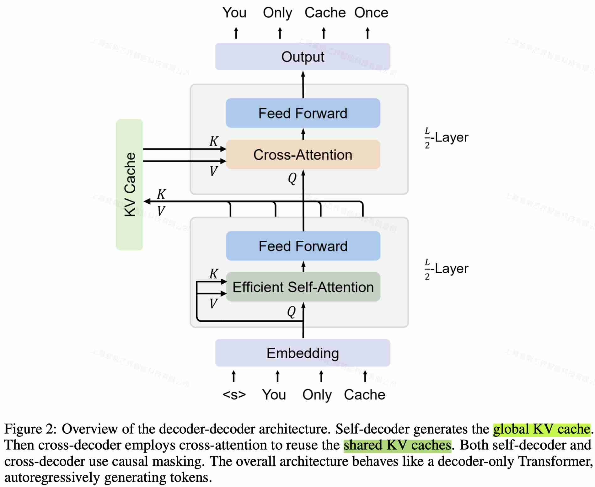

# You Only Cache Once: Decoder-Decoder Architectures for Language Models

> Yutao Sun, Li Dong, Yi Zhu, Shaohan Huang, Wenhui Wang, Shuming Ma, Quanlu Zhang, Jianyong Wang, Furu Wei (Microsoft Research, Tsinghua University)

> 注：以下论文笔记由 AI Agent 自动生成，可能存在理解偏差或遗漏，请以原论文为准。

## Abstract

We introduce a decoder-decoder architecture, YOCO, for large language models, which only caches key-value pairs once. It consists of two components, i.e., a cross-decoder stacked upon a self-decoder. The self-decoder efficiently encodes global key-value (KV) caches that are reused by the cross-decoder via cross-attention. The overall model behaves like a decoder-only Transformer, although YOCO only caches once. The design substantially reduces GPU memory demands, yet retains global attention capability. Additionally, the computation flow enables prefilling to early exit without changing the final output, thereby significantly speeding up the prefill stage. Experimental results demonstrate that YOCO achieves favorable performance compared to Transformer in various settings of scaling up model size and number of training tokens. We also extend YOCO to 1M context length with near-perfect needle retrieval accuracy.

## 一句话总结

提出 decoder-decoder 架构 YOCO：下半层 self-decoder 用高效注意力（gated retention 或滑窗）只算一份全局 KV cache，上半层 cross-decoder 全部跨层复用这份 cache，把 KV 显存和 prefill 开销从 O(LND)/O(LN²D) 降到 O((N+L)D)/O(LND)，同时保持全局注意力能力。

## 创新点

1. **Decoder-decoder 双段架构**：L 层中前 L/2 为 self-decoder（高效自注意力，KV cache 大小为常数），后 L/2 为 cross-decoder，所有 cross-attention 层复用 self-decoder 输出 $\hat{X}_{L/2}$ 投影出的同一份全局 KV cache（KV 只算一次、只存一次），对外行为与 decoder-only Transformer 一致，可直接自回归生成。
2. **Gated retention（gRet / RetNet-3）**：在 retention 基础上引入数据依赖的 head-wise 门控衰减 $\gamma = \text{sigmoid}(XW_\gamma)^{1/\tau}$，统一并行、循环、chunkwise 循环三种等价计算范式：训练用 chunkwise 并行，推理用循环形式维持常数大小状态 $S_n = \gamma_n S_{n-1} + K_n^\top V_n$。
3. **Prefill early-exit 特性**：cross-decoder 的输出只依赖 self-decoder 的 KV cache 而非逐层中间激活，因此 prefill 阶段算完 self-decoder 即可提前退出（跳过后 L/2 层）而不改变最终输出，prefill 注意力复杂度从 O(LN²D) 降为 O(LND)。
4. **面向长序列训练的 chunk parallelism**：序列切分到多卡时，self-decoder 只有相邻设备的隐藏状态传递，cross-decoder 的 KV cache 只需一次 all-gather（而非逐层通信），显著降低长序列分布式训练的通信开销与显存碎片。

## 带来什么提升

1. **KV cache 显存**：约省 L 倍；65B 模型每 token KV 显存降低约 80×（GQA+8bit 对比下 512K token 需 ~86GB → 1GB 量级），3B 模型 1M context 总推理显存 9.38× 降低（12.4GB vs ~116GB），32K 时也有 ~2×。
2. **Prefill 延迟**：512K context 从 180s 降到 <6s（30.3×），1M context 提速 71.8×，32K 也有 2.87×（early-exit 保证 ≥2×）。
3. **吞吐**：512K context 吞吐 9.6×（4.5 → 43.1 token/s），且显存省下后可用更大 batch，进一步放大吞吐收益。
4. **语言建模质量不掉**：3B 模型按 StableLM-3B-4E1T 配方训 1.6T token，OpenLLM Eval Harness 平均 0.636 vs StableLM-3B-4E1T 的 0.627（1T token 时 0.634 vs 0.612）；160M–13B scaling 曲线与 Llama-style Transformer 相当，YOCO_gRet 略优；1M context 下 Needle-In-A-Haystack 近满分，128K multi-needle 检索以 3B 大小匹敌/超过 7B 的 LWM-1M-text 等长上下文模型。

## 备注

- 自注意力模块可插拔（gRet / SWA / 其他常数缓存注意力），文中已观察到 attention-retention 混合的互补增益，后续 Jamba 等 hybrid 架构印证该结论。
- KV cache 作为显式模块被隔离出来，为 cache 压缩、单一索引检索、context 预缓存（native RAG）等系统优化提供了统一入口。
- 1M 长度训练用 64K→256K→1M 渐进扩长（RoPE θ=640K/5M/80M），long-context 部分未做指令微调对比，检索外任务证据以 NLL 曲线为主。
