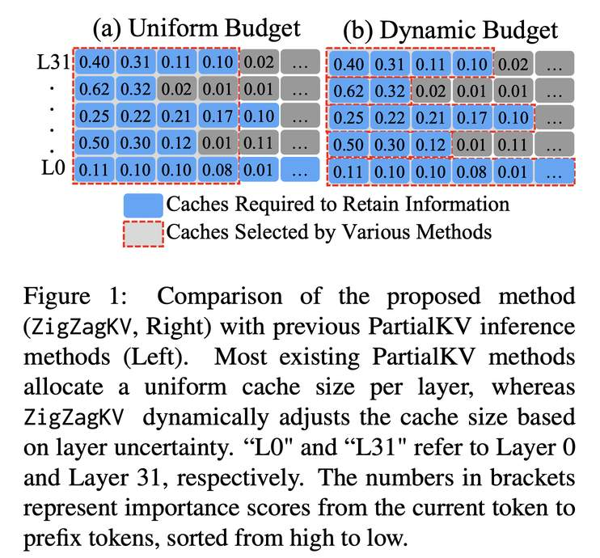

# ZigZagkv: Dynamic KV Cache Compression for Long-context Modeling based on Layer Uncertainty

> **一句话总结**：ZigZagKV 提出了一种基于层不确定性动态分配 KV 缓存预算的方法，在将 KV 缓存内存占用压缩至约 20% 的同时，实现了近乎无损的长上下文推理性能。

---

## 摘要翻译

大语言模型（LLM）已成为研究热点。为了加速 LLM 推理，将计算缓存存储在内存中已成为标准技术。然而，随着推理长度的增加，不断增长的 KV 缓存可能导致内存不足问题。许多现有方法通过 KV 缓存压缩来解决此问题，主要通过在所有层中保留关键 token 来减少信息损失。这些方法大多为每一层分配相同的预算大小。然而，我们观察到，从注意力机制和隐藏状态输出的角度来看，不同层和模型保留基本信息所需的最小预算大小各不相同。基于这一观察，本文提出了一种简单而有效的 KV 缓存压缩方法，利用层不确定性为每一层分配预算大小。实验结果表明，与全量 KV 推理相比，该方法可将 KV 缓存的内存使用量减少至仅约 20%，同时实现近乎无损的性能。

---

## 研究动机

1. **长上下文推理的内存瓶颈**：LLM 在长上下文建模时，KV 缓存随序列长度线性增长。例如，LLaMA-2 7B 模型在 100K token 上下文时需超过 50GB 显存，而 2K 上下文仅需不到 1GB。

2. **现有方法的局限**：现有 KV 缓存压缩方法（如 H2O、SnapKV、StreamingLLM）大多为每一层分配**相同的预算大小**，即统一保留 Top-B 最重要的 token。

3. **核心发现**：作者从注意力机制和隐藏状态输出两个角度分析了不同层的最小预算需求，发现：
   - **注意力角度（LMBA）**：不同层维持相同注意力损失（0.1）所需的最小预算大小不同。例如，底层可能需要更大预算，中层需求降低，高层又增加。
   - **隐藏状态输出角度（LMBO）**：类似地，不同层维持输出稳定性所需的最小预算也存在差异。对于 LLaMA，所需缓存初始较小但随层深增加；对于 Mistral，所需缓存持续上升。

4. **结论**：统一预算分配策略并非最优，需要根据层不确定性动态分配预算。

---

## 方法（技术细节）

### 4.1 基于层不确定性的动态预算分配

**核心思想**：根据每一层的不确定性（uncertainty）动态调整预算大小。注意力更分散（不确定性更高）的层分配更大预算，注意力更集中（不确定性更低）的层分配更小预算。

**具体步骤**：

1. **计算层不确定性**：使用 LMBA（Layer Minimum Budget size to maintain Attention score）作为不确定性度量：

$$
\text{uncertainty}_l = \frac{\text{LMBA}_l}{\sum_{i \in [1,L]} \text{LMBA}_i}
$$

其中 LMBA 是维持每层注意力损失为 0.1 所需的最小预算大小（对所有注意力头取平均）。

2. **动态预算分配**：给定平均预算大小 B，每层的预算大小为：

$$
\hat{B}_l = B \cdot L \cdot \text{uncertainty}_l
$$

其中 L 为总层数。

3. **有界预算机制**：为防止低不确定性层被分配过小预算导致信息丢失，引入最小预算下限 Bbound：

$$
\hat{B}_l = B_{\text{bound}} + (B - B_{\text{bound}}) \cdot L \cdot \text{uncertainty}_l
$$

每层首先获得保证的最小预算 Bbound，剩余预算按不确定性动态分配。

### 4.2 KV 缓存选择

在确定每层预算大小后，通过累积注意力分数选择关键 token：

- **重要性分数**：使用最后 w 个 token（指令 token）的累积注意力分数作为前缀 token 的重要性评分：

$$
s_i^h = \sum_{j \in [n-w, n]} A_{ij}^h
$$

- 其中 n 为提示序列长度，[n-w, n] 为最后的指令 token 段。
- 按重要性分数排序，保留每个注意力头中 Top-$\hat{B}_l$ 个最重要的 token。

---

## 实验结果

### 实验设置

- **模型**：LLaMA-3.1-8B-Instruct、Mistral-7B-Instruct-v0.3
- **基准**：Needle-in-a-Haystack（海针测试）、LongBench（16个子任务）
- **基线方法**：FullKV、StreamingLLM、H2O、SnapKV、PyramidKV
- **平均预算大小**：B ∈ {128, 256, 512, 1024}（Needle-in-a-Haystack）；B ∈ {128, 256, 512, 1024, 2048}（LongBench）

### 主要结果

**Needle-in-a-Haystack**：
- ZigZagKV 在几乎所有预算设置下**持续优于**其他方法
- 预算为 256 时，Mistral 上达到 **89.33%** 准确率，接近 FullKV（91.67%）
- 在 30K 上下文长度下仅需平均预算 256

**LongBench**：
- ZigZagKV 在多个任务上**平均得分最高**
- KV Size=128 时，Mistral 上平均得分 43.3（最高）；LLaMA 上 35.4（最高）
- KV Size=2048 时，Mistral 上平均得分 47.7（最高）；LLaMA 上 39.3（最高）
- 在 TriviaQA few-shot 学习任务上，仅用 KV Size=128 就**超越了 FullKV**

### 消融实验

**注意力损失（Table 3）**：
- ZigZagKV 在所有预算设置下的注意力损失均**低于** SnapKV 和 PyramidKV
- 例如，Mistral 预算 256 时：SnapKV 1.54、PyramidKV 1.59、ZigZagKV **1.25**

**隐藏状态损失（Table 4）**：
- ZigZagKV 的平均输出损失**最低**
- 证明动态预算分配有效维护了输出稳定性

**有界预算（Bounded Budget）消融**：
- 有界预算策略在两个模型上均提升了性能
- 防止了低不确定性层的预算不足问题

**计算开销（Table 5）**：
- ZigZagKV（6.50s）与 PyramidKV（6.56s）延迟相近
- StreamingLLM 更快（4.59s），但性能显著下降

---

## 优势

1. **简单有效**：方法仅需计算 LMBA 并按不确定性分配预算，无需训练，实现简单
2. **近乎无损**：在大幅压缩 KV 缓存（约 20%）的同时，性能损失极小
3. **层感知分配**：打破统一预算限制，根据每层的注意力特征和信息密度动态调整
4. **有界预算保护**：引入最小预算下限，防止低不确定性层的信息丢失
5. **即插即用**：无需修改模型结构，可直接应用于现有 LLM 推理流程
6. **广泛适用性**：在不同模型（LLaMA、Mistral）和不同任务上均表现出色
7. **低开销**：延迟与 PyramidKV 相近，不会引入显著额外计算负担

---

## 局限

1. **仅验证了 decoder-only 架构**：未包含 encoder-decoder 和 encoder-only 架构的验证
2. **模型种类有限**：仅在 LLaMA-3.1-8B-Instruct 和 Mistral-7B-Instruct-v0.3 上实验
3. **LMBA 计算依赖额外开销**：需要先计算各层的 LMBA，可能增加预处理时间
4. **未涉及代码开源**：prototxt 中代码 URL 为空，未提供开源实现
5. **仅考虑平均预算**：实验基于平均预算 B，未探索更大规模模型（如 70B+）上的表现

---

## 与 EfficientPaper 相关的研究方向

1. **KV 缓存压缩（kv_cache_sparse）**：本文属于 KV 缓存稀疏化/压缩领域，与 H2O、SnapKV、PyramidKV 等方法紧密相关
2. **动态预算分配**：与 PyramidKV 的层间预算分配思路类似，但 ZigZagKV 基于不确定性而非启发式固定策略
3. **长上下文推理优化**：与 StreamingLLM 等流式推理方法形成对比，ZigZagKV 更注重信息保留
4. **注意力机制分析**：从注意力分布和隐藏状态输出两个角度分析层间差异，为理解 Transformer 内部机制提供新视角
5. **训练无关（Training-Free）方法**：无需额外训练即可应用，与当前高效推理趋势一致
6. **LLM 推理加速**：与 LLM 长上下文建模的内存优化和推理速度优化直接相关

---

> **生成声明**：本 note 由 AI Agent（Hermes Agent）自动生成，基于 arXiv 论文（arXiv:2412.09036v1）全文内容分析和翻译。生成时间：2026年6月。
