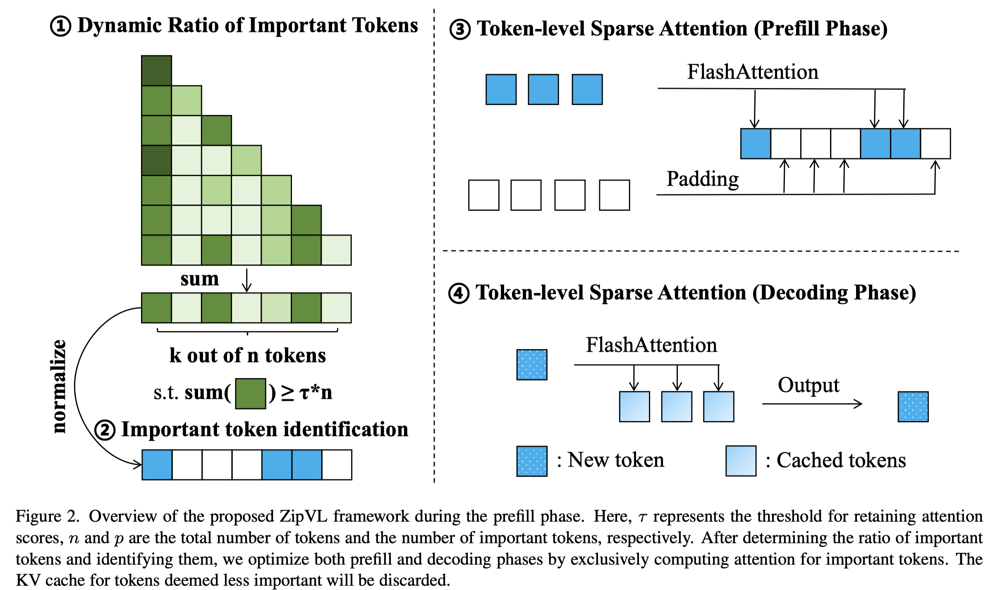

# ZipVL: Efficient Large Vision-Language Models with Dynamic Token Sparsification

> Yefei He, Feng Chen, Jing Liu, Wenqi Shao, Hong Zhou, Kaipeng Zhang, Bohan Zhuang

## Abstract

The efficiency of large vision-language models (LVLMs) is constrained by the
computational bottleneck of the attention mechanism during the prefill phase
and the memory bottleneck of fetching the key-value (KV) cache in the decoding
phase, particularly in scenarios involving high-resolution images or videos.
Visual content often exhibits substantial redundancy, resulting in highly
sparse attention maps within LVLMs. This sparsity can be leveraged to
accelerate attention computation or compress the KV cache through various
approaches. However, most studies focus on addressing only one of these
bottlenecks and do not adequately support dynamic adjustment of sparsity
concerning distinct layers or tasks. In this paper, we present ZipVL, an
efficient inference framework designed for LVLMs through a dynamic ratio
allocation strategy of important tokens. This ratio is adaptively determined
based on the layer-specific distribution of attention scores, rather than fixed
hyper-parameters, thereby improving efficiency for less complex tasks while
maintaining high performance for more challenging ones. Then we select
important tokens based on their normalized attention scores and perform sparse
attention mechanism solely on those important tokens, reducing the latency in
the prefill phase. Tokens deemed less important will be discarded to reduce KV
cache size, alleviating the memory bottleneck in the decoding phase. Our
experiments demonstrate that ZipVL can accelerate the prefill phase by
2.3$\times$ and improve decoding throughput by 2.8$\times$, with a minimal
accuracy reduction of only 0.5\% on VQAv2 benchmark over LLaVA-Next-13B model,
effectively enhancing the generation efficiency of LVLMs.
