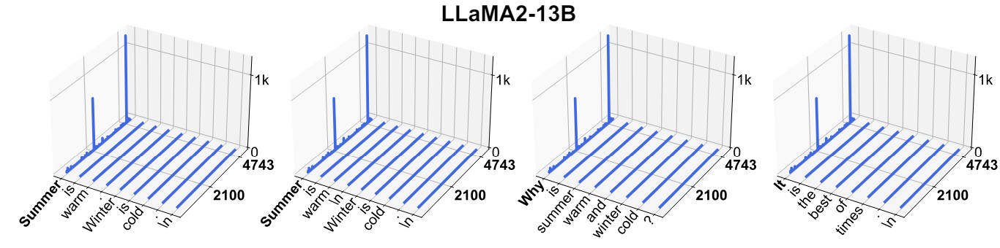

# Massive Activations in Large Language Models



> **⚠️ 本 note 由 AI Agent（Hermes Agent）自动生成，基于论文原文提取与分析，仅供参考。**
> **生成时间：2025-06**

---

## 一句话总结

本文发现并系统研究了大型语言模型（LLM）中普遍存在的一种现象——"巨大激活"（massive activations），即极少数激活值比其他激活值高出数个数量级（如 10 万倍），它们在模型中充当不可替代的固定偏置项，并与自注意力机制紧密相关，通过将注意力集中到特定 token 上来实现隐式偏置。

---

## 摘要翻译

我们在大型语言模型（LLM）中观察到一个经验性现象——极少数激活值表现出远大于其他激活值的数值（例如大 100,000 倍）。我们称其为"巨大激活"（massive activations）。首先，我们证明了巨大激活在各种 LLM 中广泛存在，并对其位置进行了刻画。其次，我们发现它们的值在不同输入下基本保持恒定，充当 LLM 中不可或缺的偏置项。第三，这些巨大激活导致注意力概率集中在对应的 token 上，进而在自注意力输出中形成隐式偏置项。最后，我们还研究了视觉 Transformer（ViT）中的巨大激活现象。

---

## 研究动机

### 背景问题

当前关于 LLM 的研究大多聚焦于其外部行为（如任务性能评估、提示工程等），但对其内部工作机制的了解仍然有限。随着 LLM 越来越多地被集成到实际应用中，深入理解其内部机制变得至关重要。

### 核心发现

作者发现 LLM 的隐藏状态中存在极少数激活值，其幅度比其他激活值大 4 个数量级以上（例如在 LLaMA2-70B 中绝对值超过 15,000），尽管存在归一化层。这些激活极为稀少——在数千万个激活中往往不到 10 个。这一现象此前未被系统研究。

### 与现有工作的关系

- **与 outlier features 的区别**：outlier features 是向量，对应所有 token 的激活；而 massive activations 是标量，由序列和特征维度共同决定，仅在极少数 token 上出现。
- **与 attention sinks 的扩展**：Xiao et al. (2023b) 发现 LLM 会将大量注意力分配给第一个 token，本文发现 LLM 将注意力集中在更多与巨大激活相关的 token 上，并深入分析了这些注意力集中模式的成因。

---

## 方法（技术细节）

### 1. 巨大激活的定义

论文给出一个宽松但通用的定义：一个激活值如果其绝对值超过 100，且比其隐藏状态的中位数大 1,000 倍左右，则被视为巨大激活。具体地，在 LLaMA2-7B 中，最大激活值约 2,622，而中位数仅约 0.2，差距超过 10,000 倍。

### 2. 位置分析

**深度维度（层）**：
- 巨大激活在中间层的值基本保持恒定
- 它们在初始几层突然出现（如 LLaMA2-7B 在第 2 层），在最后几层消失
- 这种突然出现表明它们不是通过多层逐渐积累形成的

**特征维度**：
- 巨大激活持续出现在极少数固定的特征维度中（如 LLaMA2-7B 的维度 1415 和 2533）
- 这些维度是与输入无关的

**序列维度**：
- 根据巨大激活的位置，LLM 可分为三类：
  - **仅起始 token**：如 LLaMA2-13B、MPT、GPT-2
  - **起始 token + 首个强分隔符（如 "." 或 "\n"）**：如 LLaMA2-7B
  - **起始 token + 分隔符 + 弱语义词（如 "and"、"of"、"from"）**：如 LLaMA2-70B、Mistral-7B、Mixtral-8x7B、Falcon-40B、Phi-2

### 3. 偏置功能分析

**干预实验（Intervention Analysis）**：

| 干预方式 | LLaMA2-7B (WikiText) | LLaMA2-7B (Mean Zero-Shot) | LLaMA2-13B (WikiText) | LLaMA2-13B (Mean Zero-Shot) |
|---|---|---|---|---|
| 原始 | 5.47 | 68.95% | 4.88 | 71.94% |
| 设为 0 | inf | 36.75% | 5729 | 37.50% |
| 设为均值 | 5.47 | 68.94% | 4.88 | 71.92% |

- **设为零**：模型性能灾难性崩溃（perplexity 爆炸），证明巨大激活不可替代
- **设为均值**：几乎无影响，说明其值本质上是与输入无关的常数

**为什么是这些层和 token？**
- 起始 token 是所有自回归训练实例中唯一在所有前向传递中都使用的 token
- 分隔符 token 语义值低，存储偏置的代价小
- 巨大激活仅在初始几层之后出现，可能是因为 LLM 需要先处理与巨大激活相关 token 的语义

### 4. 与自注意力机制的关系

**4.1 注意力集中在巨大激活上**

- 在巨大激活出现的层之后，注意力 logits 主要集中在与巨大激活相关的 token 上
- 这些 token 的 key 状态导致的 attention logits 为正值，而其他 token 为负值
- 在 softmax 后，这些 token 获得大部分注意力概率

**4.2 巨大激活施加隐式注意力偏置**

- 通过分析 attention LayerNorm 和 QKV 投影，发现与巨大激活相关的 token 在所有阶段的特征都与其他 token 截然不同
- LayerNorm 的归一化步骤将正常值推近零，同时保留巨大激活的异常特性
- 注意力输出的分解表明，来自巨大激活相关 token 的值更新在所有 token 间几乎完全相同——这本质上是一个隐式偏置项

**4.3 显式注意力偏置消除巨大激活**

提出一种新的注意力公式：

```
Attention(Q, K, V; k', v') = softmax(QK^T k' / √d) [V; v'^T]
```

其中 k' 和 v' 是每个 head 的可学习参数，与 key/value 矩阵拼接。

- 在 GPT-2 上训练三种模型：标准模型、带 sink token 的模型、带显式注意力偏置的模型
- 三种模型收敛后性能相同，但巨大激活状态显著不同
- **带显式注意力偏置的 GPT-2 中，巨大激活消失**
- 这表明显式注意力偏置消除了 LLM 在预训练阶段学习巨大激活的必要性

### 5. 视觉 Transformer 中的巨大激活

- 在 CLIP ViT-L 和 DINOv2 ViT-L 中发现巨大激活
- 在 MAE ViT-L 中未观察到
- 与 LLM 不同，ViT 中的巨大激活出现在随机 patch token 上（非固定位置）
- ViT 中的巨大激活仅在后几层出现
- 干预实验（CLIP ViT-L）：设为零导致准确率大幅下降（75.5% → 59.8%），设为均值几乎无影响

**Register tokens 的新解释**：
- Darcet et al. (2023) 提出在 ViT 中使用额外的 register tokens
- 本文发现 DINOv2-reg 中的 register 3 包含巨大激活
- 干预实验表明将 register 特征固定为均值后，性能几乎不变
- 这说明 register tokens 本质上充当了与巨大激活类似的固定偏置，而非原文所假设的"聚合全局图像信息"

---

## 实验结果

### 模型覆盖范围

论文在大量模型上验证了巨大激活的存在：
- **LLM**：LLaMA2-7B/13B/70B、LLaMA3-8B/70B、Phi-2、Mistral-7B、Mixtral-8x7B、MPT-7B/30B、Falcon-7B/40B、GPT-2/Medium/Large/XL、OPT-7B/13B/30B/66B
- **微调模型**：LLaMA2-7B-Chat、LLaMA2-13B-Chat、Mistral-7B-Instruct、Mixtral-8x7B-Instruct
- **ViT**：CLIP ViT-L、DINOv2 ViT-L、DINOv2-reg ViT-G、MAE ViT-L

### 关键量化结果

- **Top 激活值**：LLaMA2-7B 约 2,622，Mixtral-8x7B 约 7,100，LLaMA2-70B 约 15,000+
- **中位数值**：通常在 0.2-0.4 之间
- **差距**：Top 激活值通常比中位数大 4-5 个数量级
- **方差**：巨大激活的方差远小于其他激活（如 LLaMA2-7B Top1 均值 2556.8 ± 141.0，标准差仅占均值的约 5.5%）

### 显式注意力偏置训练结果

- 标准 GPT-2、带 sink token 的 GPT-2、带显式注意力偏置的 GPT-2 三种模型在 50,000 次迭代后验证集 perplexity 均为 3.04
- 但只有带显式注意力偏置的模型中巨大激活消失

---

## 优势

1. **全面的实证分析**：在 20+ 种 LLM 和多种 ViT 模型上验证了巨大激活的普遍存在性
2. **清晰的机制解释**：通过干预实验和注意力分析，揭示了巨大激活作为偏置项的功能
3. **创新的解决方案**：提出显式注意力偏置公式，能有效消除巨大激活，同时不影响模型性能
4. **跨模态的发现**：将分析扩展到视觉 Transformer，展示了该现象的普遍性
5. **对现有工作的统一理解**：将 attention sinks、outlier features、register tokens 等现象纳入统一框架
6. **对量化研究的启示**：识别了一种新型异常激活，对 LLM 压缩研究具有重要价值

---

## 局限

1. **计算资源限制**：显式注意力偏置实验仅在 GPT-2 小模型上进行，未能在更大规模模型上验证
2. **训练稳定性**：未深入研究显式注意力偏置对大规模 LLM 训练稳定性的影响
3. **微调影响**：指令微调对巨大激活的影响（如 Mixtral-8x7B-Instruct 中 \n token 上的消失）未被充分研究
4. **BOS token 影响**：BOS token 对巨大激活位置的影响未被充分理解
5. **ViT 分析不够深入**：在 ViT 中仅分析了 CLIP 和 DINOv2，未覆盖更多视觉模型
6. **MAE 未发现巨大激活的原因**：MAE ViT-L 中未观察到巨大激活，但未深入分析原因

---

## 与 EfficientPaper 相关的研究方向

### 1. 模型量化与压缩

- 巨大激活是 LLM 量化的主要障碍之一（如 LLM.int8()、SmoothQuant、AWQ 等）
- 识别了新类型的异常激活，可能启发新的量化方法
- 研究方向：针对巨大激活的专用量化策略

### 2. 注意力机制优化

- 显式注意力偏置公式可作为注意力机制的改进方向
- 研究方向：将显式注意力偏置应用于大规模 LLM，探索训练稳定性和性能

### 3. 模型可解释性

- 巨大激活揭示了 LLM 内部偏置的存储机制
- 研究方向：将偏置项显式化，提升注意力图的可解释性

### 4. 高效模型设计

- 理解巨大激活的功能有助于设计更高效的模型架构
- 研究方向：在模型设计中显式引入偏置项，避免隐式学习

### 5. 视觉 Transformer 优化

- register tokens 本质上是偏置项，与巨大激活功能类似
- 研究方向：将 register tokens 与显式注意力偏置结合，优化视觉模型

### 6. 跨模态泛化

- 巨大激活在 LLM 和 ViT 中均存在，但表现形式不同
- 研究方向：探索多模态模型中巨大激活的统一规律

---

**论文信息**：
- 标题：Massive Activations in Large Language Models
- 作者：Mingjie Sun (CMU), Xinlei Chen (Meta), J. Zico Kolter (CMU/Bosch), Zhuang Liu (Meta)
- 机构：Carnegie Mellon University, Meta AI Research, Bosch Center for AI
- 发表：arXiv:2402.17762v2, COLM 2024
- 代码：https://github.com/locuslab/massive-activations
