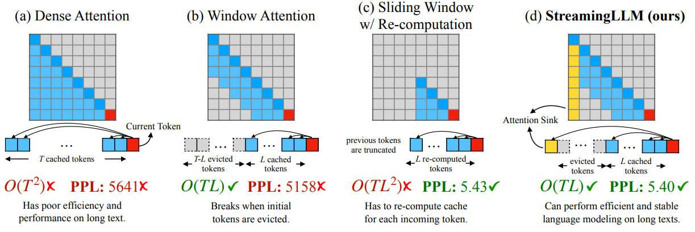

# Efficient Streaming Language Models with Attention Sinks

> **一句话总结**：StreamingLLM 通过保留初始 token 的 KV 缓存（"注意力汇聚点"），使大语言模型无需微调即可处理无限长文本流，相比滑动窗口重计算基线实现最高 22.2 倍加速。

---

## 摘要翻译

将大语言模型（LLM）部署在流式应用（如多轮对话）中，需要处理长时间交互，这面临两大挑战：（1）在解码阶段，缓存所有先前 token 的 Key 和 Value 状态（KV）会消耗大量内存；（2）主流 LLM 无法泛化到超过训练序列长度的更长文本。滑动窗口注意力（Window Attention）是一种自然的方法——但它在文本长度超过缓存大小时会失效。我们观察到一个有趣的现象——**注意力汇聚（Attention Sink）**：保留初始 token 的 KV 可以大幅恢复滑动窗口注意力的性能。本文首先证明，注意力汇聚的出现是由于模型对初始 token 的强注意力分数，即使这些 token 在语义上并不重要。基于以上分析，我们提出 StreamingLLM，一种高效的框架，使有限注意力窗口训练的 LLM 无需微调即可泛化到无限序列长度。我们展示了 StreamingLLM 能够使 Llama-2、MPT、Falcon 和 Pythia 稳定高效地进行语言建模，处理多达 400 万 token 以上。此外，我们发现预训练时添加一个占位符 token 作为专用注意力汇聚点可以进一步提升流式部署效果。在流式设置中，StreamingLLM 相比滑动窗口重计算基线最高可实现 22.2 倍加速。

---

## 研究动机

### 核心问题

大语言模型（LLM）正被广泛应用于对话系统、文档摘要、代码补全等场景。为释放 LLM 的全部潜力，它们需要能够高效准确地进行长序列生成。例如，一个理想的聊天助手可以稳定处理整天的对话内容。然而，LLM 很难泛化到超过其预训练序列长度的文本（如 Llama-2 的 4K 窗口）。

### 两大挑战

1. **内存瓶颈**：在解码阶段，Transformer LLM 缓存所有先前 token 的 KV 状态，导致内存占用持续增长，推理延迟不断增加。
2. **长度外推限制**：现有模型在输入长度超过预训练注意力窗口时性能急剧下降（即使扩展窗口尺寸也难以解决无限长度问题）。

### 现有方法的不足

- **稠密注意力（Dense Attention）**：时间复杂度 O(T²)，内存无限增长，且在超过训练长度后性能崩溃。
- **滑动窗口注意力（Window Attention）**：仅缓存最近 L 个 token 的 KV，但当初始 token 被驱逐后模型性能急剧下降（PPL 从 5.40 飙升至 5158）。
- **滑动窗口重计算（Sliding Window with Re-computation）**：对每个新生成的 token 重建 KV 状态，性能好但计算代价高 O(TL²)，不适合实时流式应用。

---

## 方法（技术细节）

### 注意力汇聚（Attention Sink）现象

通过可视化 Llama-2-7B 的注意力图（图 2），作者发现：**在前两层之外，模型在所有层和头中都大量关注初始 token**，无论这些 token 是否与当前语言建模任务相关。作者将这些 token 称为"注意力汇聚点（Attention Sinks）"。

**原因分析**：Softmax 函数要求注意力分数对所有上下文 token 求和为 1（公式 1）。即使当前查询在许多先前 token 中没有强匹配，模型仍需要将多余的注意力值分配到某处。由于初始 token 在自回归语言建模中对几乎所有后续 token 可见（因为位置最靠前），它们最容易被训练成注意力汇聚点，接收多余的注意力值。

**实验证据（表 1）**：
- 窗口注意力（0+1024）：PPL = 5158.07（崩溃）
- 保留 4 个初始 token + 1020 个最近 token（4+1020）：PPL = 5.40（恢复）
- 将初始 token 替换为换行符 "4\n+1020"：PPL = 5.60（同样有效）

这表明初始 token 的**绝对位置**而非语义内容才是关键。

### StreamingLLM：滚动 KV 缓存 + 注意力汇聚

StreamingLLM 的 KV 缓存分为两部分（图 4）：

1. **注意力汇聚（Attention Sinks）**：保留 4 个初始 token 的 KV，稳定注意力计算。
2. **滚动 KV 缓存（Rolling KV Cache）**：保留最近的 token，用于语言建模。

**位置编码处理**（关键细节）：StreamingLLM 使用缓存内的相对位置，而非原始文本中的绝对位置。例如，如果当前缓存为 [0, 1, 2, 3, 6, 7, 8]（解码第 9 个 token），位置分配为 [0, 1, 2, 3, 4, 5, 6, 7]，而非原始位置 [0, 1, 2, 3, 6, 7, 8, 9]。

- **RoPE 编码**：缓存引入旋转变换之前的 Keys，在每个解码步骤对滚动缓存中的 keys 应用位置变换。
- **ALiBi 编码**：直接对注意力分数应用连续线性偏置，而非跳跃偏置。

**初始 token 数量消融（表 2）**：
- 0 个初始 token：PPL 崩溃（如 Llama-2-7B: 3359.95）
- 1-2 个初始 token：部分恢复但不完全
- 4 个初始 token：充分恢复，后续增加收益递减
- 8 个初始 token：与 4 个效果相当

### 预训练时添加 Sink Token

作者提出在预训练时向所有训练样本开头添加一个可学习的占位符 token（Sink Token），作为专用的注意力汇聚点。对比实验（表 3，160M 参数模型）：

| 方法 | 0+1024 | 1+1023 | 2+1022 | 4+1020 |
|------|--------|--------|--------|--------|
| Vanilla | 27.87 | 18.49 | 18.05 | 18.05 |
| Zero Sink | 29214 | 19.90 | 18.27 | 18.01 |
| Learnable Sink | 1235 | 18.01 | 18.01 | 18.02 |

关键发现：
- **Learnable Sink** 模型仅需 1 个 sink token 即可实现稳定的流式困惑度（PPL = 18.01），无需额外初始 token。
- **Zero Sink**（SoftMax-off-by-One）模型仍需其他初始 token 作为注意力汇聚点。
- 添加 Sink Token 不影响模型的正常收敛和性能（表 4，7 个 NLP 基准测试性能相似）。
- 可视化分析（图 7）显示 Sink Token 模型在所有层和头中都明确关注 sink token，有效收集多余注意力。

---

## 实验结果

### 实验设置
- **模型**：Llama-2-[7,13,70]B、MPT-[7,30]B、Falcon-[7,40]B、Pythia-[2.9,6.9,12]B
- **位置编码**：RoPE（Llama-2, Falcon, Pythia）和 ALiBi（MPT）
- **基准**：稠密注意力、滑动窗口注意力、滑动窗口重计算
- **数据集**：PG-19 测试集（100 本长书，约 400K token）
- **默认配置**：4 个初始 token 作为注意力汇聚点

### 长文本语言建模（图 3, 图 5）

- **20K token 文本**：StreamingLLM 的 PPL（5.40）与滑动窗口重计算基线（5.43）相当，而窗口注意力崩溃（PPL = 5158），稠密注意力也崩溃（PPL = 5641）。
- **400 万 token 文本**：StreamingLLM 在所有模型家族和规模上保持稳定的困惑度，包括 Llama-2-[7,13,70]B、Falcon-[7,40]B、Pythia-[2.9,6.9,12]B、MPT-[7,30]B。

### 流式问答（表 5）

在 ARC-[Challenge, Easy] 数据集上模拟多轮问答（流式格式）：
- **稠密注意力**：内存溢出（OOM），不可用。
- **窗口注意力**：准确率极低（如 Llama-2-7B-Chat Arc-E: 3.58%）。
- **StreamingLLM**：与一次性逐样本基线准确率相当（如 Llama-2-7B-Chat Arc-E: 71.34% vs One-shot: 71.25%）。
- **70B 模型**：StreamingLLM 达到 Arc-E 91.37%、Arc-C 80.20%。

### StreamEval 基准（图 9）

作者引入 StreamEval 数据集，每 10 行新信息后向模型提问（答案在 20 行前），模拟真实流式场景：
- StreamingLLM 在输入长度接近 120K token 时仍保持合理准确率。
- 稠密注意力和窗口注意力分别在预训练文本长度和 KV 缓存大小处失败。
- StreamingLLM 可与上下文扩展技术（LongChat-7b-v1.5-32k、Llama-2-7B-32K-Instruct）互补，扩大可捕获的局部信息范围。

### 效率对比（图 10）

在 Llama-2-7B 和 Llama-2-13B 上使用 Huggingface Transformers 库，NVIDIA A6000 GPU 测试：

| 指标 | StreamingLLM | 滑动窗口重计算 |
|------|-------------|--------------|
| **解码延迟** | 线性增长（最高 65ms/token @ 4096 cache） | 二次增长（最高 1411ms/token @ 4096 cache） |
| **最大加速比** | — | **22.2x** |
| **内存占用** | 与重计算基线相当 | 与 StreamingLLM 相当 |

- 随着缓存大小增加，StreamingLLM 的解码速度线性增长，而重计算基线呈二次增长。
- StreamingLLM 保持与重计算基线一致的内存占用。

### 消融研究

**缓存大小影响（表 6）**：增大缓存大小并不总是降低困惑度（如 Llama-2-7B 从 4+508 的 9.73 到 4+1020 的 9.32，再到 4+2044 的 9.59），表明这些模型可能无法充分利用接收到的完整上下文。

---

## 优势

1. **无需微调**：StreamingLLM 可直接应用于已训练的 LLM，无需任何额外微调，即插即用。
2. **无限长度支持**：使 LLM 能处理无限长文本（已验证 400 万 token 以上），突破预训练窗口限制。
3. **高效推理**：相比滑动窗口重计算基线，最高实现 **22.2 倍加速**，且内存占用相当。
4. **通用性强**：适用于多种模型家族（Llama-2、MPT、Falcon、Pythia）和位置编码方案（RoPE、ALiBi）。
5. **稳定性好**：困惑度在超长文本上保持稳定，不随长度增加而波动。
6. **可与上下文扩展互补**：StreamingLLM 可与 RoPE 插值、NTK-aware scaling 等上下文扩展技术结合使用，扩大可捕获的局部信息范围。
7. **预训练优化方案**：提出添加 Sink Token 的预训练策略，使模型仅需 1 个 sink token 即可实现稳定流式部署。
8. **简单易实现**：核心思想仅是保留初始 token 的 KV + 滚动缓存，实现简单。
9. **广泛采用**：已被 NVIDIA TensorRT-LLM、Intel Extension for Transformers、HuggingFace Transformers、MLC LLM 等多种 LLM 服务方案采用。

---

## 局限

1. **无法扩展上下文窗口**：StreamingLLM 不扩展 LLM 的上下文窗口大小，也不增强模型对长文本的记忆和利用能力。它只能稳定使用最近的 token，不能利用远处的 token 信息。
2. **缓存大小增加不总带来性能提升**：消融实验（表 6）显示，增大缓存大小并不总是降低困惑度，表明模型可能无法充分利用完整上下文。
3. **仅适用于自回归模型**：StreamingLLM 依赖自回归语言模型的注意力机制，不适用于非自回归模型或双向编码器。
4. **位置编码依赖**：虽然支持 RoPE 和 ALiBi，但对其他位置编码方案的兼容性未被验证。
5. **预训练 Sink Token 的通用性**：Sink Token 的预训练方案仅在 160M 参数模型上验证，未在更大规模模型上测试。
6. **内存占用未优化**：虽然与重计算基线相当，但 KV 缓存仍然占用显著内存（Llama-2-7B 约 13-19GB），对资源受限场景仍需进一步优化。
7. **不能解决长上下文利用问题**：StreamingLLM 的重点是"稳定地使用最近 token"，而非"有效利用长上下文"——后者仍是一个开放问题。
8. **对"幻觉"问题无帮助**：StreamingLLM 不解决 LLM 在长文本生成中的幻觉或事实一致性问题。

---

## 与 EfficientPaper 相关的研究方向

1. **KV 缓存优化**：StreamingLLM 的核心是 KV 缓存管理，与 `attention_sparsity`、`kv_cache_sparse` 等关键词直接相关。相关方向包括 KV 缓存量化（如 KIVI）、KV 缓存驱逐策略（如 H₂O）、以及高效的注意力稀疏化方法。
2. **长上下文处理**：StreamingLLM 解决了无限长度流式部署的问题，与长上下文扩展（如 RoPE 插值、NTK-aware scaling、ALiBi）形成互补。相关工作包括 LongRoPE、YaRN、Ring Attention 等。
3. **推理效率**：StreamingLLM 的加速效果（22.2x）使其成为高效推理的重要方向，与 FlashAttention、PagedAttention、连续批处理（Continuous Batching）等技术相关。
4. **注意力机制改进**：注意力汇聚现象揭示了 Softmax 函数的内在局限，相关研究包括 SoftMax-off-by-One、注意力蒸馏、以及多头注意力的冗余消除。
5. **流式部署架构**：StreamingLLM 为流式 LLM 服务提供了理论基础，与 LLM 服务系统（如 vLLM、TensorRT-LLM、DeepSpeed-Inference）的流式处理能力密切相关。
6. **KV 缓存压缩**：结合 StreamingLLM 的注意力汇聚机制，探索更高效的 KV 缓存压缩方法（如保留更重要的 token、动态调整缓存窗口等）。
7. **预训练策略**：Sink Token 的预训练思想可启发更高效的 LLM 预训练方法，如预训练时设计专用的注意力汇聚 token，减少推理时的 KV 缓存需求。

---

> **AI 生成声明**：本笔记由 AI Agent（Hermes Agent）自动生成，基于论文原始文本（通过 PyMuPDF/fitz 提取）和元数据（prototxt）。笔记中的翻译、分析和总结均由 AI 完成，可能存在理解偏差或信息遗漏。建议读者参考原文以获取完整、准确的论文内容。
