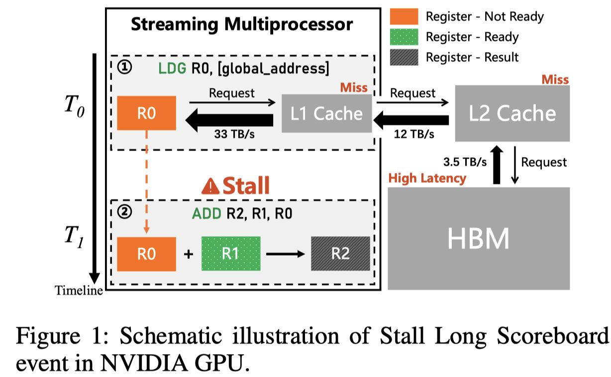

# Accelerating LLM Inference Throughput via Asynchronous KV Cache Prefetching

> **生成声明**：本 note 由 AI Agent（Hermes Agent）基于论文全文自动生成，生成日期为 2025 年。内容仅供参考，请结合原文阅读。

---

## 一句话总结

提出一种面向 GPU L2 Cache 的异步 KV Cache 预取方法，在计算周期内利用空闲内存带宽主动将 KV Block 预取到 L2 Cache，实现计算与内存访问的重叠，从而突破 LLM 推理中的 HBM 带宽瓶颈，在 NVIDIA H20 GPU 上实现了最高 2.15× 注意力核加速和 1.97× 端到端吞吐量提升。

---

## 摘要翻译

大语言模型（LLM）在推理过程中由于高带宽内存（HBM）带宽限制而表现出显著的内存受限特性。本文提出了一种面向 L2 Cache 的异步 KV Cache 预取方法，通过计算-负载重叠来突破 LLM 推理中的内存带宽瓶颈。通过在活跃计算窗口期间策略性地调度空闲内存带宽，该方法主动将所需的 KV Cache 预取到 GPU L2 Cache 中，使后续访问能够获得高速的 L2 Cache 命中，并有效地将 HBM 访问延迟隐藏在计算周期内。在 NVIDIA H20 GPU 上的大量实验表明，该方法在注意力核效率上实现了 2.15 倍的提升，端到端吞吐量最高提升 1.97 倍，超越了当前最先进的 FlashAttention-3 基线。值得注意的是，该方案与现有优化技术保持正交性，可与当前推理框架集成，为下一代 LLM 推理引擎提供可扩展的延迟隐藏方案。

---

## 研究动机

1. **LLM 推理的内存瓶颈**：LLM 在自回归解码阶段具有显著的内存受限特性。每个解码步骤需要从 HBM 加载历史序列的 KV Cache 到计算单元寄存器，而 HBM 带宽无法满足现代计算单元的吞吐量需求，导致大量数据移动延迟成为推理吞吐量的关键瓶颈。

2. **现有优化的不足**：FlashAttention 等方法通过分片和内核融合减少 HBM 访问次数，但未能实现计算与内存操作的重叠，仍然受限于内存带宽。

3. **硬件性能分析发现**：通过对 vLLM 推理引擎的 XFormers 后端进行系统性硬件性能分析，发现三个关键性能瓶颈：
   - **GPU 资源利用不足**：计算带宽利用率仅 23.35%，内存带宽利用率仅 47.10%
   - **缓存命中率极低**：L1 缓存命中率仅 0.75%，L2 缓存命中率仅 0.06%，缓存机制几乎完全失效
   - **持续的 Warp 停顿**：平均 CPI 达到 27.68 周期，其中 77% 的周期被 "Stall Long Scoreboard" 事件消耗

4. **关键洞察**：在 KV Block 加载阶段存在显著的空闲内存带宽，利用这些未充分利用的带宽资源可以优化 KV Cache 的内存访问效率。

---

## 方法（技术细节）

### 核心思想

在 GPU 计算单元执行当前迭代的 Q·K^T 计算时，利用 GPU 的异步预取能力，主动将下一迭代所需的 K Block 从 HBM 加载到 L2 Cache，使后续迭代的 K Block 请求能直接获得 L2 Cache 命中，从而消除因 "Stall Long Scoreboard" 事件导致的 Warp 停顿。

### 具体实现

**KV Block 预取机制（Algorithm 1）**：
- 输入：Block table (bt)、Warp 数量 (w)、Block 索引范围 [s, e)
- 对每个 block_idx：
  1. 查找 block table 获取当前 Block 的物理地址
  2. 从全局内存加载当前 K Block 到寄存器
  3. 如果 block_idx + w < e，则预取下一个 K Block 到 L2 Cache
  4. 使用已加载到寄存器的 K Block 执行 Q·K^T 计算
  5. block_idx 增加 w，进入下一轮迭代

**关键设计要点**：
- 当前迭代的 K Block 已加载到寄存器，其对应的 L2 Cache 行可以安全驱逐，不会造成性能损失
- 当前迭代的 Q·K^T 计算与下一迭代的 K Block 预取并行执行，实现计算-内存访问重叠
- 该方法同样适用于 V Block 的预取，实现 logits·V 计算与 V Block 预取的并行

**GPU 预取接口**：
- 使用 NVIDIA CUDA 的 PTX 指令 `cp.async.bulk.prefetch.L2` 实现 L2 Cache 面向的异步预取
- 该指令为非阻塞指令，要求 Compute Capability 9.0 或更高（Hopper 架构，如 H100/H20）

### L2 Cache 容量分析

- 单个 Block 的内存占用：M_block = b · d_h · T_block（b 为参数字节大小，d_h 为注意力头维度，T_block 为每 Block 的 token 数）
- 每次迭代处理的 Block 总内存占用：M_total = M_block · (N_thread/32) · H · B
- 以 FP16 Llama2-7B 为例，单个 Block 占用 4 KB，每次迭代总数据量 512 KB
- NVIDIA H100 的 60 MB L2 Cache 理论上可支持最多 120 个 batch 的 K/V Block 全量驻留
- 当 batch 超过上限时，部分驻留的 Block 仍可通过缓存命中获得边际性能增益

### XFormers 内核并行策略

- **Thread Block 级并行**：单个 CUDA Thread Block (配置为 [N_thread, 1, 1]) 作为基本执行单元，每个 Thread Block 被划分为多个 Warp，每个 Warp 处理单个 KV Block
- **Grid 级并行**：Grid 维度为 [H, B, 1]（H 为注意力头数，B 为 batch size），实现多注意力头和多输入序列的并行处理

---

## 实验结果

### 实验设置
- **硬件**：4× Intel Xeon Platinum 8469C + 8× NVIDIA H20 GPU（60MB L2 Cache，96GB HBM，4.0TB/s 内存带宽）
- **模型**：Llama2-7B (MHA, 32Q:32KV)、Llama3-8B (GQA, 32Q:8KV)、Qwen2.5-7B (GQA, 28Q:4KV)、Qwen2.5-14B (GQA, 40Q:8KV)，均为 FP16 精度
- **基线**：vLLM v0.7.1 的原生 XFormers 后端和 FlashAttention-3 (FA3)
- **配置**：输入 token 长度 512，输出 token 512-8192，batch size 1-128

### 注意力核性能（单 GPU，batch=64，output=4K）

| 模型 | 指标 | XFormers | 本文方法 | 提升 |
|------|------|----------|----------|------|
| Llama2-7B | Duration (μs) | 293.47 | 159.14 | 1.84× |
| Llama2-7B | Compute Throughput (%) | 23.35 | 48.22 | - |
| Llama2-7B | Memory Throughput (%) | 47.10 | 86.88 | - |
| Llama2-7B | L2 Cache Hit Rate (%) | 0.06 | 43.70 | - |
| Llama2-7B | Stall Long Scoreboard (cycle) | 21.34 | 4.13 | - |
| Llama3-8B | Duration (μs) | 226.53 | 119.90 | 1.89× |
| Llama3-8B | L2 Cache Hit Rate (%) | 38.35 | 73.01 | - |
| Qwen2.5-7B | Duration (μs) | 232.03 | 107.71 | 2.15× |
| Qwen2.5-7B | L2 Cache Hit Rate (%) | 55.90 | 82.66 | - |
| Qwen2.5-14B | Duration (μs) | 272.19 | 143.94 | 1.89× |
| Qwen2.5-14B | L2 Cache Hit Rate (%) | 51.43 | 77.11 | - |

- 所有模型的 Stall Long Scoreboard 周期从 16-21 降至 2-4，CPI 降低 65.8%-67.5%
- 计算吞吐量峰值提升 35.66%，内存吞吐量峰值提升 44.45%
- 内核加速比 1.84× 到 2.15×

### 单 GPU 端到端吞吐量（output=2048，batch 16-128）

- 相比原生 XFormers：Llama2-7B 最高提升 51%，Llama3-8B 最高提升 57%，Qwen2.5-7B/14B 最高提升 41%
- 相比 FA3：Llama2-7B 最高提升 110%，Llama3-8B 最高提升 15%，Qwen2.5-14B 最高提升 7%
- Qwen2.5-7B 相比 FA3 有 2-5% 性能回退（因激进的 GQA 配置 7:1 限制了优化空间）

### Batch Size 与序列长度的影响

- 固定 batch size，增加输出序列长度 → 加速比单调递增（更多 KV Block 导致更大累积收益）
- 固定序列长度，增加 batch size → 加速比递增（KV Block 数量线性增长）
- 峰值加速比出现在 8K output tokens × batch 128 的组合之前（受 L2 Cache 容量限制和 GPU 物理内存限制）

### 多 GPU 吞吐量（2/4/8 GPU，output=4096，batch=64）

- Llama3-8B：相比 XFormers 提升 4%-59%
- Qwen2.5-14B：相比 XFormers 提升 4%-76%
- 随 GPU 数量增加，性能增益递减（TP 分区导致每 GPU 处理的注意力头减少）
- FA3 在 4/8 GPU 配置下 Llama3-8B 出现 3-7% 吞吐量回退，本文方法仍保持加速

---

## 优势

1. **显著性能提升**：注意力核效率提升最高 2.15 倍，端到端吞吐量提升最高 1.97 倍，超越 FlashAttention-3
2. **正交性与可集成性**：与 FlashAttention、GQA/MQA/MLA 等现有优化技术正交，可集成到现有推理框架（如 vLLM）中
3. **硬件-软件协同设计**：利用 NVIDIA Hopper 架构的异步预取指令（cp.async.bulk.prefetch.L2），实现高效的硬件-软件协同
4. **显著减少 Warp 停顿**：Stall Long Scoreboard 周期降低 75%-81%，CPI 降低 65%-67%
5. **扩展性强**：支持单 GPU 和多 GPU（Tensor Parallelism）场景，加速比随序列长度和 batch size 增长
6. **实现简单**：仅需在 XFormers 内核中添加预取逻辑，不需要改变模型架构或训练过程

---

## 局限

1. **GPU 架构限制**：依赖 NVIDIA Hopper 架构（Compute Capability 9.0+），不支持旧架构 GPU（如 A100/V100）
2. **GQA 架构收益衰减**：在激进的 GQA 配置下（如 Qwen2.5-7B 的 7:1），预取收益随 KV Head 数减少而线性衰减，甚至出现 2-5% 性能回退
3. **L2 Cache 容量限制**：当 batch size 超过 L2 Cache 容量上限时，部分 Block 被驱逐，性能增益受限
4. **多 GPU 场景收益递减**：在 Tensor Parallelism 下，每 GPU 处理的注意力头数减少，可优化的 I/O 操作空间缩小
5. **无开源代码**：论文未提供代码实现，可复现性受限
6. **仅优化注意力核**：未涉及其他推理阶段（如 Prefill、MLP 等）的优化

---

## 与 EfficientPaper 相关的研究方向

1. **KV Cache 管理优化**：与 KV Cache 相关的压缩、分页、预取等技术（关键词：kv_cache_management）
2. **注意力核优化**：FlashAttention 系列、DeepSpeed-inference 等计算内核优化
3. **GPU 内存层次优化**：利用 L1/L2 Cache 减少 HBM 访问，实现计算-内存重叠
4. **推理框架优化**：vLLM、PagedAttention 等推理引擎的性能优化
5. **硬件-软件协同设计**：利用特定 GPU 架构特性（如 Hopper 的异步预取）进行内核级优化
6. **LLM 推理吞吐量优化**：通过减少内存带宽瓶颈提升端到端推理吞吐量
