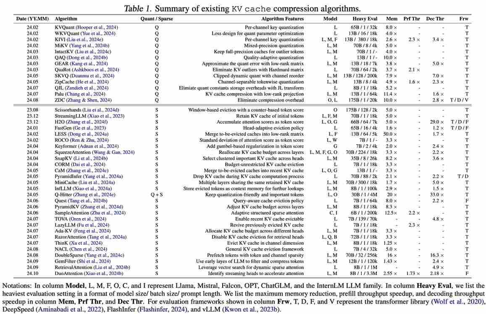

# Rethinking Key-Value Cache Compression Techniques for Large Language Model Serving

> **AI Agent 生成声明**：本 note 由 AI Agent（Hermes Agent）于 2026 年 6 月 5 日自动生成，基于论文全文阅读和分析。所有内容用中文撰写。生成工具：Nous Research Hermes Agent。

---

## 一句话总结

本文从实用部署角度重新审视 LLM 推理中 KV 缓存压缩技术，通过全面综述和实证评估揭示了现有方法在吞吐量、输出长度分布和负样本三个关键维度上的不足，并提供了辅助工具以促进 KV 缓存压缩在生产环境中的部署。

---

## 摘要翻译

KV 缓存压缩已成为优化大语言模型（LLM）服务的一种有前景的技术。它主要通过降低 KV 缓存的内存消耗来减少计算成本。尽管已有许多压缩算法被提出，但它们在生产环境中的应用仍然不普遍。本文从实用视角重新审视主流 KV 缓存压缩方案，贡献有三方面：

1. **全面综述**：系统回顾现有 KV 缓存压缩算法的算法设计和基准研究，识别出性能评估中缺失的关键维度，这些缺失可能阻碍其在实际中的采用。
2. **实证评估**：对代表性 KV 缓存压缩方法进行实证评估，揭示两个影响计算效率的关键问题：（1）压缩 KV 缓存虽能减少内存消耗，但当前实现（如 FlashAttention、PagedAttention）未针对生产级 LLM 服务进行优化，导致吞吐量性能次优；（2）压缩 KV 缓存可能导致更长的输出，从而增加端到端延迟。此外，通过分析个体样本（而非整体性能）的准确度，揭示了 KV 缓存压缩在处理特定 LLM 任务时的内在局限。
3. **工具集**：提供工具以促进未来 KV 缓存压缩研究及其在生产环境中的实际部署。工具已开源至 https://github.com/LLMkvsys/rethink-kv-compression。

---

## 研究动机

KV 缓存是 LLM 推理的主要性能瓶颈。以 LLaMA3-70B 为例，在 FP16 格式、批大小 512、提示长度 2048 的设置下，仅 KV 缓存就需要 512GB 存储空间。两大压缩策略：

- **量化方法**（Quantization）：将 KV 缓存转换为低精度表示（如 INT8），降低 GPU 内存使用，但可能影响准确度。
- **稀疏方法**（Sparsity）：通过淘汰不重要的 KV 对来减少内存占用，关键在于如何准确评估每个 token 的重要性。

**核心问题**：尽管压缩算法在学术研究中表现出色，但在生产环境中的实际部署仍存在重大挑战。现有评估存在三个关键缺失：

1. **吞吐量评估不足**：多数研究仅在朴素的 Transformers 库（TRL）中测量吞吐量，未考虑 FlashAttention 和 PagedAttention 等生产级服务技术，也未评估多 GPU 张量并行场景。
2. **响应长度分布被忽视**：压缩方法可能产生更长的响应，从而增加端到端延迟，但现有研究通常使用固定响应长度进行吞吐量评估。
3. **负样本分析缺失**：压缩方法在整体准确度下降微小的表象下，可能对特定样本造成严重性能退化，但现有研究缺乏对个体样本的深入分析。

---

## 方法（技术细节）

### 3.1 综合综述

论文系统总结了现有 KV 缓存压缩算法（Table 1，约 40+ 种方法），分为量化和稀疏两大类：

#### 量化方法
- **量化粒度**：从通道级（per-channel）到 token 级（per-token），如 KVQuant、KIVI、ZipCache 等
- **量化误差修正**：如 GEAR 使用低秩矩阵近似量化误差，QuaRot 使用 Hadamard 正交矩阵消除量化异常值
- **关键问题**：更细的量化粒度虽能保持准确度，但引入不规则计算模式，限制 GPU 资源利用率

#### 稀疏方法
- **压缩粒度**：token 级（Scissorhands、StreamingLLM）、层级（SqueezeAttention、PyramidKV）、head 级（SnapKV、Ada-KV）、通道级（ThinK）
- **淘汰策略**：重要性度量（注意力分数变体）、淘汰范围（局部窗口约束）、预算分配（动态层间/头间分配）
- **关键问题**：与 FlashAttention 和 PagedAttention 的兼容性差——FlashAttention 不保存注意力分数，稀疏方法需要额外的数据加载和计算步骤

#### 评估设置的缺失
- **缺失 1**：忽略生产级服务框架（FlashAttention、PagedAttention）和多 GPU 张量并行
- **缺失 2**：忽略压缩方法对响应长度分布的影响
- **缺失 3**：缺乏对个体样本（特别是长上下文任务）的准确度分析

### 3.2 实证评估

论文对 4 种代表性压缩方法进行了全面评估：
- **KIVI**（量化，4-bit，per-channel key + per-token value）
- **GEAR**（量化误差修正，低秩矩阵 + 稀疏矩阵）
- **H2O**（稀疏，动态淘汰，注意力分数累积）
- **StreamingLLM**（稀疏，保留首尾 token）

评估使用 LLaMA-7B/13B/70B 和 Mistral-7B，数据集包括 ShareGPT 和 LongBench，框架包括 TRL、FlashAttention 和 LMDeploy。

### 3.3 工具集

#### 吞吐量预测器（Throughput Predictor）
- 基于 Vidur 框架，离线 profile 注意力层在不同 batch size 和序列长度下的吞吐量
- 预测准确度 >85%（LLaMA-7B 各压缩方法均 85%+）

#### 长度预测器（Length Predictor）
- 基于 BERT 分类器，预测压缩算法在给定请求下产生的响应长度
- 预测准确度 >85%（LLaMA-3.1-8B-instruct）

#### 负样本评估器（Negative Sample Evaluator）
- 使用 10% 阈值定义负样本（即压缩后准确度下降超过阈值的样本）
- 构建了负样本基准数据集，用于评估现有和未来压缩方法

#### 请求路由器（Request Router）
- 结合吞吐量预测器和长度预测器，动态路由请求到最优 GPU
- 实现 1.45-1.80× 的端到端延迟加速

---

## 实验结果

### 吞吐量分析（Throughput Analysis）

**Observation 1**：TRL 上的吞吐量结果不可靠。在 batch size >4 且序列长度达 1024 时，StreamingLLM 相对 PagedAttention + FlashAttention 的加速不显著。

**Observation 2**：KV 缓存压缩在特定 batch size、序列长度和张量并行度场景下呈现负的计算效率提升。

- **Prefill 阶段**：KIVI 和 StreamingLLM 接近 FP16 基线；GEAR 和 H2O 持续降低预填充吞吐量
- **Decode 阶段**：小 batch size 和短 KV 长度时差异不大；重负载下稀疏方法保持优势，量化方法优势减弱（KIVI 甚至出现 OOM）
- **张量并行度影响**：更大的 TP 可削弱压缩带来的吞吐量优势

### 响应长度分布（Length Distribution Analysis）

**Observation 3**：有损压缩导致响应长度分布大幅变化，压缩方法倾向于产生更长的响应。

- 20%+ 的样本在压缩后响应长度增加 1.5× 以上
- 高压缩比加剧此问题（分布更加平坦）
- 压缩可能通过产生冗长输出来隐式补偿准确度损失

**Observation 4**：端到端延迟分析显示，压缩方法的实际收益有限。结合吞吐量和响应长度，性能提升不显著（GEAR 甚至导致更长的尾部延迟）。

### 负样本分析（Negative Sample Analysis）

**Observation 5**：KV 缓存压缩算法天然存在负样本。即使整体准确度下降微小，也有大量样本受到严重性能影响。通过算法集成可减少负样本数量，但难以完全消除。

**Observation 6**：不同类型任务对 KV 缓存压缩的敏感度不同。**摘要（Summarization）和问答（QA）任务**受影响最大，因为它们高度依赖上下文信息。负样本分布：
- KIVI：66.7% 摘要 + 11.5% QA
- GEAR：73.0% 摘要 + 10.5% QA
- H2O：54.6% 摘要 + 22.8% QA
- StreamingLLM：43.0% 摘要 + 32.6% QA

### 负样本基准测试

在 LongBench 上的负样本基准测试结果：

| 任务类型 | Baseline | KIVI | GEAR | H2O | Stream |
|---------|----------|------|------|-----|--------|
| 摘要 | 31.6 | 24.8 | 23.7 | 24.7 | 24.3 |
| 问答 | 52.0 | 28.8 | 28.7 | 33.8 | 30.4 |
| 代码 | 97.0 | 30.0 | 30.0 | 57.2 | 61.3 |

### 请求路由器效果

| 策略 | FP16 | KIVI | GEAR | H2O | Stream |
|------|------|------|------|-----|--------|
| Baseline | 11.4 | 9.1 | 13.4 | 10.6 | 10.3 |
| w/ Throughput | - | 7.7 | 9.1 | 8.3 | 8.2 |
| w/ Both | - | 6.3 | 7.4 | 6.9 | 6.6 |

---

## 优势

1. **全面系统**：对 40+ 种 KV 缓存压缩算法进行了系统性综述，涵盖量化和稀疏两大类，提供了统一的评估框架。
2. **实践导向**：从生产部署角度出发，揭示了现有研究在吞吐量、响应长度和负样本三个关键维度的缺失。
3. **深入实证**：不局限于整体性能指标，深入分析了个体样本的准确度退化问题，发现负样本的存在。
4. **工具实用**：提供了吞吐量预测器、长度预测器和负样本评估器等工具，实用性强，且开源。
5. **多维度评估**：同时评估了端到端延迟、响应长度分布和负样本，比仅评估吞吐量更全面。
6. **多模型/多框架验证**：在 LLaMA-7B/13B/70B 和 Mistral-7B 上，在 TRL、FlashAttention 和 LMDeploy 上进行了验证。

---

## 局限

1. **评估模型有限**：仅在 LLaMA 和 Mistral 家族上进行了评估，未覆盖其他 LLM 家族（如 OPT、ChatGLM、InternLM 等）。
2. **压缩方法覆盖有限**：实证评估仅选择了 4 种代表性方法（KIVI、GEAR、H2O、StreamingLLM），未覆盖 SnapKV、DoubleSparse 等较新方法。
3. **硬件环境有限**：主要在 A6000 GPU 上评估，仅部分实验使用 H800，未涵盖更多 GPU 类型。
4. **负样本分析深度有限**：虽然识别了负样本的存在，但未提供足够的解决方案来完全消除负样本。
5. **压缩率与准确度的权衡**：对不同压缩率下准确度退化的系统分析可以更深入。
6. **实际生产验证不足**：虽提到生产环境部署，但工具的实际生产验证（如在真实在线服务中的效果）尚未充分展示。
7. **预测器准确度可提升**：吞吐量预测器和长度预测器的准确度虽 >85%，但仍有提升空间。

---

## 与 EfficientPaper 相关的研究方向

1. **KV 缓存管理**：与 PagedAttention 等内存管理技术的集成优化，减少 KV 缓存内存碎片。
2. **稀疏注意力机制**：探索更高效的注意力稀疏化方法，如基于查询感知的稀疏策略（Quest）。
3. **量化与稀疏结合**：如 Q-Hitter 将量化与稀疏结合，可进一步探索统一框架。
4. **端到端延迟优化**：将响应长度分布纳入性能评估，避免仅关注吞吐量。
5. **负样本缓解**：开发任务特定的 KV 缓存压缩技术，或使用轻量模型预测任务类型以选择合适压缩策略。
6. **预测器与路由器**：利用吞吐量预测器和长度预测器构建智能请求路由系统，提升生产环境效率。
7. **长上下文处理**：针对长上下文任务的 KV 缓存压缩优化，因为这些任务对压缩最为敏感。
8. **多 GPU 场景**：张量并行下 KV 缓存压缩的性能优化，避免压缩优势被稀释。

---

## 关键词

KV 缓存管理、稀疏剪枝、注意力稀疏、综述、LLM 推理优化、吞吐量预测、响应长度预测、负样本分析
