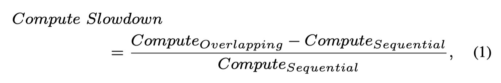

# Characterizing Compute-Communication Overlap in GPU-Accelerated Distributed Deep Learning: Performance and Power Implications

> Seonho Lee, Jihwan Oh, Junkyum Kim, Seokjin Go, Jongse Park, Divya Mahajan



> ⚠️ 本 note 由 AI Agent 自动生成（Hermes Agent, 2025 年 6 月），基于论文全文内容撰写，仅供参考。

---

## 一句话总结

本文系统性地表征了 GPU 加速分布式深度学习中计算-通信重叠（overlap）对性能和功耗的影响，发现当前"激进重叠"的共识存在缺陷——重叠虽然能隐藏通信开销，但会导致计算核慢 18.9%（最高 40%）和功耗增加，尤其在大模型和严格功耗限制下问题更加严重。

---

## 摘要翻译

本文对 GPU 加速系统进行了深入的表征研究，旨在理解分布式训练中计算与通信重叠（overlap）的相互作用。由于模型规模庞大，跨多设备的分布式训练是必须的。重叠策略通过使计算和通信并发执行，对于缓解通信瓶颈和最大化 GPU 利用率至关重要。然而，当前共识认为应始终且激进地进行计算-通信重叠以缓解分布式开销。通过系统评估最先进的 GPU（包括 NVIDIA H100、A100 和 AMD MI250、MI210），本研究考察了数值精度、专用核心和功耗限制等硬件特性对分布式训练工作负载的影响。

综合实验表明，计算-通信重叠可导致平均 18.9%（最高 40.0%）的计算减速。相比之下，顺序执行（计算和通信不重叠）平均比重叠执行慢 10.2%（最高慢 26.6%）。虽然专用数据通路和优化数值精度可以缓解部分减速，但重叠执行在特定配置下会导致资源争夺并增加功耗。分析还揭示了功耗和频率限制带来的权衡，强调了平衡策略对优化能效和训练吞吐量的重要性。

---

## 研究动机

1. **大模型分布式训练的需求**：随着 GPT、LLaMA 等模型规模超过数十亿参数，分布式训练是必需的，通信开销随模型规模线性增长。
2. **现有共识的质疑**：当前分布式训练框架（如 DeepSpeed、ZeRO、PipeDream）普遍假设应激进地进行计算-通信重叠，但忽略了重叠带来的动态相互作用——计算和通信会争夺 GPU 资源，导致计算减速和功耗增加。
3. **缺乏系统性表征**：现有工作很少系统地分析重叠对性能和功耗的影响，尤其是在不同 GPU、并行策略和模型规模下的差异。
4. **研究空白**：虽然 Domino、Lancet、Tutel 等工作提出了更激进的重叠策略，但均未分析重叠导致的减速和功耗影响。

---

## 方法（技术细节）

### 评估硬件
- **NVIDIA GPU**：H100（80GB HBM3，NVLink 900GB/s）、A100（40GB HBM2e，NVLink 600GB/s）
- **AMD GPU**：MI250（128GB HBM2e，Infinity Fabric 300GB/s）、MI210（64GB HBM2e，Infinity Fabric 300GB/s）
- 仅评估单节点训练（避免节点间通信干扰）

### 软件框架
- PyTorch 2.4，NVIDIA 用 CUDA 12.4 + NCCL，AMD 用 ROCm 6.2 + RCCL
- 分布式并行策略：DeepSpeed（FSDP）、Megatron-LM（Pipeline Parallelism）
- Profiling 工具：PyTorch Profiler、torch.cuda.event API、NVML（NVIDIA）、AMD-SMI

### 工作负载
- **GPT-3**：XL (1.3B)、2.7B、6.7B、13B
- **LLaMA 2**：13B
- 所有实验取 25 次平均

### 核心指标
1. **计算减速（Compute Slowdown）**：
   ```
   Slowdown = (ComputeOverlapping - ComputeSequential) / ComputeSequential
   ```
2. **重叠计算比例**：
   ```
   Overlapped = ComputeTimeOverlapped / ComputeTimeOverlap
   ```
3. **端到端训练延迟**：分三种场景比较
   - **理想执行（E2E_Ideal）**：计算和通信完全独立，无资源争夺
   - **重叠执行（E2E_Overlapping）**：实际重叠执行
   - **顺序执行（E2E_Sequential）**：计算和通信串行
4. **功耗**：平均功耗和峰值功耗

### 实验设计
- 先测量 FP16 训练的基线性能和功耗
- 再通过消融实验（ablation）隔离不同因素的影响：
  - 功耗限制（Power Capping）
  - 数值精度（FP16 vs FP32）
  - 专用数据通路（Tensor Core vs 通用计算）

---

## 实验结果

### 性能减速分析

| 观察维度 | 关键发现 |
|---------|---------|
| **并行策略** | FSDP 重叠比例高达 42%，但减速更大（MI210 平均 11.3%，最高 23%）；Pipeline 并行减速较小 |
| **GPU 差异** | H100 减速范围 2.3%~7.25%（峰值 19.2%）；A100 最高仅 4.3%（受 40GB 显存限制，只能跑小模型） |
| **批量大小** | FSDP：大 batch → 减速降低（计算增量 > 通信增量）；Pipeline：大 batch → 减速增加 |
| **模型规模** | GPT-3 XL（小模型）减速约 5%；GPT-3 13B/LLaMA 13B（大模型）减速接近 40% |
| **端到端** | 重叠执行优于顺序执行，但仍有显著差距（如 MI250 + GPT-3 13B，重叠比理想慢 45%） |

### 功耗分析

- **H100**：小工作负载占 TDP 的 38%，大模型峰值达 140% TDP
- 重叠场景峰值功耗比非重叠高 **25%**
- **功耗限制**（Power Cap）：在 100W 限制下，重叠执行减速高达 **100%**
- 时序分析（MI250 + LLaMA2 13B）：重叠期间出现显著功耗尖峰

### 数值精度和专用核心

- **FP16 vs FP32**：小模型 FP16 有效降低功耗（1.2x TDP → 0.5x TDP）；大模型 FP16 重叠比例更高，功耗和减速反而增加
- **Tensor Core**：小模型用 Tensor Core 降低峰值功耗（1.2x → 1.0x TDP）；大模型资源争夺加剧（如 GPT-3 6.7B + batch 16，减速从 4.3% → 7.3%，功耗从 0.95x → 1.42x TDP）

---

## 优势

1. **系统性表征**：首次跨 NVIDIA（H100、A100）和 AMD（MI250、MI210）四大 GPU，系统性地量化了计算-通信重叠的性能和功耗影响。
2. **多维度分析**：涵盖 FSDP 和 Pipeline 并行、多种模型规模（1.3B-13B）、多种批量大小、功耗限制、数值精度等。
3. **理想执行基线**：引入"理想执行"概念，量化了重叠执行与无竞争理想情况之间的差距，为评估重叠效果提供了新的评估框架。
4. **功耗-性能权衡的深入分析**：揭示了功耗限制与重叠执行之间的非线性交互（100W 限制下减速高达 100%）。
5. **实践指导意义**：对分布式训练框架的设计者提供了平衡重叠策略和资源竞争的实证基础。

---

## 局限

1. **仅限单节点**：实验只在单节点内（节点间 NVLink/Infinity Fabric）进行，未涉及跨节点训练场景（如 InfiniBand 互联）。
2. **工作负载范围有限**：仅测试了 GPT-3 和 LLaMA 2，未涵盖其他架构（如 MoE、扩散模型）。
3. **模型规模上限为 13B**：未测试更大的模型（如 70B+），而大模型的通信-计算重叠问题可能更为严重。
4. **未提出改进方案**：本文主要是表征性研究，未提出具体的优化策略或框架来解决重叠导致的减速和功耗问题。
5. **功耗测量精度差异**：NVIDIA（100ms 粒度）和 AMD（1ms/20ms 粒度）的功耗测量粒度不一致，可能影响跨平台比较的准确性。
6. **未考虑动态调度**：实验中未测试自适应重叠策略（如根据实时资源状态动态调整重叠比例）。

---

## 与 EfficientPaper 相关的研究方向

1. **高效并行策略优化**：基于本文发现，可设计自适应重叠策略，在通信开销和资源竞争之间动态权衡，如根据模型规模和硬件特性选择最优重叠比例。
2. **功耗感知训练框架**：结合功耗限制分析，开发功耗感知的分布式训练调度器（如 POLCA、SplitWise 的延伸），在功耗约束下最大化训练吞吐量。
3. **硬件-软件协同设计**：利用本文对专用数据通路（Tensor Core）和数值精度的分析，设计更高效的 GPU 架构（如针对重叠场景优化内存带宽分配）。
4. **梯度压缩与通信优化**：本文揭示了通信重叠的代价，可结合梯度压缩、稀疏通信等技术减少通信量，从而降低重叠的性能和功耗开销。
5. **大规模模型训练的资源管理**：对于 70B+ 级别模型，重叠的资源竞争可能更严重，需要新的调度和资源分配策略。
6. **跨平台异构训练**：本文比较了 NVIDIA 和 AMD GPU 的差异，可进一步研究异构 GPU 集群中的重叠策略优化。
7. **能效优化（Energy Efficiency）**：结合本文的功耗分析，可开发训练时的动态功耗管理策略（如 EvnPipe、Zeus 的延伸），在能效和性能之间取得平衡。

---

## 关键 Takeaways

1. **Takeaway 1**：依赖复杂通信集合（如 all-gather、reduce-scatter）的并行策略需要更大的重叠来隐藏通信延迟，但反过来表现出更大的减速。
2. **Takeaway 2**：更大的内存占用和模型复杂度对资源竞争和性能退化有叠加效应。
3. **Takeaway 3**：重叠有效隐藏通信开销并提升训练吞吐量，但计算核的减速限制了其全部潜力。
4. **Takeaway 4**：计算-通信重叠增加峰值功耗，加剧资源竞争，进一步加剧性能减速。
5. **Takeaway 5**：功耗限制导致资源竞争，造成重叠执行的减速。
6. **Takeaway 6**：重叠执行增加功耗并加剧资源竞争，尤其当 GPU 运行在接近或超过 TDP 限制时。
7. **Takeaway 7**：低精度和专用数据通路虽然提升效率，但也加剧了大工作负载下的资源竞争。

---

*Generated by Hermes Agent (AI Agent). All content in Chinese. Date: 2025-06-05.*
