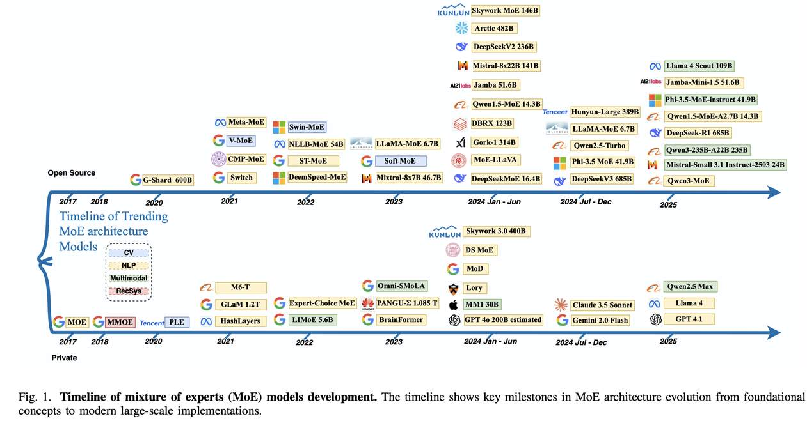

# Mixture of Experts in Large Language Models

> Danyang Zhang, Junhao Song, Ziqian Bi, Yingfang Yuan, Tianyang Wang, Joe Yeong, Junfeng Hao

---

> **⚠️ 生成声明：** 本笔记由 AI Agent（Hermes Agent）自动生成，基于对论文全文的阅读和分析。内容可能存在偏差，请以原文为准。

---

## 一句话总结

本文是一篇关于大语言模型中混合专家（Mixture-of-Experts, MoE）架构的综合性综述，系统梳理了 MoE 从理论基础、核心架构设计到 NLP/视觉/多模态/医疗等领域的应用，以及元学习、知识迁移、评估方法和未来方向等关键问题。

---

## 摘要翻译

本文对大语言模型中的混合专家（MoE）架构进行了全面综述，重点强调了 MoE 在显著提升模型性能的同时保持最小计算开销的能力。通过对理论基础、核心架构设计和大语言模型（LLM）应用的系统分析，我们考察了专家门控与路由机制、层级式和稀疏 MoE 配置、元学习方法、多模态和多任务学习场景、真实世界部署案例以及深度学习中的最新进展与挑战。我们的分析识别了 MoE 的关键优势，包括相比等价贝叶斯方法的优越模型容量、改进的任务特定性能以及高效扩展模型容量的能力。我们还强调了确保专家多样性、准确校准和可靠推理聚合的重要性，因为这些对于最大化 MoE 架构的有效性至关重要。最后，本综述概述了当前的研究局限、开放挑战和有前景的未来方向，为 MoE 架构及其应用的持续创新奠定了基础。

---

## 研究动机

- **计算效率瓶颈**：随着 Transformer 架构模型容量的爆炸式增长，模型参数量线性增长导致 FLOPs 和能耗呈指数增长，在实际部署中难以持续。
- **稀疏计算的兴起**：MoE 通过条件激活一小部分参数（通常为少量专门化专家模块），将推理成本与总模型规模解耦，成为高效的扩展路径。
- **从概念到生产的演进**：MoE 从 2020 年 GShard（600B 参数）开始进入大规模部署阶段，经过 Switch Transformer、GLaM、Mixtral、DeepSeek-V3 等模型的迭代，已成为现代基础模型的核心组件。
- **多领域泛化需求**：MoE 从 NLP 扩展到视觉、多模态、推荐系统、医疗健康等领域，需要系统性的综述来整合当前进展。

---

## 方法（技术细节）

### 1. 核心 MoE 架构与路由机制

- **稀疏激活**：每个 MoE 层包含 N 个专家 {E₁,...,Eₙ} 和一个门控函数 G(x)，为每个输入选择 k ≪ N 个专家。输出为加权组合：`y = Σ gᵢ(x)Eᵢ(x)`。
- **Noisy Top-k 路由**：在专家得分上添加高斯噪声后选 top-k，促进探索、防止早期专家坍缩：`H(x)ᵢ = (x·Wg)ᵢ + N(0,1)·Softplus((x·Wn)ᵢ)`。
- **负载均衡损失**：`L_balance = α Σ fᵢ·Pᵢ`，其中 fᵢ 是分配给专家 i 的 token 比例，Pᵢ 是其平均门控概率，鼓励均匀负载分布。
- **Token Choice vs. Expert Choice**：Token Choice 为每个 token 选择 top-k 专家；Expert Choice 让每个专家从输入序列中选择其处理的 token 子集，后者在视觉任务中改善了专家利用率和一致性。

### 2. 高级架构变体

- **正交 MoE（OMoE）**：通过正交性约束 `L_orth = Σᵢ≠ⱼ ⟨Wᵢ,Wⱼ⟩²` 促进专家多样化。
- **互蒸馏（MoDE）**：通过最小化专家间 KL 散度实现知识共享：`L_distill = Σᵢ Σⱼ≠ᵢ KL(Eᵢ(x)‖Eⱼ(x))`。
- **参数高效调优**：如 MoCE-IR、Adamix，冻结共享层、仅更新专家头或低秩适配器，<1% 参数更新即可达到接近全量微调的性能。
- **层级 MoE（HMoE）**：两级门控——粗粒度门控选择超级专家组，细粒度门控在组内路由，支持大规模专家池。
- **异构与自适应专家**：每个专家具有独立的计算配置 ϕᵢ（深度、宽度、模态），门控函数结合专家得分和计算成本：`g(x) = arg maxᵢ [Sᵢ(x) − λ·Cost(ϕᵢ)]`。
- **HyperMoE**：利用未激活专家的隐藏状态生成轻量调制信号，注入活跃专家的输出路径，实现隐式专家协作。

### 3. 元学习与知识迁移

- **元 MoE 框架**：优化路由策略 θ 跨任务分布 T，实现快速适应未见任务：`θ_Tnew = θ − η∇θ L_support(θ)`。
- **MixER**：引入额外上下文向量 ξ 与输入 x 共同路由，通过 K-means 目标进行离散专家选择，避免 softmax 软选择的开销。
- **Meta-DMoE**：将测试时自适应形式化为元蒸馏问题，通过 transformer 聚合器 A 组合领域特定专家输出，蒸馏到轻量学生模型。
- **稀疏到稠密知识集成**：多教师蒸馏策略，Top-K 知识集成和 SVD 知识集成，在 ImageNet 上保留 61.7% MoE 优势（78.4% top-1），推理加速 3.7×。

### 4. 应用领域

- **推荐系统与搜索**：M3oE、AESM2 等模型通过分层门控设计实现跨领域异构建模。
- **多模态与多任务**：Omni-SMoLA（低秩专家）、T-REX2（双模态提示）、HyperMoE（超网络调制）等。
- **医疗健康**：Med-MoE、BiMediX、AT-MoE 等，强调准确性、模块化和可解释性。
- **计算机视觉**：MoCaE（校准融合）、Deep-MoE（层级空间/语义专家）、注意力门控 + 熵最小化正则化等。
- **NLP 与 LLM**：PEFT MoE（<1% 参数更新）、MoDE 工具包（模块化领域组合）、MoE 假设构造理论。

### 5. 评估框架

- **LibMoE**：模块化评估框架，覆盖 MoE 算法全生命周期。关键发现：不同 MoE 算法在广泛任务上达到相似平均性能。
- **MoE-CAP**：三元评估范式（模型精度、应用性能、部署成本），通过 CAP 雷达图支持系统级比较。
- **MoCaE**：通过校准每个专家输出提升预测融合可靠性，COCO 上提升 2.5 AP。

---

## 实验结果

### 关键实验发现

- **大规模 MoE 与稠密模型对比**：MoE 模型在语言任务上达到与稠密模型相当的性能，同时每个 token 激活的参数少约 10 倍。
- **OneS（稠密学生模型）**：在 ImageNet 上保留 61.7% MoE 优势（78.4% top-1），NLP 数据集上获得 88.2% MoE 优势，推理加速 3.7×。
- **LibMoE 基准测试**：对 5 种 SOTA MoE 算法在 3 种 LLM 和 11 个数据集上进行零样本评估，发现所有算法在广泛任务上达到相似平均性能——MoE 算法选择可能不如先前假设的关键。
- **MoCaE**：在 COCO 目标检测上提升 2.5 AP。
- **LoRA-MoE**：<1% 参数更新即可达到接近全量微调的性能，适用于计算受限环境。
- **AESM2**：在动态交通分布下持续提升检索质量和训练稳定性，优于静态多门 MoE 变体。
- **专家坍缩问题**：实证研究显示专家常收敛到几乎相同的表示，相似度超过 99%，即使在高性能配置中也出现。
- **随机路由的挑战**：冻结随机初始化路由器在多个基准上可与学习路由策略表现相当，质疑了自适应路由的必要性。

---

## 优势

1. **高效扩展**：通过稀疏激活，MoE 可以在保持计算效率的同时显著扩展模型容量。
2. **模块化设计**：专家可以专注于不同领域、语言模式或模态，提高泛化和鲁棒性。
3. **跨领域适用性**：从 NLP 到视觉、多模态、推荐系统、医疗健康，MoE 架构展现了广泛的适用性。
4. **参数高效调优**：LoRA-MoE 等方法实现 <1% 参数更新的高效微调。
5. **丰富的架构变体**：从基础的 Top-k 路由到层级、正交、异构、自适应等多样化的架构选择。
6. **系统级支持**：DeepSpeed-MoE、LibMoE 等平台提供了从训练到评估的完整工具链。
7. **理论基础**：相比贝叶斯集成，MoE 模型在某些条件下展现出更高的功能容量。
8. **渐进式部署**：从 GShard（2020）到 DeepSeek-V3（2024），MoE 从研究原型演进为生产就绪的骨干架构。

---

## 局限

1. **专家坍缩**：专家常收敛到几乎相同的表示（相似度 >99%），削弱了"分而治之"的设计原则。
2. **路由不稳定性**：路由算法的设计仍是技术上最具挑战的方面之一，过度自信的门控可能坍缩到少数主导专家。
3. **部署障碍**：稀疏激活引入不规则内存访问模式和频繁的跨设备通信，导致推理延迟和硬件利用率不足。
4. **理论基础不足**：现有设计大多依赖实验启发式而非原则性模型，专家多样性与泛化能力之间的关系尚未明确。
5. **共享层的负面影响**：共享层在某些配置下可能降低性能，因专家学习到冗余或冲突的表示。
6. **动态专家扩展困难**：增量学习场景中新增专家可能导致不一致输出和训练不稳定。
7. **评估方法缺失**：传统 LLM 评估基准（如 LLM-Perf、MLPerf、Mmbench）不适合评估 MoE 模型，缺乏标准化评估框架。
8. **计算开销与调度**：路由的随机性导致批次不稳定、工作负载碎片化和可重复性差，尤其在低延迟或内存受限环境中。

---

## 与 EfficientPaper 相关的研究方向

本论文属于 EfficientPaper 中的 **structure_design（结构设计）** 和 **survey（综述）** 两大研究方向，涵盖以下高效 AI 相关主题：

### 直接相关
- **稀疏计算与条件激活**：MoE 的核心是通过条件激活少量参数实现高效推理，是高效 AI 的关键范式。
- **参数高效微调（PEFT）**：LoRA-MoE、Adamix 等方法实现了 <1% 参数更新的高效微调。
- **模型压缩与知识蒸馏**：稀疏到稠密的知识迁移、互蒸馏等技术。
- **高效路由与负载均衡**：Noisy Top-k、Expert Choice、层级路由等机制。

### 潜在相关
- **模型缩放定律**：联合 MoE 缩放定律表明 MoE 可以在内存效率上超越稠密模型。
- **自适应计算**：自适应专家选择（根据输入复杂度动态调整激活专家数）。
- **持续学习与灾难性遗忘**：动态路由帮助保留旧知识、缓解灾难性遗忘。
- **多模态高效推理**：Omni-SMoLA、T-REX2 等多模态 MoE 模型。
- **硬件感知优化**：Pre-gated MoE、DeepSpeed-MoE 等系统级优化。
- **联邦 MoE**：联邦学习与 MoE 的结合，未来方向之一。
- **自动化专家设计**：通过强化学习指导专家选择和路由策略。
- **终身模块化**：持续学习与模块化 MoE 的结合。

### 重要关键词
`structure_design`, `survey`, `mixture_of_experts`, `sparse_activation`, `efficient_inference`, `parameter_efficient_finetuning`, `knowledge_distillation`, `scaling_law`, `adaptive_computation`, `multimodal`
