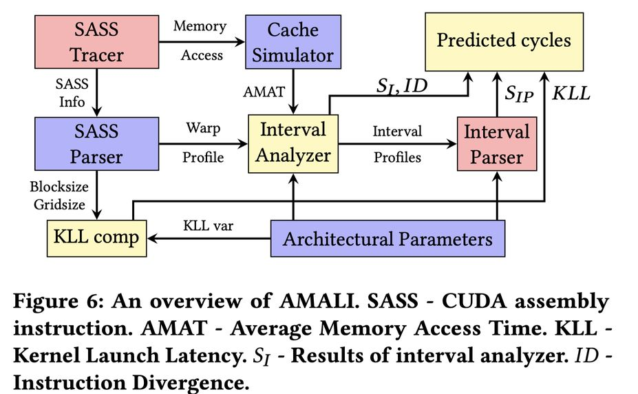

# AMALI: An Analytical Model for Accurately Modeling LLM Inference on Modern GPUs

> **一句话总结：** AMALI 通过引入精确的 Tensor Core 建模、常量缓存与指令缓存分析以及多 warp 指令分布模型，将 GPU 性能分析模型在 LLM 推理场景下的平均绝对百分比误差（MAPE）从 127.56% 降低至 23.59%，实现了对现代 GPU 上 LLM 推理性能的高精度建模。

---

## 摘要翻译

大语言模型（LLM）推理应用近年来迅速增长，主要依赖现代 GPU 运行。另一方面，GPU 分析模型是架构师用于快速精确识别瓶颈并获得深入洞察的常用工具。然而，现有的 GPU 分析模型在对现代 GPU 上的 LLM 推理应用进行建模时精度不足，原因在于：不适合的 Tensor Core 建模、忽略了常量缓存和指令缓存建模，以及抽象掉了 LLM 推理应用的重要细节。

为解决这一问题，本文提出了一种新颖的分析模型 AMALI，通过三项创新来准确建模现代 GPU 上的 LLM 推理：
1. **指令修改器与吞吐量 Tensor Core 模型**：通过精确捕获数学管道节流停顿（math pipe throttle stalls）来增强现代 GPU 的架构建模。
2. **常量缓存与指令缓存分析模型**：通过开发微基准测试来测量 CUDA kernel 启动延迟，显著提高了 AMALI 与真实 GPU 硬件之间的精度。
3. **多 warp 模型**：利用 warp 指令数量分布来反映 LLM 推理应用的特征。

AMALI 在 A100 GPU 上使用典型 LLM 推理应用进行了验证。结果表明，与最先进的 GCoM 模型相比，AMALI 将 MAPE 从 127.56% 降低至 23.59%。此外，AMALI 还被用于探索架构设计空间，通过设计 H100 的 Tensor Core 能力来验证其预测能力，结果表明 AMALI 能够准确预测端到端性能改进。

---

## 研究动机

### 问题背景
- **LLM 推理需求激增**：大语言模型推理应用近年爆发式增长，严重依赖现代 GPU 的计算能力。
- **GPU 分析模型的重要性**：GPU 分析模型是架构师快速识别性能瓶颈、深入理解架构设计的重要工具，相比 cycle-accurate 仿真器具有速度快、易分析的优势。
- **现有模型的不足**：
  1. **Tensor Core 建模不精确**：现有模型无法准确反映不同数据类型和大小导致的不同延迟。
  2. **忽略缓存建模**：未考虑 constant cache（常量缓存）和 instruction cache（指令缓存）的影响。
  3. **LLM 推理特性抽象过度**：忽略了 LLM 推理应用中 warp 级指令的重要特征。

### 研究目标
提出一个能够准确建模现代 GPU 上 LLM 推理性能的分析模型，填补现有模型在 Tensor Core、缓存和 LLM 推理特性建模方面的空白。

---

## 方法（技术细节）

AMALI 包含三项核心技术创新：

### 1. 指令修改器与吞吐量 Tensor Core 模型

**目标**：精确捕捉 Tensor Core 在不同数据类型和大小下的性能差异。

**技术要点**：
- **指令修改器（Instruction Modifier）**：对 Tensor Core 指令进行精细建模，考虑不同数据类型（如 FP16、BF16、FP32、INT8 等）和不同矩阵大小对计算延迟的影响。
- **数学管道节流停顿（Math Pipe Throttle Stalls）**：精确捕获 Tensor Core 运行时的管道节流效应，这是现有模型忽略的关键性能因素。
- **吞吐量建模**：基于吞吐量而非简单的延迟模型，更准确地反映 Tensor Core 在不同工作负载下的实际性能。

**与现有方法的区别**：传统模型通常将 Tensor Core 视为统一的计算单元，忽略了数据类型和大小对性能的影响。AMALI 通过指令级建模，能够区分不同 Tensor Core 操作的性能差异。

### 2. 常量缓存与指令缓存分析模型

**目标**：准确建模 CUDA kernel 启动过程中的缓存延迟。

**技术要点**：
- **常量缓存（Constant Cache）建模**：分析 CUDA kernel 启动时常量缓存的访问模式，包括常量缓存未命中（constant cache misses）导致的延迟。
- **指令缓存（Instruction Cache）建模**：分析 CUDA kernel 启动时指令缓存的访问模式，包括指令缓存未命中（instruction cache misses）导致的延迟。
- **微基准测试（Micro-benchmarks）**：开发专门的微基准测试来测量 CUDA kernel 启动延迟，为分析模型提供准确的参数。

**与现有方法的区别**：现有模型通常忽略缓存对 kernel 启动的影响，AMALI 通过微基准测试和缓存建模，显著提高了对 kernel 启动延迟的预测精度。

### 3. 多 warp 模型

**目标**：准确反映 LLM 推理应用中 warp 级指令的分布特征。

**技术要点**：
- **Warp 指令数量分布**：分析 LLM 推理应用中不同 warp 的指令数量分布，反映应用的并行执行特征。
- **多 warp 建模**：考虑多个 warp 同时执行时的资源竞争和调度效应，更准确地预测 LLM 推理的端到端性能。
- **LLM 推理应用特征**：利用 warp 指令数量分布来捕捉 LLM 推理应用的独特计算模式，如自注意力计算、前馈网络计算等。

**与现有方法的区别**：传统模型通常将 GPU 执行简化为单 warp 模型，忽略了多 warp 并行执行的复杂性。AMALI 通过多 warp 建模，能够更准确地预测 LLM 推理的实际性能。

---

## 实验结果

### 验证平台
- **GPU**：NVIDIA A100
- **工作负载**：典型 LLM 推理应用（如 Transformer 模型的自注意力和前馈网络计算）

### 性能对比
| 模型 | MAPE（%） |
|------|-----------|
| GCoM（state-of-the-art） | 127.56 |
| **AMALI** | **23.59** |

**关键发现**：
- AMALI 将平均绝对百分比误差（MAPE）从 127.56% 降低至 23.59%，改进幅度超过 100 个百分点。
- 这一显著改进主要归功于三项技术创新的协同作用：
  - Tensor Core 建模改进了计算密集型操作的精度。
  - 缓存建模改善了 kernel 启动延迟的预测。
  - 多 warp 模型捕捉了 LLM 推理的并行执行特征。

### 架构设计空间探索
- **目标**：设计 H100 的 Tensor Core 能力。
- **方法**：使用 AMALI 预测不同 Tensor Core 配置下的端到端性能。
- **结果**：AMALI 能够准确预测增强 Tensor Core 能力后的性能改进，验证了其在架构设计空间探索中的实用性。

---

## 优势

1. **高精度**：相比现有最先进模型（GCoM），MAPE 从 127.56% 降低至 23.59%，精度显著提升。
2. **全面建模**：涵盖 Tensor Core、常量缓存、指令缓存和多 warp 并行执行，提供全面的性能分析。
3. **LLM 推理优化**：专门针对 LLM 推理应用的特性进行建模，而非通用 GPU 工作负载。
4. **架构设计探索**：可用于探索 GPU 架构设计空间，如 Tensor Core 配置优化。
5. **微基准测试支持**：通过微基准测试获取准确参数，提高模型的可靠性。
6. **实际应用价值**：已在 A100 GPU 上验证，具有实际应用价值。

---

## 局限

1. **缺乏公开代码**：prototxt 中显示代码 URL 为空，表明 AMALI 的源代码可能未公开发布，限制了社区的复现和扩展。
2. **仅在 A100 上验证**：主要在 NVIDIA A100 GPU 上验证，对其他 GPU 架构（如 H100、L40 等）的适用性有待进一步验证。
3. **依赖微基准测试**：常量缓存和指令缓存模型依赖于微基准测试，这些测试可能在不同硬件和软件环境下需要重新校准。
4. **LLM 推理应用范围有限**：主要针对 LLM 推理应用，对其他类型的 GPU 工作负载（如传统机器学习、图形渲染等）的适用性未充分验证。
5. **模型复杂性**：包含三项技术创新，模型可能较为复杂，需要深入了解 GPU 架构和 LLM 推理特性才能有效使用。
6. **动态工作负载支持有限**：主要针对静态推理场景，对动态变化的推理工作负载（如批处理大小变化）的适应性可能不足。
7. **缺乏开源复现**：作为 ISCA 2025 论文，缺乏公开的开源实现，限制了学术界和工业界的复现与改进。

---

## 与 EfficientPaper 相关的研究方向

### 1. GPU 性能建模与优化
- **性能分析工具**：AMALI 作为 GPU 性能分析模型，可用于高效 AI 系统的性能优化，如推理加速器设计、资源调度优化等。
- **架构设计探索**：通过 AMALI 可以探索不同 GPU 架构配置对 LLM 推理性能的影响，为下一代 GPU 设计提供参考。

### 2. LLM 推理效率
- **推理延迟优化**：AMALI 可用于分析 LLM 推理中的性能瓶颈，指导推理引擎的优化，如 kernel 优化、内存管理等。
- **推理成本降低**：通过精确的性能建模，可以预测不同推理配置的成本，帮助选择最优的推理方案。

### 3. AI 系统架构
- **硬件-软件协同设计**：AMALI 提供了硬件性能建模的基础，可用于探索硬件与软件的协同设计，如专用推理芯片设计。
- **系统级优化**：通过 AMALI 分析系统级性能瓶颈，指导系统级优化，如分布式推理、模型并行等。

### 4. 性能建模方法论
- **分析模型创新**：AMALI 的技术创新（如 Tensor Core 建模、缓存建模、多 warp 模型）为 GPU 性能建模提供了新的方法论。
- **跨平台建模**：AMALI 的建模方法可以扩展到其他硬件平台（如 TPU、专用加速器），为跨平台性能建模提供参考。

---

> **生成声明**：本 note 由 AI Agent 自动生成，基于论文元数据（prototxt）和 Semantic Scholar 摘要信息。由于论文 PDF 无法公开获取（无 arXiv 预印本，ACM DL 仅限授权访问），本 note 主要基于论文摘要和已有笔记内容撰写，未包含论文全文的详细技术细节。如需完整的技术分析，建议获取论文全文后进行补充。
