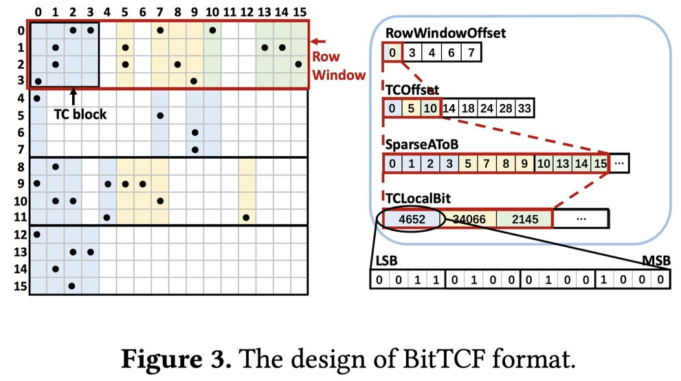

# Acc-SpMM: Accelerating General-purpose Sparse Matrix-Matrix Multiplication with GPU Tensor Cores

> **⚠️ 生成声明：本 note 由 AI Agent 自动生成，基于 arXiv 论文 2501.09251v1 的全文内容撰写。**

## 一句话总结

Acc-SpMM 通过数据亲和性重排序、内存高效压缩格式（BitTCF）、高吞吐流水线和自适应稀疏感知负载均衡四大技术，系统性地优化了基于 Tensor Core 的稀疏矩阵-矩阵乘法（SpMM），在 RTX 4090 上实现平均 2.52×（最高 5.11×）加速。

## 摘要翻译

通用稀疏矩阵-矩阵乘法（SpMM）是科学计算和深度学习中的基础计算核。随着 Tensor Core（TC）等新型矩阵计算单元的出现，SpMM 加速有了更多机遇。然而，要充分释放硬件性能，需要系统性的优化。本文提出了 Acc-SpMM，一个基于 TC 的高性能 SpMM 库，包含多种优化技术：基于数据亲和性的重排序、内存高效压缩格式、高吞吐流水线和自适应稀疏感知负载均衡。与多种 NVIDIA GPU 架构上的最先进 SpMM 内核相比，Acc-SpMM 实现了显著的性能提升：在 RTX 4090 上平均 2.52×（最高 5.11×）加速，在 A800 上平均 1.91×（最高 4.68×）加速，在 H100 上平均 1.58×（最高 3.60×）加速（均对比 cuSPARSE）。

## 研究动机

SpMM 是图神经网络（GNN）、大规模深度学习模型、图分析、线性代数求解器等应用的核心计算核，具有广泛的影响。现有 SpMM 优化面临三大挑战：

1. **高内存消耗与不规则访问**：稀疏矩阵的压缩存储格式（如 CSR、COO）影响内存占用和访问效率。现有格式要么压缩效率低，要么开销大。
2. **低密度与低局部性**：TC 设计用于稠密数据，稀疏矩阵需分块后适配 TC block。TC block 的密度（TCU 利用率）和数据局部性（内存访问效率）直接决定计算性能。现有重排序算法在数据局部性和重排序开销之间难以平衡。
3. **低流水线利用率**：GPU 通过指令级并行（ILP）实现内存访问与计算的重叠（流水线）。现有内存访问优化方法相对简单低效，常表现为低内存带宽或大量流水线气泡。

## 方法（技术细节）

Acc-SpMM 由四个核心组件组成，形成完整的系统优化方案：

### 1. 基于数据亲和性的重排序（Data-affinity-based Reordering）

- **目标**：提高 TC block 密度和数据局部性
- **算法复杂度**：O(n log n)
- **核心思想**：受模块化社区检测算法（Louvain）启发，将稀疏矩阵视为图的邻接矩阵
  - **Dendrogram 构建阶段**：按度升序选择源顶点 v，找到使模块度增量 ΔQ 最大的邻居顶点 u，若 ΔQ > 0 则合并
  - **Ordering 生成阶段**：对 dendrogram 进行 DFS，选择与当前顶点共享最多公共邻居的未访问叶子节点，依次生成排序
- **效果**：相比 METIS、Louvain、SGT、LSH64、DTC-LSH、Rabbit Order 等 6 种算法，在所有评估矩阵上实现最高 MeanNNZTC（TC block 平均非零元素数），平均提升 1.28×（对比 DTC-LSH）和 1.10×（对比 Rabbit Order）
- **缓存效果**：L1 缓存命中率最高提升 17.56%，L2 缓存命中率最高提升 4.93%

### 2. 内存高效压缩格式 BitTCF（Memory-efficient Compressed Format）

- **基础**：基于 ME-TCF 改进
- **结构**：使用四个数组表示稀疏矩阵（8×8 TC block）
  - `RowWindowOffset`：每行窗口中 TC block 起始偏移（⌈M/8⌉+1 个元素）
  - `TCOffset`：每个 TC block 起始 nnz 偏移
  - `SparseAToB`：TC block 中 nnz 的原始列索引
  - `TCLocalBit`：uint64 整数表示 TC block 中 nnz 的局部位置（1=nnz, 0=零元素）
- **压缩比**：相比 CSR 平均高 16.12%，相比 ME-TCF 平均高 4.21%
- **格式转换开销**：比 ME-TCF 降低 15%
- **解压优化**：使用 C++ 位操作和 `__popcll` API，两个 warp 解码，解压开销极小，可与内存访问重叠
- **内存访问模式**：`SparseAToB` 加载到 shared memory 复用，`RowWindowOffset`/`TCOffset`/`TCLocalBit` 直接加载到寄存器，不影响稠密矩阵的缓存命中率

### 3. 高吞吐流水线（High-throughput Pipeline）

- **目标**：减少流水线气泡，最大化 TCU 利用率
- **核心技术**：最小气泡双缓冲流水线（Least Bubble Double-buffers Pipeline）
  - 在 shared memory 中设计双缓冲存储稀疏矩阵 A tiles 和 SparseAToB 数组
  - 使用 `cp.async` 异步处理计算和数据加载
  - 预取下一次 MMA 所需的稠密矩阵 B tiles
- **与 DTC-pipeline 对比**：DTC-pipeline 在加载 B 矩阵时 TCU 空闲（隐式同步），导致大量流水线气泡。Acc-pipeline 通过预取和异步重叠，显著提升 TCU 流水线利用率
- **矩阵形状**：选择 m16n8k8 MMA API，通过交换左/右矩阵计算将 A 分为 8×8 TC block，提高 TC block 密度
- **缓存策略**：使用 PTX 级指令控制缓存策略
  - 稀疏矩阵 A：`.ca`（L1+L2 缓存）
  - 稠密矩阵 B：`.ca`（L1+L2 缓存，需多次访问）
  - 结果矩阵 C：`.wt`（写穿 L2 缓存，无需再加载）
- **性能提升**：对 type-2 矩阵（高 AvgL）提升更显著，type-1 平均 1.06×，type-2 平均 1.16×

### 4. 自适应稀疏感知负载均衡（Adaptive Sparsity-aware Load Balancing）

- **问题**：不同稀疏矩阵的 TC block 数在各 RowWindow 间不均衡，影响计算效率
- **不平衡度度量**（IBD）：
  - IBD = Σ|TCBlockPerRowWindow - AvgTCBlock| / NumOfRowWindow
  - IBD 阈值为 8，超过则启用负载均衡
- **性能模型**（含写回开销）：
  - T = LoadDenseTime + MMATime + WBTime
  - 考虑了硬件特性（带宽、TFLOPS）和矩阵稀疏特征（FeatureDim、TcBlockPerTB）
  - 每个 TB 最多分配 32 个 TC block
- **关键创新**：在性能模型中加入写回（write-back）开销，显著提升模型准确性和负载均衡效果
- **效果**：同时提升计算吞吐和内存吞吐

## 实验结果

### 实验设置
- **GPU 平台**：RTX 4090（Ada Lovelace, 24GB GDDR6X）、A800（Ampere, 80GB HBM2）、H100（Hopper, 80GB HBM3）
- **精度**：TF32
- **对比方法**：TCGNN-SpMM、DTC-SpMM、SparseTIR、Sputnik、cuSPARSE
- **数据集**：10 个代表性大规模幂律图矩阵 + 414 个 SuiteSparse 矩阵
- **矩阵分类**：type-1（小 AvgL）、type-2（大 AvgL）

### 整体性能
| GPU | 平均加速比 | 最大加速比 |
|-----|-----------|-----------|
| RTX 4090 | 2.52× | 5.11× |
| A800 | 1.91× | 4.68× |
| H100 | 1.58× | 3.60× |

- 所有对比方法和数据集上均保持优越性能
- 在 H100 上尽管 cuSPARSE 性能大幅提升，Acc-SpMM 仍有显著加速
- type-2 矩阵加速比更显著

### 详细评估
- **重排序**：在所有 10 个矩阵和 414 个 SuiteSparse 矩阵上 MeanNNZTC 最高
- **BitTCF 压缩格式**：最高压缩比，格式转换开销低 15%
- **流水线**：type-1 平均 1.06×，type-2 平均 1.16×（对比 DTC-pipeline）
- **负载均衡**：对 type-2 矩阵同时提升计算和内存吞吐
- **消融实验**（H100, feature_dim=128）：各组件均有效，BitTCF 同时提升存储效率和计算性能

## 优势

1. **系统性优化**：四大组件协同，从算法层、内存访问层、流水线层到负载均衡层全面优化
2. **通用性强**：支持通用 SpMM，不限于特定稀疏结构，适用于 GNN、科学计算等广泛场景
3. **跨架构适配**：在 Ada Lovelace、Ampere、Hopper 三代主流 NVIDIA GPU 上均表现优异
4. **压缩效率高**：BitTCF 格式压缩比优于 CSR、TCF、ME-TCF，且解压开销极低
5. **负载均衡智能**：基于性能模型的自适应方案，含写回开销，判断精准
6. **显著加速**：对比 cuSPARSE 平均 1.58×~2.52×，最高 5.11×

## 局限

1. **仅优化稀疏矩阵重排序**：未对稠密矩阵进行行重排序，缓存命中率和性能有进一步提升空间（作者在 future work 中提到）
2. **重排序开销**：虽然复杂度为 O(n log n)，但对于大规模矩阵，重排序仍有不可忽略的开销
3. **仅支持 TF32 精度**：聚焦 GNN 中最常用的 TF32，其他精度（如 FP16、FP64）未涉及
4. **缺乏端到端集成**：尚未集成到 DGL 等 GNN 框架中，实用可行性有待验证
5. **IBD 阈值固定**：负载均衡的 IBD 阈值设为 8，可能不适用于所有场景
6. **仅评估 NVIDIA GPU**：未在 AMD、Intel 等其他 GPU 平台上验证

## 与 EfficientPaper 相关的研究方向

1. **稀疏矩阵优化**：Acc-SpMM 的 BitTCF 压缩格式和数据亲和性重排序为稀疏矩阵存储与访问优化提供了新思路，可与其他稀疏优化工作（如 FlashSparse、Magicube）对比分析
2. **Tensor Core 利用**：高吞吐流水线设计（双缓冲、异步拷贝）对 TC 利用率的提升方法，可推广到其他基于 TC 的稀疏/稠密计算
3. **自适应负载均衡**：含写回开销的性能模型和自适应负载均衡策略，对 GPU 并行计算的负载均衡研究有参考价值
4. **GNN 加速**：作为 GNN 中 SpMM 的关键加速组件，Acc-SpMM 可与 TC-GNN、SparseTIR 等 GNN 加速框架进行系统性对比
5. **多精度稀疏计算**：当前仅支持 TF32，未来可扩展至混合精度（如 FP16/BF16），与硬件稀疏特性（如 H100 的 2:4 结构化稀疏）结合
6. **跨代 GPU 优化**：在 Ada Lovelace、Ampere、Hopper 上的性能表现和优化策略，为跨代 GPU 架构的稀疏计算优化提供经验
