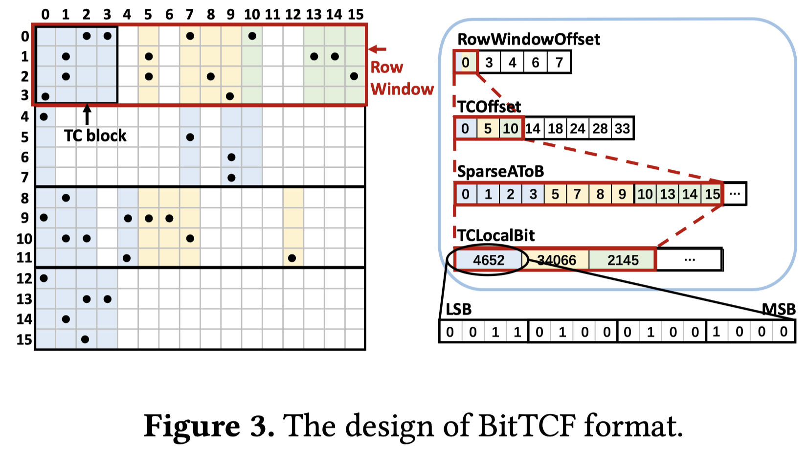

# Acc-SpMM: Accelerating General-purpose Sparse Matrix-Matrix Multiplication with GPU Tensor Cores

## Abstract

General-purpose Sparse Matrix-Matrix Multiplication (SpMM) is a fundamental
kernel in scientific computing and deep learning. The emergence of new matrix
computation units such as Tensor Cores (TCs) brings more opportunities for SpMM
acceleration. However, in order to fully unleash the power of hardware
performance, systematic optimization is required. In this paper, we propose
Acc-SpMM, a high-performance SpMM library on TCs, with multiple optimizations,
including data-affinity-based reordering, memory efficient compressed format,
high-throughput pipeline, and adaptive sparsity-aware load balancing. In
contrast to the state-of-the-art SpMM kernels on various NVIDIA GPU
architectures with a diverse range of benchmark matrices, Acc-SpMM achieves
significant performance improvements, on average 2.52x (up to 5.11x) speedup on
RTX 4090, on average 1.91x (up to 4.68x) speedup on A800, and on average 1.58x
(up to 3.60x) speedup on H100 over cuSPARSE.

通过稀疏编码减少整列的IO和计算