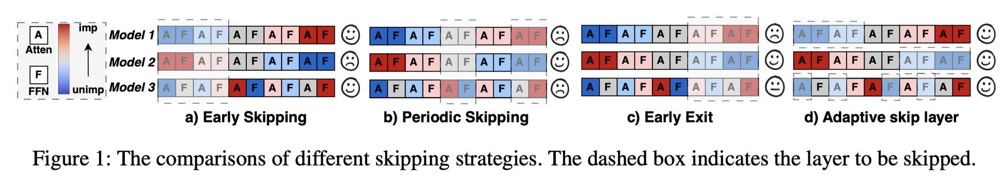

# AdaSkip: Adaptive Sublayer Skipping for Accelerating Long-Context LLM Inference

> **⚠️ 生成声明**：本 note 由 AI Agent 自动生成，基于 arXiv 论文（2501.02336v1）全文阅读撰写，生成时间：2025 年 6 月。所有内容为中文。

---

## 一句话总结

AdaSkip 是一种自适应的子层跳过方法，针对长上下文 LLM 推理，通过利用运行时相似度信息自适应识别不重要的层，实现子层级别的跳过，同时加速预填充和解码阶段。

---

## 摘要翻译

长上下文大语言模型（LLM）推理日益重要，催生了大量旨在减轻此类场景中巨大存储和计算成本的研究。层跳过方法是有前景的优化策略，但在长上下文推理中鲜有探索。我们观察到，现有的层跳过策略在应用于长上下文推理时存在若干局限，包括无法适应模型和上下文的多样性、忽视子层重要性、以及不适用于预填充阶段。本文提出了 AdaSkip，一种专门为长上下文推理设计的自适应子层跳过方法。AdaSkip 通过利用运行时相似度信息自适应识别不重要的层，实现子层级别的跳过，并加速预填充和解码阶段。通过在各种长上下文基准和模型上的广泛实验，展示了 AdaSkip 相较于现有基线方法的优越推理性能。

---

## 研究动机

### 背景
长上下文 LLM 推理（如支持百万级 token 的模型）在个人助手、文档摘要、代码辅助等应用中至关重要。然而，长序列引入了显著的计算和存储需求，尤其是 KV 缓存和注意力计算的开销。

### 现有方法的局限
现有的层跳过策略包括三类：
1. **早期跳过（Early Skipping）**：跳过前几层（固定），支持批处理但可能跳过重要层
2. **周期性跳过（Periodic Skipping）**：按固定频率跳过中间层，无法捕获不同层的重要性变化
3. **早退（Early Exit）**：跳过最后几层，可能忽略重要层，且需要额外训练或微调

这些策略在长上下文推理中存在三个核心问题：
1. **无法适应模型和上下文多样性**：不同模型的层重要性分布差异显著
2. **忽视子层重要性**：注意力和 FFN 子层的重要性分布独立，一刀切跳过整个层是次优的
3. **不适用于预填充阶段**：现有策略仅针对解码阶段，忽略了预填充阶段的优化潜力（TTFT 问题）

### 三个关键观察
1. **层重要性分布跨模型差异大**：不同模型（如 InternLM-7B-8k vs LLaMA3.1-8B-128k）的 IO 相似度分布模式完全不同
2. **注意力和 FFN 子层的重要性分布不同**：注意力模块通常有更高的 IO 相似度（尤其在后几层），FFN 相对分散，因此注意力子层有更多跳过空间
3. **预填充和解码阶段的子层重要性趋势相似但波动程度不同**：FFN 在解码阶段有更高的 IO 相似度，可跳过更多 FFN 子层

---

## 方法（技术细节）

### 核心思想
AdaSkip 是一种自适应、子层级别的跳过策略，无需训练，同时适用于预填充和解码阶段。核心机制包括：
- **离线重要性学习**（针对预填充阶段）
- **在线重要性学习**（针对解码阶段的额外 FFN 跳过）

### 关键概念：IO 相似度
利用模块输入和输出向量的余弦相似度（Cosine Similarity）评估模块重要性。如果输入和输出向量高度相似（高 IO 相似度），说明该模块对前向传播贡献较小，可以安全跳过。通过实验验证（LeastSkip vs MostSkip 策略），IO 相似度与生成质量高度相关。

### 预填充阶段：离线重要性学习
**核心洞察**：历史任务的 IO 相似度特征可以精确预测新任务的子层跳过行为。实验显示，不同数据集间的层命中率高达 9.31/10、9.56/10 等。

**方法流程**：
1. 在离线阶段，对 N 个推理任务（样本）进行 IO 相似度分析
2. 计算每个子层的平均相似度 $\overline{Similarity_j}$
3. 引入模量补偿：计算历史输入输出向量的平均模量比 $\overline{Scale_j}$，用于修正跳过层的近似输出
4. 根据加速比 $\alpha$，计算需要跳过的子层数 $m = M - M/\alpha$，选择相似度最高的 $2m$ 个子层跳过

**补偿机制**：由于残差连接，输入输出模量变化较小，使用历史平均模量比来补偿跳过层的近似输出，避免信息丢失。

### 解码阶段：在线重要性学习
**核心洞察**：解码阶段的前 P 个 token 的 IO 相似度信息可以有效识别后续解码中应跳过的 FFN 子层。随着窗口大小 n 增加，命中率逐渐趋于稳定（无需无限增大窗口）。

**方法流程**：
1. 将预填充阶段的跳过决策复用到解码阶段（注意力和 FFN 子层）
2. 利用解码阶段前 P 个 token 的 IO 相似度信息，发现额外可跳过的 FFN 子层
3. 设定阈值 $\beta$（已跳过集合中最小的相似度值），遍历 FFN 子层，将相似度超过 $\beta$ 的额外 FFN 子层加入跳过集合
4. 结合预填充阶段的跳过集合，形成解码阶段的自适应子层跳过集合

**关键设计**：
- 注意力子层在两个阶段共享跳过决策
- FFN 子层在解码阶段有更多跳过空间（IO 相似度更高）
- 通过在线学习动态调整，无需预训练

---

## 实验结果

### 实验设置
- **模型**：LLaMA3.1-8B-128k、InternLM-7B-8k、Vicuna-v1.5-7B-16k
- **基准**：
  - 预填充任务：MultiFieldQA、TriviaQA、TREC（短输出）
  - 解码任务：GovReport、MultiNews（长输出，最大 512 token）
- **基线**：SkipDecode、Unified Skipping、Early Exit
- **硬件**：单卡 L20 GPU（CUDA 12.1）

### 预填充任务结果
- AdaSkip 显著优于所有基线。例如在 LLaMA3.1-8B-128k 上，跳过 8 个子层时：
  - TREC 准确率：72.8%（接近全模型 75.0%）
  - TriviaQA F1：86.6（接近全模型 91.6%）
- 对比：SkipDecode 和 Unified Skipping 跳过仅 8 个子层时准确率下降超 90%
- 加速：在 InternLM 上由于跳过更多注意力子层，加速超过 10%

### 解码任务结果
- AdaSkip 在解码任务中也持续优于基线：
  - LLaMA 模型：Rouge-L 超过 17.5（接近全 InternLM 模型的 18.2）
  - 最高加速提升达 17%
- Early Exit 在解码阶段表现较差（Vicuna 模型 Rouge-L 低于 4.0）

### 端到端测试结果
- 当在预填充和解码阶段同时跳过层时：
  - SkipDecode 的 Rouge-L 几乎降为零
  - Unified Skipping 的 Rouge-L 低于 10
  - Early Exit（跳过 16 子层）得分低于 5
- AdaSkip 保持与仅在解码阶段跳过时几乎相同的性能
- **实际价值**：可显著优化预填充阶段的 TTFT，减少长 prompt 的 KV 缓存存储开销

---

## 优势

1. **自适应性**：无需预定义跳过策略，根据模型和上下文动态调整
2. **子层级别跳过**：独立决策注意力和 FFN 子层的跳过，比层级别跳过更精细
3. **同时加速预填充和解码**：是首个同时支持两个阶段的层跳过方法
4. **无需训练**：完全基于运行时 IO 相似度信息，不依赖额外分类器或模型微调
5. **模块化设计**：离线学习 + 在线学习，逻辑清晰，易于实现
6. **广泛的兼容性**：在多个模型和基准上验证有效，包括 LLaMA、InternLM、Vicuna

---

## 局限

1. **运行时开销**：需要在推理过程中计算 IO 相似度，可能增加额外的计算成本（尤其是离线学习阶段）
2. **实验规模有限**：仅在 7B 级模型上验证，未探索更大模型（如 13B、70B）或更长上下文（如 200K+）
3. **仅关注层跳过**：未与 KV 缓存压缩（如 SnapKV、PyramidKV）等方法结合，可能存在互补空间
4. **预填充阶段依赖历史数据**：离线学习需要收集历史任务的 IO 相似度数据，对新场景的泛化性有待进一步验证
5. **解码阶段的在线学习窗口**：虽然窗口大小影响不大，但选择合适的 P 值可能需要经验调优
6. **未涉及推理系统的工程优化**：如批处理、动态调度等系统层面的优化未被讨论

---

## 与 EfficientPaper 相关的研究方向

### 关键词：结构化稀疏（structured_sparsity）、稀疏剪枝（sparse_pruning）、结构设计（structure_design）

1. **长上下文 LLM 推理优化**：AdaSkip 属于层跳过策略，与 KV 缓存压缩（SnapKV、PyramidKV、H2O）等方法互补，可探索联合优化
2. **层/子层级别剪枝**：与 LayerSkip、Early Exit、FFN-SkipLLM 等方法形成对比，子层级别跳过是更精细的剪枝粒度
3. **自适应推理**：与 MoE（混合专家）的自适应路由、动态稀疏注意力（如 MInference）等方法相关，探索运行时自适应策略
4. **结构化稀疏与剪枝**：AdaSkip 的 IO 相似度分析为结构化稀疏提供了新的重要性度量方式
5. **推理加速系统**：与 Prefill 阶段优化（如 Preble、Quest）等方法结合，可构建更完整的长上下文推理优化方案
6. **模型架构优化**：AdaSkip 对注意力和 FFN 子层的独立分析，可指导未来 Transformer 架构设计（如非对称层、子层级动态计算）
