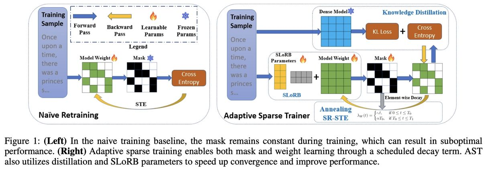

# Pruning Large Language Models with Semi-Structural Adaptive Sparse Training

> **注意：本 note 由 AI Agent 自动生成，内容基于论文全文阅读与理解。生成时间：2025年6月。**

---

## 一句话总结

**AST（Adaptive Sparse Trainer）** 是一种针对半结构化（N:M）稀疏模型的高效重训练框架，通过自适应掩码学习、知识蒸馏和补充参数（SLoRB）三大技术，在仅使用不到 0.4% 预训练 token 的情况下，将 LLaMA2-7B 的 2:4 稀疏模型与稠密模型的困惑度差距缩小至 0.6，零样本准确率差距缩小至 1.16%，首次证明了半结构化稀疏 LLM 在复杂知识密集型任务上同样具备竞争力。

---

## 摘要翻译

大型语言模型（LLM）的卓越成功很大程度上依赖于其庞大的规模，这在模型部署时带来了延迟和内存消耗方面的显著挑战。近期，许多研究尝试使用一次性剪枝方法压缩 LLM，但这些方法在复杂语言理解任务上往往遭受严重的性能退化，引发了对 LLM 剪枝可行性的担忧。为解决此问题，我们提出了 **Adaptive Sparse Trainer (AST)**，一种针对半结构化稀疏模型的新型高效重训练框架。AST 使模型在权重更新过程中自适应学习最优掩码，而不产生额外的计算开销。此外，我们证明了引入知识蒸馏能够显著提升重训练效率，并在固定计算约束下增强模型性能。同时，一组良好初始化的补充参数被集成以进一步提升模型效能。AST 以最小的训练成本实现了最先进的性能。当应用于 LLaMA2-7B 模型时，AST 将稠密模型与 2:4 半结构化稀疏模型之间的困惑度和零样本准确率差距分别缩小至 0.6 和 1.16%，仅使用不到 0.4% 的预训练 token 和 GPU 小时。我们的工作证明了部署半结构化稀疏 LLM 的可行性，并在与现有量化技术结合时提供了一种实现高度压缩模型的有前景的替代方案。

---

## 研究动机

1. **LLM 部署瓶颈**：Transformer 大语言模型参数规模持续增长，推理时的计算和内存需求巨大，导致延迟高、内存占用大，严重限制了实际部署。

2. **一次性剪枝的不足**：现有的训练无关方法（如 SparseGPT、Wanda）虽然高效，但在复杂语言理解任务（尤其是知识密集型任务）上存在显著性能退化，如 MMLU、GSM8K 等任务上表现不佳。

3. **半结构化稀疏（N:M）的优势**：N:M 稀疏（如 2:4）可以在保持精度的同时，通过硬件加速（如 NVIDIA Tensor Core）实现实际的矩阵乘法加速和内存访问加速，是性能与硬件效率之间的最佳平衡点。

4. **重训练的挑战**：将重训练应用于数十亿参数的 LLM 仍不成熟，面临四大挑战：
   - 计算成本高，需确保快速收敛
   - 必须严格遵守 N:M 稀疏模式
   - 需同时学习掩码和权重
   - 剪枝可能损害语言理解和推理能力，且恢复困难

5. **现有方法的局限**：IMP（迭代幅度剪枝）和 GMP（渐进幅度剪枝）等方法在 LLM 上效果有限，因为预训练模型的参数并非随机初始化，"中奖彩票"假设不一定成立。

---

## 方法（技术细节）

AST 框架由三个核心组件构成：

### 1. 自适应掩码学习与退火 SR-STE（Annealing SR-STE）

**核心思想**：在训练过程中动态更新掩码，而非固定不变。重要的权重会收到强梯度信号，逐渐从被剪枝状态恢复；不重要的权重则逐渐衰减到零并保持被掩码。

**具体实现**：
- 每隔 $\Delta t$ 次迭代，基于幅度准则重新计算掩码 $m(W_t)$
- 对被掩码的权重添加 L2 衰减项，帮助保持模型整体性能
- 衰减因子 $\lambda_W(t)$ 采用退火调度：
  - 训练初期衰减较弱，鼓励模型探索各种连接模式
  - 训练后期衰减较强，促进模型收敛
  - 公式：$\lambda_W(t) = \alpha t$（$0 \le t \le T_0$），$\lambda_W(t) = \alpha T_0$（$T_0 \le t \le T_1$）

**权重更新公式**：
$$W_{t+1} \leftarrow W_t - \gamma_t \left( g(\tilde{W}_t) + \lambda_W(t) \left( m(W_t) \odot W_t \right) \right)$$

**AdamW 优化器适配**：原始 SR-STE 仅兼容 SGD，AST 通过将衰减项从一阶动量中解耦来支持 AdamW，避免对动量计算造成干扰，同时使用解耦后的一阶信号更新二阶动量。

**掩码选择**：采用经典的幅度准则（magnitude criterion），实验证明其在计算效率和性能上均优于基于激活值的准则（如 SparseGPT 和 Wanda 的方法）。

### 2. 知识蒸馏（Knowledge Distillation）

**动机——重训练困境（Retraining Dilemma）**：
- 重训练的模型继承了预训练模型的部分模式，导致初始收敛快但易陷入局部最优
- 尽管训练损失下降很快，但测试集困惑度不稳定且偏高
- 仅降低学习率不足以解决此问题

**解决方案**：
- 使用 KL 散度损失（KL-divergence loss）作为蒸馏损失
- 以稠密模型作为教师模型，引导稀疏模型学习
- 损失函数：$L = \alpha L_{\text{logit}} + (1-\alpha) L_{\text{task}}$
  - $L_{\text{logit}} = D_{KL}(p_{\theta_t} \| p_{\theta_s})$（教师与学生之间的 KL 散度）
  - $L_{\text{task}}$ 为交叉熵损失
  - $\alpha$ 为混合系数（通常 $2/3$，大模型可用 $1/3$）

**关键发现**：
- 中间信息蒸馏（如 TinyBERT、MobileBERT）对生成式语言模型有害
- KL 散度损失已足够，反向 KL 效果与正向 KL 相当
- 蒸馏在相同 FLOPs 下显著优于非蒸馏方法（如 LLaMA2-7B：5B token 蒸馏 PPL=5.97 vs 7.5B token 非蒸馏 PPL=6.12）

### 3. 稀疏低秩提升（SLoRB，Sparse Low-Rank Boosting）

**核心思想**：在 2:4 稀疏模型中引入一组补充的低秩参数，弥补因稀疏化导致的表达能力下降。

**具体实现**：
- 与传统 LoRA 不同（冻结原始参数仅训练适配器），AST 同时训练稀疏参数和适配器权重
- 初始化策略利用被剪枝权重的信息：设权重矩阵 $W$ 大小为 $N \times d$，对应掩码矩阵 $M$，选择秩 $r = d/k$（$k$ 可取 64、32、16 等，$k$ 越小性能越好但内存越大）
- 投影矩阵 $X$ 大小为 $d/k \times d$（分块单位矩阵），SLoRB 权重矩阵 $S$ 大小为 $N \times d/k$
- 每个 SLoRB 权重 $S_{ij}$ 被广播到对应组 $G_{ij}$ 中，初始化为该组被剪枝权重的均值，保持剪枝前后组内均值一致

**参数开销**：AST-Boosted 使用 $k=16$，额外引入 12.5% 的参数。

---

## 实验结果

### 实验设置

- **模型**：LLaMA2-7B、OPT（125M/350M/1.3B）、GPT2（124M/350M/774M/1.5B）
- **稀疏模式**：2:4（50% 稀疏率）
- **数据集**：OPT 和 GPT2 使用 C4，LLaMA2-7B 使用 RedPajama-v11
- **评估指标**：WikiText-2 困惑度、零样本/少样本任务准确率

### 主要结果

**语言建模（WikiText-2 PPL）**：

| 方法 | OPT 125M | OPT 350M | OPT 1.3B | GPT2 124M | GPT2 350M | GPT2 774M | GPT2 1.5B |
|------|----------|----------|----------|-----------|-----------|-----------|-----------|
| Dense | 27.76 | 22.00 | 14.62 | 29.95 | 21.72 | 19.43 | 17.40 |
| SparseGPT | 45.58 | 40.33 | 29.03 | 50.09 | 31.03 | 25.98 | 21.14 |
| Wanda | 60.91 | 50.16 | 23.92 | 115.64 | 63.71 | 49.97 | 30.44 |
| AST-Naive | 30.22 | 24.65 | 15.85 | 32.23 | 23.65 | 21.29 | 18.33 |
| AST-Boosted | 28.68 | 24.03 | 15.43 | 31.13 | 23.03 | 20.66 | 18.01 |

AST 显著优于训练无关方法和训练基线方法。

**LLaMA2-7B 零样本准确率（7 个任务平均）**：

| 模型 | 平均准确率 |
|------|-----------|
| Dense | 59.78% |
| LLaMA2-7B (Sparse) | 57.68% |
| LLaMA2-7B (Sparse+SLoRB) | 58.62% |
| Sheared-LLaMA-2.7B (Dense) | 51.73% |

稀疏模型持续优于参数量相近的稠密模型。

**知识密集型任务（LLaMA2-7B）**：

| 任务 | Dense | Wanda | AST-Naive | AST-Boosted |
|------|-------|-------|-----------|-------------|
| Perplexity ↓ | 5.12 | 11.02 | 5.82 | 5.69 |
| MMLU (5-shot) ↑ | 45.3 | 27.6 | 37.9 | 38.2 |
| MATH (4-shot) ↑ | 5.38 | 2.86 | 4.42 | 4.64 |

首次证明 2:4 稀疏 LLM 在知识密集型任务上也能保持竞争力。

### 推理加速

使用 TensorRT-LLM 在 LLaMA2-7B 2:4 稀疏模型上的加速：
- RTX 4090：1.33x～1.34x 加速
- L20 GPU：1.78x～1.83x 加速

### 消融实验

- **蒸馏**：显著提升性能（消除后 PPL 上升约 1-2）
- **退火 SR-STE**：优于静态 SR-STE 和固定掩码
- **SLoRB**：AST-Boosted 相比 AST-Naive 进一步提升
- **蒸馏函数**：KL 散度最佳，中间层蒸馏（TinyBERT/MobileBERT）有害
- **不同 N:M 模式**：2:4、4:8、8:16 等模式，性能随 N 增大而提升，但压缩比也随之增加
- **与量化结合**：AST-Boosted-4bit 在 LLaMA2-7B 上 PPL=6.25（理论压缩率 0.078x）

---

## 优势

1. **极高效率**：仅需不到 0.4% 预训练 token（7B tokens）即可收敛，远低于传统重训练方法
2. **最小性能损失**：LLaMA2-7B 困惑度差距仅 0.6，零样本准确率差距仅 1.16%
3. **自适应掩码**：训练过程中动态学习最优掩码，而非使用固定掩码，实现从稠密到稀疏的平滑过渡
4. **知识蒸馏的有效性**：蒸馏加速收敛并避免局部最优，即使在相同计算预算下也优于非蒸馏方法
5. **与硬件加速兼容**：2:4 稀疏模式可利用 NVIDIA Tensor Core 进行实际加速（1.33x-1.83x）
6. **与量化技术协同**：AST 可与 AWQ 等量化方法结合，实现极端压缩（约 0.0675x 理论压缩率）
7. **SLoRB 设计精巧**：利用被剪枝权重信息初始化补充参数，加速收敛且额外参数仅 12.5%
8. **首次证明可行性**：首次证明半结构化稀疏 LLM 在知识密集型任务上也可行

---

## 局限

1. **训练 token 有限**：由于计算约束，LLaMA2-7B 仅使用 7B tokens，未来增加训练 token 可能进一步提升效果
2. **硬件依赖**：2:4 稀疏加速依赖 NVIDIA Tensor Core 和 TensorRT-LLM，非 NVIDIA 硬件无法获得实际加速
3. **掩码选择简单**：虽然幅度准则效果好，但未探索更复杂的动态掩码选择策略
4. **大规模模型验证不足**：仅在 7B 参数级别验证，对更大规模模型（如 13B、70B）未测试
5. **SLoRB 内存开销**：AST-Boosted 引入额外 12.5% 参数，可能对内存受限场景造成压力
6. **中间层蒸馏无效**：作者发现中间层信息对生成式 LLM 有害，但这可能与其特定设置有关，值得进一步研究

---

## 与 EfficientPaper 相关的研究方向

1. **模型压缩与剪枝**：AST 属于 N:M 半结构化稀疏方向，可与 EfficientPaper 中其他剪枝方法（如 SparseGPT、Wanda）对比分析
2. **重训练与微调效率**：AST 的极低成本重训练方法（仅 0.4% 预训练 token）与高效微调（如 LoRA）的研究方向密切相关
3. **知识蒸馏**：AST 使用的蒸馏策略可与 TinyBERT、MiniLLM 等方法进行对比，尤其是对生成式 LLM 的蒸馏
4. **稀疏与量化结合**：AST 与 AWQ 量化结合的实验结果，为模型联合压缩提供了有价值的参考
5. **硬件加速**：N:M 稀疏的实际加速效果（1.33x-1.83x）与硬件感知模型设计的研究方向相关
6. **稀疏训练优化**：AST 的自适应掩码学习和退火调度机制，对动态稀疏训练研究有启发意义
7. **低秩适配（LoRA）**：SLoRB 将 LoRA 与稀疏剪枝结合，为低秩方法在剪枝场景中的应用提供了新思路
