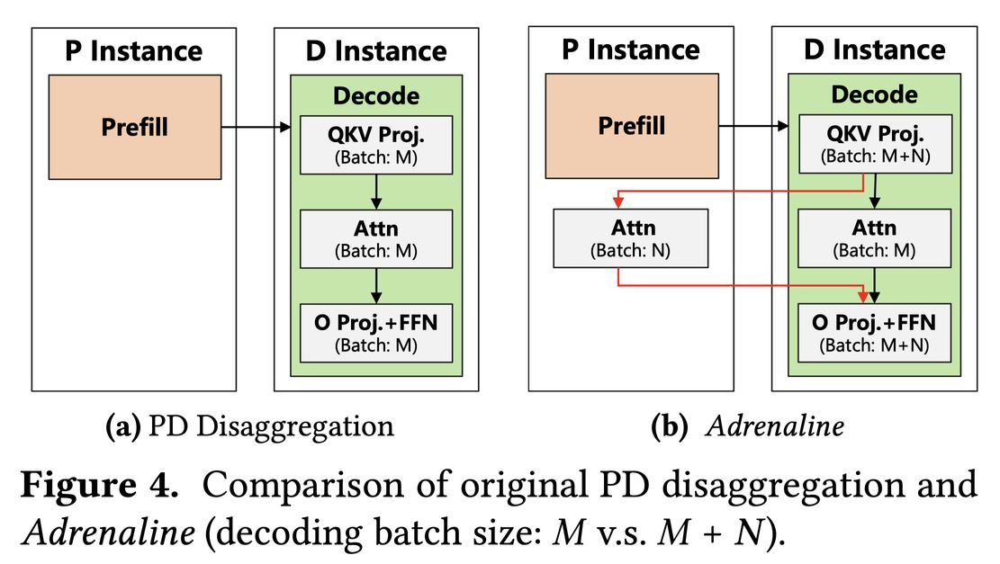

# Injecting Adrenaline into LLM Serving: Boosting Resource Utilization and Throughput via Attention Disaggregation

> **本文由 AI Agent 自动生成，生成时间：2025-06-05。**

---

## 一句话总结

Adrenaline 通过将解码阶段的部分注意力计算卸载到预填充实例，利用预填充实例中未充分利用的 HBM 资源，同时提升预填充实例的内存利用率和解码实例的计算利用率，从而将整体推理吞吐量提升至 1.68 倍。

---

## 摘要翻译

在大语言模型（LLM）服务系统中，每个请求的执行分为两个阶段：计算密集型的预填充阶段和内存密集型的解码阶段。为防止两个阶段之间的性能干扰，当前的 LLM 服务系统通常采用预填充-解码分离（PD Disaggregation）架构，将两个阶段分配到不同的机器上。然而，我们观察到这种方法导致了严重的资源利用不足。具体而言，计算密集型的预填充实例存在内存利用率低的问题，而内存密集型的解码实例则面临计算利用率低的问题。为解决这一问题，本文提出 Adrenaline，一种注意力分解和卸载机制，旨在提升 LLM 服务系统的资源利用率和性能。Adrenaline 的关键创新在于将解码阶段的部分注意力计算分解并卸载到预填充实例上。解码阶段注意力计算的内存密集特性天然使其适合有效的卸载策略，产生两个互补的优势：（1）提升预填充实例的内存容量和带宽利用率；（2）增加解码批次大小，从而提升解码实例的计算利用率，共同提升整体系统性能。Adrenaline 通过三种关键技术实现这些收益：低延迟解码同步、资源高效的预填充共存和负载感知的卸载调度。实验结果表明，Adrenaline 在预填充实例上实现了 2.28 倍的内存容量利用率和 2.07 倍的内存带宽利用率，在解码实例上实现了高达 1.67 倍的计算利用率提升，整体推理吞吐量比最先进的系统高 1.68 倍。

---

## 研究动机

### 背景问题

LLM 推理包含两个关键阶段：
- **预填充阶段（Prefill）**：并行处理所有 prompt  tokens，生成第一个输出 token，计算密集，延迟用 TTFT（Time to First Token）衡量。
- **解码阶段（Decoding）**：自回归地逐个生成输出 token，频繁加载 KV cache，内存密集，延迟用 TPOT（Time Per Output Token）衡量。

为避免两阶段之间的性能干扰，现代 LLM 服务系统（如 vLLM、NVIDIA Dynamo、Mooncake、DeepSeek）普遍采用 **PD Disaggregation**，将预填充和解码分配到不同的 GPU 上。

### 核心观察

然而，PD Disaggregation 导致了严重的 **GPU 资源利用不足**：
- **预填充实例**：计算利用率高，但 HBM 容量利用率仅约 21%，HBM 带宽利用率低于 30%（因为预填充完成后 KV cache 被立即发送到解码实例）。
- **解码实例**：计算利用率低于 26%，但 HBM 容量利用率高达 75.5%，KV cache 占 57.3% 的 HBM 容量，注意力核函数占 69.5% 的执行时间（batch size 80 时）。

### 核心洞察

注意力计算是解码阶段的瓶颈，具有内存密集型特性。将其卸载到预填充实例可以：
1. 提升预填充实例的 HBM 利用率
2. 增大解码实例的 batch size，提升计算利用率

---

## 方法（技术细节）

### 整体架构

Adrenaline 基于 vLLM 实现，包含三个模块：**Proxy（代理）**、**Prefill Instance（预填充实例）**、**Decoding Instance（解码实例）**。核心创新是在预填充实例中引入 **Attention Executor（注意力执行器）**，专门执行从解码实例卸载的注意力计算任务。

### 技术一：低延迟解码同步（Low-latency Decoding Synchronization）

**挑战**：将注意力计算卸载到远程预填充实例后，需要在每个 transformer 层内与本地解码计算进行同步。如果同步开销过大（如每层 0.5ms），32 层模型的总开销可达 16ms，严重影响 TPOT。

**优化策略**：
1. **工作流编排优化**：将元数据和内存管理操作（如分配/回收 cache block、初始化请求元数据）移出关键路径，减少在线同步开销。
2. **数据聚合发送**：将分散的注意力输入（q, k, v）聚合后单次发送，降低通信成本。
3. **计算重叠**：确保远程注意力计算与本地注意力计算在时间上重叠，减少 GPU 空闲等待时间。
4. **二维 CUDA Graph**：针对 vLLM 中注意力卸载导致的动态 tensor shape 问题，设计了二维 CUDA Graph（维度为本地 batch size × 卸载 batch size），通过可配置间隔限制图的数量，并使用调度器输出选择最小的合适 CUDA Graph。

### 技术二：资源高效的预填充共存（Resource-efficient Prefill Colocation）

**挑战**：卸载的注意力任务与预填充任务共享 GPU 资源，可能导致性能干扰。

**关键观察**：
- 注意力计算是内存密集型的，即使使用少量 SM 也能达到较高的 HBM 带宽利用率（20% SM 可达到 60% 的 A100 HBM 带宽）。
- 预填充延迟随 SM 数量减少呈次线性增长，因为预填充阶段的部分子步骤（如请求路由、调度、KV cache 传输）不依赖 GPU 计算资源。

**优化策略**：
- **离线 profiling**：测量不同 SM 比例下的预填充延迟和注意力带宽。
- **在线自适应资源分区**：根据 TTFT SLO 和离线 profiling 数据，确定最小 SM 比例，使用 NVIDIA MPS 技术限制预填充阶段的计算资源，确保性能隔离。

### 技术三：负载感知的卸载调度（Load-aware Offloading Scheduling）

**挑战**：确定合适的卸载比例，以及在动态工作负载下决定是否卸载。

**卸载比例上界建模**：
- **内存约束**：$OB_{mem}(n) = \min(\sum HBM_{pi}/HBM_d, \sum BW_{pi}/BW_d)$
- **计算约束**：$OB_{comp}(B_{max}) = (B_{max} - B_{TPO T}) / B_{TPO T}$
- **总体上界**：$OB(n, B_{max}) = \min(OB_{mem}(n), OB_{comp}(B_{max}))$

**自适应调度算法**（Algorithm 1）：
- 使用 Proxy 中的全局调度器管理运行时元数据（活跃请求数、序列长度等）。
- 判断是否卸载的两个条件：
  - **C1**：现有卸载请求和新请求（即使最大序列长度）的注意力总和不超过卸载比例上界。
  - **C2**：注意力执行器和解码实例的当前序列长度比和 batch size 比都在上界内。
- 两个条件的共同目标：确保远程注意力计算时间可以被本地注意力计算覆盖，避免同步延迟增加。

---

## 实验结果

### 实验设置
- **硬件**：8 张 NVIDIA A100-80GB SMX GPU，600 GB/s NVLink 互联
- **模型**：Llama-2 7B 和 13B（float16）
- **基线**：vLLM v6.3.0（支持 PD Disaggregation）
- **工作负载**：ShareGPT（聊天场景）、OpenThoughts（推理模型场景，输出/prompt 比更高）

### 端到端性能

| 指标 | 模型 | 工作负载 | 提升倍数 |
|------|------|----------|----------|
| 输出吞吐量 | Llama-2 7B | ShareGPT | 1.47× |
| 输出吞吐量 | Llama-2 13B | ShareGPT | 1.63× |
| 输出吞吐量 | Llama-2 7B | OpenThoughts | 1.60-1.66× |
| 输出吞吐量 | Llama-2 13B | OpenThoughts | 1.57-1.68× |
| TTFT | Llama-2 7B | ShareGPT | 高负载下降低 22× |
| TPOT | Llama-2 7B | OpenThoughts | 降低 26.9-29.5% |
| P99 TPOT | Llama-2 7B | OpenThoughts | 降低 48.5-58.8% |

### 资源利用率

| 指标 | 提升倍数 |
|------|----------|
| 预填充实例 HBM 容量利用率 | 2.28× |
| 预填充实例 HBM 带宽利用率 | 1.49-2.07×（7B）/ 1.37-1.93×（13B） |
| 解码实例计算利用率 | 1.67×（7B）/ 1.68×（13B） |

### 卸载比例分析
- ShareGPT 最优卸载比例约 70%，OpenThoughts 约 80%。
- 卸载比例过高（如 80% 在 ShareGPT 中）会因注意力执行器运行时间过长而无法被本地注意力覆盖，导致性能下降。
- Adrenaline 通过 offline profiling 和 runtime metadata 自动找到不同工作负载的最优比例。

---

## 优势

1. **无需额外硬件**：与 Lamina（使用消费级 GPU）、NEO（使用 CPU）、InstInfer（使用 CSD）不同，Adrenaline 利用系统内已有的预填充实例的闲置资源，无需引入额外硬件。
2. **显著提升资源利用率**：预填充实例的 HBM 容量利用率提升 2.28 倍，带宽利用率提升 2.07 倍，解码实例计算利用率提升 1.67 倍。
3. **吞吐量显著提升**：最高 1.68 倍的推理吞吐量提升。
4. **SLO 兼容性**：低延迟同步机制确保 TPOT 不会显著增加，同时 TTFT 在高负载下大幅降低（可达 22 倍改善）。
5. **自适应调度**：基于运行时负载和 SLO 动态调整卸载比例，适应不同工作负载。
6. **基于 vLLM 实现**：代码开源（https://github.com/ASISys/Adrenaline），与主流框架兼容，易于集成。

---

## 局限

1. **实验规模有限**：仅在 8 张 A100-80GB GPU 上测试了 Llama-2 7B 和 13B，未验证更大模型（如 70B+）和更大规模 GPU 集群下的效果。
2. **模型种类单一**：仅评估了 Llama-2 模型，未考虑 MoE 架构（如 Mixtral、DeepSeek）、长上下文场景等。
3. **工作负载覆盖有限**：仅使用 ShareGPT 和 OpenThoughts，未涵盖更多真实场景（如代码生成、多轮对话等）。
4. **同步开销**：尽管通过 CUDA Graph 和工作流优化降低了同步开销，但在每层 transformer 中仍有额外通信延迟，可能在超低延迟场景下成为瓶颈。
5. **SM 资源分区依赖 NVIDIA MPS**：使用 NVIDIA MPS 进行 SM 资源分区，对硬件有特定要求，可能在其他硬件平台上不可用。
6. **卸载比例上限受限**：卸载过多注意力计算会导致预填充实例资源过载或解码实例同步延迟增加，实际卸载比例受限。
7. **与 PD Disaggregation 紧耦合**：Adrenaline 依赖于已有的 PD Disaggregation 架构，对于未采用分离架构的系统无法直接应用。

---

## 与 EfficientPaper 相关的研究方向

1. **KV Cache 管理**：Adrenaline 深入分析了 KV cache 在解码阶段的内存占用问题，其调度策略与 KV cache 管理密切相关（关键词：kv_cache_management）。
2. **LLM 服务系统优化**：论文属于 LLM 部署（deployment）方向，关注系统级别的资源利用率优化和吞吐量提升。
3. **PD Disaggregation 优化**：与 DistServe、Splitwise、Mooncake 等工作一脉相承，是 PD Disaggregation 框架下的资源利用优化方案。
4. **注意力计算卸载**：与 Lamina、NEO、InstInfer、FastDecode 等注意力卸载工作相关，但 Adrenaline 利用系统内已有资源而非额外硬件。
5. **GPU 资源调度**：涉及 GPU SM 资源分区（MPS）、CUDA Graph 优化等技术，与 GPU 资源管理和调度研究相关。
6. **异构计算架构**：虽然本文使用同构 GPU，但其注意力卸载的思想可扩展到异构计算场景（如 GPU+CPU、GPU+CSD）。

---

*本 note 由 AI Agent 自动生成，内容基于论文原文的完整阅读。*
