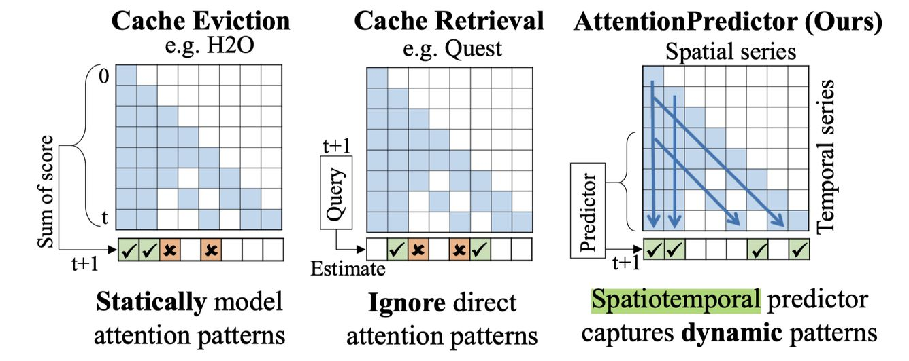

# AttentionPredictor: Temporal Pattern Matters for Efficient LLM Inference

> ⚠️ **生成声明**：本 note 由 AI Agent（Hermes Agent）于 2025 年自动生成，基于 arXiv 论文全文（2502.04077v1）的阅读理解与分析，内容仅供学术参考。

---

## 一句话总结

AttentionPredictor 是首个基于学习的 KV cache 关键 token 识别方法，通过轻量级 CNN 捕捉注意力分数的时空模式来预测下一步注意力，实现 16× KV cache 压缩且性能接近完整缓存，并提出跨 token 预取框架实现 1.4× 解码加速。

---

## 摘要翻译

随着大语言模型（LLM）的发展，通过 Key-Value（KV）缓存压缩实现高效推理受到广泛关注，尤其在长上下文生成场景中。现有方法通常通过启发式排名（基于注意力分数）来识别关键 KV token，但这些方法往往忽略了注意力分数中的**时间模式**（temporal patterns），导致在关键 token 的识别上准确性不足，从而造成 LLM 性能的明显下降。

为解决这一问题，我们提出了 **AttentionPredictor**，这是首个基于学习的关键 token 识别方法。具体而言，AttentionPredictor 学习一个轻量级卷积模型来捕获时空模式并预测下一步 token 的注意力分数。该方法在准确预测注意力分数的同时，内存消耗几乎可以忽略不计。此外，我们提出了一个**跨 token 关键缓存预取框架**，将 token 估计的时间开销隐藏在 LLM 推理过程中，以加速解码阶段。通过保留大部分注意力信息，AttentionPredictor 实现了 16× 的 KV cache 压缩，同时保持可比的 LLM 性能，显著优于现有最先进方法。

---

## 研究动机

### KV Cache 的内存瓶颈
LLM 推理过程中，KV cache 是主要的内存消耗来源。例如，一个 7B 参数模型的参数仅占 14GB，但 128K 上下文长度的 KV cache 需要约 72GB。随着解码延迟和内存占用随 KV cache 成比例增长，压缩 KV cache 至关重要。

### 现有方法的局限性
1. **Cache 驱逐方法**（如 H2O、StreamingLLM、SnapKV）：使用启发式方法，基于历史注意力分数静态建模注意力模式，无法捕捉动态的时间变化。
2. **Cache 检索方法**（如 Quest）：通过近似计算注意力分数来识别关键 token，但对页大小敏感，压缩率增大时准确率显著下降。此外，这些方法依赖当前步的查询 token，无法利用异步计算来覆盖估计时间开销。

### 核心观察
论文观察到注意力分数具有**三种时间模式**：
- **重访问（Re-access）**：对特定 token 的重复注意力（纵向条纹）
- **顺序性（Sequential）**：注意力向下一个 token 顺序推进（对角线）
- **周期性（Seasonal）**：关键 token 的周期性出现（交替的高/均匀注意力分数区域）

同时发现查询向量（query）具有高度的连续性——相邻步的余弦自相关高达 87%，这意味着相邻步的注意力分数相似（A_i ≈ A_{i+1}），使得基于预测的方法成为可能。

---

## 方法（技术细节）

### 4.1 问题形式化
- 定义：Qt 为查询张量，K 为键张量，At = Softmax(Q_t K^T / √d) 为注意力分数
- KV cache 压缩目标：在预算 B 下，选择关键位置 p，最大化注意力恢复率 R_rec = Σ A_t,pi / ||A_t||_1
- 核心思路：预测下一步注意力分数 Â_{t+1} 作为评分函数

### 4.2 AttentionPredictor：时空预测器

**预测形式化**：
- 将注意力历史 AH ∈ R^{H×t} 建模为时空序列
- 时间维度：沿解码步骤的时间序列
- 空间维度：沿不同 key 位置的空间序列
- 目标：Â_{t+1} = F(AH)，其中 F 为预测模型

**模型设计**：
- 两层 2D 卷积 + 一层 1D 卷积的 CNN 架构
- 2D 卷积捕获多尺度时空特征
- 1D 卷积聚焦时间维度，提取跨时间步的时间模式
- 1D 卷积替代全连接层，使模型适应不断增长的空间维度，无需数据分割或多模型训练
- 与 LSTM 相比更轻量，预测速度更快（短于单 token 推理延迟）
- 与 MLP 相比更善于捕获空间特征，预测准确率更高
- **参数量仅 4.9K**（CNN），远小于 MLP（49K）和 LSTM-block（3.2M）

**训练策略**：
- 仅使用约 3% 的注意力数据（每个任务约 5 个样本）训练
- 仅使用解码阶段的注意力分数作为输出
- 训练 30 个 epoch，选择注意力恢复率最优的模型
- 损失函数：均方误差（MSE）
- **泛化能力强**：在 LongBench 上训练的模型在 GSM8K 上表现良好

**块级注意力压缩（Block-wise Attention Compression）**：
- 利用注意力的局部性，在块（block）级别预测和识别关键 token
- 对注意力分数 A 应用最大池化，核大小等于块大小 b
- A_comp_t = Maxpooling(A_t, b)，将预测计算量降低到约 1/b

**分布误差校准（Distribution Error Calibration）**：
- 由于稀疏注意力计算，用于预测的注意力历史分布可能偏离密集注意力分布
- 每 M 步计算并存储完整注意力分数，校正累积偏差
- 平衡准确率与计算效率

**整体流程**（Algorithm 1）：
1. 将 A_t 填充到 b 的最近倍数
2. 块级压缩：A_comp_t = MaxPooling(A_t, b)
3. 更新注意力历史：AH ← Update(AH, A_comp_t)
4. 预测下一步注意力：Â_{t+1} = Prediction_model(AH)
5. Top-K 选择：Positions = Top-K(Â_{t+1}, B/b)
6. 扩展索引：p = Expand(Positions, b)
7. 返回关键 token 位置 p

### 4.3 跨 token 预取框架（Cross-token Prefetching）

**动机**：当前 LLM 系统将 KV cache 卸载到 CPU 以减少 GPU 内存使用，但 CPU-GPU 传输延迟成为瓶颈。预取通过异步加载关键缓存部分来隐藏传输时间。

**与 InfiniGen（跨层预取）的区别**：
- 跨 token 方法可利用更长的传输时间
- 适应更复杂、更准确的关键 token 识别方法
- 每个 token 的传输数据组织更好，I/O 利用率更高

**实现细节**：
- Prefill 阶段：完整卸载 KV cache 到 CPU，不压缩
- AttentionPredictor 预测下一步的关键 token 索引 p
- 异步预取 p 对应的 KV cache 到 GPU
- GPU 同时处理其他层的推理（并行化）
- 每 token 推理时间即为预测和缓存加载的最大可用时间
- 利用 GPU 并行流和 CPU 多线程，跨层并行化 token 检索和缓存传输

---

## 实验结果

### 实验设置
- **数据集**：
  - LongBench（16 个数据集，覆盖 6 种任务：单/多文档 QA、摘要、少样本学习、合成任务、代码补全）
  - GSM8K（数学推理，CoT 链式思维）
- **基线方法**：StreamingLLM、H2O（H2O+变体）、SnapKV、Quest
- **模型**：LongChat-v1.5-7b-32k（32K 上下文）、LLaMA-3.1-8B-Instruct（128K 上下文）
- **超参数**：H=64，b=16，M=5
- **硬件**：NVIDIA A800（80GB）GPU

### 注意力恢复率（Attention Recovery Rate）

| KV 预算 | 方法 | QA | Summary | Math | Average |
|---------|------|-----|---------|------|---------|
| 512 | H2O | 79.97 | 79.36 | 88.23 | 82.52 |
| 512 | Quest | 80.85 | 72.37 | 78.14 | 77.12 |
| 512 | **AttentionPredictor** | **84.79** | **79.73** | **87.77** | **84.10** |
| 1024 | H2O | 91.58 | 88.37 | 94.79 | 91.58 |
| 1024 | Quest | 93.40 | 88.12 | 92.04 | 91.19 |
| 1024 | **AttentionPredictor** | **90.63** | **85.16** | **92.04** | **89.28** |

- 在 512 预算（20× 压缩）下，AttentionPredictor 比 Quest 高 7%
- 数学推理任务中，Quest 恢复率下降明显，而 AttentionPredictor 更可靠

### LongBench 最终准确率

- 所有 KV 预算（512~4096）和所有 LLM 上，AttentionPredictor 均超越所有 SOTA 基线
- **平均性能损失 < 0.5%**（相比完整缓存）
- 在极端稀疏预算（512/13K，4%）下，性能下降仅 0.44%，相比 Quest 的 1.84% 下降，**改进 76%**

### CoT 数学推理（GSM8K）

| 方法 | 预算 | 4K | 8K | 16K | 平均 |
|------|------|-----|-----|------|------|
| Full cache | Full | 56.79 | 55.27 | 54.13 | 55.40 |
| Quest | 1K | 48.52 | 45.26 | 37.22 | 43.67 |
| **AttentionPredictor** | **1K** | **57.16** | **53.75** | **52.08** | **54.33** |

- Quest 在 16K 序列长度下准确率下降 16.91%，而 AttentionPredictor 仅下降 2.05%
- 在 25% 缓存预算下，甚至超过完整缓存准确率（无损性能）

### 效率（解码延迟）

| 方法 | 每 token 延迟(s) | 加速比 |
|------|-------------------|--------|
| 跨层预取（baseline） | 0.364 | 1× |
| 跨层预取 + AttentionPredictor | 0.295 | 1.2× |
| **跨 token 预取 + AttentionPredictor** | **0.262** | **1.4×** |

### 消融实验

- **块大小 b**：8~64 范围内，AttentionPredictor 均优于 Quest，性能下降更温和
- **校准步数 M**：校准频率越高准确率越好，但增加计算成本（M=5 为折中）
- **历史步数 H**：中等值（H=64）最大化性能
- **预测模型**：CNN（4.9K 参数，93.65% 恢复率）> MLP（49K）> LSTM-block（3.2M）> CNN-block（21K）

---

## 优势

1. **首创基于学习的关键 token 识别**：首次将注意力预测建模为时空序列预测问题，填补了 KV cache 压缩领域学习方法的空白
2. **极低的模型开销**：仅 4.9K 参数的轻量级 CNN，内存消耗可忽略不计，预测速度短于单 token 推理延迟
3. **强泛化能力**：仅使用约 3% 数据训练，单模型可跨数据集（LongBench → GSM8K）泛化
4. **高压缩比 + 高性能**：16× KV cache 压缩，平均性能损失 < 0.5%，显著优于 SOTA
5. **跨 token 预取加速**：首次提出跨 token 预取框架，1.4× 解码加速
6. **理论基础扎实**：基于注意力的时间模式（重访问、顺序、周期性）和查询相似性的理论分析
7. **可扩展性**：块级压缩和分布误差校准机制确保了在不同场景下的适用性

---

## 局限

1. **未开源**：论文的 prototxt 中代码 URL 为空，目前没有公开的代码实现
2. **训练依赖**：需要收集全量注意力数据训练预测模型（虽然数据需求小，但仍需先验训练）
3. **对模型的依赖**：每个 LLM 需要单独训练 AttentionPredictor 模型（虽然跨数据集泛化好，但未跨模型泛化）
4. **固定超参数**：H=64、b=16、M=5 等超参数在不同场景下的最优性未经充分验证
5. **仅在 7B/8B 级别模型验证**：未在更大规模模型（如 13B、70B）上进行实验
6. **缓存预算分配**：固定分配 64 token 给前缀和本地 token，可能不是所有场景的最优策略
7. **预取框架的实际部署**：跨 token 预取框架的实现较为复杂，实际部署可能面临挑战

---

## 与 EfficientPaper 相关的研究方向

### KV Cache 压缩与稀疏化
- **关键词**：`kv_cache_sparse`
- **相关方法**：H2O、StreamingLLM、SnapKV、Quest、PQCache、PyramidKV、Ada-KV、Q-Hitter
- **研究趋势**：从启发式静态方法 → 学习型动态方法的转变，AttentionPredictor 代表了这一方向的先驱工作

### 高效推理系统
- **相关工作**：InfiniGen（跨层预取）、FlexGen、FlashInfer、SGLang、LMDeploy
- **趋势**：CPU-GPU 异构推理、KV cache 卸载与预取的协同优化
- **未来方向**：跨 token 预取框架可与其他推理系统（如 PagedAttention）结合

### 注意力机制优化
- **趋势**：从全局注意力 → 稀疏注意力 → 可预测的稀疏注意力
- **研究方向**：
  - 跨模型的 AttentionPredictor 泛化
  - 与 KV cache 量化方法（KIVI、KVQuant）结合
  - 与投机解码（Speculative Decoding）方法结合
  - 扩展到更大规模模型和更长上下文

### 时间序列预测在 LLM 中的应用
- **创新点**：首次将时间序列预测技术应用于 LLM 注意力预测
- **潜在扩展**：类似方法可用于预测 FFN 激活模式、token 生成模式等

---

## 参考信息

- **论文链接**：http://arxiv.org/abs/2502.04077v1
- **发表年份**：2025
- **一作**：Qingyue Yang
- **通讯作者**：Jie Wang (jiewangx@ustc.edu.cn)
- **单位**：中国科学技术大学、华为诺亚方舟实验室、天津大学
- **代码框架**：Pytorch（代码未公开）
- **关键词**：kv_cache_sparse
