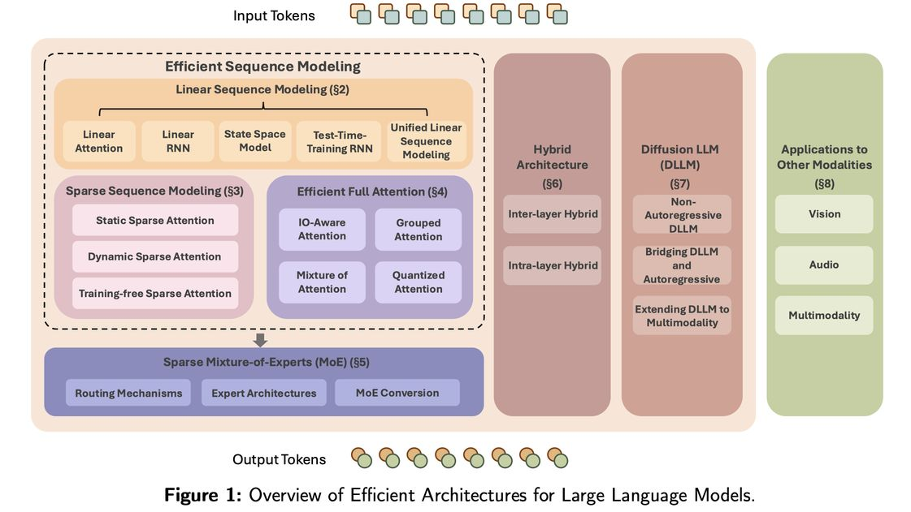

# Speed Always Wins: A Survey on Efficient Architectures for Large Language Models

> Weigao Sun*, Jiaxi Hu*, Yucheng Zhou*, Jusen Du, Disen Lan, Kexin Wang, Tong Zhu, Xiaoye Qu, Yu Zhang, Xiaoyu Mo, Daizong Liu, Yuxuan Liang, Wenliang Chen, Guoqi Li, Yu Cheng
>
> 📄 arXiv: [2508.09834v1](https://arxiv.org/abs/2508.09834v1) | 📅 2025 | 🏷️ survey, attention_sparsity, structure_design, sparse_pruning
>
> 🔗 [GitHub: Awesome-Efficient-Arch](https://github.com/weigao266/Awesome-Efficient-Arch)

---

> ⚠️ **生成声明**：本 note 由 AI Agent（Hermes Agent）于 2026-06-05 自动生成，基于对论文全文的阅读和分析。内容为中文，仅供参考。

---

## 一句话总结

本综述系统性地梳理了大语言模型（LLM）高效架构的七大方向——线性序列建模、稀疏序列建模、高效全注意力、稀疏混合专家、混合架构、扩散大语言模型及跨模态应用，为构建更高效、更具扩展性的 AI 系统提供了全面的技术蓝图。

---

## 摘要翻译

大语言模型（LLMs）在语言理解、生成、推理方面取得了令人瞩目的成果，并推动了多模态模型能力边界的扩展。Transformer 模型作为现代 LLM 的基础，凭借其卓越的缩放特性提供了强大的基线。然而，传统 Transformer 架构需要大量计算资源，对大规模训练和实际部署构成了重大障碍。本综述对旨在解决 Transformer 固有局限并提升效率的创新 LLM 架构进行了系统性考察。从语言建模出发，本综述涵盖了线性和稀疏序列建模方法的背景和技术细节、高效全注意力变体、稀疏混合专家、融合上述技术的混合模型架构，以及新兴的扩散大语言模型。此外，我们讨论了这些技术在其他模态中的应用，并考虑了其对开发可扩展、资源感知基础模型的更广泛影响。通过将近期研究归入上述类别，本综述呈现了现代高效 LLM 架构的蓝图，希望能推动未来更高效、更通用的 AI 系统研究。

---

## 研究动机

1. **Transformer 效率瓶颈**：标准 Transformer 的自注意力机制具有 O(N²) 的计算复杂度，在长序列场景下（如 RAG、AI Agent、推理链、多模态输入）计算和内存开销急剧增长，成为大规模训练和部署的核心障碍。
2. **FFN 扩展困难**：随着模型参数规模增大，前馈网络（FFN）层的训练成本和推理效率问题日益突出。
3. **实际部署需求**：高资源消耗限制了 LLM 在边缘设备和资源受限环境中的应用，亟需效率优化。
4. **多模态与推理需求**：LLM 在多模态理解和复杂推理（LRM）方面的应用越来越广泛，对长序列处理效率提出了更高要求。

---

## 方法（技术细节）

本综述将高效架构分为七大类：

### 2. 线性序列建模（Linear Sequence Modeling）

#### 2.1 线性注意力（Linear Attention）
- **核心思想**：通过核函数/特征映射 φ(·) 近似 softmax 注意力，将注意力复杂度从 O(N²d) 降低到 O(Nd²)。
- **关键公式**：将 softmax(QK⊤)V 重写为 ϕ(Q)(ϕ(K⊤)V)，利用矩阵乘法结合律实现线性复杂度。
- **代表方法**：Linear Transformer、RFA（随机特征注意力）、Nystromformer、Skyformer、Hedgehog 特征映射。
- **门控机制**：引入门控机制增强序列建模能力，如 Lightning Attention（数据无关衰减）、RetNet（保留机制）、GLA（数据依赖门控）、GSA（上下文感知门控）。
- **Delta 学习规则**：通过 Delta（Widrow-Hoff）学习规则更新记忆状态，如 DeltaNet、Gated DeltaNet、MesaNet。
- **对数线性记忆**：Log-Linear Attention 用对数增长的隐藏状态集替代固定大小状态，实现 O(N log N) 训练和 O(log N) 推理。

#### 2.2 线性 RNN（Linear RNN）
- **核心思想**：移除非线性激活，使用线性循环更新，实现高效并行训练和线性推理复杂度。
- **关键公式**：h_t = g_t ⊙ h_{t-1} + (1 - g_t) ⊙ i_t
- **代表方法**：HGRN/HGRN2、RWKV4/6/7、LRU、xLSTM、GateLoop。
- **矩阵值记忆**：通过外积将记忆从 d 维向量扩展为 d×d 矩阵，增强记忆容量（HGRN2、RWKV6、xLSTM）。
- **动态循环**：RWKV6 引入数据依赖的衰减率（通过 LoRA 增强），RWKV7 引入测试时梯度下降（广义 Delta 规则）。

#### 2.3 状态空间模型（State Space Model, SSM）
- **核心思想**：基于控制理论的状态空间模型，通过离散化将连续时间 ODE 转换为离散递推。
- **关键公式**：x'(t) = Ax(t) + Bu(t)，y(t) = Cx(t) + Du(t)
- **离散化**：ZOH（零阶保持）和混合离散化（前向欧拉法）。
- **对角化**：S4/DSS/S4D 将状态矩阵简化为对角或对角加低秩结构，加速计算。
- **选择性 SSM**：Mamba 放弃 HiPPO 初始化，通过线性投影层直接学习数据依赖的参数矩阵；Mamba2 进一步简化为标量状态；Comba 引入标量加低秩（SPLR）矩阵和输出校正机制。
- **代表方法**：S4、S4D、Mamba、Mamba2、Comba、Longhorn、Attraos。

#### 2.4 测试时训练 RNN（Test-Time-Training RNN）
- **核心思想**：将状态矩阵视为可训练的快速权重，通过可学习的优化器进行更新。
- **关键公式**：S_t = α_t S_{t-1} - η_t ∇_S ℓ(S_{t-1}; k_t, v_t)
- **代表方法**：TTT-MLP（SGD 更新+双层 MLP 深层状态）、Titans（一阶动量+长期记忆/瞬时惊奇）、Lattice（线性模型压缩正交信息）、Miras（关联记忆+注意力偏置+保留门+记忆学习算法）、Atlas（高阶特征映射+Omega 规则+Muon 优化器）、LaCT（大块梯度下降）。

#### 2.5 统一线性序列建模
- **记忆视角**：线性注意力、线性 RNN、SSM 和 TTT RNN 逐渐收敛到统一框架。
  - **线性更新规则**：S_t = α_t S_{t-1} + v_t k_t^⊤
  - **双线性更新规则**：S_t = S_{t-1} (I - β_t k_t k_t^⊤) + β_t v_t k_t^⊤（如 Comba、DeltaNet）
  - **非线性更新规则**：TTT 类模型使用非线性操作（如 MLP 激活）
- **优化器视角**：从 L1 损失 → L2 损失 → 多步 L2 损失 → 全局 L2 损失（如 MesaNet）。

#### 2.6 线性化（Linearization）
- **目的**：将预训练的 Transformer 模型转换为线性序列建模架构，降低转换成本。
- **微调方法**：T2R（先对齐后微调）、SUPRA（GroupNorm+小 MLP）、Liger（复用原始权重+单阶段端到端训练）。
- **蒸馏方法**：LoLCATs（低秩线性转换+注意力迁移）、MOHAWK（三阶段渐进训练）、MambaInLlama（多阶段训练+硬件感知推测解码）。
- **RL 时代线性化**：通过蒸馏和微调将 Transformer 推理模型转换为线性架构，如 M1。

#### 2.7 硬件高效实现
- **快速递推**：S4 的卷积形式、Mamba 的 Blelloch 扫描算法。
- **块级并行**：Lightning Attention、GLA、Mamba2 引入块内并行+块间递推。
- **开源框架**：Flash Linear Attention 提供块级并行 Triton 内核。

### 3. 稀疏序列建模（Sparse Sequence Modeling）

#### 3.1 静态稀疏注意力
- **核心思想**：预定义固定注意力模式，训练和推理时不变。
- **模式**：全局、窗口、跨步、稀释、随机、块级。
- **代表方法**：Sparse Transformer（跨步+稀释）、Star-Transformer（径向拓扑+中继节点）、BlockBERT（块级稀疏）、Longformer（滑动窗口+全局令牌）、ETC（局部+全局流）、BigBird（局部+全局+随机）、LongT5（临时全局令牌）、LongNet（指数稀释）、Axial Attention（2D 分解）。

#### 3.2 动态稀疏注意力
- **核心思想**：根据输入内容自适应确定注意力模式。
- **代表方法**：Reformer（LSH 哈希）、Routing Transformer（在线 k-means 聚类）、Sparse Sinkhorn Attention（可微分排列）、ABC（有界记忆控制）、Memorizing Transformers（kNN 检索）、Unlimiformer（交叉注意力）、NSA（硬件对齐层次策略）、MoSA（MoE 风格动态稀疏）。

#### 3.3 无训练稀疏注意力
- **加速预填充**：LongLoRA（移位稀疏注意力）、MInference（固定模式 GPU 内核）、SeerAttention（轻量门控模块）、SeerAttention-R（自蒸馏+共享稀疏模式）。
- **加速解码**：SpAtten（级联令牌/头部剪枝+渐进量化）、StreamingLLM（注意力汇+滑动窗口）、H2O（重型令牌子模优化）、Quest（分页 KV 缓存）、LongHeads（每头独立选择上下文块）、LServe（块级跳过+查询驱动 KV 剪枝）、XAttention（反角和块重要性度量，13.5× 加速）。

#### 3.4 硬件高效实现
- FlashAttention-1/2 的块级稀疏注意力。
- NSA 的硬件对齐策略（分组中心数据加载、共享 KV 获取、网格外循环）。
- MoBA 的块级可变长度计算（10M 令牌序列 16× 加速）。

### 4. 高效全注意力（Efficient Full Attention）

#### 4.1 IO 感知注意力（IO-Aware Attention）
- **FlashAttention-1**：在线 Softmax（增量计算运行最大值和累积权重）、融合注意力计算（单一内核）、反向传播重计算。
- **FlashAttention-2**：更多矩阵乘法、Query-Outer/Key-Value-Inner 循环结构、行级计算。
- **FlashAttention-3**：生产者-消费者异步（TMA+WGMMA）、交错 Matmul+Softmax（双缓冲）、块级 FP8 量化（不相干处理）。

#### 4.2 分组注意力（Grouped Attention）
- **MQA**：多查询注意力，多个查询头共享一个 KV 头，大幅减少 KV 缓存。
- **GQA**：分组查询注意力，MHA 和 MQA 的折中，支持 uptraining。
- **MLA**：多头潜在注意力（DeepSeek-V2/V3），将 KV 缓存压缩为低秩潜在向量。
- **GTA/GLA**：硬件友好+内存高效的注意力变体。

#### 4.3 混合注意力（Mixture of Attention）
- **MoA**：为每个头/层分配不同稀疏注意力模式。
- **MoH**：软选择注意力头，部分剪枝。
- **LLaMA-MoE v2**：扩展到全 LLM，稀疏化注意力和 FFN 层。
- **MoBA**：块级路由，动态选择全/稀疏注意力。
- **MoM**：混合记忆，多稀疏激活记忆槽。
- **MoSA**：细粒度令牌级稀疏，每头动态选择 top-k 令牌。

#### 4.4 量化注意力（Quantized Attention）
- **训练后量化（PTQ）**：SageAttention（INT8 QKT+FP16 softmax-V）、INT-FlashAttention、Q-BERT（4-bit）、TurboAttention。
- **量化感知训练（QAT）**：Q8BERT（8-bit BERT）、I-BERT（端到端 INT8）、FullyQT（8-bit Transformer）。
- **混合精度**：SageAttention 系列、TurboAttention 的 FlashQ。
- **超低比特（<4-bit）**：SageAttention2（INT4 QKT+FP8 V）、SageAttention3（FP4 微缩放，5× 加速）、BitDistiller。

### 5. 稀疏混合专家（Sparse Mixture-of-Experts）

#### 5.1 路由机制（Routing Mechanisms）
- **基本门控**：G(X) = Softmax(XW_g + b_g)，选择 top-k 专家。
- **路由策略**：
  - **Token-choice**：每个 token 选择 k 个专家（易负载不均）。
  - **Expert-choice**：每个专家选择 top-k token（完美负载均衡，但自回归时有局限）。
  - **BASE Layer**：线性分配问题，训练时完美均衡。
  - **Hash Layer**：固定哈希函数路由。
- **自适应 top-k**：可微分激活（ReMoE、BlockFFN）、专家激活估计（MoE-Dynamic、Ada-K）、零计算专家（MoE++、AdaMoE）。
- **负载均衡**：辅助损失（Shazeer CV、GShard 简化版）、AuxLossFree（动态专家偏置）、全局批量负载均衡。

#### 5.2 专家架构（Expert Architectures）
- **细粒度专家**：保持总参数不变，缩小 M（中间维度）增大 N（专家数），增加组合多样性。
- **共享专家**：始终路由的固定专家（DeepSpeed-MoE、Qwen2-MoE、DeepSeekMoE）。
- **MoD（Mixture-of-Depths）**：将 Transformer 层视为专家，为每层选择 top-k token。
- **其他特殊专家**：SoftMoE（软槽）、MoE++（零/复制/常数专家）、ModuleFormer（调度扩展）、LoRA 专家。

#### 5.3 MoE 转换（MoE Conversion）
- **Dense to MoE**：MoEBERT（分割 BERT）、MoEfication（分割 T5）、LLaMA-MoE（分割 LLaMA）、Sparse Upcycling（复制 FFN）。
- **Sparse Model Routing**：BTM（分支训练合并）、BTX（分支训练混合）。

### 6. 混合架构（Hybrid Architectures）

#### 6.1 层间混合（Inter-layer Hybrid）
- **核心思想**：在连续线性序列建模层间插入 softmax 注意力层。
- **代表模型**：
  - **Zamba/Zamba2**：Mamba + 共享全局自注意力块（Zamba2 改用 Mamba2+交替共享注意力+LoRA）。
  - **Jamba**：52B 参数，Mamba + 标准注意力 + MoE（7:1 比例），3× 吞吐量，256K 上下文（4GB KV 缓存）。
  - **Samba**：Mamba + 滑动窗口注意力（无全注意力），零样本外推至 100 万 token。
  - **Mamba-in-Llama**：从预训练 Transformer 蒸馏到 Mamba，多阶段蒸馏。
  - **Hunyuan-TurboS**：56B 激活（560B 总参数），Mamba2 + 标准注意力 + MoE，256K 上下文。
  - **RWKV-X**：RWKV-7 + MoBA 稀疏注意力（约 25% 层使用稀疏注意力）。
  - **YOCO**：滑动窗口注意力 + 标准注意力，共享 KV 缓存。
  - **MiniMax-01**：456B MoE 混合模型，Lightning Attention + softmax 注意力，支持 400 万 token 上下文。
  - **LaCT**：大块 TTT + 局部窗口注意力，支持 100 万 token。

#### 6.2 层内混合（Intra-layer Hybrid）
- **头部拆分（Head-wise）**：Hymba（Mamba + softmax 注意力头分区+可学习元令牌+滑动窗口+跨层 KV 缓存共享），1.5B Hymba 超过 Llama-3.2-3B（3.49× 吞吐量，19× 缓存缩小）。
- **序列拆分（Sequence-wise）**：LoLCATs（线性注意力处理早期令牌+局部 softmax 处理最近令牌，<0.2% 参数更新，支持 405B 参数）、Liger（门控线性循环+滑动窗口注意力，0.02B 微调 token 恢复 93% 性能）、TransMamba（动态切换 softmax 和 Mamba，25% 训练加速）。

### 7. 扩散大语言模型（Diffusion LLMs）

#### 7.1 非自回归扩散 LLM
- **核心思想**：通过渐进去噪/掩码生成文本，支持并行解码。
- **代表模型**：
  - **LLaDA**：8B 参数，通过掩码预测器 p_θ(·|x_t) 迭代去噪，性能匹配 LLaMA-3-8B。
  - **d1 框架**：将预训练掩码扩散 LLM 用于复杂推理（SFT + diffu-GRPO RL 算法），在数学/逻辑推理基准上超越 SFT/RL 基线。

#### 7.2 弥合扩散 LLM 与自回归
- **BD3-LMs**：在块间定义自回归分布，块内执行扩散，支持灵活长度生成和 KV 缓存。
- **DiffuLLaMA/DiffuGPT**：利用预训练 AR 模型通过持续预训练转换为扩散架构，继承上下文学习和指令遵循能力。

#### 7.3 扩展扩散 LLM 至多模态
- **LLaDA-V**：纯扩散多模态 LLM，视觉编码器 + MLP 连接器。
- **UniDisc**：统一离散扩散范式，文本和图像共享词汇表和自注意力。
- **LaViDa**：互补掩码+前缀扩散解码+时间步偏移。
- **Dimple**：自回归-然后-扩散混合训练+自信解码+结构先验。
- **MMaDA**：模态无关扩散基础模型，混合长链思维+UniGRPO RL 算法。

### 8. 其他模态应用（Applications to Other Modalities）

#### 8.1 视觉
- **分类/检测/分割**：Mamba/SAM/RWKV 在医学、自动驾驶、遥感等领域的应用。
- **图像增强/修复/生成**：U-Net 框架中的 Mamba/RWKV，扩散模型中的高效骨干。
- **领域特定**：医学（U-Mamba、VM-UNet）、自动驾驶（Mamba-BEV）、遥感（RS-Mamba）。

#### 8.2 音频
- **理解**：Audio Mamba、BiMamba、Dual-path Mamba。
- **增强/生成**：SEMamba、SaShiMi、Music-Diff。
- **流式处理**：低延迟流式系统（VAD、ASR）。

#### 8.3 多模态
- **对齐/融合**：Mamba-aligner、Cross-Modality Mamba、VisualRWKV。
- **生成**：LLaDA-V、MMaDA、Dimple。
- **MoE 扩展**：LIMoE、Uni-MoE、MoE-LLaVA、MoCLE、Llava-MoLE。

---

## 实验结果

本综述为 survey 类论文，不包含作者自己设计的新实验，但系统总结了各方法的实验结果：

1. **线性序列建模**：Mamba/Mamba2 在语言建模任务上达到或超越 Transformer 性能；GLA 在长上下文建模上优于线性注意力基线；RWKV7 在语言建模和回忆任务上表现优异。
2. **稀疏注意力**：FlashAttention-1/2/3 在保持精确 softmax 注意力的同时显著加速；NSA 在 64K 序列上实现 9.0×/6.0× 前向/反向加速；XAttention 实现 13.5× 加速（长上下文基准）。
3. **MoE**：DeepSeekMoE、Qwen-MoE 等在语言建模中表现优异；细粒度专家（64-top-8）组合数达 4.4×10⁹。
4. **混合架构**：Jamba（7:1 Mamba-Attention-MoE）3× 吞吐量，256K 上下文（4GB KV 缓存）；Samba 零样本外推至 100 万 token；1.5B Hymba 超过 Llama-3.2-3B（3.49× 吞吐量，19× 缓存缩小）。
5. **Diffusion LLM**：LLaDA-8B 性能匹配 LLaMA-3-8B；d1 框架在数学/逻辑推理基准上超越 SFT/RL 基线。
6. **硬件高效实现**：FlashAttention-3 在 Hopper GPU 上实现显著加速；块级并行（Lightning Attention、GLA、Mamba2）在现代硬件上高效运行。

---

## 优势

1. **系统全面**：覆盖七大高效架构方向，从线性序列建模到扩散 LLM，从文本到视觉/音频/多模态，提供完整技术蓝图。
2. **统一视角**：从记忆更新规则和优化器角度统一了线性注意力、线性 RNN、SSM 和 TTT RNN，揭示了它们的收敛趋势。
3. **技术深度**：详细介绍了数学公式、算法设计和硬件高效实现，为实际部署提供指导。
4. **前瞻性**：识别了未来研究方向，如算法-系统-硬件协同设计、自适应注意力、高效大模型、层次化记忆、扩散 LLM 等。
5. **多模态扩展**：不仅限于文本，还涵盖视觉、音频和多模态应用。
6. **实用价值**：包含大量具体模型和方法的对比，为研究者选择架构提供参考。

---

## 局限

1. **信息时效性**：综述于 2025 年 8 月发布，部分方法可能在综述完成后有新进展。
2. **深度与广度权衡**：作为 82 页综述，某些技术细节可能不够深入（如特定硬件实现的细节）。
3. **缺乏统一实验基准**：虽然系统总结了各方法的实验结果，但缺乏统一的实验对比（不同方法在相同基准上的直接比较）。
4. **实际部署考量不足**：虽然讨论了硬件高效实现，但对实际部署中的工程挑战（如模型压缩、服务化、延迟优化）的讨论相对有限。
5. **Diffusion LLM 仍属新兴**：该方向快速发展，综述中的部分结论可能很快被更新。
6. **噪声处理**：PDF 提取文本可能包含公式排版噪声，影响部分内容的准确性。

---

## 与 EfficientPaper 相关的研究方向

本综述与 EfficientPaper 的研究方向高度相关，可重点关注以下方面：

1. **注意力稀疏化（Attention Sparsity）**：
   - 静态稀疏（Longformer、BigBird）和动态稀疏（NSA、MoSA）是 EfficientPaper 的核心关注点。
   - 无训练稀疏注意力（MInference、SeerAttention、XAttention）在推理加速中的应用。

2. **结构设计（Structure Design）**：
   - 线性序列建模（Mamba、GLA、RWKV）与 Transformer 的混合架构。
   - MoE 路由机制和专家架构设计。
   - 扩散 LLM 作为新型生成架构的潜力。

3. **稀疏剪枝（Sparse Pruning）**：
   - MoE 的负载均衡和专家稀疏激活。
   - 稀疏注意力的 KV 缓存剪枝（StreamingLLM、H2O、Quest）。

4. **硬件高效实现**：
   - FlashAttention 系列（IO 感知注意力）。
   - 块级并行（Lightning Attention、GLA、Mamba2）。
   - 量化注意力（SageAttention 系列、INT-FlashAttention）。

5. **线性化技术**：
   - 将预训练 Transformer 转换为线性序列建模架构（T2R、Liger、LoLCATs）。
   - 低参数更新的线性化（Liger 仅 0.02B token 微调）。

6. **多模态高效架构**：
   - 视觉/音频/多模态中的 Mamba/RWKV 应用。
   - MoE 在多模态模型中的扩展（MoE-LLaVA、VL-MoE）。

7. **Diffusion LLM**：
   - 并行解码和可控性优势。
   - AR + 扩散混合架构（BD3-LMs）。

---

## 参考信息

- **论文链接**：https://arxiv.org/abs/2508.09834v1
- **代码仓库**：https://github.com/weigao266/Awesome-Efficient-Arch
- **关键词**：survey, attention_sparsity, structure_design, sparse_pruning
- **机构**：上海人工智能实验室、香港科技大学（广州）、澳门大学、中国科学院自动化研究所、苏州大学、KTH 皇家理工学院、北京大学、香港中文大学
