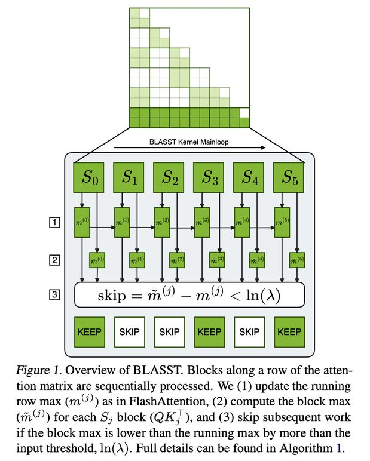

# BLASST: Dynamic BLocked Attention Sparsity via Softmax Thresholding

> Jiayi Yuan, Cameron Shinn, Kai Xu, Jingze Cui, George Klimiashvili, Guangxuan Xiao, Perkz Zheng, Bo Li, Yuxin Zhou, Zhouhai Ye, Weijie You, Tian Zheng, Dominic Brown, Pengbo Wang, Richard Cai, Julien Demouth, John D. Owens, Xia Hu, Song Han, Timmy Liu, Huizi Mao



---

> ⚠️ **本 note 由 AI Agent 自动生成，仅供参考。** 生成时间：2026-06-05。内容基于 arXiv 论文全文提取与分析，如有疏漏请以原文为准。

---

## 一句话总结

BLASST 提出了一种无需预计算或代理分数的动态块稀疏注意力方法，利用 FlashAttention 在线 softmax 中已有的统计信息（running maximum），通过简单的阈值比较跳过可忽略的注意力块，从而在不损失精度的情况下实现 prefill 阶段 1.62× 和 decode 阶段 1.48× 的加速（H200/B200 GPU）。

---

## 摘要翻译

大语言模型（LLM）对长上下文推理能力的需求日益增长，这加剧了标准注意力机制固有的计算和内存瓶颈。为应对这一挑战，我们提出 BLASST，一种即插即用的稀疏注意力方法，无需任何预计算或代理分数即可动态剪枝注意力矩阵。该方法使用固定阈值和在线 softmax 中已有的信息来识别可忽略的注意力分数，从而跳过 softmax 计算、Value 块加载以及随后的矩阵乘法。该方法可无缝融入现有的 FlashAttention 内核设计，延迟开销可忽略不计。该方法适用于 prefill 和 decode 两个阶段，支持所有注意力变体（MHA、GQA、MQA 和 MLA），为加速长上下文推理提供了统一解决方案。我们开发了自动校准程序，揭示了最优阈值与上下文长度之间的简单反比关系，使得在不同场景下能够稳健部署。在保持高精度的同时，我们在现代 GPU 上展示了 74.7% 稀疏度下 prefill 阶段 1.62× 加速和 73.2% 稀疏度下 decode 阶段 1.48× 加速。此外，我们探索了稀疏感知训练作为自然延伸，表明模型可以被训练为对稀疏注意力模式具有更强的鲁棒性，进一步推动精度-稀疏度前沿。

---

## 研究动机

1. **长上下文推理的计算瓶颈**：LLM 的注意力机制具有 O(n²) 的计算复杂度和内存访问开销。随着应用对长上下文窗口（128K-1M tokens）的需求不断增加，这一瓶颈变得越来越严重。即使 FlashAttention 及其后继者通过分块和内核融合优化了内存带宽利用率，它们仍然计算完整的注意力矩阵，未从根本上解决二次复杂度问题。

2. **现有稀疏注意力方法的局限**：
   - **需要昂贵的预计算**：MInference 和 XAttention 等方法需要进行昂贵的预计算来确定稀疏模式，这往往会抵消理论加速效果。
   - **静态稀疏模式不够灵活**：静态稀疏模式虽然避免了预计算，但对不同任务和上下文长度的多样化注意力分布适应性差。
   - **依赖不准确的代理分数**：大多数现有方法依赖于累积注意力权重或 query-key 相似度等代理重要性分数，这些分数可能不准确，会遗漏关键的 token 交互。
   - **仅关注单一阶段**：大多数现有方法仅关注 prefill 或 decode 阶段之一，错失端到端优化的机会。

3. **BLASST 的核心动机**：利用 FlashAttention 在线 softmax 计算中已经存在的统计信息（running maximum），在无需额外开销的情况下动态识别和跳过可忽略的注意力块，实现统一的 prefill + decode 加速。

---

## 方法（技术细节）

### 核心思想：利用 Running Maximum 进行动态块剪枝

BLASST 的核心洞察在于：在 FlashAttention 的分块在线 softmax 计算过程中，许多块对最终输出的贡献可以忽略不计。该方法在前向传播过程中动态识别和跳过这些块，无需预计算或代理分数。

**关键机制**：

在标准注意力机制中，softmax 计算为：
```
Attention(Q, K, V) = softmax(QK^T / √dk) V
```

在 FlashAttention 的分块计算中，维护一个跨块的 running maximum $m_i^{(j)}$。如果某个块的局部最大值 $\tilde{m}_i^{(j)}$ 显著小于当前 running maximum（差异超过阈值 $\ln(\lambda)$），即：
$$\tilde{m}_i^{(j)} - m_i^{(j)} < \ln(\lambda)$$

则经过指数运算后，$\exp(\tilde{m}_i^{(j)} - m_i^{(j)}) < \lambda \approx 0$，该块对最终注意力输出的贡献可忽略不计，可以完全跳过其计算。

**三步近似**：
1. 每个分数 $S_{ij}$ 的理想重要性是其相对于（未知的）全局最大值的相对值。
2. 在线计算真实全局最大值代价过高，因此使用 running maximum 作为可处理的代理。
3. 为实现高效的块级决策，将 token 级的 $S_{ij}$ 替换为块局部最大值，得到高效条件：(block max - running max) < $\ln(\lambda)$。

**跳过操作**（Algorithm 1）：
- **计算节省（CUDA 核心）**：跳过 exp(·) 操作（需要 MUFU.EX2、FMUL、FADD 等指令）和归一化的行求和操作（FADD 指令）。
- **计算节省（Tensor 核心）**：跳过矩阵乘法 $\tilde{P}_{ij} V_j$（prefill 阶段的关键加速来源）。
- **内存带宽节省**：跳过从 HBM 加载 Value 块 $V_j$（decode 阶段的关键加速来源）。

### 内核设计

BLASST 内核设计遵循两个主要目标：(1) 对现有 FlashAttention 内核接口和实现结构的最小改动；(2) 块跳过决策逻辑的最小开销。关键洞察是复用标准 FlashAttention 算法中已经计算的统计信息——特别是在线 softmax 中每个线程的局部最大值和 running maximum 值。

**Skip Decision 实现**：
- 每个块仅需少量额外指令：(1) 基于阈值比较设置每个线程的谓词；(2) 发出 VOTE 指令确定 warp 内所有线程是否一致同意跳过；(3) 一个 ATOMIC 指令（由每个 warp 的一个线程向共享内存发出）跨 softmax warpgroup 协调块级决策。
- 通过精心设计使决策指令隐藏在现有操作之后，增加的延迟开销可忽略不计。

**Prefill 内核（计算密集型优化）**：
- Prefill 通常受 CUDA 核心（softmax）和 Tensor 核心（矩阵乘法）吞吐量限制，而非内存带宽。
- 通过跳过 softmax 计算和 MMA 操作（attention-value 乘法）来减少计算量。
- Value 块仍然从 HBM 加载（因为：(1) 内存带宽不是瓶颈；(2) 预取管道受益于可预测的内存访问模式；(3) 条件性 Value 加载的延迟超过节省量）。
- 通过跳过计算操作，内核释放执行单元，使后续操作可以更早调度，压缩整个调度时间（从 18 个时间单位压缩到 14 个时间单位）。

**Decode 内核（内存密集型优化）**：
- Decode 通常受 HBM 带宽限制（需要获取 KV 缓存），而非计算。
- 主要跳过 Value 矩阵 $V_j$ 的内存密集型加载，直接解决 HBM 瓶颈。
- 跳过被剪枝块的 V 块加载和 BMM2，GPU 可以更快完成其他 TMA 管道阶段的待处理加载（从 30 个时间单位减少到 23 个时间单位）。
- 对于像 MLA 这样在 decode 阶段也更偏向计算密集型的注意力机制，额外跳过 softmax 操作。

### 自动校准（Calibration）

**关键问题**：选择合适的阈值 $\lambda$ 来平衡稀疏度和精度。

**核心发现**：
- 精度下降主要由稀疏度比率本身决定，而非数据集类型或序列长度。
- 不同上下文长度需要不同的阈值：例如，实现 75% 稀疏度需要 8K 上下文时 $\lambda \approx 1e-4$，而 64K 时仅需 $1e-5$。
- 最优阈值与上下文长度 L 之间存在反比关系：$\lambda = a / L$（其中 a 是模型特定常数）。
- 理论基础：由于注意力分数被行归一化为总和为 1，更长的序列每个 token 的平均分数更低，需要按比例缩小的阈值。

**校准算法（Algorithm 2）**：
1. 对每个上下文长度 $L_k$，从数据集采样序列。
2. 在阈值集合 $\Lambda$ 中搜索最佳阈值 $\lambda_{best}$，使测量稀疏度接近目标 $S$（在容差 $\delta$ 内）。
3. 对转换后的数据点 $(1/L_k, \lambda_{best})$ 进行线性回归，拟合斜率 $a$。
4. 返回校准函数 $\lambda(L) = a/L$。

**校准效果**：固定阈值方法在不同上下文长度下产生高度不稳定的稀疏度（4K 时 23% 到 64K 时 75%），而校准方法将稀疏度控制在目标附近，平均误差仅 1.2%。

### 稀疏感知训练（Sparsity-Aware Training）

**动机**：如果模型在训练时学会将重要信息集中在高分注意力块中，那么在推理时剪枝这些块时应保持更高的精度。

**方法**：
- 在微调阶段，在前向传播中应用 BLASST，基于阈值准则跳过可忽略的注意力块。
- 在反向传播中，被跳过的块自然没有梯度（因为它们在前向传播中未被计算），鼓励模型适应与稀疏度兼容的注意力模式。
- 无需架构改变或辅助损失——只需使用与推理时相同的稀疏注意力进行训练。

**效果**：在目标稀疏度 50%-75% 范围内，稀疏训练模型比后训练稀疏应用实现更好的精度，将精度降低减少最高 1.7×。

---

## 实验结果

### 实验设置
- **模型**：Llama-3.1-8B-Instruct、Qwen3-8B-Instruct（均支持 128K 上下文）。
- **基线**：Dense Attention、MInference、FlexPrefill、XAttention（prefill）；Quest、RocketKV（decode）。
- **评估数据集**：
  - 长上下文任务：RULER（4K-128K 合成检索和推理）、LongBench v2（真实 QA、摘要、代码补全）。
  - 推理任务：MATH500（数学问题解决）、AIME 2024（高级数学）、GPQA（研究生级科学）、LiveCodeBench（代码生成）。
- **实现**：基于 flashinfer 框架的优化 CUDA 内核。

### 主要结果

**整体性能（Table 1）**：
- BLASST 在 ~50% 和 ~75% 稀疏度下，在 Llama-3.1-8B 和 Qwen3-8B 上实现最少精度损失。
- 有时甚至优于 dense baseline（如 Qwen3-8B 在 MATH500 上 96.23 vs 95.87，AIME 2024 上 76.50 vs 75.00）。
- 解释：剪枝低注意力块迫使模型集中概率质量于最相关的 token，有效充当隐式去噪；对于长生成推理任务，跳过可忽略的注意力分数过滤了干扰信息。

**Prefill 阶段对比（Table 2）**：
- BLASST 在 Llama-3.1-8B 上实现所有稀疏方法中最佳性能（92.87 RULER 平均，31.8 LongBench），接近 dense attention（93.21，31.4）。
- 显著优于 MInference（84.15 RULER）和 FlexPrefill（87.72 RULER），展示阈值剪枝相对于代理重要性估计的有效性。

**Decode 阶段对比（Table 3）**：
- BLASST 在 Qwen3-8B 上，在 ~50% 稀疏度下匹配或超过 dense baseline 性能（包括 MATH500、AIME 2024、GPQA、LiveCodeBench、RULER、LongBench）。
- 优于 Quest（平均 60.75）和 RocketKV（平均 66.91），BLASST 平均 68.97。

**GPU 内核性能（Table 4）**：
- **Blackwell (B200)**：
  - ~50% 稀疏度：prefill ~1.24× 加速，decode ~1.23× 加速。
  - ~70% 稀疏度：prefill 和 decode 加速提升至 ~1.40×。
  - 最高：prefill 1.79×（91.99% 稀疏度），decode 1.49×（80.35% 稀疏度）。
- **Hopper (H200)**：
  - Prefill 最高 1.62× 加速（74.7% 稀疏度）。
- 0% 稀疏度时无显著性能退化（0.99-1.03× baseline），确保低稀疏度时开销极小。

**校准结果（Table 5）**：
- 固定阈值方法产生高度不稳定的稀疏度（4K 时 23% 到 64K 时 75%）。
- 校准方法 $\lambda = a/L$ 将稀疏度控制在目标附近，平均误差仅 1.2%。

**稀疏感知训练结果（Figure 6）**：
- 稀疏训练模型在低稀疏度时甚至略微超过 dense baseline。
- 在 50%-75% 目标稀疏度范围内，精度降低减少最高 1.7×。

### 消融研究
- **稀疏度分布分析（Figure 7）**：不同层和注意力头表现出显著异质性，BLASST 无需显式机制即可自动适应。
- **与其他方法组合（Table 6）**：BLASST 可与 XAttention（prefill）和 RocketKV（KV 缓存压缩）有效组合，精度下降最小。
- **极长序列（Table 7）**：在 RepoQA 基准上，200K 上下文时实现 ~58% prefill 稀疏度，精度下降极小。
- **Tile 行重排序（Figure 8）**：数据集依赖性行为，对某些数据集有改进，展示 BLASST 对处理顺序的鲁棒性。
- **极端稀疏度分析（Figure 9）**：BLASST 在 70-90% 稀疏度下表现出比 XAttention 更稳定的精度退化。

---

## 优势

1. **无需预计算或代理分数**：直接利用 FlashAttention 在线 softmax 中已有的统计信息，无额外开销。
2. **即插即用（drop-in）**：无需架构改变，可无缝融入现有 FlashAttention 实现。
3. **统一 prefill + decode 加速**：同时优化两个阶段，支持所有注意力变体（MHA、GQA、MQA、MLA）。
4. **自动校准**：揭示阈值与上下文长度的反比关系 $\lambda = a/L$，实现跨场景可靠部署。
5. **可扩展的稀疏感知训练**：进一步推动精度-稀疏度前沿，精度降低减少最高 1.7×。
6. **高效内核实现**：高度优化的 CUDA 内核，prefill 最高 1.62× 加速，decode 最高 1.48× 加速。
7. **与其他方法正交**：可与 XAttention、RocketKV 等方法有效组合，提供灵活部署选项。
8. **稀疏度自动适应**：无需 top-k 选择或头剪枝等显式机制，自动适应不同层和头的自然注意力分布。

---

## 局限

1. **需要阈值调优**：虽然有自动校准，但阈值选择仍是一个超参数，需要校准过程。
2. **稀疏度-精度权衡**：超过 60-70% 稀疏度后精度开始明显下降，与任务和模型相关。
3. **Prefill 阶段 Value 加载未跳过**：当前 prefill 内核设计中 Value 块仍从 HBM 加载（因为内存带宽不是瓶颈），但未来工作负载或硬件架构可能使这成为瓶颈。
4. **对注意力模式的依赖**：稀疏度和精度效果依赖于注意力模式的分布，对于某些分布可能效果有限。
5. **缺乏理论分析**：阈值剪枝的理论保证有限，主要基于经验观察。
6. **未开源**：代码仓库 URL 为空，无法直接复现。
7. **评估模型规模有限**：主要在 8B 参数模型上评估，更大规模模型（70B+）的效果未验证。
8. **校准需要额外数据**：校准过程需要从数据集采样序列，增加部署复杂度。

---

## 与 EfficientPaper 相关的研究方向

1. **稀疏注意力（Sparse Attention）**：BLASST 属于动态稀疏注意力方法，与 MInference、XAttention、FlexPrefill、SpargeAttention 等方法密切相关，是该方向的重要进展。
2. **KV 缓存压缩**：BLASST 与 KV 缓存压缩方法（如 Quest、RocketKV）正交，可组合使用，为端到端长上下文优化提供灵活构建模块。
3. **FlashAttention 内核优化**：BLASST 直接扩展 FlashAttention 框架，展示了在保持内核兼容性的同时实现显著加速的可能性。
4. **长上下文推理加速**：BLASST 为 128K-1M token 的长上下文推理提供高效解决方案，与 DeepSeek-R1、Qwen3、Gemini 等模型的长上下文能力互补。
5. **稀疏感知训练**：BLASST 探索了在训练时引入稀疏注意力的简单方法，为更高效的注意力机制设计提供了新思路。
6. **硬件感知稀疏模式**：BLASST 的内核设计展示了如何针对不同 GPU 架构（Hopper、Blackwell）和计算特征（计算密集型 vs 内存密集型）进行优化。
7. **注意力机制变体**：BLASST 支持所有注意力变体（MHA、GQA、MQA、MLA），展示了与不同注意力架构的兼容性。
8. **自动化部署**：BLASST 的自动校准程序为稀疏注意力方法的生产部署提供了实用工具，与自动化超参数调优相关。
