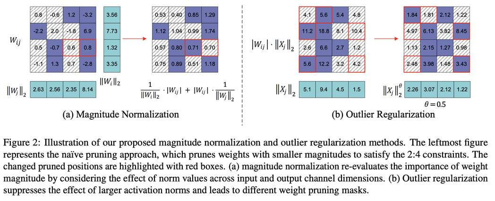

# BaWA: Automatic Optimizing Pruning Metric for Large Language Models with Balanced Weight and Activation

> **⚠️ 生成声明：本文档由 AI Agent（Hermes Agent）自动生成，基于 arXiv 论文全文提取与分析，仅供参考。生成时间：2025年6月。**

---

## 一句话总结

BaWA 通过平衡权重和激活的分布（幅度归一化 + 离群值正则化）并自动搜索最优超参数，实现了 LLM 一次性后训练剪枝的 SOTA 性能，无需权重重建即可显著降低困惑度并提升下游任务准确率。

---

## 摘要翻译

一次性后训练剪枝促进了百亿级大语言模型（LLM）的部署，而剪枝度量在决定移除哪些权重方面起着关键作用。然而，现有度量由于依赖权重和激活的简单符号组合而表现不佳，忽略了不平衡的权重幅度和激活离群值的不成比例影响。为了克服这些局限性，我们提出了 **BaWA**，一种新颖的剪枝度量，系统地平衡权重和激活分布以实现更有效的剪枝。BaWA 引入了两个关键创新：**幅度归一化**（magnitude normalization），减轻跨通道的权重不平衡以实现更公平的剪枝决策；以及**离群值正则化**（outlier regularization），减少激活离群值的影响，确保更合适的通道优先级排序。为了进一步增强其有效性，BaWA 集成了一个高效且自动化的框架来优化归一化和正则化超参数。大量实验验证 BaWA 为 SOTA 剪枝度量。例如，将 BaWA 应用于 Mistral-7B 诱导 2:4 稀疏性，语言理解困惑度降低了 2.49，平均下游任务准确率提高了 3.08%，超越了先前的 SOTA 方法 Wanda。

---

## 研究动机

### 问题背景

随着 LLM 参数规模增长至数百亿甚至上千亿，模型压缩技术（如量化和剪枝）成为实际部署的关键。一次性后训练剪枝（one-shot post-training pruning）因其无需梯度反向传播或微调而备受关注。然而，现有方法受限于**次优的剪枝度量**。

### 两个关键现象

1. **权重幅度分布不平衡（Imbalanced Weight Magnitude Distribution）**
   - LLM 的权重幅度分布是不平衡的，某些输入或输出通道表现出异常大或小的幅度
   - 这种不平衡导致通道内的权重被整体保留或整体剪枝，无论其对模型性能的实际重要性如何
   - 通过 LLaMA-7B 的可视化分析验证了这一现象

2. **激活离群值的不成比例影响（Disproportionate Influence of Outliers）**
   - 少量激活离群值可以不成比例地膨胀通道的范数值
   - 不到 1% 的离群值可以将通道范数值放大 5 倍以上
   - 这导致含离群值的通道被错误地优先保留，而其他通道被低估

### 现有方法的不足

- **Wanda**：使用 |W| · ||X||₂ 作为度量，未考虑权重幅度的不平衡
- **GBLM-Pruner**：使用梯度信息，但改进有限
- **Pruner-Zero**：使用遗传编程搜索符号剪枝度量，计算开销大
- 这些方法都依赖于权重、激活和梯度的简单符号组合，忽略了 LLM 中权重和激活的异构分布

---

## 方法（技术细节）

### 1. 幅度归一化（Magnitude Normalization）

**核心思想**：不仅考虑激活的逐通道范数值，还要考虑权重本身的幅度。

**输入通道归一化（Input Channel Normalization）**：
$$S_{ij}^{(ICN)} = |W_{ij}| \cdot \frac{1}{\|W_j\|_2} \cdot \|X_j\|_2$$

- 对输入通道的权重幅度进行归一化，避免过度关注激活值

**输出通道归一化（Output Channel Normalization）**：
$$S_{ij}^{(OCN)} = \frac{1}{\|W_i\|_2} \cdot |W_{ij}| \cdot \|X_j\|_2$$

- 对输出通道的权重幅度进行归一化，减轻激活离群值的不当影响

**联合归一化**：$S_{ij}^{(MN)} = S_{ij}^{(ICN)} + S_{ij}^{(OCN)}$，使不同通道的剪枝掩码分布更加平衡

### 2. 离群值正则化（Outlier Regularization）

**核心思想**：引入可学习的幂次因子 θ，控制离群值对剪枝度量的影响。

$$S_{ij}^{(OR)} = |W_{ij}| \cdot \|X_j\|_θ$$

- 通过调节 θ 的值来抑制离群值的影响
- 对权重范数和激活范数都应用离群值正则化

### 3. BaWA 最终度量

$$S_{ij} = \left( |W_{ij}| \cdot \frac{1}{\|W_j\|_2^{θ_1}} + \frac{1}{\|W_i\|_2^{θ_2}} \cdot |W_{ij}| \right) \cdot \|X_j\|_2^{θ_3}$$

其中：
- θ₁：输入通道归一化的幂次因子
- θ₂：输出通道归一化的幂次因子
- θ₃：激活范数的幂次因子

### 4. 高效幂次因子搜索（Efficient Power Factor Search）

**搜索目标**：以 Transformer block 为单位，最小化剪枝前后的输出差异

$$L(Θ; X) = \|\text{RMSNorm}(F(W; X)) - \text{RMSNorm}(F(W \odot M; X))\|_2^2$$

**参数优化算法**：使用零阶优化器（Zeroth-Order Optimizer）估算梯度

$$\hat{\nabla}L(Θ; X) = \frac{L(Θ + ϵz; X) - L(Θ - ϵz; X)}{2ϵ}$$

- z ~ N(0, Iₙ)，ε = 0.01
- 使用 SGD 优化器，学习率 0.2，2 个 epoch
- 校准数据集：128 个随机 2048-token 段（来自 C4）
- 整个搜索过程约 16 分钟完成（LLaMA2-70B，单 GPU）

**关键特性**：
- 搜索空间从指数级降低到多项式级（按 Transformer block 优化）
- 使用 RMSNorm 平衡不同 block 的误差差异
- 即使不进行自动搜索，BaWA 也能轻松超越 Wanda

---

## 实验结果

### 语言建模（WikiText-2 Perplexity）

**不同稀疏率下的表现**：
- LLaMA-7B（70% 稀疏）：BaWA (57.84) vs Wanda (74.79)，降低 16.95
- LLaMA2-70B（80% 稀疏）：BaWA (125.71) vs Wanda (149.76)，降低 24.05
- Qwen2-72B（80% 稀疏）：BaWA (31.89) vs Wanda (40.50)，降低 8.61

**N:M 稀疏模式**：
- 2:4 稀疏（Mistral-7B）：BaWA (9.88) vs Wanda (12.37)，降低 2.49
- BaWA + ADMM 组合在所有模型上达到最佳性能
- BaWA + ADMM（2:4，Mistral-7B）：9.53（最佳）

### 零样本任务（Zero-Shot Tasks）

- 在 7 个零样本任务上，BaWA 一致超越 Wanda
- LLaMA2-70B（50% 稀疏）：BaWA (67.81%) vs Wanda (67.03%)
- Mistral-7B（50% 稀疏）：BaWA (60.17%) vs Wanda (58.93%)
- Qwen2-72B（50% 稀疏）：BaWA (69.11%) vs Wanda (66.41%)

### 消融实验（Ablation Study）

| 方法 | LLaMA2-13B (4:8) | LLaMA2-70B (4:8) | Qwen2-72B (4:8) |
|------|------------------|------------------|-----------------|
| Wanda | 6.55 | 4.47 | 5.86 |
| 输入通道归一化 | 6.38 | 4.42 | 5.84 |
| 幅度归一化 | 6.27 | 4.41 | 5.81 |
| 离群值正则化 (0.5) | 6.20 | 4.39 | 5.77 |
| BaWA w/o 自动搜索 | 6.27 | 4.41 | 5.80 |
| BaWA w/ 自动搜索 | 6.16 | 4.32 | 5.74 |

- 幅度归一化在非结构化剪枝中效果更大
- 离群值正则化在 N:M 稀疏条件下效果更显著
- 自动搜索进一步降低困惑度

### 幂次因子分析

| 缩放策略 | θ₁ | θ₂ | θ₃ | PPL | Δ |
|---------|-----|-----|-----|-----|---|
| 固定 θ=0.1 | 0.1 | 0.1 | 0.1 | 8.92 | +24.1% |
| 固定 θ=0.5 | 0.5 | 0.5 | 0.5 | 7.18 | baseline |
| 固定 θ=1.0 | 1.0 | 1.0 | 1.0 | 7.53 | +4.9% |
| BaWA 优化 | 0.42 | 0.51 | 0.38 | 6.30 | **-12.3%** |

- 不同幂次因子设置对性能影响显著（±24.1% PPL 方差）
- 优化后的幂次因子相比最佳固定设置（θ=0.5）降低 12.3% 困惑度

### 鲁棒性分析

- BaWA 对校准样本数量几乎不敏感，即使只有 1 个样本也能获得满意结果
- 这主要归功于离群值正则化策略，有效抑制了采样异常对剪枝结果的影响

### 计算开销

| 方法 | 7B | 13B | 70B |
|------|-----|------|------|
| Wanda | 0.4s | 0.8s | 2.2s |
| SparseGPT | 3.1min | 5.2min | 22.3min |
| BaWA w/o 搜索 | 0.5s | 0.8s | 2.4s |
| BaWA w/ 搜索 | 1.9min | 3.7min | 16.2min |

- BaWA 不进行搜索时与 Wanda 计算开销相当
- 进行搜索时比 SparseGPT 更快（LLaMA2-70B：16.2min vs 22.3min）

### 硬件加速

- 2:4 稀疏在 NVIDIA A100 上实现 1.58× 加速（token 生成阶段）
- Q/K/V 层加速 1.66×，Up/Gate 层加速 1.71×，Down 层加速 1.40×
- 也支持 CPU 加速（如 AMD Ryzen 7 PRO 5850U）

---

## 优势

1. **无需权重重建**：作为度量方法，BaWA 无需梯度反向传播或微调，即可显著提升剪枝性能
2. **与权重重建方法正交**：BaWA 的度量可以与现有的权重重建技术（如 ADMM、DSnoT）无缝结合
3. **高效搜索**：零阶优化使得搜索过程仅需 16 分钟（LLaMA2-70B，单 GPU），比 SparseGPT 更快
4. **鲁棒性强**：对校准样本数量和随机种子不敏感，即使只有 1 个样本也能获得满意结果
5. **通用性强**：在多种 LLM（LLaMA、LLaMA2、Mistral、Qwen2）和多种稀疏模式（50%、2:4、4:8）上均有效
6. **易于实现**：基于 PyTorch，实现简单，不依赖特殊的硬件支持
7. **显著性能提升**：在各种基准测试上一致超越 Wanda、SparseGPT 等 SOTA 方法

---

## 局限

1. **仅适用于非结构化剪枝**：本文聚焦于非结构化剪枝和 N:M 稀疏模式，未涉及结构化剪枝
2. **依赖校准数据集**：需要 128 个校准样本（C4 数据集），虽然鲁棒性强，但仍需要一定数据
3. **搜索成本**：虽然比 SparseGPT 快，但仍有 16 分钟的搜索开销（LLaMA2-70B）
4. **幂次因子敏感性**：不同层对幂次因子的敏感性不同，可能需要进一步优化
5. **层间敏感性分析不完整**：论文提到前几层和后几层对剪枝策略的敏感性不同，但未提供完整的层间优化方案
6. **缺乏对结构化剪枝的探索**：未讨论与结构化剪枝方法的结合
7. **未讨论与其他度量方法的对比**：仅与 Wanda、SparseGPT、Magnitude 等方法对比

---

## 与 EfficientPaper 相关的研究方向

1. **稀疏剪枝度量优化**
   - BaWA 属于稀疏剪枝度量优化的范畴，是 EfficientPaper 中"稀疏剪枝"方向的重要工作
   - 与 SparseGPT、Wanda 等方法共同构成 LLM 稀疏剪枝的完整方法谱

2. **零阶优化在 LLM 压缩中的应用**
   - BaWA 使用零阶优化器来搜索最优超参数，这一思路可以扩展到其他 LLM 压缩任务（如量化）
   - 为非可微分优化问题提供了一种高效的解决方案

3. **权重-激活分布不平衡的缓解**
   - BaWA 指出权重幅度分布不平衡和激活离群值是影响剪枝效果的关键因素
   - 这一洞察可以推广到其他模型压缩任务（如量化中的离群值处理）

4. **与权重重建方法的结合**
   - BaWA 的度量方法与权重重建方法（如 ADMM、DSnoT）正交，可以进一步提升性能
   - 未来可以探索更多组合策略

5. **N:M 稀疏的硬件加速**
   - BaWA 在 2:4 稀疏下实现了 1.58× 加速，这与 EfficientPaper 中的硬件加速研究密切相关
   - 未来可以探索更高效的 N:M 稀疏实现方案

6. **自动化模型压缩框架**
   - BaWA 的自动搜索框架可以作为更广泛的自动化模型压缩框架的一部分
   - 与 AutoML、神经架构搜索等方向有交叉

---

*本 note 由 AI Agent 自动生成，基于论文全文分析。如有疑问请参考原文。*
