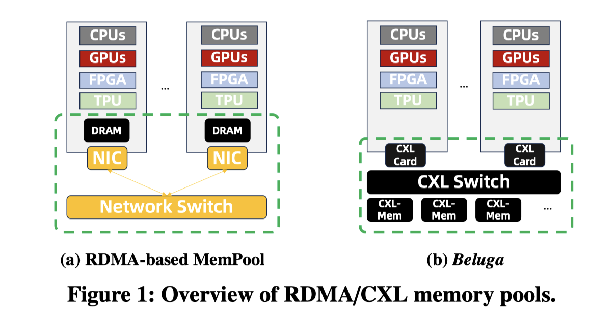

# Beluga: A CXL-Based Memory Architecture for Scalable and Efficient LLM KVCache Management

> Xinjun Yang, Qingda Hu, Junru Li, Feifei Li, Yicong Zhu, Yuqi Zhou, Qiuru Lin, Jian Dai, Yang Kong, Jiayu Zhang, Guoqiang Xu, Qiang Liu

## Abstract

The rapid increase in LLM model sizes and the growing demand for long-context inference have made memory a critical bottleneck in GPU-accelerated serving systems. Although high-bandwidth memory (HBM) on GPUs offers fast access, its limited capacity necessitates reliance on host memory (CPU DRAM) to support larger working sets such as the KVCache. However, the maximum DRAM capacity is constrained by the limited number of memory channels per CPU socket. To overcome this limitation, current systems often adopt RDMA-based disaggregated memory pools, which introduce significant challenges including high access latency, complex communication protocols, and synchronization overhead. Fortunately, the emerging CXL technology introduces new opportunities in KVCache design. In this paper, we propose Beluga, a novel memory architecture that enables GPUs and CPUs to access a shared, large-scale memory pool through CXL switches. By supporting native load/store access semantics over the CXL fabric, our design delivers near-local memory latency, while reducing programming complexity and minimizing synchronization overhead. We conduct a systematic characterization of a commercial CXL switch-based memory pool and propose a set of design guidelines. Based on Beluga, we design and implement Beluga-KVCache, a system tailored for managing the large-scale KVCache in LLM inference. Beluga-KVCache achieves an 89.6% reduction in Time-To-First-Token (TTFT) and 7.35x throughput improvement in the vLLM inference engine compared to RDMA-based solutions. To the best of our knowledge, Beluga is the first system that enables GPUs to directly access large-scale memory pools through CXL switches, marking a significant step toward low-latency, shared access to vast memory resources by GPUs.
