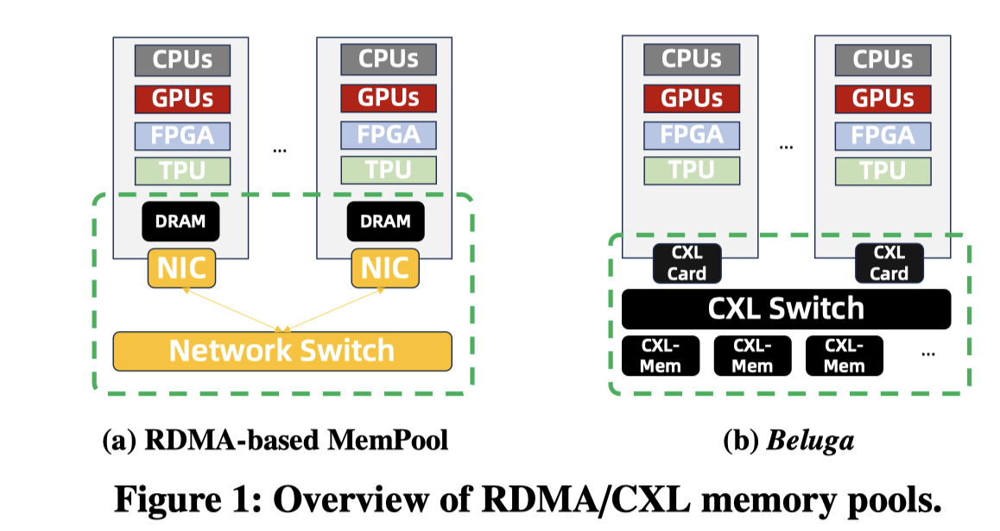

# Beluga: A CXL-Based Memory Architecture for Scalable and Efficient LLM KVCache Management

> Xinjun Yang, Qingda Hu, Junru Li, Feifei Li, Yicong Zhu, Yuqi Zhou, Qiuru Lin, Jian Dai, Yang Kong, Jiayu Zhang, Guoqiang Xu, Qiang Liu

---

## 一句话总结

Beluga 是首个基于 CXL 2.0 交换机的 GPU 集群共享内存架构，通过原生 load/store 语义实现近本地内存延迟的 KVCache 管理，在 LLM 推理中实现 TTFT 降低 89.6%、吞吐量提升 7.35 倍（相比 RDMA 方案）。

---

## 摘要翻译

随着 LLM 模型规模的快速增大和长上下文推理需求的增长，内存已成为 GPU 加速服务系统中的关键瓶颈。尽管 GPU 上的高带宽内存（HBM）提供了快速访问，但其有限的容量使其必须依赖主机内存（CPU DRAM）来支持更大的工作集（如 KVCache）。然而，最大 DRAM 容量受每个 CPU 插槽有限的内存通道数量制约。为克服这一限制，当前系统通常采用基于 RDMA 的解耦内存池，但这会引入高访问延迟、复杂的通信协议和同步开销等重大挑战。幸运的是，新兴的 CXL 技术为 KVCache 设计带来了新的机遇。本文提出 Beluga，一种新颖的内存架构，使 GPU 和 CPU 能够通过 CXL 交换机访问共享的大规模内存池。通过在 CXL 织网上支持原生 load/store 访问语义，我们的设计实现了接近本地内存的延迟，同时降低了编程复杂度并最小化同步开销。我们对基于商用 CXL 交换机的内存池进行了系统性表征，并提出了一套设计准则。基于 Beluga，我们设计并实现了 Beluga-KVCache，一个专门为 LLM 推理中大规模 KVCache 管理定制的系统。Beluga-KVCache 在 vLLM 推理引擎中实现了 89.6% 的 Time-To-First-Token (TTFT) 降低和 7.35 倍的吞吐量提升（相比 RDMA 方案）。据我们所知，Beluga 是首个使 GPU 通过 CXL 交换机直接访问大规模内存池的系统，标志着 GPU 低延迟、共享访问海量内存资源的重要一步。

---

## 研究动机

### 背景问题

1. **KVCache 内存瓶颈**：LLM 推理中 KVCache 的内存占用随上下文长度线性增长，例如 Kimi 模型处理 50M tokens 时需要约 20TB DRAM。GPU 的 HBM 容量有限，必须依赖主机内存。

2. **RDMA 方案的局限**：
   - **性能低效**：CPU 驱动的 RDMA 模式需要通过 bounce buffer 进行 GPU→主机内存→远程内存的多步数据传输，引入显著延迟。
   - **控制路径复杂**：RDMA 依赖复杂的网络协议和跨组件同步，微基准测试显示 16KB 传输的 75% 延迟来自同步开销。
   - **资源浪费**：RDMA 的轮询机制导致 CPU 核心或 GPU SM 被占用，与推理任务竞争资源。
   - **编程复杂度高**：开发者需要管理低级别的网络栈、工作请求准备和性能优化。
   - **调度复杂**：RDMA 内存池的非均匀层次结构要求复杂的缓存感知调度策略。

3. **CXL 技术机遇**：CXL（Compute Express Link）提供了直接、低延迟的 load/store 内存接口，允许 CPU/GPU 以接近本地内存的效率访问远程内存。CXL 2.0 交换机支持多主机并发访问和大规模内存池。

### 核心动机

- 现有 RDMA 方案的性能和复杂度瓶颈严重限制了 KVCache 卸载的潜在收益。
- CXL 2.0 交换机（XConn XC50256）的商用化使得大规模 CXL 内存池的实际部署成为可能。
- 需要系统性的性能表征和优化指南，以释放 CXL 在 LLM 推理中的全部潜力。

---

## 方法（技术细节）

### 1. Beluga 架构设计

**硬件拓扑**：
- 每台服务器有 2 个 CPU 插槽（NUMA 架构），每个插槽通过 PCIe 5.0 x16 PCIe/CXL 适配器连接到 CXL 交换机。
- CXL 内存池由交换机节点和独立的内存盒子组成。交换机配备两颗 XConn XC50256 芯片，每颗提供 2 TB/s 的转发容量（256 条 PCIe 5.0 通道）。
- CXL 交换机可连接最多 16 台服务器到 8 TB 内存池，总带宽 1 TB/s。
- 用 PCIe/CXL 适配器替换 RDMA NIC，减少硬件成本（适配器 $210 vs NIC $1,745）。

**数据访问接口**：
- CPU 端：支持直接 load/store 指令访问和 Intel DSA（数据流加速器）硬件加速传输。
- GPU 端：支持 cudaMemcpy P2P 传输和自定义 CUDA kernel 细粒度非连续访问。

### 2. 缓存一致性管理（软件实现）

CXL 2.0 不支持多主机间硬件缓存一致性，需要软件管理：

**写端（确保数据到达 CXL 内存）**：
- **静态 uncacheable 配置**：通过 MTRR 设置 CXL 内存为 uncacheable，写入直接绕过缓存。对 GPU 传输，禁用 DDIO。
- **细粒度缓存刷新**：使用 CLFLUSH/CLFLUSHOPT/CLWB 指令显式刷新缓存行。
- **无缓存绕过写入**：使用 ntstore 指令绕过缓存层次直接写入 CXL 内存。

**读端（确保从 CXL 内存获取新鲜数据）**：
- **静态 uncacheable 配置**：CPU 读取强制访问远程 CXL 内存。
- **读前缓存刷新**：使用 CLFLUSH 指令在读取前无效化缓存行。

**最佳实践**：
- CPU store：使用 ntstore（延迟 2.41µs）
- CPU load：CLFLUSH 后读取（延迟 5.98µs）
- CPU DSA：uncacheable 内存（读写延迟均最优）
- GPU memcpy：禁用 DDIO + uncacheable 内存（写入 9.14µs）

### 3. 延迟优化

- **CPU 访问**：小 I/O（< 4KB）用直接 load/store，大传输用 DSA（16KB 以上 DSA 更优）。
- **GPU 访问**：
  - 使用异步 CUDA stream 启动内核以隐藏启动延迟。
  - 从 uncacheable CXL 内存到 GPU 的数据传输（< 24KB）必须使用自定义 CUDA memcpy kernel（标准 cudaMemcpy 性能急剧下降）。
  - 64KB CXL-to-GPU 延迟 11.73µs，接近 CPU-to-GPU 的 10.32µs。

### 4. 带宽优化

- **瓶颈分析**：CPU Root Complex (RC) 是主要带宽瓶颈。单个 PCIe/CXL 适配器（16 通道）读带宽 46.2 GB/s，写带宽 33 GB/s，GPU 访问仅 26 GB/s。
- **优化策略**：
  - 未来架构应支持 GPU 直连 CXL 交换机（绕过 RC）。
  - 增加 PCIe/CXL 适配器数量以扩展带宽。
  - 在多个 CXL 内存设备间交织数据（2MB 粒度软件交织），避免单设备瓶颈。

### 5. Beluga-KVCache 系统

**KVCache 数据传输**：
- KVCache 在 GPU 中非连续存储（按层和 token 分离），需要序列化到连续内存池块。
- RDMA 的 scatter-gather lists（sglists）受限于硬件（如 ConnectX-7 NIC 限制 30 项），需要将操作拆分为多个 RDMA 请求。
- Beluga 使用自定义 CUDA copy kernel 实现无限制的 gather writes 和 scatter reads，消除 RDMA 的请求管理开销。
- **稀疏 KVCache 优势**：对于稀疏 KVCache（如 H2O、SnapKV），单个 token 的 KVCache 可分散为 1024 个小块（160 字节），Beluga 通过单个 CUDA kernel 高效处理，延迟比 RDMA 降低 95.9%。

**CXL-Based RPC**：
- 在 CXL 内存池中保留小块内存用于跨服务器通信（生产者-消费者模型）。
- 客户端写入请求到空闲槽并设置 REQ_READY 标志，服务器轮询处理后设置 RESP_READY 标志。
- 优化：ntstore 避免缓存污染、CLFLUSH 确保数据可见性、批量 mfence 操作、用户空间操作避免内核切换。
- 性能：低并发（QD=1）延迟 2.11µs（RDMA-RC 8.39µs，提升 4 倍）；高并发（QD=128）吞吐量 12.13 Mops（RDMA-RC 4.5 Mops，提升 2.7 倍）。

**无 KVCache 层次的调度**：
- 传统 RDMA 方案需要缓存感知调度策略（将请求路由到拥有所需数据块的节点）。
- Beluga 将 CXL 内存池抽象为统一、对称的地址空间，远程访问延迟接近本地。
- 实现缓存无关调度：使用标准负载均衡技术分配请求，无需考虑缓存位置。
- 节点添加/移除无需重新平衡 KVCache 分区。

---

## 实验结果

### 实验环境
- 两台服务器集群，每台 8 个 H20 GPU（96GB），共 16 个并发 vLLM 实例。
- CXL 内存池 8 TB（32 个 DDR5 4800 MT/s 256GB 设备）。
- RDMA 内存池 4 TB（2 台 GPU 服务器）。
- 模型：Qwen-32B（未量化）。
- 基线：MoonCake（v3.2）、Dynamo（v0.4.1）、原生 vLLM。
- 工作负载：LV-Eval（长上下文 QA，>15K tokens）。

### 端到端性能（Exp #5）

| 指标 | Dynamo | vLLM | vLLM+MoonCake | vLLM+Beluga |
|------|--------|------|---------------|-------------|
| **首次运行（Cache-populate）** | | | | |
| Avg TTFT | 17.96s | 18.76s | 19.66s | **17.22s** |
| QPS (req/s) | 1.15 | 0.96 | 1.02 | **1.24** |
| **第二次运行（Cache-hit）** | | | | |
| Avg TTFT | 15.69s | 18.23s | 13.00s | **1.36s** |
| QPS (req/s) | 1.32 | 0.96 | 1.54 | **11.32** |

**关键发现**：
- Cache-hit 场景：Beluga-KVCache 平均 TTFT 降低 89.6%，QPS 提升 7.35 倍（相比 MoonCake）。
- Cache-populate 场景：Beluga-KVCache 平均 TTFT 降低 12.4%，QPS 提升 21.5%。
- 性能优势在缓存命中场景最显著，因为 CXL 的数据访问比 RDMA 高效得多。

### 敏感性分析

**请求到达率（Exp #6）**：
- 在各种请求速率（0.3-9.0 QPS）下，Beluga-KVCache 始终优于 MoonCake，TTFT 和 TPOT 均更低。
- 在缓存命中场景中，CXL 数据访问效率显著优于 RDMA。

**输入上下文长度（Exp #7）**：
- 随着输入 token 数增加，Beluga 的性能提升更显著（因为 KVCache 读写时间在端到端延迟中占比更大）。
- 长上下文场景（如 LV-Eval 15K+ tokens）中优势最为明显。

**软件配置（Exp #8）**：
- Prefill-Decode 分离架构中，Beluga 的 KVCache 加载/存储路径实现 3.41×~9.47× 更高 QPS。
- KVCache 块大小：RDMA 需要大块（256 tokens）以摊销控制开销，Beluga 可高效使用 vLLM 原生小块（16 tokens）。
- 软件内存交织：有交织时 QPS 11.32，无交织时 8.49（提升 33.2%）。

### 性能分解

**稠密 KVCache 传输（Exp #9）**：
- Beluga 消除了 bounce buffer，直接 GPU→CXL 内存路径。
- KVCache 写入延迟降低 36.2%，读取延迟降低 38.7%（相比 MoonCake）。

**稀疏 KVCache 传输（Exp #10）**：
- 对于 Qwen-32B 模型（Top 256 tokens，16 个稀疏 token），Beluga 延迟 211µs vs RDMA 5260µs（降低 95.9%）。
- Llama-3-8B：97µs vs 2670µs（降低 96.4%）。

**RPC 性能（Exp #11）**：
- 低并发（QD=1）：CXL-RPC 2.11µs vs RDMA-RC 8.39µs（4× 提升）。
- 高并发（QD=128）：CXL-RPC 12.13 Mops vs RDMA-RC 4.5 Mops（2.7× 提升）。

### 并发工作负载性能

- 在 skew 分布访问下，CXL 中位延迟仅为 RDMA 的 10.2%~13.3%（64B 操作）和 39.5%~56.2%（16KB 操作）。
- 无内存交织时，16KB skew 工作负载下带宽和延迟明显下降。
- 后台带宽压力下，中位延迟稳定，P99 延迟随同向带宽压力增加。

---

## 优势

1. **显著性能提升**：TTFT 降低 89.6%，吞吐量提升 7.35 倍（相比 RDMA 方案），缓存命中场景优势尤为突出。

2. **低延迟内存访问**：CXL 内存池提供近本地内存延迟（64KB CXL-to-GPU 延迟 11.73µs，接近 CPU-to-GPU 的 10.32µs），消除了 RDMA 的多步数据传输开销。

3. **简化编程模型**：开发者无需管理低级网络栈、复杂工作请求和跨组件同步，数据访问接口类似本地 DRAM。

4. **简化调度**：缓存无关调度（cache-oblivious scheduling）消除了复杂的缓存感知调度策略，节点添加/移除无需重新平衡。

5. **降低硬件成本**：CXL 适配器（$210）远低于 RDMA NIC（$1,745），CXL 交换机（$5,800）低于 RDMA 交换机（$16,000）。

6. **灵活的细粒度访问**：无需 RDMA 的 scatter-gather list 限制，支持无限的 gather writes 和 scatter reads，特别适合稀疏 KVCache。

7. **首个商用 CXL 2.0 交换机集成系统**：基于 XConn XC50256 的实际部署，提供真实硬件性能数据和优化指南。

---

## 局限

1. **缓存一致性需软件管理**：CXL 2.0 不支持多主机间硬件缓存一致性，需要软件实现一致性协议，增加了系统复杂度。未来 CXL 3.0 可能解决此问题，但目前仍在发展中。

2. **带宽瓶颈**：CPU Root Complex 是主要瓶颈，GPU 到 CXL 内存的带宽（26 GB/s）远低于 CXL 内存控制器和 GPU 自身的 PCIe 带宽（55.4 GB/s）。GPU 直连 CXL 交换机的架构尚未实现。

3. **单设备带宽限制**：每个 CXL 内存设备支持 22.5 GB/s，需要软件交织避免单设备瓶颈。

4. **RPC 可靠性不足**：CXL-RPC 提供的可靠性保证低于 RDMA 传输协议，依赖上层机制确保可靠性。

5. **商用硬件限制**：基于 XConn XC50256（B1 样品价格）的 CXL 2.0 交换机仍在早期阶段，最终价格和功能可能变化。

6. **模型和工作负载局限**：评估主要基于 Qwen-32B 模型和 LV-Eval 工作负载，未涵盖更多模型架构和多样化工作负载场景。

7. **缺乏开源代码**：论文未提供开源实现（prototxt 中代码 URL 为空），限制了可复现性。

---

## 与 EfficientPaper 相关的研究方向

### 1. LLM 推理中的内存管理
- **KVCache 管理**：Beluga 的 KVCache 卸载和共享机制是 LLM 推理优化的核心方向，与 vLLM、MoonCake、LMCache 等系统相关。
- **稀疏 KVCache**：Beluga 对稀疏 KVCache（H2O、SnapKV）的高效支持，探索了注意力稀疏性与系统优化的结合。
- **Prefill-Decode 分离**：Beluga 的调度简化与 DistServe、Orca 等分离架构的结合。

### 2. 内存解耦架构
- **CXL vs RDMA**：Beluga 对 CXL 和 RDMA 的系统性比较，为选择内存解耦技术提供依据。
- **统一内存池**：Beluga 的统一地址空间和缓存无关调度，为构建统一、可扩展的内存池提供范式。
- **GPU 直连内存**：Beluga 的 GPU-to-CXL 路径，探索 GPU 直连远程内存的架构可能性。

### 3. CXL 生态系统
- **CXL 硬件表征**：Beluga 对 XConn XC50256 的详细性能分析，为 CXL 硬件优化提供参考。
- **CXL 软件栈**：缓存一致性管理、CXL-Based RPC、内存交织等软件优化，为 CXL 生态系统建设提供经验。
- **CXL 3.0 前景**：CXL 3.0 的硬件缓存一致性和多层交换，可能进一步简化 Beluga 的设计。

### 4. 数据库与 AI 融合
- **数据库中的 LLM 推理**：Beluga 的背景提到数据库厂商（PolarDB、GaussDB）集成 LLM 推理，CXL 可为数据库中的 AI 工作负载提供高效内存访问。
- **向量数据库和图数据库**：Beluga 的未来工作提到 CXL 内存池可打破向量数据库（如 HNSW）和图数据库的内存容量限制。

### 5. 成本与效率优化
- **硬件成本优化**：CXL 方案显著降低网络设备成本，为云环境中的资源池化提供经济高效的解决方案。
- **资源利用率**：CXL 内存池分离内存与 CPU 资源，允许多服务器共享内存，提高资源利用率。

### 6. 系统优化方向
- **自定义 CUDA kernel**：Beluga 的自定义数据拷贝 kernel 避免了标准 cudaMemcpy 的性能下降，为细粒度 GPU 内存操作提供范式。
- **用户空间操作**：CXL-RPC 的用户空间操作避免内核切换，为高性能 RPC 设计提供参考。

---

## 生成声明

本笔记由 AI Agent（Hermes Agent）于 2025 年 6 月 5 日自动生成，基于论文全文阅读和结构化分析。所有内容用中文撰写，包含论文核心贡献、技术细节、实验结果和研究方向的完整总结。
