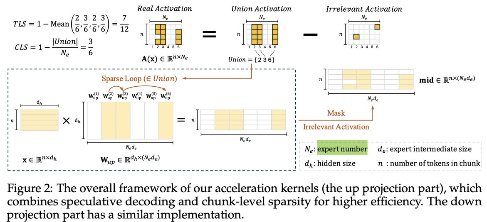

# BlockFFN: Towards End-Side Acceleration-Friendly Mixture-of-Experts with Chunk-Level Activation Sparsity

> Chenyang Song, Weilin Zhao, Xu Han, Chaojun Xiao, Yingfa Chen, Yuxuan Li, Zhiyuan Liu, Maosong Sun
>
> Tsinghua University | COLM 2025
>
> 🔗 [arXiv](http://arxiv.org/abs/2507.08771v1) | [Code](https://github.com/thunlp/BlockFFN)
>
> 🏷️ `activation_sparsity` `structure_design`

---

> ⚠️ **生成声明**：本 note 由 AI Agent（Hermes Agent）基于论文全文自动生成，仅供学习参考。

---

## 一句话总结

BlockFFN 提出了一种面向端侧设备加速的新型 MoE 架构，通过 ReLU+RMSNorm 路由器实现可微分且灵活的专家选择，并首次将激活稀疏性与推测解码相结合，实现在 NVIDIA Jetson Orin NX 上高达 3.67 倍的加速比。

---

## 摘要翻译

为了缓解大语言模型（LLM）的计算负担，以混合专家（MoE）为代表的具有激活稀疏性的架构受到越来越多的关注。然而，传统 MoE 中不可微且不灵活的路由机制损害了模型性能。此外，虽然每个 token 只激活少量参数，但这些稀疏激活架构在 chunk 级别上表现出低稀疏性，即多个连续 token 的联合激活了大量参数。这种稀疏模式在低资源条件（如端侧设备）下对加速不友好，并且与主流加速技术（如推测解码）不兼容。为了解决这些挑战，本文引入了一种新的 MoE 架构 BlockFFN，以及其高效的训练和部署技术。具体来说，我们使用集成 ReLU 激活和 RMSNorm 的路由器，实现可微分且灵活的路由。接下来，为了同时提升 token 级别稀疏性（TLS）和 chunk 级别稀疏性（CLS），设计了 CLS 感知的训练目标，使 BlockFFN 对加速更加友好。最后，我们实现了高效的加速内核，首次将激活稀疏性与推测解码相结合。实验结果表明，BlockFFN 在其他 MoE 基线上表现出优越的性能，实现了超过 80% 的 TLS 和 70% 的 8-token CLS。我们的内核在真实端侧设备上实现了比密集模型高达 3.67 倍的加速。所有代码和检查点已公开。

---

## 研究动机

### 问题一：路由机制的缺陷

传统 MoE 模型（如 TopK 路由）存在两大路由缺陷：
1. **不可微分性**：TopK 路由是离散的，导致只有被激活的参数拥有完整梯度，损害了 MoE 模型的收敛效率。
2. **不灵活性**：TopK 强制每个 token 激活相同数量的专家，这种僵化的激活模式可能削弱模型性能。

### 问题二：低 chunk 级别稀疏性（CLS）

仅提高 token 级别稀疏性（TLS）不足以实现实际加速。关键在于 chunk 级别稀疏性（CLS）——多个连续 token 的联合激活模式。低 CLS 意味着：
- 与推测解码（需要同时处理多个连续 token）不兼容
- 对 offloading 等资源节省技术不友好（频繁的 GPU-CPU 通信开销）
- 使得激活稀疏性在实际加速中失去价值

现有工作主要关注 TLS 的提升，但大多数稀疏架构中 CLS 仍然很低。

---

## 方法（技术细节）

### 1. BlockFFN 架构

#### 专家模块（Expert Modules）

每个 BlockFFN 专家是一个带激活函数的 MLP：

$$E_i(x) = W_{down}^{(i)T} \cdot \text{Swish}(W_{up}^{(i)T} x)$$

- $W_{up}^{(i)} \in \mathbb{R}^{d_h \times d_e}$, $W_{down}^{(i)} \in \mathbb{R}^{d_e \times d_h}$ 为可学习权重
- 采用细粒度专家分割（$d_e \ll d_h$），增加灵活性
- 使用 **Swish 激活**增加非线性
- **关键设计**：使用非门控 MLP（而非更流行的门控变体），因为门控 MLP 会破坏路由稀疏性

#### 路由器模块（Router Module）

BlockFFN 采用带 ReLU 激活的线性路由器：

$$A_0(x) = W_{router}^T x$$
$$A_1(x) = \text{ReLU}(A_0(x))$$
$$A(x) = \text{RMSNorm}(A_1(x))$$

**与 ReMoE 的关键区别**：在 ReLU 后添加 RMSNorm 层。

- **ReLU 优势**：完全可微分、比 Swish 等激活生成更稀疏的模式、允许每个 token 自适应激活不同数量的专家
- **RMSNorm 优势**：
  - 使激活值的幅度通过 RMSNorm 自适应学习，比 vanilla softmax 更灵活
  - **分离激活模式与幅度**：正则化仅作用于 ReLU 激活模式（$A_1(x)$），不直接作用于最终激活值（$A(x)$），缓解了正则化（如 L1）对激活幅度的干扰

### 2. CLS 感知训练目标

#### 激活局部性损失（Activation Locality Loss）

目标：增加相邻 token 之间激活模式的相似性，缩小 TLS 与 CLS 的差距。

$$A_0^s(x) = \text{LeftShift}(A_0(x))$$
$$\mathcal{L}_{al} = \text{BCE}[\sigma(\alpha \cdot A_0(x)), \sigma(\alpha \cdot A_0^s(x))]$$

- $\sigma$ 为 sigmoid 函数，$\alpha$ 为锐度超参数
- 通过左移操作（LeftShift）对齐相邻 token 的激活模式
- 使用二元交叉熵（BCE）最小化相邻 token 的软激活模式差异

#### Chunk 稀疏化损失（Chunk Sparsification Loss）

目标：直接最小化 chunk 级别的稀疏性。

$$[p_i^k]_{i=1}^{N_e} = \text{Norm}(A_1(x))$$
$$P_i^{act} = 1 - \exp\left(\sum_{k=1}^{L} \ln(1 - p_i^k)\right)$$
$$\mathcal{L}_{cs} = \frac{1}{N_e} \sum_{i=1}^{N_e} P_i^{act}$$

- $p_i^k$ 为第 $k$ 个 token 激活第 $i$ 个专家的概率
- $P_i^{act}$ 为第 $i$ 个专家被 chunk 中至少一个 token 激活的概率
- $\mathcal{L}_{cs}$ 直接最小化 chunk 级别的激活概率，而非独立作用于每个 token

#### 总训练目标

$$\mathcal{L}_{total} = \mathcal{L}_{lm} + \lambda_{al} \mathcal{L}_{al} + \lambda_{cs} \mathcal{L}_{cs}$$

- 采用自适应因子调度器（Adaptive Factor Scheduler）根据 $\mathcal{L}_{cs}$ 的动态变化调整 $\lambda_{cs}$

### 3. 加速内核（Acceleration Kernels）

**首次结合激活稀疏性和推测解码**：

- 在推测采样过程中，draft 模型提出 $n$ 个 draft token
- BlockFFN 验证这些 token 时，路由激活值为 $A(x) \in \mathbb{R}^{n \times N_e}$
- 由于高 CLS，$Union(x)$（激活专家的索引并集）只占总专家数的很小比例
- **仅对 $Union(x)$ 中的专家进行计算**，减少内存访问量

**关键实现细节**：
- 利用 CLS 和 TLS 值相近的特点，每个 Union(x) 中的专家被绝大多数 token 激活
- 对所有 $n$ 个 token 预计算每个激活专家，然后通过 mask 去除无关激活
- 基于 CUTLASS GEMM 修改矩阵乘法内核
- 使用 CUDA Tensor Core 加速，$n=32$

---

## 实验结果

### 主要实验设置

- 四种参数规模：Small (0.1B), Medium (0.5B), Large (0.8B), XLarge (1.2B)
- 对比基线：Vanilla TopK MoE, DeepSeekMoE (DSMoE), GRIN, ReMoE
- 所有设置保持相近的参数数量、训练 token 数量和 token 级别稀疏性

### 性能对比

| 指标 | BlockFFN | TopK | DSMoE | GRIN | ReMoE |
|------|----------|------|-------|------|-------|
| XLarge PPL | **8.69** | 8.87 | 8.86 | 9.03 | 8.78 |
| XLarge CLS8 | **72.78%** | 61.05% | 60.28% | 60.89% | 51.01% |

- **性能**：在相近 TLS 下，BlockFFN 在验证 PPL、训练损失和下游任务得分上均优于其他 MoE 基线
- **稀疏性**：BlockFFN 始终具有显著更高的 CLS 值（高出约 10-20 个百分点）
- 下游任务（常识推理 + 阅读理解）平均得分：BlockFFN 在多个规模上达到最优或接近最优

### 推理加速

在 NVIDIA Jetson Orin NX 16GB 上的实验结果：

| 方法 | 平均加速比 |
|------|-----------|
| Huggingface (密集) | 0.57× |
| Baseline AR | 1.00× |
| EAGLE-2 | 1.74× |
| Ours (1-Tok) | 3.14× |
| **Ours (32-Tok)** | **3.67×** |

- 结合推测解码与激活稀疏性（32-Tok）达到最高解码速度
- 同时快于纯稀疏设置（1-Tok）和纯推测解码（EAGLE-2）
- 达到稀疏性诱导的 FFN 加速理论上界

### 专家选择稳定性

- 重复使用率（Reuse Ratio）在所有规模上超过 85%，最高达 90.28%
- 确保良好的内存效率和对 offloading 的适应性

### 消融实验

| 设置 | TLS | CLS8 | PPL |
|------|-----|------|-----|
| AL+CS（完整） | 80.54 | 71.38 | 14.88 |
| CS（无AL） | 81.67 | 67.56 | 15.66 |
| AL（无CS） | 63.55 | 52.59 | 14.89 |
| Null（无额外目标） | 48.56 | 14.89 | 14.85 |

- AL 负责提升 CLS（减少性能损失），CS 负责全局稀疏化
- 替换 CS 为 L1 或 Ent 会导致显著性能下降
- RMSNorm 移除后 PPL 从 14.88 上升到 15.04，验证了其有效性

---

## 优势

1. **架构创新**：ReLU+RMSNorm 路由器首次实现激活模式与幅度的分离，解决了正则化干扰激活幅度的问题
2. **CLS 感知训练**：首次系统性地关注 chunk 级别稀疏性，设计了两个互补的训练目标
3. **首次结合**：首次将激活稀疏性与推测解码结合，实现端侧高效加速
4. **端侧部署**：在 NVIDIA Jetson Orin NX 上实现 3.67× 加速，达到理论加速上界
5. **专家分配灵活性**：ReLU 激活实现了双峰分布的专家分配，不同含义的 token 自适应获得不同数量的专家
6. **无负载均衡需求**：端侧设备无需分布式部署，简化了设计
7. **高专家选择稳定性**：重复使用率 >85%，对 offloading 友好

---

## 局限

1. **模型规模限制**：主要实验在 0.1B-1.2B 规模进行，速度实验仅 2.8B，未验证更大规模
2. **端侧聚焦**：主要针对端侧部署场景，对云侧大规模部署的适用性未充分讨论
3. **无负载均衡**：虽然端侧无需负载均衡，但这限制了云侧部署的通用性
4. **硬件依赖**：加速内核基于 CUTLASS 和 CUDA Tensor Core，依赖特定硬件
5. **细粒度专家分割**：虽然增加灵活性，但边际收益在 >40 专家后迅速减少
6. **仅 FFN 层**：稀疏性主要在 FFN 层实现，注意力层的稀疏性未被考虑

---

## 与 EfficientPaper 相关的研究方向

1. **激活稀疏性架构设计**：BlockFFN 是 block 级别激活稀疏性的代表性工作，与 ReMoE、GRIN、DeepSeekMoE 等工作共同推动了稀疏 MoE 架构的发展
2. **端侧 LLM 推理加速**：与 PowerInfer、PowerInfer-2、Deja Vu 等端侧推理加速工作密切相关，但 BlockFFN 通过架构设计而非预测器实现加速
3. **推测解码**：与 EAGLE、EAGLE-2、Medusa 等推测解码工作互补，首次将推测解码与激活稀疏性结合
4. **MoE 训练效率**：与 FastMoE、MegaBlocks 等 MoE 训练效率工作相关，但聚焦于端侧推理场景
5. **稀疏 LLM 理论**：与 Sparsing Law、ReLU2 wins 等稀疏 LLM 理论工作相关，提供了关于 chunk 级别稀疏性的新见解
6. **CLS-aware 训练目标**：激活局部性损失和 chunk 稀疏化损失为稀疏性训练提供了新的正则化方法
