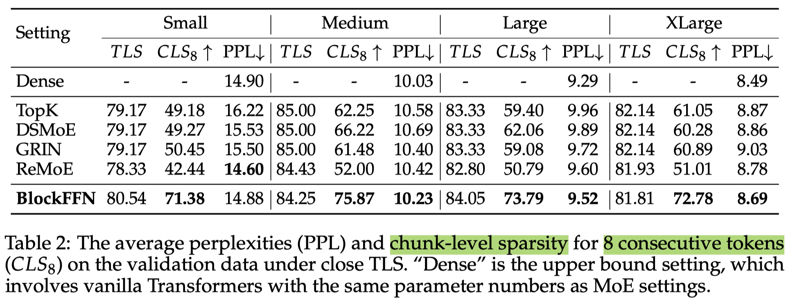

# BlockFFN: Towards End-Side Acceleration-Friendly Mixture-of-Experts with Chunk-Level Activation Sparsity

> Chenyang Song, Weilin Zhao, Xu Han, Chaojun Xiao, Yingfa Chen, Yuxuan Li, Zhiyuan Liu, Maosong Sun

## Abstract

To alleviate the computational burden of large language models (LLMs),
architectures with activation sparsity, represented by mixture-of-experts
(MoE), have attracted increasing attention. However, the non-differentiable and
inflexible routing of vanilla MoE hurts model performance. Moreover, while each
token activates only a few parameters, these sparsely-activated architectures
exhibit low chunk-level sparsity, indicating that the union of multiple
consecutive tokens activates a large ratio of parameters. Such a sparsity
pattern is unfriendly for acceleration under low-resource conditions (e.g.,
end-side devices) and incompatible with mainstream acceleration techniques
(e.g., speculative decoding). To address these challenges, we introduce a novel
MoE architecture, BlockFFN, as well as its efficient training and deployment
techniques. Specifically, we use a router integrating ReLU activation and
RMSNorm for differentiable and flexible routing. Next, to promote both
token-level sparsity (TLS) and chunk-level sparsity (CLS), CLS-aware training
objectives are designed, making BlockFFN more acceleration-friendly. Finally,
we implement efficient acceleration kernels, combining activation sparsity and
speculative decoding for the first time. The experimental results demonstrate
the superior performance of BlockFFN over other MoE baselines, achieving over
80% TLS and 70% 8-token CLS. Our kernels achieve up to 3.67$\times$ speedup on
real end-side devices than dense models. All codes and checkpoints are
available publicly (https://github.com/thunlp/BlockFFN).

这里取连续的8个token判断是否需要同时激活，从而能够在硬件上高效实现，与我们的想法基本一致。