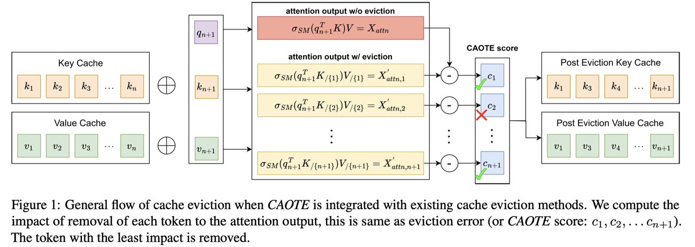

# CAOTE: KV Cache Selection for LLMs via Attention Output Error-Based Token Eviction

> Raghavv Goel, Junyoung Park, Mukul Gagrani, Dalton Jones, Matthew Morse, Harper Langston, Mingu Lee, Chris Lott
>
> Qualcomm AI Research

> **一句话总结：** CAOTE 通过闭式计算每个 token 被驱逐后对注意力输出的误差贡献（同时考虑注意力分数和 Value 向量），实现最优的 KV Cache 驱逐策略；该方法可作为元启发式方法与任何现有驱逐方法结合使用，始终提升下游任务准确率。

## 摘要翻译

虽然大语言模型的长上下文支持扩展了其能力，但也带来了内存和计算方面的挑战，成为资源受限设备上的关键瓶颈。Token 驱逐是一种广泛采用的训练后方法，通过从缓存中驱逐不太重要的 token 来缓解瓶颈，通常使用注意力分数作为 token 重要性的代理指标。然而，注意力分数作为 token 级别重要性指标的一个主要限制是，它缺乏关于 token 对注意力输出贡献的信息。在本文中，我们提出了一种基于缓存 token 对注意力输出贡献的简单驱逐准则。我们的方法 **CAOTE** 通过无缝整合注意力分数和 Value 向量来优化因 token 驱逐产生的误差。这是首个在闭式形式中使用 Value token 信息叠加注意力分数的驱逐方法。此外，CAOTE 可以作为一种元启发式方法，灵活地与任何 token 驱逐方法结合使用。我们表明，当 CAOTE 与最先进的基于注意力分数的方法结合时，在下游任务中总是提升准确率，这说明在 token 驱逐过程中利用 Value 信息的重要性。

## 研究动机

### 背景问题

- **长上下文 LLM 的 KV 缓存瓶颈：** 随着上下文长度增加，KV 缓存的内存消耗可能超过模型本身（如 LLaMA 系列在长序列场景下 KV 缓存可达数十 GB），成为资源受限设备上的关键瓶颈。
- **自注意力的二次复杂度：** 自注意力机制的计算复杂度为 O(n²)，KV 缓存虽能避免重复计算，但在长上下文场景下内存消耗仍然巨大。
- **现有驱逐方法的局限：** 现有 token 驱逐方法（如 H2O、TOVA、SnapKV）主要依赖**注意力分数**（Query-Key 交互）作为 token 重要性的代理指标，但忽略了 **Value 向量**对注意力输出的贡献。

### 核心问题

- 注意力分数仅反映 Query 与 Key 的对齐程度，但注意力输出是注意力分数与 Value 向量的加权组合。
- 忽略 Value 信息可能导致次优的驱逐决策——即使某个 token 的注意力分数较低，其 Value 向量可能对输出有显著贡献。
- 需要一种能够同时考虑注意力分数和 Value 向量的驱逐评分机制。

## 方法（技术细节）

CAOTE 的核心思想是直接优化**驱逐误差**——即 token 被驱逐前后注意力输出的变化量。该方法由两个关键洞察驱动：(i) 现有驱逐策略主要依赖 Query 和 Key 的注意力分数，(ii) 注意力输出是 Value 的线性组合。

### 1. CAOTE Score（驱逐误差的闭式计算）

**驱逐误差的定义：** 对于预算为 b 的缓存，当前有 b+1 个 token。驱逐 token j 后的注意力输出变化为：

$$e_{\text{eviction},j} = \| X_{\text{attn}} - X'_{\text{attn},j} \|^2$$

其中 $X_{\text{attn}}$ 是驱逐前的注意力输出，$X'_{\text{attn},j}$ 是驱逐 token j 后的注意力输出。

**CAOTE Score 的定义：** 给定注意力分数 $A = [\alpha_1, \ldots, \alpha_{b+1}]$ 和 Value 向量 $V = [v_1, \ldots, v_{b+1}]$，token j 的 CAOTE score 为：

$$c_j = \frac{\alpha_j}{1 - \alpha_j} \| V A^T - v_j \|^2$$

其中 $V A^T = X_{\text{attn}}$ 是驱逐前的注意力输出。

**理论保证（Theorem 3.2）：** CAOTE score 与驱逐误差完全等价，即 $c_j = e_{\text{eviction},j}$。

**关键定理（Theorem 3.1）：** 驱逐 token j 后，其余 token 的注意力分数变为 $\alpha'_i = \frac{\alpha_i}{1 - \alpha_j}$。

**并行计算：** CAOTE score 可以对所有 token 并行计算，仅依赖于注意力分数和 Value 向量。使用 L2 范数作为距离度量（基于经验选择）。

### 2. CAOTE 与通用驱逐方法的结合（Meta-Heuristic）

CAOTE 可以与任何基于分数的驱逐方法结合，只需对原始分数进行归一化处理：

$$c_j = f_{\text{caote}}(f_{\text{norm}}(H), V) = \frac{h^{\text{norm}}_j}{1 - h^{\text{norm}}_j} \| V (H^{\text{norm}})^T - v_j \|^2$$

其中 $H$ 是原始驱逐分数集合，$f_{\text{norm}}$ 是归一化函数。

**H2O 结合：** H2O 的分数基于累积注意力分数（$\sum h_j > 1$），归一化后可直接应用 CAOTE。

**TOVA 结合：** TOVA 的分数默认和为 1，可直接使用。

### 3. FastCAOTE（高效近似版本）

FastCAOTE 将预驱逐注意力输出 $X_{\text{attn}}$ 替换为 Value 向量的均值：

$$c_j = \frac{\alpha_j}{1 - \alpha_j} \| \frac{1}{b+1} \sum_{i=1}^{b+1} v_i - v_j \|^2$$

**经验验证：** CAOTE 与 FastCAOTE 之间存在高度相关性（Spearman 相关系数 ≥ 0.8），在所有 28 层上均如此（如 Llama3.2-3B-Instruct 上层 1-14 相关系数 0.81-0.99，层 15-28 为 0.88-0.99）。

**计算开销：** FastCAOTE 的额外 FLOPs 仅为预填充/生成 FLOPs 的 10⁻⁵ 量级（如序列长度 8k 时为 5.28e-5），几乎无开销。

### 4. 多 Token 驱逐

论文推导了多 token 联合驱逐的闭式公式。例如驱逐 token 1 和 token 2 的联合误差为：

$$c_{[1,2]} = \frac{1}{1 - \alpha_1 - \alpha_2} \| \alpha_1 (X_{\text{attn}} - v_1) + \alpha_2 (X_{\text{attn}} - v_2) \|^2$$

但由于组合数为 $\binom{n}{m}$，精确计算对大 m 不可行，论文采用贪心策略（逐个驱逐）进行近似，实验证明效果依然良好。

### 5. CAOTE 与输出 Logit 的关系

论文进一步证明了驱逐误差与最终 logit 误差的关系。对于单头单层网络：

$$\Delta l_{b+1} = W_H W_O \Delta_A$$

其中 $\Delta_A = e_{\text{eviction}}$。这表明注意力输出的误差会直接影响 logit 空间，从而影响下游任务性能。

## 实验结果

### 实验设置

- **模型：** Llama 3.2-3B-Instruct、Llama 3.1-8B-Instruct、Qwen 2.5-3B-Instruct、Qwen 2.5-7B-Instruct
- **基准：** LongBench（16 个任务，涵盖单文档 QA、多文档 QA、摘要、Few-shot 学习、合成任务、代码生成）、Booksum 困惑度、Needle-in-a-Haystack 检索
- **基线方法：** H2O、TOVA、SnapKV
- **缓存预算：** 2048、4096、6144、8192（2k/4k/6k/8k）
- **Prompt 消费策略：** 采用分块预填充（block-wise prefill），块大小为 128，即每次推理处理 128 个新 token 并在缓存满时驱逐 128 个 token

### LongBench 主要结果

- **Llama 3.1-8B-Instruct（2k 预算）：**
  - H2O + CAOTE/FastCAOTE：平均分从 16.89 提升到 33.31/34.07（**>30% 提升**）
  - TOVA + CAOTE/FastCAOTE：平均分从 37.52 提升到 38.08/38.19
  - SnapKV + CAOTE/FastCAOTE：平均分从 39.60 提升到 40.05/40.73
  - **最佳：** SnapKV-FastCAOTE（40.73）

- **Llama 3.1-8B-Instruct（4k 预算）：**
  - H2O + CAOTE/FastCAOTE：平均分从 26.37 提升到 40.42/42.09
  - **最佳：** SnapKV-FastCAOTE（45.75）

- **Qwen 2.5-7B-Instruct（2k 预算）：**
  - H2O + CAOTE/FastCAOTE：平均分从 12.89 提升到 23.47/23.62
  - **最佳：** SnapKV-CAOTE/FastCAOTE（29.24/29.69）

- **Qwen 2.5-3B-Instruct（2k 预算）：**
  - H2O + CAOTE/FastCAOTE：平均分从 12.68 提升到 23.98/24.12
  - **最佳：** SnapKV-CAOTE（29.15）

### 困惑度（Perplexity）

使用 Booksum 数据集测量生成困惑度（与无驱逐基准的差值，越低越好）：

- **Llama 3.1-8B-Instruct：**
  - 2k 预算：H2O（+2.007）→ H2O-CAOTE（-0.046）、SnapKV（+1.891）→ SnapKV-CAOTE（-0.097）
  - 4k 预算：H2O（+1.284）→ H2O-CAOTE（-0.047）、SnapKV（+1.061）→ SnapKV-CAOTE（-0.080）
  - 6k 预算：所有方法使用 CAOTE 后困惑度接近或优于无驱逐基准（负值表示优于 dense）

- **关键发现：** CAOTE 在所有预算和模型上均能改善困惑度，部分组合甚至优于无驱逐基准（负值）。

### Needle-in-a-Haystack

- **Llama 3.1-8B-Instruct：**
  - 2k 预算：H2O（0.174）→ H2O-CAOTE（0.270）、H2O-FastCAOTE（0.264）
  - 4k 预算：H2O（0.330）→ H2O-CAOTE（0.538）、H2O-FastCAOTE（0.568），**提升 30-60%**
  - 6k 预算：H2O（0.544）→ H2O-CAOTE（0.698）、H2O-FastCAOTE（0.676）

- **Llama 3.2-3B-Instruct：**
  - H2O-FastCAOTE 在所有预算上表现最佳

- **可视化分析（Figure 2）：** CAOTE 改进了现有驱逐方法，甚至能在缓存预算之外的深度范围内保持检索准确率。

### 补充实验（6k/8k 预算）

- 6k/8k 预算下的 LongBench 结果趋势与 2k/4k 一致
- H2O + CAOTE 的提升最为显著（>30%），TOVA、SnapKV 也有明显改善
- SnapKV-FastCAOTE 在 Llama3 模型上表现最佳，SnapKV-CAOTE 在 Qwen2.5 模型上表现最佳

## 优势

1. **理论基础严谨：** 通过严格的数学证明（Theorem 3.1 和 3.2），证明 CAOTE score 等于驱逐误差，具有理论保证。
2. **闭式可计算：** CAOTE score 可以在闭式形式下并行计算，仅依赖注意力分数和 Value 向量，无需额外的近似或采样。
3. **元启发式特性：** CAOTE 可以与任何基于分数的驱逐方法（如 H2O、TOVA、SnapKV）结合使用，作为增强模块，不改变原始方法的核心逻辑。
4. **一致性提升：** 在所有基准任务（LongBench、Perplexity、Needle-in-Haystack）和所有模型（Llama3、Qwen2.5）上，结合 CAOTE 总是提升性能，无例外。
5. **计算开销极低：** FastCAOTE 的额外 FLOPs 仅为预填充/生成的 10⁻⁵ 量级，几乎无额外开销，适合部署在资源受限设备上。
6. **高效近似：** FastCAOTE 与 CAOTE 的 Spearman 相关系数 ≥ 0.8，用 Value 均值替代注意力输出，性能损失可忽略。
7. **分块预填充策略：** 采用 block-wise prefill（块大小 128），在预填充阶段也能进行驱逐，降低内存峰值，缩短首 token 时间。
8. **多模型验证：** 在 Llama3（3B/8B）和 Qwen2.5（3B/7B）两个模型家族上验证，具有良好的泛化性。

## 局限

1. **贪心策略（Myopic/Greedy）：** CAOTE 采用逐个驱逐的贪心策略，未考虑多 token 联合驱逐的交互效应，可能在某些场景下不是全局最优。
2. **单 token 驱逐假设：** CAOTE 的评分框架基于每轮驱逐 1 个 token 的假设，在预填充阶段（需要驱逐多个 token）时该假设不成立。虽然实验中独立驱逐仍有效，但多 token 驱逐的精确计算存在组合爆炸问题（$\binom{n}{m}$）。
3. **无代码开源：** 代码 URL 为空，无法直接复现实验结果。
4. **仅限 Post-Training：** 该方法仅在推理阶段应用，无法通过训练进一步优化驱逐策略。
5. **缓存预算敏感：** 在极低预算（如 2k）下，CAOTE 的提升虽然显著，但绝对性能仍较低，说明驱逐本身带来的信息损失不可避免。
6. **模型范围有限：** 仅在 3B 和 7B 规模的 Llama3/Qwen2.5 上验证，未在更大规模（如 70B）或更多架构（如 Mamba、混合模型）上测试。
7. **与 Full Cache 的差距：** 虽然 CAOTE 接近 Full Cache 性能，但在部分任务上仍存在一定差距，尤其是对于信息密度高的 QA 任务。

## 与 EfficientPaper 相关的研究方向

### KV Cache 优化
- 本文属于 **KV Cache 驱逐** 类方法，与 H2O、TOVA、SnapKV、StreamingLLM、Quest、CaM 等工作直接相关
- CAOTE 提出的 Value 中心评分机制是现有注意力分数方法的正交补充
- 可与 **KV Cache 量化**（如 KVQuant、KIVI）结合，实现内存和计算的双重压缩
- 可与 **自适应缓存分配**（如 AdaKV）结合，实现层间预算的动态优化

### 高效推理
- 与 **稀疏注意力**（如 SpAtten、BigBird）正交，可在稀疏注意力的基础上进一步压缩 KV 缓存
- 可与 **FlashAttention** 等注意力加速方法结合使用
- 可与 **分块推理**（如 Sarathi、DeepSpeed-FastGen）结合，优化预填充阶段的内存和延迟

### 长上下文处理
- CAOTE 在长上下文场景下（如 Needle-in-Haystack 32K 长度）表现优异，与 **长上下文扩展**（如 YaRN、LongLoRA、Ring Attention）互补
- 可应用于 **长文档理解**（如 RAG、多轮对话、摘要）等场景
- 分块预填充策略有助于在资源受限设备上处理超长输入

### 注意力机制研究
- CAOTE 的注意力输出误差分析为理解 Transformer 的注意力机制提供了新视角
- Value 向量的信息利用是现有方法的盲区，CAOTE 的公式化方法为未来研究提供了理论基础
- 可与 **DuoAttention**（注意力头选择）等方法结合，实现头级别和 token 级别的双重优化

### 硬件部署与优化
- 与 **模型量化**（如 GPTQ、AWQ）结合，可在有限硬件资源下实现更大上下文窗口
- FastCAOTE 的极低计算开销使其适合在移动设备、边缘设备等资源受限环境中部署
- 可与 **推测解码**（Speculative Decoding）等技术结合，提升推理吞吐量

---

> **生成声明：** 本 note 由 AI Agent 自动生成，基于 arXiv 论文（arXiv:2504.14051v6）的全文内容，使用 /Users/xiandong/miniconda3/bin/python + fitz 提取文本并进行分析。生成时间：2025 年 6 月。所有内容以中文撰写。
