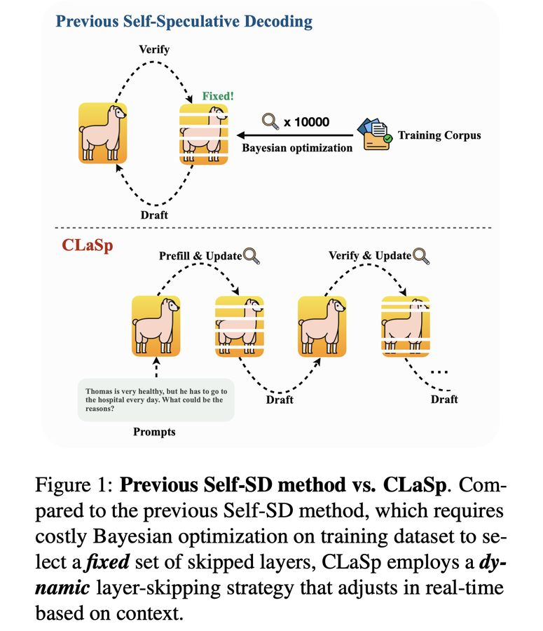

# CLaSp: In-Context Layer Skip for Self-Speculative Decoding

> Longze Chen, Renke Shan, Huiming Wang, Lu Wang, Ziqiang Liu, Run Luo, Jiawei Wang, Hamid Alinejad-Rokny, Min Yang

---

> ⚠️ **本 note 由 AI Agent 自动生成**，基于论文全文阅读，生成时间：2025年6月。

---

## 一句话总结

CLaSp 提出了一种无需额外训练的自推测解码（Self-Speculative Decoding）框架，通过基于上下文的动态层跳过策略（Dynamic Layer Skipping），利用动态规划算法在每次验证阶段后实时优化跳层集合，实现了 LLaMA3 系列模型上 1.3× ~ 1.7× 的无损加速，且无需任何额外模块或训练。

---

## 摘要翻译

推测解码（Speculative Decoding, SD）是加速大语言模型（LLM）解码过程的有前景方法。SD 的效率主要取决于草稿模型与验证模型之间的一致性。然而，现有的草稿方法通常需要训练额外模块，这在实现和确保跨多种 LLM 的兼容性方面存在挑战。本文提出 CLaSp，一种用于自推测解码的上下文内层跳过策略。与先前方法不同，CLaSp 不需要额外的草稿模块或额外训练，而是采用即插即用机制，通过跳过验证模型的中间层来构建压缩的草稿模型。具体而言，本文开发了一种动态规划算法，利用上一次验证阶段的完整隐藏状态作为目标函数来优化层跳过过程，使 CLaSp 能够在每次验证阶段后动态调整层跳过策略，而无需依赖预优化的跳层集合。在多种下游任务上的实验结果表明，CLaSp 在 LLaMA3 系列模型上实现了 1.3× ~ 1.7× 的加速，且不改变生成文本的原始分布。

---

## 研究动机

1. **LLM 推理延迟问题**：Transformer 架构的 LLM 在解码阶段由于自回归特性，每次生成 token 都需将模型参数加载到 GPU SRAM，导致计算核心利用率低下，推理延迟高。
2. **推测解码的局限性**：传统 SD 方法依赖草稿模型与验证模型的一致性，需要训练额外模块（如 Medusa、EAGLE 等），实现复杂且难以跨模型泛化；检索类方法（如 REST）则对检索质量高度敏感。
3. **现有自推测解码（Self-SD）的不足**：Self-SD 和 SWIFT 通过跳过验证模型的中间层来构建草稿模型，避免了额外训练，但其层跳过策略是静态的，依赖耗时的贝叶斯优化过程，在数据稀疏或未见任务上泛化能力差。
4. **核心需求**：需要一种无需训练、即插即用、且能动态适应上下文的自推测解码方法。

---

## 方法（技术细节）

### 整体流程（Pipeline）

CLaSp 采用三阶段流程循环运行：

1. **Drafting（草稿生成）**：草稿模型从给定的提示序列自回归地生成 K 个候选 token（$x_{i+1}, ..., x_{i+K}$）。
2. **Verification（验证）**：验证模型通过单次前向传播验证草稿 token，对每个候选 token 预测概率分布并评估其与完整模型预测的一致性。若某个草稿 token $x_j$ 被拒绝，则用原始 LLM 的预测覆盖 $x_j$，并在下一轮从 $x_{j+1}$ 恢复草稿生成。
3. **Layer Optimization（层优化）**：利用上一轮验证阶段最后一个被接受 token 的隐藏状态作为优化目标，通过动态规划算法更新最优跳层集合 $S^*$，指导下一轮草稿生成。

### 核心问题建模

设验证模型 $M_v$ 和草稿模型 $M_d$（由跳过某些中间层的原始 LLM 构成），目标是找到最优跳层集合 $S$，最小化 $M_v$ 与 $M_d$ 输出隐藏状态之间的余弦相似度：

$$S^* = \arg\min_S \cosine(F_{M_v}(X), F_{M_d}(X)), \quad s.t. S \in \{0, 1\}^L$$

其中 $L$ 为验证模型的 Transformer 层数。

### 近似动态规划（Approximate Dynamic Programming）

关键观察：推测解码中每次验证步骤后，最后一个被接受 token 的隐藏状态未被充分利用。CLaSp 利用这些反馈信息预测下一阶段的草稿模型配置。

设 Transformer 模型的 $L$ 层，第 $l$ 层的变换为 $h_{l+1} = f_l(h_l)$。定义 $D(i, j)$ 为在前 $i$ 层中跳过 $j$ 层后，$h_i$ 与最优隐藏状态 $g(i, j)$ 的最大余弦相似度。动态规划转移方程为：

$$D(i, j) = \max\{\cosine(h_i, g(i-1, j-1)), \cosine(h_i, f_{i-1}(g(i-1, j)))\}$$

算法通过双层循环（时间复杂度 $O(LM)$）计算最优跳层集合，并通过回溯（backtracking）得到最终的 $S$。

### 近似马尔可夫性

动态规划要求"无后效性"（马尔可夫性），但 CLaSp 不严格满足此条件。然而，利用 Transformer 层间嵌入缓慢变化的性质（slowly changing embeddings），实验验证 CLaSp 的近似算法与暴力搜索的最优解高度一致（高余弦相似度），说明其有效近似了马尔可夫性。

### 效率优化策略

1. **序列并行（Sequence Parallel）**：动态规划中，计算 $(i, j)$ 时仅依赖 $(i-1, \cdot)$ 状态，因此同一 $i$ 的不同 $j$ 值可独立计算，实现第二层循环的并行化。同时设计专用掩码矩阵，避免将状态拼接成 batch，复用同一 KV Cache，显著降低 GPU 显存占用。在 LLaMA3-70B 上，单次 DP 时间从约 2.5 秒降至 0.14 秒，与单次验证时间相当。

2. **降低更新频率（Lower Optimization Frequency）**：利用"稀疏持久性"（Sparse Persistence）现象——相邻 token 所需的跳层集合高度相似（Jaccard 相似度高）。因此，不必每次验证后都更新，可累积多次验证步后再更新，牺牲少量接受率换取大幅降低更新延迟。总体加速比显著提升。

### 关键超参数

- **跳层数量（Number of Skipped Layers）**：在 LLaMA3-70B（80层）上，跳过44层时达到最优加速1.64×。跳层过多导致草稿质量下降，反而降低加速。
- **层优化间隔（Layer Optimization Interval, LOI）**：增加间隔可降低 DP 额外延迟，但超过128后接受率显著下降导致加速比下降。
- **草稿退出阈值（Draft-Exiting Threshold, DET）**：约0.7时加速最高。即使提高 DET 值，仍保持高加速，说明该参数鲁棒性强。

---

## 实验结果

### 实验设置

- **模型**：LLaMA3-8B、LLaMA2-13B、LLaMA3-70B、LLaMA3.1-405B
- **硬件**：NVIDIA A800 GPU（80GB），8B/13B 单卡，70B 双卡，405B 八卡，FP16（405B 用 INT8 量化）
- **数据集**：Spec-Bench，包含6个子任务（多轮对话 MT-bench、翻译 WMT14、摘要 CNN/DM、问答 NQ、数学推理 GSM8K、检索增强生成 DPR），每个任务80个样本，最大序列长度1024
- **对比方法**：自回归解码（baseline）、Self-SD、SWIFT（均为无训练的层级跳过方法）

### 主要结果

| 模型 | 设置 | CLaSp 加速比 | Self-SD 加速比 | SWIFT 加速比 |
|------|------|-------------|---------------|-------------|
| LLaMA3-70B | Greedy | **1.67×** | 1.47× | 1.28× |
| LLaMA3-70B-Chat | Greedy | **1.45×** | 1.31× | 1.25× |
| LLaMA3-8B | Greedy | **1.24×** | 1.14× | 1.11× |
| LLaMA3-70B | Non-Greedy | **1.50×** | 1.31× | 1.09× |
| LLaMA3-70B-Chat | Non-Greedy | **1.37×** | 1.22× | 1.00× |
| LLaMA3-8B | Non-Greedy | **1.08×** | 0.96× | 0.83× |

### 关键发现

1. **CLaSp 在所有模型和任务上一致优于 Self-SD 和 SWIFT**，加速比 1.3× ~ 1.7×。
2. **大模型优势更明显**：CLaSp 在 LLaMA3-70B 上的加速比显著高于 LLaMA3-8B，说明更大模型有更多层冗余可利用。LLaMA3.1-405B 在部分任务上加速比可达 1.82×。
3. **平均接受长度（τ）显著提升**：在 Greedy 设置下，CLaSp 的 τ 值普遍高于 Self-SD 和 SWIFT，表明草稿质量更好。
4. **Non-Greedy 设置下 Self-SD 和 SWIFT 性能下降明显**，而 CLaSp 仍保持较高加速比，说明其动态调整策略在多样化场景下更鲁棒。
5. **层优化开销极小**：通过序列并行优化后，层优化仅增加约4.8%的延迟，几乎可忽略。
6. **跳层比例**：实验中跳过 50%~60% 的层可达到最优效果。

---

## 优势

1. **无需额外训练或模块**：CLaSp 是纯即插即用方法，不需要训练任何额外模块、不做任何微调，直接利用原始模型的层跳过构建草稿模型，适用于任何 Transformer 架构的 LLM。
2. **动态适应上下文**：不同于 Self-SD 和 SWIFT 的静态跳层策略，CLaSp 在每次验证后动态调整跳层集合，能更好地适应变化的任务和上下文，避免了昂贵的贝叶斯优化过程。
3. **高效实现**：通过序列并行和降低更新频率策略，将额外计算开销控制在极低水平（约4.8%延迟），几乎不影响整体推理速度。
4. **无损加速**：基于推测采样，保证生成结果与原始模型一致，不改变文本分布。
5. **跨模型泛化好**：在不同规模的 LLaMA 模型上均表现稳定，且在更大模型上加速效果更佳。
6. **无额外硬件需求**：不增加额外的显存或计算资源，复用同一 KV Cache。

---

## 局限

1. **硬件和模型覆盖有限**：实验仅在 NVIDIA A800 GPU（80GB）上进行，且仅测试了 LLaMA 系列模型，未探索更多硬件平台和其他模型架构（如 Mamba、混合专家模型等）。
2. **未与其他推测解码创新集成**：CLaSp 可以与树状注意力机制（如 SpecInfer、Sequoia）等方法结合，但论文未研究这种集成的效果。
3. **跳层策略的理论保证不足**：虽然近似马尔可夫性被实验验证，但理论上动态规划并不严格最优，可能存在边界情况下的性能退化。
4. **非贪婪设置下加速比降低**：在 Temperature=1 的设置下，CLaSp 的加速比（尤其在 8B 模型上）明显低于贪婪设置。
5. **批处理性能未知**：实验均在 batch size=1 下进行，未评估 CLaSp 在高吞吐量批处理场景下的表现。
6. **代码未开源**：论文未提供开源代码（code url 为空），限制了可复现性。

---

## 与 EfficientPaper 相关的研究方向

### 结构化稀疏性（Structured Sparsity）
CLaSp 本质上利用了模型的层间冗余性（layer sparsity），属于结构化稀疏性的一种形式。这一方向与 EfficientPaper 中的结构化剪枝、LayerDrop、LayerSkip 等方法密切相关。未来可探索更细粒度的稀疏策略（如注意力头稀疏、FFN 稀疏）与自推测解码的结合。

### 推测解码（Speculative Decoding）
CLaSp 是无训练推测解码方法的重要进展。相关研究方向包括：
- **树状推测解码**：将 CLaSp 与 SpecInfer、Sequoia 等树状推测解码方法结合，可进一步提升接受率和加速比。
- **跨模型适配**：将 CLaSp 的动态层跳过策略推广到非 LLaMA 架构（如 Qwen、Mistral 等）。
- **长序列推理**：结合 Triforce 等长序列推测解码方法，探索在长上下文场景下的应用。

### 动态推理与早期退出
CLaSp 的层跳过策略与早期退出（Early Exit）和动态层选择（Dynamic Layer Selection）方法有相似之处。未来可探索结合 Deja Vu 的上下文稀疏性和 CLaSp 的动态跳层策略，实现更灵活的推理加速。

### 推理优化系统
CLaSp 的序列并行和 KV Cache 复用策略为推理系统优化提供了新思路。可与 vLLM、TensorRT-LLM 等推理框架集成，实现端到端的推理加速。

---

## 关键词

- 结构化稀疏性（structured sparsity）
- 推测解码（speculative decoding）
- 自推测解码（self-speculative decoding）
- 层跳过（layer skipping）
- 动态规划（dynamic programming）
- LLM 推理加速（LLM inference acceleration）

---

*本 note 由 AI Agent 自动生成，基于论文 arXiv:2505.24196v1 全文阅读。*
