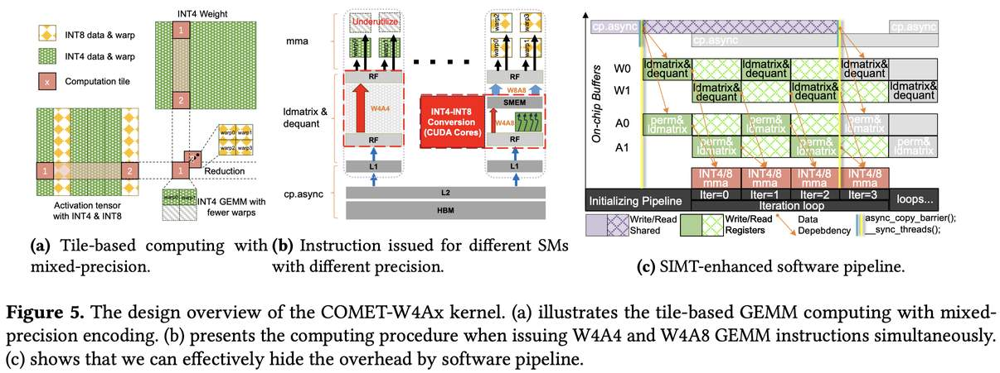

# COMET: Towards Practical W4A4KV4 LLMs Serving

> **本笔记由 AI Agent 自动生成，基于论文全文阅读与分析。生成时间：2026-06-05。**

## 一句话总结

COMET 首次实现了实用的 W4A4KV4 LLM 推理服务，通过细粒度混合精度量化算法 FMPQ 和高度优化的 W4Ax 核函数，在单卡 A100-80G 上实现了 2.88× 的内核加速和 2.02× 的端到端吞吐提升。

## 摘要翻译

量化是一种广泛使用的压缩技术，用于降低在终端设备和云数据中心服务大型语言模型（LLM）的开销。然而，现有的量化方法（如 8-bit 权重-激活量化或 4-bit 仅权重量化）由于对低精度（如 4-bit）激活的支持不足，只能实现有限的性能提升。本文首次实现了实用的 W4A4KV4 LLM 服务，充分利用现代 GPU 的 INT4 张量核心，并减少由 KV 缓存引起的内存瓶颈。具体而言，我们提出了一种新颖的细粒度混合精度量化算法（FMPQ），可以将大多数激活压缩为 4-bit，且精度损失可忽略不计。为了支持 W4A4 和 W4A8 的混合精度矩阵乘法，我们开发了一个高度优化的 W4Ax 核函数。我们的方法引入了一种新颖的混合精度数据布局，便于激活和权重张量的访问和快速反量化，利用 GPU 的软件流水线隐藏数据加载和转换的开销。此外，我们提出了细粒度流多处理器（SM）调度，以实现不同 SM 之间的负载平衡。我们将优化的 W4Ax 核函数集成到推理框架 COMET 中，并提供高效的管理以支持 LLaMA-3-70B 等主流 LLM。大量评估表明，在单卡 A100-80G-SMX4 上运行 LLaMA 系列模型时，COMET 实现了内核级别相对于 cuBLAS 的 2.88× 加速，以及端到端框架视角下相对于 TensorRT-LLM 的 2.02× 吞吐提升。

## 研究动机

### LLM 推理挑战

随着 LLM 参数量增长至数百亿，推理系统面临两大核心挑战：
1. **内存瓶颈**：大模型需要大量显存，而多数系统在单 GPU 上推理，显存有限
2. **高服务成本**：LLM 推理按 token 计费，长序列处理进一步增加成本

### 现有量化方法的局限

- **仅权重量化（W4A16）**：权重反量化到 16-bit 与激活对齐，浪费计算资源，无法充分利用现代 GPU 的 4-bit 张量核心；在大 batch 和长序列场景下，KV 缓存成为主要瓶颈
- **W8A8 量化（SmoothQuant）**：虽然同时量化权重和激活，但采用保守的缩放策略，仍局限于 INT8 格式，无法充分发挥低精度计算能力

### 核心洞察

- LLM 激活中的离群值（outlier）集中在特定特征维度（<1% 的通道），可分离量化
- 现代 GPU（如 A100）的 INT4 张量核心吞吐量是 INT8 的 2×，应充分利用
- KV 缓存是内存瓶颈（128K 序列长度时占总存储 72%），应低比特量化
- 激活-激活运算（KV 缓存相关）是内存带宽受限，权重-激活运算在大 batch 下是计算受限

## 方法（技术细节）

### 1. FMPQ 算法：细粒度混合精度量化

#### 激活分布分析

- LLM 激活中存在离群值，其幅度是典型值的 10-100 倍
- 这些离群值集中在特定通道（如 LLaMA-7B 的某些激活通道）
- 不能丢弃离群值（对模型表示能力至关重要）
- 解决方案：对离群值通道用 8-bit 量化，正常值通道用 4-bit 量化

#### 块级混合精度量化

- **核心问题**：传统通道级量化与 GPU 最小计算粒度不对齐（A100 的 FP16 张量核心最小粒度为 64×64×32），导致计算效率低
- **解决方案**：将激活张量沿通道维度分块，块大小 k=128，与 GPU 计算粒度对齐
- **通道置换策略**：
  1. 通过数据采样识别含离群值的通道
  2. 使用置换策略将这些通道聚集到同一个块中
  3. 对应的权重矩阵也需要置换以保持计算等价性
  4. 效果：仅 <20% 的块需要 8-bit 量化，其余均为 4-bit
  5. 通道置换开销仅占总运行时间的 0.7%

#### KV 缓存量化策略

- KV 缓存用于激活-激活运算，高度内存带宽受限
- 更适合低比特量化，且 KV 缓存比输入激活更易量化
- 采用通道级 4-bit 非对称分组量化
- 实验验证精度损失可忽略

#### 量化比例

- 平均 84% 以上的 GEMM 运算使用 W4A4
- LLaMA-30B 仅 8% 的激活需要 8-bit 量化
- 平均仅 16% 的激活量化为 8-bit

### 2. COMET-W4Ax 内核设计

#### 设计概述

- 基于 tile 的 GEMM 计算，不同 tile 使用不同精度（INT4 或 INT8）
- 每个 tile 调用一个线程块（TB）计算
- 使用 reduction 运算符跨多个 TB 累积结果
- 解决两大挑战：(1) 混合精度编码的数据管理开销；(2) W4A4 和 W4A8 GEMM 操作引起的负载不平衡

#### SIMT 增强的软件流水线

- **两级重叠策略**：
  - 第一级：将片外内存加载隐藏在数据转换和张量核心计算阶段中
  - 第二级：利用 GPU 双缓冲隐藏张量核心计算和数据传输/转换的开销
- **具体实现**：
  - 使用两个共享内存缓冲区（buffer0 和 buffer1）存储不同数据 tile
  - 迭代 0：张量核心从 buffer0 加载并计算，同时 buffer1 从全局内存加载数据
  - 迭代 1：张量核心从 buffer1 加载并计算，同时 buffer0 预取数据
  - 通过 cp.async 指令从全局内存加载数据到共享内存
  - 使用 async_copy_barrier 和 sync_threads 确保数据一致性和线程同步
- **W4A4 vs W4A8**：
  - W4A4：直接使用 mma 指令
  - W4A8：使用 CUDA 核心将 INT4 转换为 INT8，结果存储在共享内存中

#### 混合精度数据管理

**权重交织（Weight Interleave）用于 W4A8 GEMM**：
- 直接在 8-bit 格式中传输 4-bit 权重会导致共享内存冲突
- 解决方案：重新排列权重数据布局，使单个线程所需的权重地址连续
- 效果：避免共享内存冲突，减少 ldmatrix 指令使用（从 2 条减少到 1 条）

**快速 INT4to8 转换**：
- 朴素方法：每个转换需要最多 10 条指令
- 优化策略：
  1. 位置交换：交换 W1 和 W2 的存储位置，使数据直接对齐 8-bit 格式地址
  2. 零扩展替代符号扩展：零扩展可用单条零填充指令实现，每个值乘以 16，在缩放参数中除以 16 保证一致性
- 效果：每个值的转换开销从 10 条指令减少到仅 2 条

#### 细粒度 SM 调度

**问题**：不同 block 需要不同精度的 mma 指令，导致 SM 利用率低
- W4A4 的 INT4 张量核心吞吐量是 INT8 的 2×，但需要等待其他 SM 同步

**三大策略**：

1. **同步屏障最小化**：
   - 不需要每次 mma 迭代都插入同步屏障
   - 仅在所有迭代完成后需要同步
   - 减少 SM 间通信开销

2. **Tile 重映射（Tile Remapping）**：
   - 不将 INT4 和 INT8 mma 计算固定映射到特定 SM
   - 将 INT4 和 INT8 mma 计算均匀分布到所有 SM
   - 确保每个 SM 负载平衡

3. **Tile 分解（Tile Decomposition）**：
   - 传统的 tile-SM 绑定是一对一的
   - 通过任务窃取（task-stealing）机制实现一对多绑定
   - 空闲 SM 可从繁忙 SM 偷取计算任务
   - 例如：SM2 和 SM3 空闲时，从 SM0 和 SM1 偷取部分计算

### 3. COMET 系统实现

- **代码规模**：基于 TensorRT-LLM 和 CUTLASS，额外实现 7,000 行 C++ 和 CUDA 代码
- **内核接口**：W4Ax 内核可编译为独立的 .so 动态库
- **API 设计**：
  - C++ API：便于集成到 TensorRT-LLM 和 DeepSpeed 等推理系统
  - Python 接口（通过 pybind）：便于集成到 PyTorch 和 Huggingface
- **内存管理**：采用 vLLM 的 KV 缓存管理优化（PagedAttention）
- **Tile 配置**：
  - 大多数情况：128 × 128 × 128（m×n×k）
  - INT4 张量核心：warp shape 为 64 × 64 × 128
  - INT8 张量核心：warp shape 为 64 × 64 × 64
  - W4A4 tile 的 warp 数量仅为 W4A8 tile 的一半

## 实验结果

### 算法评估

**评测数据集**：
- 困惑度（Perplexity）：WikiText2
- 零样本准确率：PIQA、ARC（含 ARC-e 和 ARC-c）、HellaSwag、WinoGrande

**评测模型**：LLaMA-1/2/3 系列（7B/13B/30B/65B/70B/8B）

**算法基线**：
- W8A8：SmoothQuant
- W4A16：GPTQ、AWQ、OmniQuant
- W4Ax：FMPQ
- W4A4：OmniQuant（全 W4A4）
- W4A8 KV4：QoQ
- W4AxKV4：FMPQ

**困惑度结果**：
- FMPQ（W4Ax）：相比 W8A8 SmoothQuant 和 W4A16 OmniQuant，仅增加极少困惑度（LLaMA-1-7B 仅增加 0.10）
- FMPQ（W4AxKV4）：引入 KV 缓存量化后，平均困惑度增加仅 0.05，可忽略
- 全 W4A4 OmniQuant：困惑度增加超过 5.21，无法实用
- 仅 16% 的激活被量化为 8-bit（LLaMA-30B 仅 8%）

**零样本准确率结果**（LLaMA-3 系列）：
- FMPQ（W4AxKV4）相比 W4A16 OmniQuant，准确率仅下降 0.75%
- LLaMA-3-8B：FMPQ 在 HellaSwag 上甚至优于 OmniQuant
- LLaMA-3-8B：FMPQ 在 HellaSwag 上甚至优于 W4A8 KV4 方法 QoQ

### 内核性能

**评测环境**：NVIDIA A100-80G-SXM4，CUDA 12.1

**评测模型**：LLaMA 系列、Mistral-7B、Qwen2-72B、OPT-175B

**基线**：
- cuBLAS-W16A16
- TRT-LLM-W4A16
- TRT-LLM-W8A8

**结果**：
- COMET-W4Ax 平均加速：**2.88×**（相对于 cuBLAS-W16A16）
- 相对于 TRT-LLM-W4A16：**1.77×**
- 相对于 TRT-LLM-W8A8：**1.33×**
- 不同 batch size 下的表现：
  - BS=16：2.91×
  - BS=64：2.97×
  - BS=256：2.75×
- TRT-LLM-W4A16 在小 batch 时性能好，大 batch 时性能提升有限（1.10× 和 1.38×）
- COMET-W4Ax 在所有 batch size 下均表现优异

### 消融实验

**评测模型**：LLaMA-3-8B、LLaMA-3-70B

**比较版本**：
- W4A8（仅 8-bit）
- W4Ax w/o optimization（朴素实现）
- W4Ax w/ remapping（tile 重映射）
- COMET-W4Ax（完全优化）

**结果**：
- 朴素 W4Ax 实现仅获得 1.31× 和 1.18× 加速
- 加入 tile/SM 重映射后提升到 1.56× 和 1.60×
- 完全优化的 COMET-W4Ax 达到 1.71× 和 1.67×
- 验证了各优化策略的有效性

### 端到端评估

**评测环境**：单卡 A100-80G-SXM4

**评测设置**：
- 输入/输出序列长度：1024/512 和 128/128
- 评测模型：Mistral-7B、LLaMA 系列、Qwen1.5-72B

**基线**：TRT-LLM-W4A16

**结果**：
- 平均吞吐提升：**2.02×**（1024/512）和 **1.63×**（128/128）
- 模型级别提升：
  - 7B/8B：1.18-1.93×
  - LLaMA-2-13B：1.74×
  - LLaMA-1-30B：2.81×
  - 70B/72B：1.28-3.27×
- 在相同 batch size 下，COMET 持续优于 TRT-LLM 最佳配置，加速 1.37×
- 在长输出序列（512 tokens）下表现更好（4-bit KV 缓存缓解了大 batch 执行瓶颈）
- 即使在小模型（8B）和短输出（128/128）下，COMET 仍实现 1.56× 吞吐提升

## 优势

1. **首创性**：首次实现实用的 W4A4KV4 LLM 推理服务，充分挖掘 INT4 张量核心的计算能力
2. **高效量化**：FMPQ 算法仅 16% 激活需要 8-bit 量化（LLaMA-30B 仅 8%），大部分使用 W4A4，精度损失可忽略
3. **系统级优化**：COMET-W4Ax 内核从算法到系统层面进行深度优化，包括数据布局、软件流水线、SM 调度
4. **显著加速**：内核级 2.88× 加速（cuBLAS），端到端 2.02× 吞吐提升（TRT-LLM）
5. **通用性**：支持 LLaMA 系列、Mistral、Qwen 等多种模型，跨 7B 到 175B
6. **易集成**：提供 C++ API 和 Python 接口，可无缝集成到 TensorRT-LLM、DeepSpeed 等推理系统
7. **KV 缓存优化**：4-bit KV 缓存有效缓解长序列场景下的内存瓶颈，支持更大 batch size
8. **可扩展性**：在大 batch 和长序列场景下性能提升更显著

## 局限

1. **GPU 平台限制**：主要在 NVIDIA A100-80G-SXM4 上评估，对其他 GPU（如 H100、AMD GPU）的适应性有待验证
2. **模型范围**：主要评估 LLaMA 系列和少量其他模型，对非 Transformer 架构的适用性未验证
3. **量化粒度固定**：块大小 k=128 是基于实验选择的固定值，可能不是所有场景的最优
4. **内核实现复杂度**：7,000 行 C++ 和 CUDA 代码，实现复杂，维护成本高
5. **精度-性能权衡**：虽然精度损失可忽略，但在某些极端场景（如长上下文、复杂推理）下可能出现问题
6. **仅支持推理**：未涉及训练或微调场景
7. **与现有系统集成**：虽然提供了 API，但与 TensorRT-LLM 等系统的集成可能需要额外工作

## 与 EfficientPaper 相关的研究方向

### 1. 低比特量化推理优化

COMET 的核心贡献在于实现了 W4A4KV4 的实用推理，这与 EfficientPaper 关注的高效推理方向高度相关。相关研究方向包括：
- 更激进的量化方案（如 2-bit、3-bit）的探索
- 量化与蒸馏、剪枝等技术的联合优化
- 量化模型在边缘设备上的部署

### 2. KV 缓存优化

COMET 的 4-bit KV 缓存量化解决了长序列场景下的内存瓶颈，相关方向：
- KV 缓存压缩与稀疏化
- 动态 KV 缓存管理
- 长上下文推理的内存效率优化

### 3. 异构计算与内核优化

COMET 的 W4Ax 内核设计和 SM 调度策略，展示了现代 GPU 上混合精度计算的优化方法，相关方向：
- 针对新硬件（如 H100、AMD MI300）的内核优化
- 异构 GPU 架构下的负载均衡
- 软件流水线与数据布局的协同设计

### 4. 混合精度推理框架

COMET 作为推理框架的设计思路，与 EfficientPaper 关注的系统级优化相关：
- 推理框架的可扩展性设计
- 量化与内存管理的协同优化
- 端到端推理系统的性能建模

### 5. 量化算法研究

FMPQ 的细粒度混合精度量化方法，为高效推理提供了新的算法思路：
- 离群值感知的量化策略
- 硬件友好的量化粒度设计
- 后训练量化（PTQ）的精度-效率权衡

### 6. 与 CometSeed 的关系

COMET（本文）的 baseline 引用了 CometSeed（2025/CometSeed），后者是关于 Mixture-of-Experts 模型的计算-通信重叠优化。两者共同推动了高效 LLM 推理的发展，但方向不同：COMET 关注量化推理，CometSeed 关注 MoE 模型的并行化优化。

---

> **注意**：本笔记由 AI Agent 自动生成，基于论文全文阅读与分析。内容可能存在偏差，请以论文原文为准。
