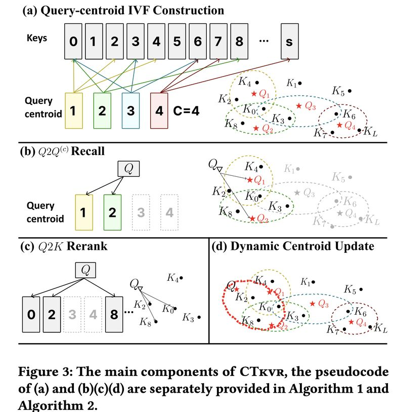

# CTkvr: KV Cache Retrieval for Long-Context LLMs via Centroid then Token Indexing

> Kuan Lu, Shuhang Lin, Sai Wu, Yichen Yao, Junhan Yang, Huan Li, Wei Chu, Xu Yinghui, Yuan Qi, Gang Chen

> **AI Agent 生成声明**：本 note 由 AI Agent 自动生成，基于论文 PDF 全文阅读后撰写，旨在提供论文的中文解读与结构化总结。内容仅供参考，如有疏漏请以原文为准。生成时间：2025年。

---

## 一句话总结

CTkvr 提出了一种"先质心后令牌"的两阶段 KV Cache 检索机制，利用 RoPE 后位置相邻查询向量的高度相似性，通过轻量级查询质心倒排索引（qcIVF）实现高效检索，在几乎不损失精度（<1% 精度下降）的前提下，在 Llama-3-8B 和 Yi-9B 上分别实现 3× 和 4× 的吞吐量提升（96K 上下文）。

---

## 摘要翻译

大语言模型（LLM）越来越多地应用于多轮对话等长上下文场景。然而，长上下文对推理效率构成重大挑战，包括来自键值（KV）缓存的高内存开销以及由过多内存访问导致的延迟增加。现有的动态 KV 选择方法面临权衡困境：块级索引通过检索不相关的 KV 条目降低精度，而令牌级索引则因低效的检索机制导致高延迟。本文提出 CTkvr，一种新颖的"先质心后令牌" KV 检索方案来解决这些限制。CTkvr 利用了一个关键观察：在旋转位置编码（RoPE）之后，位置相邻的查询向量表现出高度相似性，并共享大部分 top-k KV 缓存条目。基于此洞察，CTkvr 采用两阶段检索策略：在预填充阶段预计算轻量级质心进行质心粒度索引，然后进行令牌级细化以实现精确的 KV 检索。该方法在检索效率和精度之间实现了平衡。为进一步增强性能，CTkvr 实现了使用 CPU-GPU 协同执行的索引构建和搜索优化系统。实验表明，CTkvr 在多个基准测试中实现了优越的性能，精度下降不到 1%。同时，CTkvr 在 96K 上下文长度下，在多种 GPU 硬件上分别在 Llama-3-8B 和 Yi-9B 上实现了 3 倍和 4 倍的吞吐量提升。

---

## 研究动机

### 背景与问题

随着 GPT、Llama、Gemini 等大语言模型支持越来越长的上下文窗口（最高可达 1M tokens），长上下文推理成为关键应用场景（多文档问答、多轮对话、搜索引擎等）。然而，长上下文推理面临两个核心瓶颈：

1. **KV Cache 内存开销巨大**：KV 缓存存储中间的 Key 和 Value 激活值以避免重复计算，其存储开销与序列长度线性增长，在长上下文场景下快速消耗 GPU 显存。
2. **内存访问延迟高**：生成每个 token 需要访问所有 KV 对，导致延迟增加。

### 现有方法的局限

现有 KV Cache 压缩方法主要分为三类，各有不足：

- **KV Cache 淘汰方法**（如 H2O、SnapKV）：通过特定策略丢弃 KV 条目以减少内存使用，但会导致信息损失，在长输出或多轮对话中精度下降明显。
- **块级稀疏注意力**（如 Quest、ShadowKV）：将 Key 缓存总结为块级向量，在解码时基于相似性检索块。虽然高效，但会引入不相关的 KV 条目，降低精度。
- **令牌级稀疏注意力**（如 RetrievalAttention、MagicPIG）：使用 ANN 等方法动态检索 top-k KV 条目。虽然精度较高，但计算开销大，预填充延迟增加最高 3×，解码延迟增加最高 5×。预构建的 ANN 索引在长输出或多轮对话场景下性能受损。

**核心矛盾**：现有方法在精度、效率和可扩展性之间难以兼顾。

---

## 方法（技术细节）

### 核心洞察

CTkvr 基于两个关键观察：

**观察 1（Obs. 1）**：在应用 RoPE 旋转位置编码后，位置相邻的查询向量表现出高度相似性。实验在 RULER 基准的 13 个数据集上验证，即使位置距离在 1K 以内，余弦相似性也持续超过 0.8。

**观察 2（Obs. 2）**：相似的查询向量倾向于检索重叠的 top-k KV 条目。即如果两个查询向量的余弦相似性大于阈值 ε，则它们的 top-k 检索集合存在显著重叠（|S∩S'|/|S| > p）。论文提供了形式化证明（附录 A）。

**洞察（Insight 1）**：当前 ANN 方法的低效源于需要对整个上下文建模完整的查询-Key 映射。利用观察 2，可以将搜索限制在与当前查询相似的查询对应的 Keys 范围内；利用观察 1，位置邻近性提供了轻量级识别相似查询的机制。

### 两阶段检索机制

#### 第一阶段：查询质心倒排索引（qcIVF）构建

在**预填充阶段**（Algorithm 1）：

1. 从长上下文的查询向量中提取最后 C 个向量作为**查询质心**（$Q^{(c)}$），利用 Obs. 1（位置相邻查询高度相似）。
2. 对每个质心，计算其与所有 Key 的注意力分数，找到 top-ρ 最相似的 Keys（每个 KV head）。这里利用了 GQA（分组查询注意力）的特性，进一步减少存储开销。
3. 将结果存储为 qcIVF 索引（形状：$R^{b \times g \times C \times \rho}$）。
4. 大部分 KV 缓存卸载到 CPU，仅在 GPU 上保留初始和局部 KV 缓存（类似 StreamingLLM），128K 文本可将 GPU 存储降至原始的 5%。

**qcIVF 的内存开销极小**：典型配置下（b=1, g=4, C=512, ρ=2560），仅约 20MB。相比 ANN 方法（如 IVF、HNSW）的索引构建，CTkvr 可实现 50×~10000× 的加速。

#### 第二阶段：KV 检索（Algorithm 2）

解码时分两步进行（Recall + Rerank）：

**Recall（召回）**：
1. 计算当前查询 $Q$ 与所有查询质心 $Q^{(c)}$ 的余弦相似性。
2. 选择 top-C' 个质心（每个 KV head）。
3. 去重并收集对应的 Keys，生成召回 Keys（$K_{Recall}$）。

**Rerank（重排）**：
1. 对召回的 Keys 计算注意力分数。
2. 选择 top-ρ' 个最高分的 Key ID（$I_{Rerank}$）。
3. 从 CPU 获取稀疏 KV 缓存进行注意力计算。

**复杂度优化**：Rerank 避免对所有召回 Keys 进行完整注意力计算。对于 LRecall=10K 和 LRerank=1K，Rerank 可将端到端 token 生成时间减少约 40%。

#### 动态质心更新（DCU）

在多轮对话或长输出任务中，随着位置距离增加，当前查询与 qcIVF 中查询的相似性逐渐降低。CTkvr 引入异步更新机制：

- 在每次 Q²K Rerank 步骤之后，动态更新 qcIVF。
- 将当前迭代中识别的最相关查询-Key 映射添加到索引中。
- 使用 FIFO 队列管理，移除最旧的映射以容纳新映射。
- 更新时间与注意力计算完全重叠，不产生额外延迟。

### 系统级优化

CTkvr 引入了系统级优化策略：

1. **CPU-GPU 协同执行**：在预填充时将 KV 缓存分为两个不相交集合——静态 GPU 常驻缓存（初始和局部 tokens）和 CPU 上的大块缓存。解码时在 GPU 上执行 Q²Q(c) 召回，在 CPU 上执行 Q²K Rerank。

2. **自定义 CUDA 内核**：约 200 行 C++ 代码，专门用于高效的索引去重和令牌检索。

3. **CUDA 多流技术**：利用 CUDA multi-streaming 实现 GPU 和 CPU 注意力计算的重叠，充分利用硬件资源最大化吞吐量。

---

## 实验结果

### 精度评估

在三个基准上进行评估（Llama-3-8B-262K 和 Yi-9B-200K）：

#### RULER 基准（表 1）

| 方法 | 8K | 16K | 32K | 64K | 128K | AVG (vs FullKV) |
|------|-----|-----|-----|-----|------|-----------------|
| FullKV | 90.97 | 90.10 | 86.17 | 83.06 | 79.65 | — |
| SnapKV | 21.17 | 16.11 | 5.90 | 2.58 | 1.00 | -76.64 |
| Quest | 88.81 | 86.01 | 81.16 | 75.63 | 70.48 | -5.58 |
| ShadowKV | 90.06 | 88.81 | 85.74 | 80.40 | 74.39 | -2.11 |
| CTkvr512 | 89.90 | 89.65 | 86.42 | 82.71 | 74.82 | -1.29 |
| CTkvr1024 | 90.14 | 89.93 | 86.20 | 83.38 | 76.60 | -0.74 |

- CTkvr 在不同上下文长度和 LLM 上实现与 FullKV 精度相当（±1%），得益于精确的令牌级检索。
- 淘汰方法（SnapKV）和块级方法（ShadowKV、Quest）在稀疏预算有限、上下文增长时难以保持稳定性能。
- 令牌级方法（Flat、CTkvr）表现出更强的鲁棒性，即使在 128K 上下文长度下性能仅下降约 2.5%。

#### LongBench 基准（表 2）

- CTkvr 在 LongBench 上实现几乎与 FullKV 相同的精度（±1%），某些任务甚至超过 FullKV。
- 其他淘汰和块索引方法经历不同程度的性能下降。
- CTkvr 在不同类别上表现更一致，最大性能下降仅 1%。

#### Needle-in-a-Haystack

- CTkvr 从 16K 到 200K 上下文窗口的不同位置有效检索信息。
- 在超长上下文（200K~1M tokens）上使用 Llama-3-8B-1M 评估，CTkvr 成功检索所有 needles，验证了其在超长上下文中的鲁棒性。

#### 与 mInference 集成

- 与高效预填充方法 mInference 结合，在 8K~128K 上下文长度上实现不到 1% 的精度下降，部分长度（32K、64K）甚至提升性能。

### 系统效率评估

在 96K 上下文长度下，使用 Yi-9B 和 Llama-3-8B 在 A6000(48GB)、V100(32GB)、A6000(24GB) 上评估：

- **吞吐量提升**：Llama-3-8B 实现 3× 吞吐量加速，Yi-9B 实现 4× 加速。
- **更大批量支持**：Llama-3-8B 支持 10× 更大批量，Yi-9B 支持 20× 更大批量。
- **低显存支持**：即使在 24GB VRAM 的 GPU 上也能解码 96K 上下文。
- **vs MagicPIG**：CTkvr 避免在 CPU DRAM 中存储资源密集的哈希表，支持最多 2× 更大批量；同时因更高效的令牌定位算法实现最多 2× 更高吞吐量。
- **Rerank 模块**：进一步将两种 LLM 的吞吐量提升最多 2×。

### 索引构建效率

与 ANN 方法（IVF、HNSW、KMeans，使用 Faiss 库）对比：

- CTkvr 分别实现比 HNSW 快 50×、比 IVF 快 1000×、比 KMeans 快 10000× 的索引构建时间。
- 随着上下文长度增加，CTkvr 构建时间的波动更小，展现了可扩展性。
- 与 RetrievalAttention 对比：CTkvr 的索引构建时间快 10000×（表 9）。

### 参数与组件研究

#### 参数研究

- **稀疏预算 ρ'**：CTkvr 在所有任务上持续超过 ShadowKV，即使 ρ'=0.39% 也能实现接近 FullKV 的精度。
- **维持质心数 C**：精度随 C 增加而提升，在约 320 个质心时稳定在接近全 KNN 性能。
- **检索质心数 C'**：精度随 C' 增加而提升，在约 5 个质心时稳定，但 C' 增加会导致吞吐量下降更明显（CPU 是瓶颈）。
- **质心选择位置**：使用序列最后的查询向量（Final 策略）显著优于随机、初始化和等间距策略（表 4）。

#### 组件研究

- **Rerank 模块**：Rerank 比率越高，CPU 加速越明显，最高达 2×。
- **动态质心更新（DCU）**：在多轮对话场景中，DCU 带来明显改进，从 2 轮到 8 轮对话，精度从 85.67% 提升至 94.02%。

---

## 优势

1. **高精度**：在多个基准测试上实现与 FullKV 精度相当的结果（<1% 精度下降），即使在极长上下文（1M tokens）上也能可靠检索。

2. **高吞吐量**：在 96K 上下文下实现 3×~4× 吞吐量加速，支持 10×~20× 更大批量大小。

3. **轻量级索引**：qcIVF 构建极其快速（比 HNSW 快 50×，比 IVF 快 1000×），内存开销极小（约 20MB）。

4. **低显存要求**：即使在 24GB VRAM 的 GPU 上也能解码 96K 上下文，大大降低了硬件要求。

5. **CPU-GPU 协同**：有效利用 CPU DRAM 扩展内存，支持更大批量和更长上下文。

6. **动态适应性**：DCU 机制在多轮对话中持续更新索引，保持检索准确性。

7. **可扩展性**：在 200K~1M 超长上下文上表现鲁棒，索引构建时间随长度增加波动较小。

8. **与现有方法兼容**：可与 mInference 等高效预填充方法无缝集成。

---

## 局限

1. **CPU 是瓶颈**：Q²K Rerank 和注意力计算主要在 CPU 上进行，CPU 成为系统瓶颈（表 13），限制了更高吞吐量的潜力。随着 C' 增大，吞吐量下降明显。

2. **对 RoPE 的依赖**：核心观察（Obs. 1）依赖于 RoPE 位置编码，可能不适用于使用其他位置编码方法的模型。

3. **动态场景的局限**：虽然 DCU 机制缓解了多轮对话中的退化问题，但在极端多轮或位置距离极大的情况下，索引更新可能仍不足以保持最优精度。

4. **缺乏开源实现**：prototxt 中代码 URL 为空，目前尚无开源实现，限制了社区验证和复现。

5. **上下文长度扩展性的验证有限**：虽然在 Needle-in-a-Haystack 上验证了 1M 上下文，但其他基准（如 RULER、LongBench）的验证范围为 8K~128K，未在超长上下文上进行更全面的基准测试。

6. **参数调优复杂性**：需要选择多个超参数（C、C'、ρ、ρ'），参数选择需要在精度和效率之间权衡，可能增加部署的复杂性。

---

## 与 EfficientPaper 相关的研究方向

CTkvr 属于 **KV Cache 稀疏化（kv_cache_sparse）** 方向，与以下研究方向密切相关：

1. **KV Cache 淘汰方法**：如 SnapKV（2024）、H2O（2023）、PyramidKV（2024）、Ada-KV（2024）、Locret（2024），通过丢弃不重要的 KV 条目来减少内存开销。

2. **块级稀疏注意力**：如 Quest（2024）、ShadowKV（2024）、InfLLM（2024）、QuickLLaMA（2024），通过块级索引和检索来实现稀疏注意力。

3. **令牌级稀疏注意力**：如 RetrievalAttention（2024）、MagicPIG（2024）、TokenSelect（2024）、SqueezeAttention（2024），使用 ANN 或 LSH 进行细粒度的令牌级检索。

4. **高效预填充方法**：如 mInference（2024），可与 CTkvr 互补使用，CTkvr 专注于解码阶段的优化。

5. **CPU-GPU 协同推理**：如 FastDecode（2024），利用异构计算实现高吞吐量 LLM 服务。

6. **上下文长度扩展**：如 StreamingLLM（2023）、Infini-attention（2024），通过不同的机制支持超长上下文。

7. **LLM 推理优化系统**：如 vLLM（2023），通过 KV 缓存管理优化推理效率。

CTkvr 的独特之处在于利用 RoPE 后的位置相邻性作为高效检索的先验知识，结合轻量级质心索引和两阶段检索，在精度和效率之间取得了很好的平衡。
