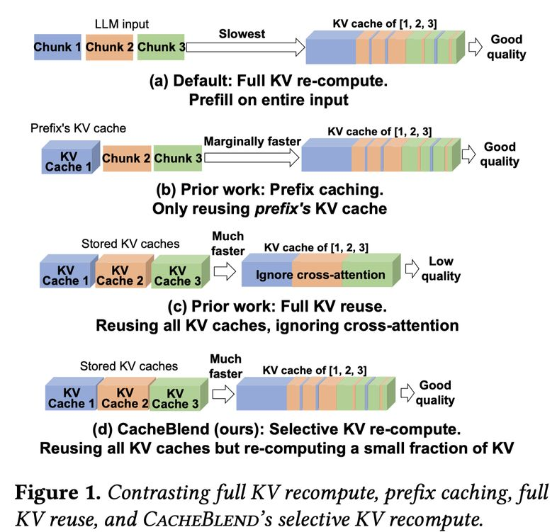

# CacheBlend: Fast Large Language Model Serving for RAG with Cached Knowledge Fusion

> Jiayi Yao, Hanchen Li, Yuhan Liu, Siddhant Ray, Yihua Cheng, Qizheng Zhang, Kuntai Du, Shan Lu, Junchen Jiang

> ⚠️ **本文由 AI Agent 自动生成，内容基于论文全文阅读与分析。生成时间：2025年6月。**

---

## 一句话总结

CacheBlend 通过选择性重计算少量 token 的 KV cache（仅 10-15%），在保留跨块注意力（cross-attention）的前提下，实现了 RAG 场景下 KV cache 的高效融合，将 TTFT 降低 2.2-3.3 倍，吞吐量提升 2.8-5 倍，且几乎不影响生成质量。

---

## 摘要翻译

大语言模型（LLM）通常在其输入中包含多个文本块以提供必要的上下文。为了加速长 LLM 输入的预填充（prefill），可以预计算文本的 KV cache 并在该上下文被复用时重新使用。然而，复用的文本块并不总是输入的前缀，这使得预计算的 KV cache 无法直接使用，因为它们忽略了该文本与前面文本的交叉注意力（cross-attention）。因此，KV cache 复用的优势在很大程度上未被实现。

本文解决了一个核心挑战：当 LLM 输入包含多个文本块时，如何快速组合它们的预计算 KV cache，以达到与昂贵的完整预填充相同的生成质量？这一挑战自然出现在检索增强生成（RAG）场景中——输入中补充了多个检索到的文本作为上下文。我们提出了 CacheBlend，一种复用预计算 KV cache（无论是否为前缀）并通过选择性重计算少量 token 的 KV 值来部分更新每个复用的 KV cache 的方案。同时，重计算少量 token 的额外延迟可以与同一任务内的 KV cache 检索进行流水线化（pipelining），使得 CacheBlend 能够将 KV cache 存储在速度较慢但容量更大的设备上，且不增加推理延迟。在三个不同规模的开源 LLM 和四个不同任务的流行基准数据集上，CacheBlend 相比完整的 KV 重计算，将 TTFT 降低了 2.2-3.3 倍，推理吞吐量提高了 2.8-5 倍，且不牺牲生成质量。代码开源：https://github.com/LMCache/LMCache。

---

## 研究动机

### 背景问题

LLM 推理中的预填充（prefill）阶段需要计算所有输入 token 的 KV cache，这一步的延迟直接决定了用户等待第一个 token 的时间（TTFT）。在 RAG 场景中，输入通常包含多个检索到的文本块（chunk），导致预填充延迟随输入长度超线性增长，严重影响用户体验。

### 现有方法的不足

**1. 前缀缓存（Prefix Caching）：**
- 仅缓存和复用输入前缀的 KV cache（如 vLLM、SGLang、RAGCache）
- 优势：前缀的 KV cache 不受后续文本影响，生成质量与完整预填充相同
- 劣势：在 RAG 中，除了第一个文本块外，其他块都不是前缀，其 KV cache 无法被复用。因此，当输入包含多个复用的文本块时，前缀缓存的速度优势几乎消失，接近完整的 KV 重计算

**2. 完整 KV 复用（Full KV Reuse）：**
- 由 PromptCache 等系统提出，复用非前缀文本的 KV cache，通过调整位置编码保持位置正确
- 优势：速度快
- 劣势：忽略跨块注意力（cross-attention），即一个块的 token 与前面块的 token 之间的注意力。这在需要联合理解多个块信息的查询中会导致错误响应

### 核心洞察

通过实验（Figure 2）发现：
- 随着检索到的相关文本块数量增加，完整 KV 复用与完整 KV 重计算之间的质量差距越来越显著
- 跨块注意力对于多跳问答（multi-hop QA）等需要综合多源信息的任务至关重要

因此，本文的目标是：在保持完整 KV 重计算质量的前提下，实现接近完整 KV 复用的速度。

---

## 方法（技术细节）

### 4.1 选择性 KV 重计算（Selective KV Recompute）

CacheBlend 的核心思想是：在每一层只重计算少量 token 的 KV 值，而复用其他 token 的预计算 KV cache。

**工作流程：**
1. 对每一层的输入应用掩码（mask），只保留选定的 token 子集
2. 将减少后的输入转换为查询（Q）、键（K）和值（V）向量，仅限于选定的 token
3. 通过复用未选定 token 的 KV cache 条目来扩展 K 和 V 向量
4. 运行注意力模块，产生下一层的输入

**关键特性：**
- 计算开销与重计算的 token 数量成正比
- 若重计算 r% 的 token，总计算开销约为完整预填充的 r%
- 通常只需重计算 10-15% 的 token 即可达到与完整预填充相同的质量

### 4.2 HKVD Token 选择（High KV Deviation）

如何选择需要重计算的 token 是关键问题。

**Insight 1：** 重计算 KV 偏差（KV deviation）最高的 token 可以最大程度地减少注意力偏差（attention deviation）。KV 偏差定义为预计算 KV 与完整重计算 KV 之间的绝对差异。

**Insight 2：** 不同层之间的 HKVD token 具有高度相关性。即一个 token 在某层的 KV 偏差较高，很可能在相邻层也较高。这是因为 transformer 中 token 的输入嵌入在层间变化缓慢。

**选择方案——渐进式过滤（Gradual Filtering）：**
1. 在第一层进行完整预填充，选择 KV 偏差最高的 token（比例略高于最终目标比例 r%）
2. 在第二层，仅对这些 token 的 KV 进行重计算，并选择其中 KV 偏差最高的 token（比例略低于上一层）
3. 逐层递进，最终选出每层的 HKVD token

**注意力稀疏性（Attention Sparsity）：**
- 实验表明，仅约 10-15% 的 token 具有显著高于其他 token 的 KV 偏差
- 这与注意力稀疏性特性一致：在注意力矩阵中，高注意力通常只发生在少量 token 与其前驱 token 之间

### 4.3 系统设计（System Design）

**核心洞察：** 如果选择性 KV 重计算的延迟小于将 KV 加载到 GPU 内存的延迟，则通过流水线化（pipelining）KV 加载和重计算，可以隐藏重计算的延迟。

**流水线化机制：**
- 一层的选择性 KV 重计算可以在上一层的 KV cache 加载到 GPU 内存后立即开始
- 因为下一层要重计算哪些 token 仅依赖于上一层的 KV 偏差
- KV 加载延迟可以完全隐藏重计算延迟（当重计算延迟 ≤ 加载延迟时）

**三个关键组件：**

1. **加载控制器（Loading Controller）：**
   - 根据给定的存储设备，选择理想的重计算比例
   - 使用两个延迟估计器：重计算延迟估计器和加载延迟估计器
   - 计算最优重计算比例，使重计算延迟接近加载延迟
   - 还可以智能选择存储设备（在满足延迟约束的前提下选择最便宜的设备）

2. **KV Cache 存储（KV Cache Store）：**
   - 将 LLM 输入拆分为多个文本块，每个块可复用或新建
   - 通过哈希查找对应的 KV cache（与 vLLM 的块哈希实现方式相同）
   - 新生成的 KV cache 添加到存储设备
   - 使用 LRU 策略淘汰过期的 KV cache

3. **融合器（Fusor）：**
   - 通过选择性重计算合并预计算的 KV cache
   - 等待上一层重计算完成，加载当前层的 KV cache，使用加载控制器计算的重计算比例进行选择性重计算
   - 重复此过程直到所有层完成

### 4.4 实现

- 基于 vLLM，使用 PyTorch v2.0，约 3K 行 Python 代码
- 三个核心接口：
  - `fetch_kv(text, layer_id)`：获取 KV cache
  - `prefill_layer(input_dict, KVCache)`：执行部分预填充
  - `synchronize()`：同步，确保当前层的 KV cache 已加载到 GPU
- 使用两个线程流水线化计算（当前层的重计算）和加载（下一层的 KV cache）
- KV cache 在 CPU 和 SSD 之间的管理：通过 `torch.cpu()` 和 `torch.save()` 进行

---

## 实验结果

### 实验设置

- **模型：** Mistral-7B、Yi-34B（8-bit 量化）、Llama-70B（8-bit 量化）
- **硬件：** Runpod GPU（128GB RAM，2×Nvidia A40，1TB NVME SSD，吞吐量 4.8GB/s）
- **数据集：**
  - 2WikiMQA（200 测试用例）：多跳推理 QA
  - Musique（150 测试用例）：多文档 QA
  - SAMSum（200 测试用例）：对话摘要
  - MultiNews（60 测试用例）：多新闻摘要
- **质量指标：** F1-score（QA）和 Rouge-L（摘要）
- **基线：**
  - Full KV recompute（完整 KV 重计算）
  - Prefix caching（前缀缓存，假设无加载延迟）
  - Full KV reuse（完整 KV 复用，基于 PromptCache）
  - MapReduce、MapRerank（RAG 方法）

### 核心结果

**1. TTFT 降低：**
- 相比完整 KV 重计算，TTFT 降低 **2.2-3.3 倍**
- 跨所有模型和数据集

**2. 质量保持：**
- 相比完整 KV 重计算和前缀缓存，质量损失在 **0.02 以内**
- 相比完整 KV 复用（Full KV reuse），F1-score 提升 **0.1-0.2**，Rouge-L 提升 **0.03-0.25**

**3. 吞吐量提升：**
- 在相同 TTFT 下，吞吐量比完整 KV 重计算提升 **2.8-5 倍**
- 比前缀缓存提升 **3.3 倍**

**4. 与 RAG 方法对比：**
- 相比 MapReduce，TTFT 低 **2-5 倍**，F1-score 更高
- 相比 MapRerank，质量显著更高（MapRerank 忽略了块间依赖）

**5. 重计算比例：**
- 5%-18% 的重计算比例即可保持与完整 KV 重计算可比的质量
- 对应 **4.1-6.6 倍** TTFT 降低（vs 完整 KV 重计算）
- 对应 **3.4-6.1 倍** TTFT 降低（vs 前缀缓存）

**6. 存储设备影响：**
- 在 RAM 和较慢 SSD（4Gbps）上，CacheBlend 均保持较低 TTFT 和质量
- 在较慢存储设备上，与 Full KV reuse 的延迟差距变小（因为延迟更多由加载主导）

**7. 敏感性分析：**
- 不同 chunk 数量和长度下，性能下降比例相似
- 更大 batch size 时，CacheBlend 的优势更显著（因为 prefill 延迟随 batch size 增长更快）

---

## 优势

1. **显著的 TTFT 降低：** 2.2-3.3 倍加速，几乎不影响生成质量
2. **高效的吞吐量提升：** 2.8-5 倍，适合高并发 RAG 服务
3. **跨块注意力保留：** 通过选择性重计算，有效恢复被忽略的跨块注意力
4. **智能流水线化：** 将重计算延迟隐藏在 KV 加载延迟中，不增加额外延迟
5. **灵活的存储管理：** 支持存储在不同速度的设备上（RAM、SSD），智能选择最优存储方案
6. **与现有系统兼容：** 基于 vLLM 实现，可与其他 KV cache 压缩/优化技术互补
7. **轻量实现：** 仅约 3K 行 Python 代码，易于集成
8. **注意力稀疏性利用：** 基于 attention sparsity 的理论和实验基础，方法有充分的理论支撑

---

## 局限

1. **仅适用于 Transformer 架构：** 当前方法基于 Transformer 的注意力机制，不适用于 Mamba、Griffin 等非 Transformer 架构
2. **模型和数据集覆盖有限：** 仅在 Mistral-7B、Yi-34B、Llama-70B 上测试，未涵盖更多模型和不同的量化设置
3. **未与最新推理引擎集成：** 仅在 vLLM 上实现，未测试与 Distserve、StableGen 等最新推理引擎的兼容性
4. **不支持跨节点 KV cache 共享：** 未研究如何将 CacheBlend 应用于跨计算节点共享 KV cache 的场景
5. **单层存储：** 当前仅支持单级存储（如 CPU RAM 或 SSD），不支持多级存储层次结构
6. **RAG 方法选择受限：** 仅支持 "stuff" 模式（将所有上下文前置在 LLM 输入中），不适用于 MapReduce 或 Rerank 等 RAG 方法
7. **重计算比例的硬编码：** 默认重计算比例为 15%，虽然可以调整，但最优比例可能因模型和场景而异

---

## 与 EfficientPaper 相关的研究方向

1. **KV Cache 管理与优化：**
   - CacheBlend 属于 KV cache 管理（kv_cache_management）领域，与 LMCache 项目直接相关
   - 与 KV cache 压缩（如 GEAR、KIVI、KVQuant）互补，可结合以进一步降低存储需求
   - 与 KV cache 选择性丢弃（如 H2O、Scissorhands）可结合，进一步减少 KV cache 大小

2. **RAG 推理优化：**
   - 与 RAGCache 等工作形成互补，CacheBlend 可在 RAG 系统中显著降低 TTFT
   - 与上下文压缩方法（如 LLMLingua、LongLLMLingua）可结合

3. **LLM 服务系统：**
   - 与 vLLM、SGLang、Distserve 等通用 LLM 服务系统互补
   - 可应用于多轮对话、长上下文推理等场景

4. **注意力机制研究：**
   - 利用注意力稀疏性进行高效推理，与 Transformer 优化的研究方向一致
   - 为未来非 Transformer 架构（如 Mamba）的 KV cache 管理提供启发

5. **存储层次结构：**
   - 支持将 KV cache 存储在不同速度的设备上，与异构存储系统的研究方向相关
   - 智能存储设备选择机制为未来多级存储层次结构提供参考

6. **论文基线：**
   - 本论文的基线方法为 LMCache（2025），与 EfficientPaper 中的 LMCache 论文直接相关

---

## 引用信息

- **发表会议：** EuroSys '25（2025年3月30日-4月3日，鹿特丹，荷兰）
- **作者：** Jiayi Yao, Hanchen Li, Yuhan Liu, Siddhant Ray, Yihua Cheng, Qizheng Zhang, Kuntai Du, Shan Lu, Junchen Jiang
- **机构：** University of Chicago, Stanford University, Microsoft Research
- **代码：** https://github.com/LMCache/LMCache
- **关键词：** Large Language Models, KV Cache, Retrieval-Augmented-Generation, kv_cache_management
