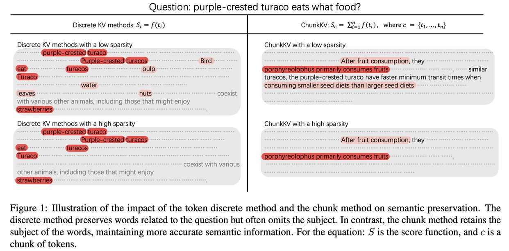

# ChunkKV: Semantic-Preserving KV Cache Compression for Efficient Long-Context LLM Inference

## 一句话总结

ChunkKV 提出了一种基于语义块（chunk）的 KV 缓存压缩方法，通过将连续的 token 作为整体保留或丢弃，有效保留了长上下文中的语义完整性，并通过层间索引复用进一步提升推理效率。

---

## 摘要翻译

为了减少长上下文推理中大语言模型（LLMs）的内存成本，许多近期工作专注于压缩不同 token 的键值（KV）缓存。然而，我们发现之前的 KV 缓存压缩方法孤立地评估 token 的重要性，忽略了现实语言特征中不同 token 之间的依赖关系。基于此，我们提出了 ChunkKV，将 chunk 中的 token 作为基本压缩单元进行分组，保留最具信息量的语义块，同时丢弃不太重要的部分。此外，观察到 ChunkKV 在不同层之间保留的索引具有更高的相似性，我们进一步提出了层间索引复用技术以减少计算开销。我们在多个前沿长上下文基准（包括 LongBench 和 Needle-In-A-HayStack）以及 GSM8K 和 JailbreakV 上下文学习基准上评估了 ChunkKV。使用指令微调和多步推理（O1 和 R1）LLM 的实验表明，在激进压缩率下，与现有方法相比，性能提升最高可达 10%。

---

## 研究动机

1. **KV 缓存内存瓶颈**：LLM 在处理长文本时，KV 缓存可占推理总内存的 70%。例如，一个 7B 参数模型中单个 token 的 KV 缓存就需要约 0.5 MB GPU 内存，10,000 token 的提示消耗约 5 GB 内存。
2. **现有方法的局限**：当前 KV 缓存压缩方法（如 H2O、SnapKV、PyramidKV）通过逐个 token 评估重要性来裁剪 KV 缓存，忽略了 token 之间的语义依赖关系。例如，在回答"purple-crested turaco 吃什么食物"时，逐 token 方法可能保留了与问题相关的词（如"turaco"），但遗漏了关键的宾语信息（如"fruits"），导致语义信息丢失。
3. **核心问题**：如何避免孤立的 token 重要性度量，同时保留 KV 缓存中的语义信息？

---

## 方法

### 3.1 核心思想：基于 Chunk 的 KV 压缩

ChunkKV 的核心思想是将连续的 token 分组为语义块（chunk），作为一个整体保留或丢弃，而不是逐个 token 进行选择。

**算法流程（Algorithm 1）**：

1. **观察窗口计算**：使用观察窗口（observe window）计算注意力分数 $A = Q^T_{T_q-w:T_q} K$，其中 $w$ 为窗口大小（通常为 4, 8, 16, 32）。
2. **分块**：将 Key 矩阵分为 $C = \lceil T_k / c \rceil$ 个 chunk，$c$ 为 chunk 大小。
3. **计算 chunk 注意力分数**：$A_i = \sum_{j=(i-1)c+1}^{ic} A_{:,j}$，即对每个 chunk 内所有 token 的注意力分数求和。
4. **Top-K 选择**：选择 top-k 个 chunk（$k = \lfloor L_{max} / c \rfloor$），$L_{max}$ 为压缩后 KV 缓存的最大长度。
5. **压缩与拼接**：保留被选中 chunk 对应的 K 和 V 矩阵，并将观察窗口拼接至压缩后的 KV 缓存末尾。

### 3.2 层间索引复用（Layer-Wise Index Reuse）

作者发现 ChunkKV 在不同层之间保留的 KV 缓存索引具有更高的相似性（Jaccard 相似度），因此提出了层间索引复用技术：

- **机制**：将连续的 $N_{reuse}$ 层分为一组，仅在每组的第一层执行 ChunkKV 压缩，后续层复用该层的索引。
- **效率提升**：减少 KV 缓存压缩时间约 20%，吞吐量提升最高达 26.5%，性能下降仅 0.5%。

**实验验证**：
| 方法 | LLaMA-3-8B | Qwen2-7B | Mistral-7B |
|------|------------|----------|------------|
| H2O  | 25.31%     | 14.91%   | 15.15%     |
| SnapKV| 27.95%    | 16.50%   | 15.78%     |
| ChunkKV| 57.74%   | 44.26%   | 52.16%     |

### 3.3 理论理解

作者从上下文学习（ICL）的角度提供了理论解释：连续的 chunk 级 KV 缓存保留了完整的示例（语义信息），从而降低了对可区分性的要求（即示例与问题之间的 KL 散度下界）。

---

## 实验结果

### 实验设置
- **基准**：LongBench、Needle-In-A-HayStack (NIAH)、GSM8K、Many-Shot GSM8K、JailbreakV
- **模型**：DeepSeek-R1-Distill-Llama-8B、LLaMA-3-8B-Instruct、Mistral-7B-Instruct、Qwen2-7B-Instruct
- **chunk 大小**：10（默认值，鲁棒性好）

### 关键结果

1. **GSM8K（上下文学习）**：
   - 在 10% 压缩率下，DeepSeek-R1-Distill-Llama-8B 从 FullKV 的 69.4% 提升至 65.7%（ChunkKV），而 SnapKV 仅 57.6%。
   - 在 10% 压缩率下，LLaMA-3.1-8B-Instruct 从 FullKV 的 79.5% 提升至 65.7%（ChunkKV），而 SnapKV 仅 50.3%。
   - 在 20% 压缩率下，LLaMA-3.1-8B-Instruct 从 FullKV 的 79.5% 提升至 77.6%（ChunkKV），而 SnapKV 仅 68.8%。

2. **Many-Shot GSM8K（50-shot）**：
   - 在 10% 压缩率下，DeepSeek-R1-Distill-Llama-8B 从 FullKV 的 71.2% 提升至 68.2%（ChunkKV），而 SnapKV 仅 54.1%。
   - 在 10% 压缩率下，LLaMA-3.1-8B-Instruct 从 FullKV 的 82.4% 提升至 79.3%（ChunkKV），而 SnapKV 仅 68.2%。

3. **JailbreakV（安全性评估）**：
   - 在 20% 压缩率下，LLaMA-3.1-8B-Instruct 从 FullKV 的 88.9% 提升至 89.0%（ChunkKV），而 SnapKV 仅 88.0%。
   - 在 10% 压缩率下，LLaMA-3.1-8B-Instruct 从 FullKV 的 88.9% 提升至 87.9%（ChunkKV），而 SnapKV 仅 84.3%。

4. **LongBench（长上下文理解）**：
   - 在 10% 压缩率下，LLaMA-3-8B-Instruct 性能下降仅 2.29%（ChunkKV），而 SnapKV 下降 3.16%。
   - 在 30% 压缩率下，LLaMA-3-8B-Instruct 性能甚至提升 0.31%（ChunkKV）。
   - 在 10% 压缩率下，Qwen2-7B-Instruct 性能提升 0.42%（ChunkKV），而 SnapKV 下降 0.39%。
   - 在中文子任务（LongBench-ZH）中，Qwen2-7B-Instruct 性能提升 2.20%（ChunkKV），而 SnapKV 下降 5.31%。

5. **Needle-In-A-HayStack（长上下文检索）**：
   - 在 KV 缓存大小为 128 时，LLaMA-3.1-8B-Instruct 的 NIAH 准确率为 73.8%（ChunkKV），而 SnapKV 仅 58.9%。
   - 在 KV 缓存大小为 96 时，LLaMA-3.1-8B-Instruct 的 NIAH 准确率为 70.3%（ChunkKV），而 SnapKV 仅 56.2%。
   - 在 Mistral-7B-Instruct 上，KV 缓存大小为 128 时，ChunkKV 准确率为 99.8%，而 SnapKV 仅 91.6%。

6. **效率提升（Layer-Wise Index Reuse）**：
   - 在输入 8192、输出 1024 的配置下，ChunkKV_reuse 延迟降低 20.7%，吞吐量提升 26.5%。
   - 在输入 4096、输出 1024 的配置下，ChunkKV_reuse 延迟降低 14.3%，吞吐量提升 17.2%。

7. **与 KV 量化方法（KIVI）比较**：
   - ChunkKV（10% 压缩）在总生成时间上比 KIVI（2-bit 量化）快 27.3%（164.66s vs 226.52s）。
   - ChunkKV 在 TTFT（首 token 延迟）和 TPOT（每 token 延迟）指标上也显著优于 KIVI。

### Chunk 大小消融实验
- chunk 大小在 5-20 范围内性能稳定，最佳值为 10。
- 过小的 chunk（如 3）导致上下文碎片化，过大的 chunk（如 30）导致语义粒度过粗。
- 不同模型和任务之间，最优 chunk 大小基本一致，对任务和模型不敏感。

---

## 优势

1. **语义保留**：通过 chunk 级别的压缩，保留了完整的语言结构和上下文信息，避免了逐 token 方法导致的语义信息丢失。
2. **性能优越**：在多个基准上显著优于现有方法（H2O、SnapKV、PyramidKV），在激进压缩率下性能提升最高达 10%。
3. **高效计算**：层间索引复用技术进一步减少计算开销，延迟降低最高 20.7%，吞吐量提升最高 26.5%。
4. **通用性强**：在不同模型（LLaMA-3、Mistral-7B、Qwen2、DeepSeek-R1）和不同任务（长上下文、上下文学习、安全性评估）上均表现优异。
5. **简单有效**：方法实现简单，无需训练，chunk 大小对任务和模型不敏感（推荐默认值 10）。
6. **支持多语言**：在中文子任务上表现优异，Qwen2-7B-Instruct 在 LongBench-ZH 上性能提升 2.20%。
7. **与量化互补**：与 KV 量化方法（如 KIVI）相比，ChunkKV 在推理效率上更具优势，可与其互补使用。

---

## 局限

1. **不适合对语义保真度要求极高的场景**：在法律或生物医学文档分析等领域，丢弃任何文本部分（即使基于注意力分数判断为不重要）可能导致关键信息丢失。
2. **固定 chunk 大小的限制**：当前实现依赖固定大小的 chunk，虽然对任务和模型不敏感，但根据语言线索（如句子结尾）动态确定 chunk 边界可能进一步提高语义完整性，但会引入额外的推理延迟。
3. **层间索引复用的权衡**：虽然层间索引复用显著提升了效率，但在某些全局理解任务（如摘要）中，可能不如逐层压缩有效。混合压缩策略（早期层使用 ChunkKV，深层使用 token 级方法）在摘要等任务上表现更优，但纯 ChunkKV 在局部信息检索任务上更优。
4. **仅验证了 7B/8B 模型**：实验主要在 7B/8B 参数规模的模型上进行，未验证更大规模模型的适用性。

---

## 与 EfficientPaper 相关的研究方向

1. **KV 缓存压缩**：ChunkKV 属于 KV 缓存压缩领域，与 H2O、SnapKV、PyramidKV、PyramidInfer 等方法形成竞争关系。
2. **语义感知的压缩**：与传统的逐 token 压缩方法不同，ChunkKV 采用 chunk 级别的压缩，强调语义信息的保留。
3. **层间共享/复用**：层间索引复用技术与 Layer-Condensed KV Cache (LCKV)、YOCO、Cross-Layer Attention (CLA)、MiniCache 等方法相关，属于 KV 缓存共享/复用领域。
4. **长上下文处理**：ChunkKV 解决了长上下文推理中的内存瓶颈问题，与 FlashAttention、StreamingLLM、RingAttention 等长上下文处理技术互补。
5. **KV 缓存量化**：ChunkKV 与 KV 量化方法（如 KIVI、SmoothQuant、AnTKV）互补，可结合使用以进一步压缩 KV 缓存。
6. **上下文学习（ICL）**：ChunkKV 在 GSM8K、Many-Shot GSM8K、JailbreakV 等上下文学习基准上表现优异，与 Chain-of-Thought (CoT) 等技术相关。
7. **推理效率**：层间索引复用技术显著提升了推理效率，与 FlashAttention、CUDA 优化等技术相关。

---

> **声明**：本 note 由 AI Agent 自动生成，基于 arXiv 论文（arXiv:2502.00299v5）的全文内容，使用中文撰写。生成时间：2026 年 6 月 5 日。
