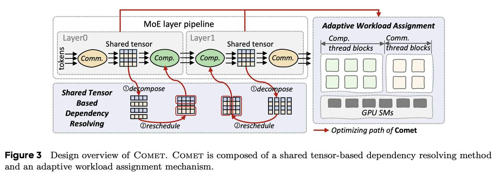

# Comet: Fine-grained Computation-communication Overlapping for Mixture-of-Experts

> Shulai Zhang, Ningxin Zheng, Haibin Lin, Ziheng Jiang, Wenlei Bao, Chengquan Jiang, Qi Hou, Weihao Cui, Size Zheng, Li-Wen Chang, Quan Chen, Xin Liu
>
> ByteDance Seed / Shanghai Jiao Tong University

---

> **⚠️ 本 note 由 AI Agent 自动生成，仅供参考。生成时间：2026-06-05。**
> 如有错误或遗漏，请以原论文为准并手动修正。

---

## 一句话总结

Comet 是一个面向 MoE 模型的细粒度通信-计算重叠系统，通过共享张量分解重调度和自适应工作负载分配，实现 MoE 层内 1.96× 加速和端到端 1.71× 加速，并已在万卡级 GPU 集群中大规模部署。

---

## 摘要翻译

混合专家模型（MoE）已被广泛用于将大语言模型扩展到万亿参数规模，同时保持固定的计算成本。然而，分布式场景中大 MoE 模型的开发面临严重的通信开销问题。在常用模型和框架中，MoE 层的设备间通信可占用整个模型执行时间的 47%。因此，现有方法建议将 MoE 层中的通信与计算进行流水线重叠。但这些粗粒度重叠方案会显著降低计算效率，且延迟隐藏效果不理想。

为此，本文提出 Comet，一个具有细粒度通信-计算重叠能力的优化 MoE 系统。通过利用数据依赖分析和任务重调度，Comet 实现了通信与计算的精确细粒度重叠。通过自适应工作负载分配，Comet 有效消除了细粒度通信瓶颈，增强了在多种场景下的适应性。实验结果表明，Comet 将单个 MoE 层的执行加速了 1.96 倍，端到端执行平均加速 1.71 倍。Comet 已被部署在万卡级 GPU 集群的生产环境中，节省了数百万 GPU 小时。

---

## 研究动机

### MoE 通信开销问题

MoE 架构通过稀疏激活机制，在不增加计算成本的前提下扩展模型参数规模。但分布式部署时，不同专家分布在不同 GPU 上，需要频繁的跨设备数据交换。实验显示，MoE 层的通信开销可占总执行时间的 47%（在 Mixtral-8x7B、Qwen2-MoE 等模型上）。

### 粗粒度重叠方案的不足

现有方法（如 FasterMoE、Tutel）采用粗粒度流水线方案，将计算和通信分成较大块进行重叠。但这种方法存在两个核心问题：

1. **粒度不匹配**：通信以 token 为单位，计算以 tile（如 128×128）为单位，粗粒度划分导致：
   - GPU 计算资源利用率下降（分区后的专家计算时间 t1+t2 > 原始时间 t）
   - 在初始和末尾通信阶段存在不可避免的 GPU 空闲时间

2. **动态负载不均衡**：MoE 的动态路由导致不同专家的输入形状在运行时各不相同，对 GPU 施加不同的通信和计算压力。将通信和计算任务封装到不同 stream 的独立 kernel 中，限制了对硬件资源的控制，导致非确定性的 kernel 性能，难以实现精确的重叠。

---

## 方法（技术细节）

Comet 的核心设计包含两个关键机制，如论文 Figure 3 所示：

### 1. 共享张量依赖解析（Shared Tensor Based Dependency Resolving）

Comet 将 MoE 层建模为两个生产者-消费者流水线：
- **通信-计算流水线**（Layer0）：All2all/AllGather（生产者）→ GEMM（消费者）
- **计算-通信流水线**（Layer1）：GroupGEMM（生产者）→ TopK-reduce + All2all/ReduceScatter（消费者）

两个流水线通过"共享张量"（Shared Tensor）连接，作为生产者的输出缓冲和消费者的输入缓冲。

**共享张量分解策略**：
- 分析算子对共享张量的访问模式，在独立维度上进行分解
- Layer0（通信-计算）：共享张量沿 M（token）维度分解（token 之间独立）
- Layer1（计算-通信）：共享张量沿 N（嵌入）维度分解（N 维度元素独立，M 维度存在 reduce 依赖）

**重调度策略**（遵循两个原则）：
- 分解后的子张量需与原始计算 tile 粒度对齐，保持计算效率
- 调度策略优先处理生产者中可被消费者立即使用的部分

具体实现：
- **Layer0**：将 token 按源 rank 排序，GroupGEMM 从包含本地 token 的 tile 开始计算，同时传输远程 token
- **Layer1**：将 GroupGEMM 改为按列（N 维度）执行，使 top-K reduce 和通信操作可在部分列计算完成后立即开始（而非等待所有专家完成）

### 2. 自适应工作负载分配（Adaptive Workload Assignment）

**线程块专业化**（Thread Block Specialization）：
- 将通信和计算任务分配到不同的 thread block 中（水平融合，而非垂直融合）
- 每个 SM 只容纳一个 thread block，避免通信和计算互相干扰
- 在 Hopper 架构上：
  - 计算 thread block：producer warp 使用 TMA 异步加载数据到 shared memory，consumer warp 执行 tensor core MMA 操作
  - 通信 thread block：读取 GEMM 结果，执行 top-K reduce 后写回本地或传输到远程
- 这种 thread block 专业化编程模型可移植到 Ampere 和 Volta 架构

**自适应线程块分配**：
- 关键参数：np（producer 线程块数）/ nc（consumer 线程块数）的比例
- 最优分配点受输入形状、模型配置、硬件环境影响
  - 例：TP=8 时，M 从 4096 变到 16384，最优 nc 从 18 变到 26
  - 例：TP 从 8 调到 4，最优 nc 从 26 变到 46
- Comet 库包含多个预编译 kernel，每个有不同分配点
- 部署前通过 profiling 确定最优配置，运行时通过 metadata 选择最佳 kernel

### 实现细节

- 代码规模：约 12k 行 C++/CUDA + 2k 行 Python
- GEMM 优化：基于 CUTLASS 模板生成高效 GroupGEMM kernel，缓存行索引到寄存器以减少全局内存访问
- 通信库：使用 NVSHMEM（而非 NCCL）进行细粒度 GPU 发起的通信操作
- 框架集成：已集成到 Megatron-LM 中

---

## 实验结果

### 实验环境

- **H800 集群**：8× NVIDIA H800（80GB），NVLink 互连，CUDA 12.3，NVSHMEM 2.11，PyTorch 2.4.0
- **L20 集群**：8× NVIDIA L20（46GB），PCIe 互连（带宽约 25GB/s）

### 基线对比

- Megatron-Cutlass（CUTLASS grouped GEMM）
- Megatron-TE（Transformer Engine）
- FasterMoE（定制化 All-to-All 通信重叠）
- Tutel（自适应 MoE 优化）

### 端到端性能（Mixtral-8x7B, Qwen2-MoE, Phi3.5-MoE）

- **端到端延迟降低**：
  - vs Megatron-Cutlass：34.1%
  - vs Megatron-TE：42.6%
  - vs FasterMoE：44.4%
  - vs Tutel：31.8%
- **平均加速**：1.71×（端到端）

### 单 MoE 层性能

- 加速范围：1.28× ~ 2.37×（不同输入 token 长度）
- 平均加速：1.96×
- **通信延迟隐藏**：86.5%（平均），FasterMoE 仅 29.2%，Tutel 仅 68.6%

### 不同并行策略

- Comet 在 EP 和 TP 不同比例下均保持低延迟
- 其他方法在 TP 增长时延迟增加（因 expert 被切分，产生更多碎片化小 GEMM）
- FasterMoE 不支持 TP

### 不同配置适应性

- 不同 E（专家数）和 topk：加速 1.16× ~ 1.83×
- 不平衡 token 分布（std=0.032 ~ 0.05）：Comet 仍优于其他系统
- L20 集群（带宽受限）：加速 1.19× ~ 1.46×

### 开销分析

- NVSHMEM 额外内存消耗：16~64MB（可忽略不计），通过全局缓冲在层和专家间共享

---

## 优势

1. **细粒度重叠**：突破粗粒度重叠的限制，在 token 级别实现通信-计算重叠，大幅提升延迟隐藏效率
2. **计算效率保持**：通过 thread block 专业化隔离通信对计算的影响，专家计算效率不受影响
3. **自适应性**：通过预编译多配置 kernel + 运行时选择，适应不同输入长度、并行策略、硬件环境
4. **大规模生产验证**：已在万卡级 GPU 集群中部署，节省数百万 GPU 小时
5. **可移植性**：thread block 专业化模型可扩展到 Ampere、Volta 等架构
6. **低额外开销**：NVSHMEM 缓冲内存消耗极小
7. **易集成**：提供 Python API，可无缝集成到 Megatron-LM 等框架

---

## 局限

1. **NVIDIA GPU 依赖**：使用 NVSHMEM 进行通信，限制在 NVIDIA GPU 平台上
2. **需要预编译和 profiling**：最优线程块分配需提前 profiling 存储为 metadata，增加了部署复杂度
3. **仅支持 NVIDIA 互联**：在 PCIe 带宽受限的环境中加速比下降（1.19× vs 1.71×）
4. **适用范围有限**：主要针对 MoE 架构，对 Dense 模型或其他稀疏结构的适用性未验证
5. **代码未完全开源**：代码将开源但当前可能未完全开放（截至论文发表时）
6. **对不同硬件架构的适配**：需要针对不同架构（如 Ampere、Volta）分别替换计算 thread block 实现
7. **token 分布不平衡**：虽然在不平衡分布下仍优于基线，但性能下降仍不可避免

---

## 与 EfficientPaper 相关的研究方向

- **通信优化**：细粒度通信-计算重叠技术可推广到其他分布式训练场景（如 Dense 模型的 AllReduce、GEMM 重叠）
- **系统效率**：与 EfficientPaper 中关注的系统级效率优化（kernel fusion、内存优化、通信库优化）高度相关
- **MoE 系统优化**：Comet 属于 MoE 系统优化的重要工作，与 FasterMoE、Tutel、PipeMoE、ScheMoE 等形成互补
- **并行策略**：支持多种并行策略（EP+TP），与 3D 并行、流水线并行等技术的结合值得探索
- **关键词关联**：overlap（重叠）、MoE、通信优化、系统优化、GPU kernel fusion、NVSHMEM
