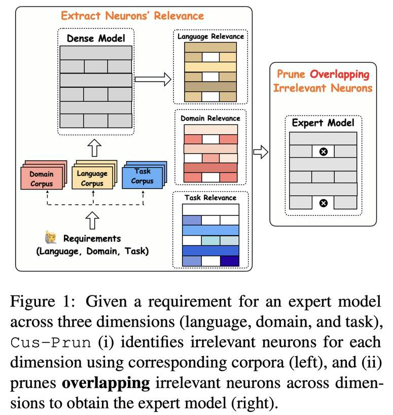

# Pruning General Large Language Models into Customized Expert Models



> **本文由 AI Agent 自动生成，生成时间：2025-06-05。**
> **元数据来源：** `/Users/xiandong/projects/EfficientPaper/meta/2025/Cus-Prun.prototxt`
> **论文来源：** [arXiv:2506.02561v1](http://arxiv.org/abs/2506.02561v1)
> **代码仓库：** [https://github.com/zhaoyiran924/Custom-Prune](https://github.com/zhaoyiran924/Custom-Prune)

---

## 一句话总结

Cus-Prun 是一种基于**语言、领域、任务**三维定制的细粒度神经元级剪枝方法，能够在**无需后训练**的情况下，将通用大语言模型裁剪为面向特定场景的轻量专家模型，同时保留大部分通用能力和专业能力。

---

## 摘要翻译

大型语言模型（LLM）已彻底改变了自然语言处理，但其庞大的模型规模通常需要大量的计算资源。为了节省计算资源并加速推理速度，剪枝冗余参数至关重要，尤其是对于需要针对特定下游场景定制紧凑专家模型的用户。然而，大多数现有剪枝方法侧重于保留模型的通用能力，通常需要大量的后训练，或者因粗粒度剪枝而导致性能下降。本文设计了一种定制剪枝方法（Cus-Prun），将大型通用模型剪枝为更小的轻量专家模型，该模型沿"语言"、"领域"和"任务"三个维度定位。通过识别和剪枝每个维度的无关神经元，Cus-Prun 能够在无需后训练的情况下创建专家模型。实验表明，Cus-Prun 在不同模型系列和大小上持续优于其他方法，在专家能力和通用能力方面均实现了最小损失。

---

## 研究动机

1. **LLM 压缩需求**：大型语言模型参数量达到数十亿甚至数百亿，推理计算成本高昂，需要高效的参数剪枝方法。

2. **现有方法的不足**：
   - 大多数剪枝方法（如 LLM-Pruner、SliceGPT、ShortGPT）侧重于**保留模型的通用能力**（如 MMLU 等通用基准），而非针对特定使用场景。
   - 粗粒度剪枝（移除整层或整个模块）可能移除对特定下游场景至关重要的参数，导致需要大量后训练来恢复。
   - 用户实际需求往往是**特定语言、领域、任务**的组合（如德语教育领域的问答模型），现有方法无法很好地满足这种定制化需求。

3. **核心洞察**：模型中存在对特定语言、领域或任务**冗余的神经元**，可以被选择性地移除，从而创建更小且与特定需求对齐的专家模型。

4. **关键区别**：现有方法是"保留通用能力"，而 Cus-Prun 是"移除与目标场景无关的参数"，后者更符合实际部署需求。

---

## 方法（技术细节）

### 4.1 专家模型的三维定义

Cus-Prun 将专家模型定义为三个维度的组合：
- **语言维度（L）**：如英语、中文、德语、泰语等
- **领域维度（D）**：如金融、医疗、法律、电商等
- **任务维度（T）**：如问答、摘要、情感分析等

专家模型表示为：`LLMExp := (L, D, T) ∈ L × D × T`

### 4.2 基础定制剪枝（Foundational Custom Pruning）

**核心假设**：受 LLM 解释性研究启发，模型中的许多参数对处理特定"语言"是冗余的，该现象可扩展到"领域"和"任务"维度。

**技术流程**：

1. **构建维度专属语料库**：
   - 对于每个维度，构建包含该维度信息的语料库（同时消除其他维度的干扰）。
   - 例如，为语言 LExp 构建语料库 `CLExp = {(LExp, D, T) | D ∈ D, T ∈ T}`，包含该语言的各种领域和任务的文档。

2. **识别无关神经元**：
   - 对于每个神经元 N(l)_i（第 l 层第 i 个神经元），通过**消融实验**衡量其相关性：
     - 计算 `||h\N(l)_i(c) - h_i(c)||_2`，其中 `h_i(c)` 是正常输出，`h\N(l)_i(c)` 是移除该神经元后的输出。
   - 对于每篇文档，影响力最低的 σ% 的神经元被视为无关（σ 为预定义的剪枝比例）。
   - 在整个语料库中**一致无关**的神经元被标记为该维度的无关神经元集合 ˜N。

3. **融合剪枝**：
   - 最终专家模型通过取**所有维度无关神经元的交集**来确定剪枝目标：
     - `LLMExp = LLM ⊖ (˜NLExp ∩ ˜NDExp ∩ ˜NTE xp)`
     - 即移除所有维度都认为无关的神经元。

4. **细粒度剪枝**：
   - 不同于移除整层或整个模块，Cus-Prun 在**神经元级别**（参数矩阵中的行或列）进行剪枝，覆盖所有组件（如注意力层和前馈层）。

### 4.3 自适应定制剪枝（Adaptive Custom Pruning）

Cus-Prun 支持灵活的定制粒度：

1. **三维专家模型**：同时约束语言、领域、任务三个维度。
2. **二维专家模型**：例如语言-领域专家模型（如中文医疗模型），使用两个维度的无关神经元交集。
3. **一维专家模型**：例如语言特定模型，仅使用一个维度的无关神经元集合。

### 4.4 并行神经元检测

为提高效率，Cus-Prun 实现了并行神经元检测方法（Zhao et al., 2024b），加速了序列化的神经元影响评估过程。

### 4.5 算法伪代码

```
输入: 原始语言模型 LLM，专家模型请求 (LExp, DExp, TExp)，剪枝比例 σ
1: 构建选定维度的语料库
2: 对每个维度识别无关神经元
3: 取所有维度无关神经元的交集
4: 移除这些神经元得到专家模型
输出: LLMExp
```

---

## 实验结果

### 5.1 实验设置

- **模型**：Llama3-8B、Mistral-Nemo-12B、Llama2-13B、Llama3-70B
- **剪枝比例**：25%（默认），以及更激进的 35% 和 45%
- **基线方法**：
  - Dense（原始模型）
  - LLM-Pruner（结构化剪枝）
  - SliceGPT（矩阵近似）
  - ShortGPT（层移除）
- **评估指标**：ARC-Challenge、GSM8K、MMLU（通用能力）；MGSM、M3Exam、XQuAD、XLSum（多语言）；MedMCQ、FinTQA、TSA、AMSA（多领域）；MedSum、ASum、AMCF（多任务）

### 5.2 预实验（三维专家模型）

在三个具体场景中（韩语-法律-摘要、英语-医疗-选择题、中文-电商-情感分析）：
- Cus-Prun 分别保留了原始模型性能的 **92%、83%、94%**
- SliceGPT（不考虑特定使用场景）表现远低于 Cus-Prun

### 5.3 主要实验结果

#### 多语言设置（25% 剪枝率）

| 模型 | 方法 | 通用能力 | 多语言专家 | 多领域专家 | 多任务专家 |
|------|------|----------|------------|------------|------------|
| Llama3-8B | Dense | 64.1 | 46.7 | 59.8 | 57.0 |
| Llama3-8B | Cus-Prun | 51.4 | **38.9** | **68.4** | **52.2** |
| Llama3-8B | SliceGPT | 21.9 | 10.0 | 20.5 | 20.5 |
| Llama3-8B | ShortGPT | 22.3 | 7.4 | 17.6 | 17.6 |
| Llama3-70B | Dense | 81.9 | 61.6 | 76.8 | 61.1 |
| Llama3-70B | Cus-Prun | 62.7 | **48.7** | **80.4** | **57.9** |

**关键发现**：
- Cus-Prun 在所有模型和所有设置中持续优于其他剪枝方法。
- 在生成任务（如 MGSM）中，其他方法几乎丧失了生成连贯推理输出的能力（接近 0 准确率），而 Cus-Prun 仍能保持较好的性能。
- 在低资源语言（如泰语）中表现稳健。

#### 二维专家模型（中文-医疗）

- Cus-Prun 在 CMExam 上达到 **48.7%**（Dense 为 50.6%），通用能力为 52.4%（Dense 为 59.3%）。
- 其他方法几乎同时丧失通用和专业能力。

#### 一维专家模型（语言特定）

- 剪枝 25% 神经元后，Cus-Prun 在德国、中文、泰语模型上均保持了通用性能和语言特定能力。
- 例如，德国特定模型在通用能力上得 54.7，XQuAD 上得 48.3，XNLI 上得 56.8（Dense 分别为 64.1、52.9、62.0）。
- ShortGPT 在生成任务（XQuAD、XLSum）上表现尤其差。

#### 激进剪枝比例（Llama3-8B）

| 方法 | 比例 | 加速比 | MMLU | 专家能力 |
|------|------|--------|------|----------|
| Dense | 0% | 1× | 63.1 | 59.7 |
| ShortGPT | 43.8% | 1.8× | 7.9 | 10.2 |
| Cus-Prun | 45% | 1.8× | **48.4** | **50.6** |

**关键发现**：即使在 45% 的激进剪枝率下，Cus-Prun 仍能保持有意义的性能，而 ShortGPT 在 43.8% 时几乎完全丧失能力。

---

## 优势

1. **无需后训练**：Cus-Prun 直接通过剪枝创建专家模型，无需任何微调或后训练，大幅降低部署成本。

2. **细粒度剪枝**：在神经元级别进行剪枝（而非整层或整模块移除），能更精确地保留与目标场景相关的参数。

3. **三维定制化**：支持语言、领域、任务三个维度的灵活组合，以及一维、二维、三维的自适应剪枝。

4. **广泛的适用性**：
   - 在多种模型家族（Llama、Mistral）和规模（8B-70B）上表现一致。
   - 在多语言（德语、中文、泰语）、多领域（医疗、金融、电商）、多任务（摘要、问答、情感分析）设置下均优于基线。

5. **鲁棒性强**：即使在激进剪枝比例（高达 45%）下仍保持良好性能。

6. **通用能力保留**：由于采用神经元级剪枝，大部分骨干神经元得以保留，从而保持了较强的通用能力。

7. **高效实现**：支持并行神经元检测，提高了剪枝效率。

---

## 局限

1. **维度覆盖有限**：虽然 Cus-Prun 使用了三个维度（语言、领域、任务），但某些关键限制（如查询格式、输入结构的变化）无法完全在该框架内捕获。

2. **剪枝后微调的不确定性**：剪枝后的模型能否有效进行后训练（微调）仍是一个开放问题，这可能限制模型在剪枝后适应新场景的能力。

3. **语料库构建**：需要为每个维度构建相应的语料库，虽然可以通过自动检索完成，但语料库质量可能影响剪枝效果。

4. **维度组合复杂性**：当需要精确控制多个维度时，语料库和神经元识别的计算开销可能增大。

5. **特定任务的适用性**：论文主要在 NLP 任务上验证，对于更广泛的任务类型（如代码生成、多模态等）的适用性尚未探索。

---

## 与 EfficientPaper 相关的研究方向

1. **结构化稀疏剪枝**：Cus-Prun 是一种结构化剪枝方法，与 EfficientPaper 关注的 `sparse_pruning` 和 `structured_sparsity` 关键词高度相关。该方法为实现高效的模型压缩提供了新思路。

2. **模型压缩与部署**：Cus-Prun 通过无后训练的剪枝方法降低了大模型的部署成本，与 EfficientPaper 中关于模型压缩（如量化、蒸馏、剪枝）的研究方向一致。

3. **多语言/多领域模型优化**：Cus-Prun 在多语言（德语、中文、泰语）和多领域（医疗、金融、电商）场景下的优异表现，为 EfficientPaper 中跨语言和跨领域的模型效率优化提供了重要参考。

4. **神经元级细粒度剪枝**：Cus-Prun 采用的神经元级剪枝策略，与 EfficientPaper 中关于细粒度模型优化的研究方向相呼应，展示了更精确的参数控制能力。

5. **免训练模型定制**：Cus-Prun 无需后训练即可创建专家模型，这种免训练的定制方法可能与 EfficientPaper 中关于高效模型定制的研究方向产生交叉。

6. **多维度剪枝框架**：Cus-Prun 的三维（语言-领域-任务）剪枝框架为模型效率研究提供了新的分析视角，可启发后续研究探索更多维度的剪枝策略。

---

## 参考信息

- **论文标题**：Pruning General Large Language Models into Customized Expert Models
- **作者**：Yiran Zhao, Guizhen Chen, Kenji Kawaguchi, Lidong Bing, Wenxuan Zhang
- **机构**：National University of Singapore, Nanyang Technological University, Alibaba Group, Singapore University of Technology and Design
- **发布平台**：arXiv（2025年6月3日）
- **关键词**：sparse_pruning, structured_sparsity
- **代码**：https://github.com/zhaoyiran924/Custom-Prune
- **基础模型**：Llama3-8B, Mistral-Nemo-12B, Llama2-13B, Llama3-70B
