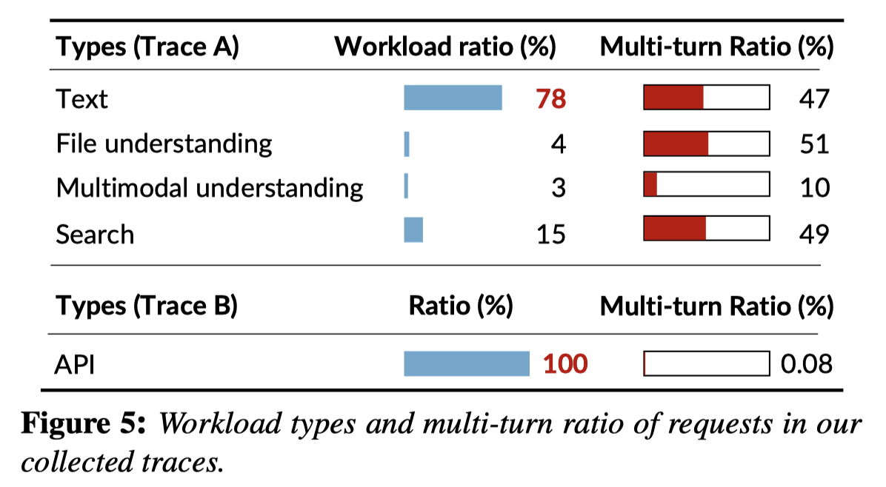

# KVCache Cache in the Wild: Characterizing and Optimizing KVCache Cache at a Large Cloud Provider

> Jiahao Wang, Jinbo Han, Xingda Wei, Sijie Shen, Dingyan Zhang, Chenguang Fang, Rong Chen, Wenyuan Yu, Haibo Chen



> **⚠️ 生成声明**：本 note 由 AI Agent（Hermes）于 2025 年 6 月自动生成，基于 arXiv 论文 PDF 全文阅读。内容可能存在偏差，请以原文为准。

---

## 一句话总结

本文首次系统性地刻画了大型云服务商（阿里云）LLM serving 环境中 KVCache（KV$）的真实工作负载特征，并基于发现提出了工作负载感知的缓存淘汰策略，在 vLLM 上实现了 3.9% 的缓存命中率提升和最高 41.4% 的平均响应时间改善。

---

## 摘要翻译

为 LLM 提供服务对云服务商至关重要，在每次请求处理后缓存中间结果（KV$）可以显著提高服务吞吐量和降低延迟。然而，目前对 LLM serving 如何受益于 KV$ 缓存的理解有限，且缓存淘汰策略等系统设计决策高度依赖于工作负载。本文首次对来自全球领先 LLM 服务提供商之一的 KV$ 工作负载模式进行了系统性刻画，发现了先前基于合成工作负载的研究未涵盖的若干现象，包括：KV$ 复用在请求间呈偏斜分布，单轮请求之间的复用与多轮请求同样重要；考虑所有请求时复用时间和概率具有多样性，但对于特定请求类别，模式往往是可预测的；实现理想缓存命中率所需的整体缓存规模适中。基于上述刻画，本文进一步提出了一种工作负载感知的缓存淘汰策略，在真实工作负载轨迹下（尤其在缓存容量有限时）提升了服务性能。

---

## 研究动机

LLM serving 的核心挑战在于以低成本提供低延迟、高吞吐的服务。KVCache 是一种关键的性能优化手段：当两个请求共享相同的输入前缀时，它们的 KV 矩阵相同，因此可以复用已缓存的 KV$ 避免重复计算。然而，KV$ 缓存系统的设计（如淘汰策略）高度依赖于工作负载特征，而现有研究主要基于合成工作负载（如 ShareGPT），缺乏对真实生产环境中 LLM serving 工作负载的深入分析。

具体而言，现有研究存在以下认知缺口：
1. 生产工作负载中到底有多少 KV$ 复用？哪种请求类型贡献了最多复用？
2. KV$ 的复用时间和复用概率分布是什么样的？这对缓存策略设计至关重要
3. KV$ 的生命周期（lifespan）特征如何？这决定了所需的缓存容量

本文通过收集和分析来自阿里云（ALIYUN TONGYI）的真实 LLM serving 请求轨迹，填补了这些认知缺口，并据此提出了改进的缓存淘汰策略。

---

## 方法（技术细节）

### 1. 数据收集

本文收集了来自阿里云两个代表性 LLM serving 集群的两周（2025年2月和2024年12月）请求轨迹。轨迹包含以下信息：
- **时间戳**：请求到达时间
- **Chat ID**：请求唯一标识
- **Parent Chat ID**：多轮对话的父请求 ID，用于识别会话
- **User ID**：用户唯一标识（经随机域映射匿名化）
- **请求类型**：Text（纯文本）、File（文件分析）、Multimodal（图像理解）、Search（搜索增强）、API（程序化接口调用）
- **输入/输出 token 数量**
- **输入/输出 token 的哈希值**：使用 SipHash 对每4个连续 token 进行加盐哈希，再映射为连续自然数

收集了两种代表性轨迹：
- **Trace A（to-C 工作负载）**：用户通过浏览器聊天机器人或移动应用与 LLM 交互，以 Text 类型为主（78%），多轮比例约 47-51%
- **Trace B（to-B 工作负载）**：开发者通过 API 调用 LLM 服务，100% 为 API 请求，多轮比例极低（< 0.1%）

### 2. KV$ 工作负载特征分析

#### 2.1 复用分析
- **理想缓存命中率**：Trace A 为 62%，Trace B 为 54%（无限缓存容量假设下），低于合成数据集报告的 80%+
- **偏斜分布**：10% 的 KV$ 块贡献了 77% 的复用；19% 的用户（Trace A）和 4% 的用户（Trace B）贡献了超过 90% 的缓存命中
- **单轮请求同样重要**：在 to-B 工作负载中，单轮 API 请求贡献了 97% 的缓存命中（因共享系统 prompt 和高请求频率）
- **跨用户复用极低**：大多数缓存命中来自同一用户的请求（对角线效应），表明用户倾向于自定义系统 prompt 而非使用模板

#### 2.2 多轮请求特征
- **高变异性**：54% 为单轮请求，90th 百分位为 5 轮，最长会话达 232 轮
- **用户级差异**：前 10% 用户的轮次比平均值高 8.9 倍；轮次偏差范围为 1-44

#### 2.3 时间局部性（Temporal Locality）
- **复用时间短**：Trace A 中 80% 的复用时间在 10 分钟内；Trace B 在 10 秒内
- **不同请求类型有不同时间局部性**：文件理解复用时间最长，图像理解最短，搜索次长
- **关键发现**：给定请求类别和时间间隔，KV$ 复用时间的概率分布遵循**指数分布**，且：
  - 不同请求类别的分布不同（工作负载感知）
  - 相似流量模式下的分布相似（可通过历史数据预测）
  - 白天和夜间分布有差异，但相同流量模式下跨天一致

#### 2.4 空间局部性（Spatial Locality）
- 从请求开头缓存的 KV$ 具有更好的空间局部性
- Text 和 Multimodal 类型有明显的空间局部性，File 和 Search 几乎没有
- 增加缓存步长（stride）在 Trace A 中能提高命中率，但在 Trace B 中不是（系统 prompt 长度通常低于总请求长度的 50%）

#### 2.5 缓存容量需求
- **KV$ 生命周期短**：Trace A 的 P90 生命周期为 612 秒，Trace B 为 0.3 秒
- **单请求 KV$ 大小适中**：以 Qwen2-7B 为例，单轮 Text 请求的第 50/90/99 百分位 HBM 占比分别为 0.09%/0.15%/0.37%
- **总体缓存需求适中**：GQA 模型（如 Llama3-70B）仅需 4 倍可用 HBM 即可达到理想命中率；Trace B 甚至可能只需 GPU HBM 即可
- **MHA 模型需要更多缓存**，但由于近期开源模型倾向于使用 GQA/MLA，整体需求可控

### 3. 工作负载感知的缓存淘汰策略

#### 3.1 现有方法的不足
- 现有系统（vLLM、CachedAttention、Pensieve）采用 LRU/FIFO 等工作负载无关的淘汰策略
- GDFS（Greedy-Dual-Frequency-Size）策略虽考虑工作负载特征，但未充分利用 LLM serving 中已知的概率分布信息

#### 3.2 提出的策略（WA）
优先级公式：
```
Priority = (ReuseProb_w(t, life), -Offset)
```

- **ReuseProb_w（技术①）**：基于工作负载（请求类别）的复用概率分布。通过后台采样数据拟合指数分布的 CDF，查询给定时间 t 和预期生命周期 life 内的复用概率
- **Offset（技术②）**：考虑空间局部性，优先级与 KV$ 块在请求中的前缀长度成反比（头部块优先级更高）
- **不考虑频率（技术③）**：因 KV$ 生命周期短，频率信息无用

#### 3.3 性能优化
- 对每个工作负载维护按最后访问时间排序的优先队列
- 淘汰时先取每个工作负载的 LRU 块作为候选，再用上述优先级公式选择最终淘汰块
- 复杂度从 O(N) 降至 O(W)（W 为工作负载数，通常在数十范围内）
- 策略开销：每次淘汰 79μs，仅占 vLLM 调度开销的 1.2%

#### 3.4 实现
- 在 vLLM 上实现 CPU-GPU KV$ 缓存层，集成现有最先进的缓存机制
- 实现了类似 Mooncake 的全局调度器
- 评估模型：Qwen2-7B、Llama2-13B、Llama3-70B
- 测试环境：8× NVIDIA A800-80GB GPU

---

## 实验结果

### 缓存命中率提升
- WA 策略相比 LRU/FIFO/LFU/S3-FIFO 提高 **8.1%–23.9%** 命中率
- 相比最佳基线提高 **1.5%–3.9%**
- 在缓存容量较小时效果更显著
- 在 Trace A（to-C）上效果优于 Trace B（to-B）（因 B 的工作负载信息较少且所需缓存较小）

### 服务性能提升
- QTTFT（Queued Time To First Token）降低 **28.3%–41.9%**

### 消融实验
- 基于分布的方法（技术①）提升约 1% 命中率
- 加入生命周期调节器（技术③）进一步提升 2.4%

### 公平性
- 存在恶意客户端可通过发送大量长前缀请求来垄断前缀缓存的公平性问题
- 本文指出这需要与服务策略协同设计（如 FairRide），超出本文范围

---

## 优势

1. **首次系统性刻画真实生产 LLM serving 工作负载**：收集了来自阿里云的大规模、细粒度轨迹数据，包含时间戳、用户ID、请求类型、多轮信息和 token 哈希，远超现有公开数据集（如 ShareGPT、Mooncake）
2. **多个重要发现**：
   - 单轮请求对 KV$ 复用的重要性被低估
   - 跨用户复用极低，应关注用户内复用
   - KV$ 生命周期短暂，LFU 策略不适用
   - 复用概率分布可预测（指数分布，工作负载感知）
3. **提出的策略简单有效**：基于指数分布拟合的优先级计算，计算开销极低（79μs），集成到 vLLM 无明显性能损耗
4. **实际意义**：对于 GQA 模型，GPU HBM 加少量 CPU 内存即可满足缓存需求，无需复杂的 CPU-RDMA-SSD 存储层次
5. **方法论可推广**：先刻画真实工作负载特征，再优化特定系统组件的方法论可推广到其他 LLM serving 场景

---

## 局限

1. **数据代表性有限**：基于一周的生产轨迹（两个代表性工作负载），LLM serving 工作负载仍在演进（如推理型工作负载），新工作负载的特征有待后续研究
2. **聚焦于缓存淘汰策略**：未探索全局调度等其他系统组件的优化潜力
3. **仅在单实例层面优化**：工作负载感知策略仅应用于单个 serving 实例，扩展到全局层面留作未来工作
4. **匿名数据限制**：由于隐私策略无法获取原始 token 内容，只能通过哈希进行缓存分析
5. **公平性未解决**：恶意客户端可能通过大量长前缀请求垄断缓存，本文未给出解决方案
6. **数据采样限制**：图像类型（Multimodal）的复用概率分布较难预测，因其粒度较粗且用户间差异较大
7. **未开源代码**：实现基于 vLLM，但本文代码未开源（代码仓库未提供）
8. **未验证非前缀 KV$ 缓存**：本文仅研究前缀匹配的缓存复用，未涉及非前缀 KV$ 缓存（如 CacheBlend、Epic 等）

---

## 与 EfficientPaper 相关的研究方向

本文属于 **LLM serving 系统优化**领域，与 EfficientPaper 的以下研究方向高度相关：

1. **KV Cache 管理**：核心关键词，涉及缓存淘汰策略、缓存容量规划、缓存命中率优化
2. **LLM 部署与推理优化**：涉及 KV$ 缓存的系统设计、GPU-CPU 层次化存储、全局调度
3. **工作负载感知的系统设计**：基于真实工作负载特征进行系统优化的方法论
4. **多轮对话 serving**：多轮请求的 KV$ 复用模式、会话管理
5. **LLM serving 系统**：vLLM、CachedAttention、Pensieve、Mooncake 等系统的对比与改进
6. **缓存策略**：LRU、LFU、FIFO、S3-FIFO、GDFS 等传统缓存策略在 LLM serving 中的应用与局限
7. **模型效率**：GQA/MHA/MLA 等注意力机制对 KV$ 缓存需求的影响
8. **KV$ 压缩与量化**：与 StreamingLLM、H2O、InfiniGen、KVQuant 等 KV$ 压缩方法的互补性

---

**相关链接**：
- 论文：[arXiv:2506.02634v4](http://arxiv.org/abs/2506.02634v4)
- 轨迹数据（匿名样本）：[github.com/alibaba-edu/qwen-bailian-usagetraces-anon](https://github.com/alibaba-edu/qwen-bailian-usagetraces-anon)
- 发表会议：ATC 2025
- 机构：上海交通大学、阿里巴巴集团
